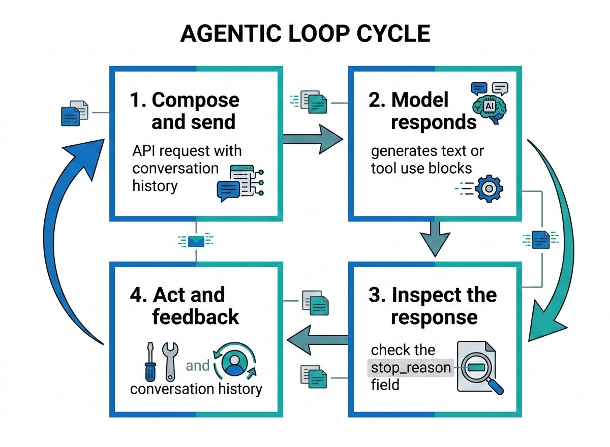
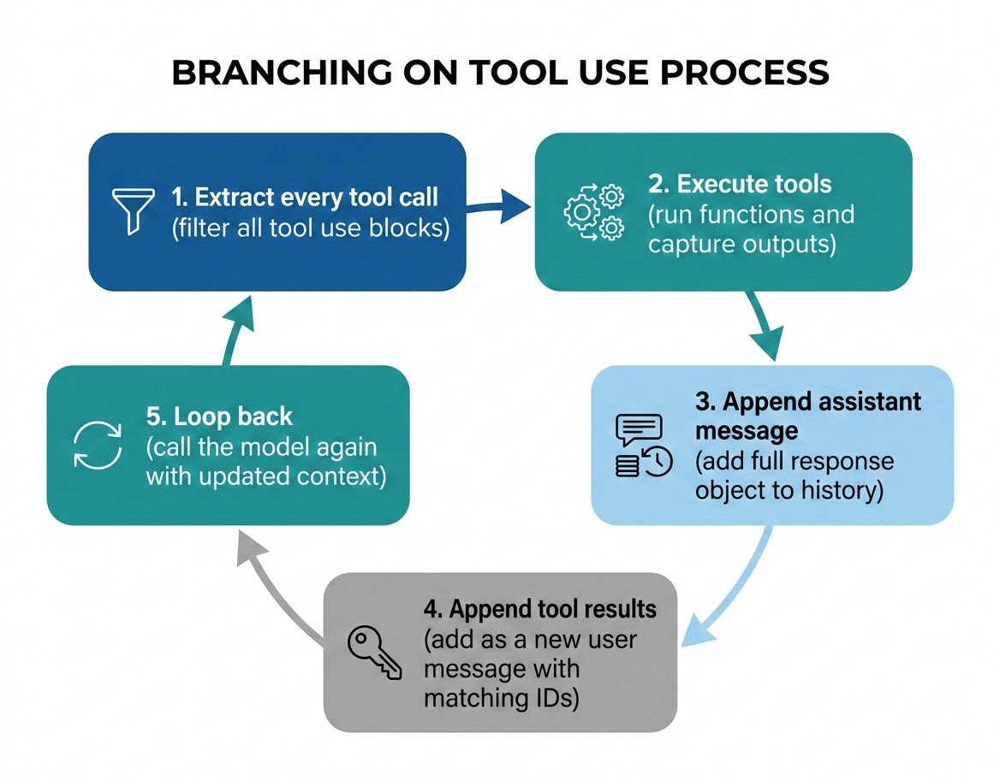
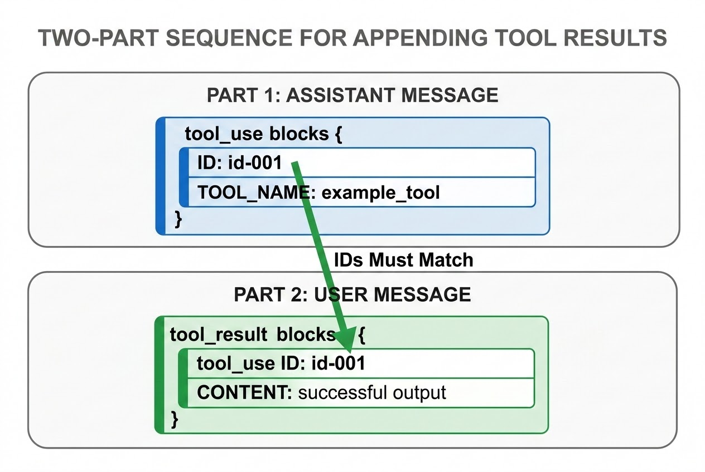

# The Agentic Loop

Every certified Claude architect needs one idea locked in before anything else: agents do not answer once, they loop. This chapter opens Domain 1 — Agentic Architecture and Orchestration — and introduces the four-stage agentic loop that turns a single stateless model call into a sustained, goal-directed process: compose and send, the model responds, inspect `stop_reason`, act and feed back. You will learn how to branch correctly on `tool_use`, how to append tool results to conversation history without corrupting it, and how to recognize the two mistakes — skipping history and ending the loop too early — that break more first-attempt agents than any other bug. Every later chapter in this book, from multi-agent orchestration to error handling to context management, assumes you have this loop internalized, so treat it as the foundation rather than a warm-up topic.

## What Is the Agentic Loop?

### The Limits of a Single Model Call

A standard call to Claude's API is stateless and one-shot. You send a message, the model generates a response, and the exchange is over. The model does not take action, does not check its own work, and does not retry if something goes wrong. That is perfectly fine for question-and-answer use cases — summarize this paragraph, translate this sentence, explain this error message.

It falls apart the moment a task requires more than one step. Consider a request like "find last quarter's churn numbers and draft a summary for the board." The model cannot look up the numbers itself. It has no access to your database, your file system, or the internet unless you give it a way to reach them and a way to act on what it finds. A single response is not enough, because the model needs to act, observe the result, reason about that result, and then decide what to do next — possibly acting again.

### From One-Shot to Goal-Directed: Why Agents Need to Loop

The **agentic loop** is the architectural pattern that closes this gap. It is not a feature built into the model itself — Claude does not "loop" on its own. It is a pattern you implement in your code: a control structure that repeatedly sends the model the full conversation, inspects what comes back, executes whatever action the model requests, and feeds the result back in, until the model signals that the task is genuinely finished.

This is the pattern behind every serious Claude-based agent, regardless of the specific framework or product surface: a coding assistant that reads a file, edits it, and runs a test suite; a research agent that queries a search tool multiple times before writing a report; a support agent that looks up an order, checks a refund policy, and drafts a reply. None of these are single-turn tasks, and none of them are possible without a loop managed by your code.

**Real-world use case:** a code-review agent is asked to evaluate a pull request. It cannot do this in one shot — it needs to read the diff (one tool call), run a linter against the changed files (a second tool call), and check whether new code has test coverage (a third tool call) before it can write a single coherent review comment. Each of those steps depends on the result of the previous one. Only a loop that feeds tool results back into the conversation makes that dependency chain possible.

> 💡 **Tip:** Think of the agentic loop as a state machine with one input driving every transition — the model's response. Your code does not decide what happens next; the model tells you, and your job is to read that signal correctly.

## The Four Stages of the Agentic Loop

Regardless of the tools involved or the complexity of the task, every agentic loop moves through the same four stages, in the same order, on every iteration.

### Stage 1: Compose and Send

At the start of each iteration, your code assembles a message and sends it to the model through the API. On the very first iteration this is straightforward: you send the user's original request along with a system prompt that defines the agent's role and declares the tools it has access to.

On every subsequent iteration, this step carries more weight. You are not sending just the newest message — you are resending the **entire conversation history**: the original request, every prior model response, every tool call the model made, and every tool result your code returned for those calls. All of it, every time.

This is the single most important fact about how Claude operates in a loop: **the model has no persistent memory between API calls.** The only context it has is what you include in the `messages` array on that specific request. Send an incomplete history, and the model reasons from an incomplete picture — and its next response will reflect that gap.

### Stage 2: The Model Responds

Once the model receives the messages, it generates a response. That response contains one or more content blocks, and each block is one of two things:

- A **text block** — a natural-language reply.
- A **`tool_use` block** — the model's request to invoke a specific tool with specific inputs.

The model might return only text. It might return only a `tool_use` block. It might return both — a short explanation followed by a tool invocation. Critically, the model never executes a tool itself. It has no access to your systems, your APIs, or your runtime environment. All it can do is declare, in structured form, that it wants a tool called with certain inputs. Making that happen is entirely your code's responsibility.

### Stage 3: Inspect the Response (`stop_reason`)

After the model responds, your code must decide what to do next — and that decision starts and ends with a single field: `stop_reason`. Every response includes it, and it tells you *why* the model stopped generating, not what it said. The next section of this chapter covers this field value by value, because getting it wrong is the single most common source of broken agents.

### Stage 4: Act and Feed Back

If the response calls for a tool, your code executes it, then appends both the model's request and the tool's result back into the conversation history in the correct order and format. With the history updated, the loop returns to Stage 1: the model is called again, now reasoning over everything that has happened so far. This repeats until the model produces a final answer with no pending tool calls.


*Figure 1.1: The agentic loop cycles through compose/send, model response, `stop_reason` inspection, and act/feedback — repeating until the model returns a final answer with no pending tool calls.*

**Real-world use case:** a customer support agent receives "where is my order?" It composes and sends the user's message (Stage 1). The model responds with a `tool_use` block requesting an order-lookup call (Stage 2). Your code inspects `stop_reason`, sees `tool_use` (Stage 3), executes the lookup, and appends the result to history (Stage 4). The loop repeats: the model now has the shipment status and responds with a plain-text answer — "Your order shipped yesterday and should arrive Thursday" — with `stop_reason` of `end_turn`, and the loop exits.

> ⚠️ **Important:** Miss any one of the four stages — sending an incomplete history, misreading `stop_reason`, executing only some of the requested tools, or appending results incorrectly — and the agent breaks in ways that are hard to diagnose after the fact, because nothing throws an obvious error. The model simply reasons from bad or missing context.

## Understanding `stop_reason`

`stop_reason` is a top-level field on every model response. It is small — there are only four values you need to handle — but it is the single most important signal in the entire loop, because each value demands a completely different action from your code.

### `end_turn`: The Natural Exit

`end_turn` means the model completed its response naturally. It said what it needed to say and considers itself finished. In the agentic loop, this is your exit condition: stop iterating and return the response to the caller. No further handling is required.

The mistake to avoid: if your loop's branching logic only checks for `tool_use` and never explicitly handles `end_turn`, you risk falling through to unintended behavior — continuing to iterate when the task is already done, or throwing an error on a perfectly valid response. Give `end_turn` its own explicit branch. It is the happy path; treat it like one.

### `tool_use`: A Request, Not a Result

`tool_use` means the response contains one or more `tool_use` content blocks. The model is **not done** — it is waiting for your code to execute those tools and return the results. When you see this value, three things must happen, in order:

1. Find every `tool_use` block in the response — not just the first one. The model can request several tools in a single turn.
2. Execute each tool and capture its output.
3. Append the assistant's response and the tool results to history, then call the model again.

Exiting the loop when you see `tool_use` is one of the two failure modes this chapter is built around, and it is covered in depth later in this chapter.

### `max_tokens`: An Incomplete Response

`max_tokens` means generation was cut off because the response hit its token limit. The model did not choose to stop — it ran out of budget mid-thought. This is fundamentally different from `end_turn`: the response is incomplete, not finished.

You have two reasonable options:

- **Continuation** — send the truncated response back as context and prompt the model to pick up where it left off. This works but adds complexity, since you need to stitch the pieces together correctly.
- **Surface an error** — tell the caller the response exceeded the token budget and may be incomplete, and let them decide how to proceed.

Which option fits depends on the use case: a coding agent truncated mid-function likely needs continuation, while a summarization pipeline that keeps hitting the ceiling probably needs a prompt redesign and a hard stop. What is never acceptable is silently passing a truncated response downstream as though it were complete. If you are hitting `max_tokens` often, treat it as a design signal — the prompt may be too large, the token limit too conservative, or the task may need to be broken into smaller pieces.

### `stop_sequence`: A Deliberate Boundary

`stop_sequence` means the model reached a custom string you configured as a stopping signal, and it halted generation there. This value only appears if you defined stop sequences in your request; if you never set any, you will never see it.

Stop sequences give you precise control over where generation ends — useful when you need the model to stop at a structural boundary, such as the closing brace of a JSON object or a delimiter between sections. In most cases this is intentional and clean: treat it like `end_turn`, extract the content before the sentinel string, and move on. If you defined multiple stop sequences for different purposes, check which one triggered so your code can decide what happens next.

### Putting the Four Values Together

| `stop_reason` | Meaning | Required Action |
|---|---|---|
| `end_turn` | The model finished its response naturally. | Exit the loop; return the final answer. |
| `tool_use` | The model requested one or more tools. | Do not exit; execute every tool, append results, call the model again. |
| `max_tokens` | The response was cut off at the token limit. | Handle explicitly — continue generation or surface an incomplete-response error. |
| `stop_sequence` | The model hit a configured stop string. | Extract content before the sentinel; typically treat like `end_turn`. |

Anything outside these four values — an unexpected string, a missing field, a malformed response — should hit a default branch that logs the anomaly and exits gracefully. Never let an unrecognized `stop_reason` propagate silently into your application logic.

**Real-world use case:** a research agent generating a long literature-review section repeatedly hits `max_tokens` because its `max_tokens` request parameter is set too low for the length of output the task demands. Rather than shipping a document that ends mid-sentence, the architecture surfaces this as a design flaw and raises the token ceiling — treating `max_tokens` as a signal to fix, not a value to paper over.

> ✅ **Best Practice:** Structure your post-response logic as an explicit branch on `stop_reason` — a `switch`/`match` statement or equivalent — with a named branch for each of the four values plus a default. Never infer behavior implicitly from message content alone.

## Branching on `tool_use`

When `stop_reason` comes back as `tool_use`, your code becomes the executor. The model cannot run functions, call APIs, or query databases — it can only ask. Branching on `tool_use` correctly is a five-step sequence, and every step matters.

### Step 1: Extract Every `tool_use` Block

Filter the response's content array for every block where `type` equals `tool_use`, and collect all of them before executing any. The model is not obligated to request one tool at a time — a single response can contain several `tool_use` blocks. If your extraction logic grabs only the first one, you silently drop the rest, even though the model included them for a reason and is waiting on all of them.

Each `tool_use` block carries three fields you need:

- `name` — which tool to call.
- `input` — the parameters the model wants to pass.
- `id` — a unique string identifying this specific call. Hold on to it; you need it to return the matching result.

### Step 2: Execute Each Tool

Route each tool's `name` to the corresponding function in your codebase, pass in `input`, and capture the output. Handle failures gracefully — a missing tool, a network error, a runtime exception should produce a structured error result, never a crash of the loop. If several tool calls in the batch are independent of one another, executing them in parallel reduces latency before the loop continues.

### Step 3: Append the Assistant Message First

Before you touch the tool results, append the model's own response — the message that contains the `tool_use` blocks — to the conversation history. This step gets skipped more often than it should, usually because developers are focused on running the tools and assume history bookkeeping can happen afterward, all at once.

It cannot. The history has to reflect the true sequence of events: the model responded, then the tools ran, then results came back. If you append tool results without first appending the assistant message that requested them, the history is malformed — the model would be shown tool results with no preceding request, and it cannot make sense of that.

Append the assistant message exactly as the API returned it — full content array, text blocks and `tool_use` blocks alike. Do not strip it down. The model needs to see its own prior output in full to reason correctly about what already happened.

### Step 4: Append the Tool Results

For each tool call executed, append a `tool_result` content block — packaged inside a single new **user**-role message — containing:

- `tool_use_id`, matching exactly the `id` from the corresponding `tool_use` block.
- `content`, the tool's output, serialized as a string.

The `tool_use_id` is what links a result back to the request that produced it. If several tools were called in one turn, all of their results go into the *same* user message as an array of `tool_result` blocks — one message, multiple results, never one message per result.

### Step 5: Loop Back

With the assistant message and tool results both appended, call the model again with the full, updated history. It now has everything: the original request, every prior turn, the tool calls it made, and what those calls returned. It uses all of that to generate the next response — another tool call, or a final answer.


*Figure 1.2: The five-step sequence for handling `tool_use` — extract every tool call, execute the tools, append the assistant message, append the tool results, then loop back — must happen in this exact order on every iteration.*

**Real-world use case:** a travel-booking agent is asked to plan a weekend trip. In a single turn, the model returns two `tool_use` blocks — one requesting a flight search, one requesting a hotel search — because both are independent lookups it needs before it can propose an itinerary. Correct branching extracts both blocks, executes both tools (in parallel, since neither depends on the other), and returns both results in one user message before calling the model again. Handling only the first block would leave the model waiting indefinitely on a hotel search it already asked for.

> ⚠️ **Important:** Always set a maximum iteration limit on the loop. If a tool consistently fails, or the model keeps requesting tools it can never get a satisfying result from, an unbounded loop will run until you stop it manually or exhaust your API budget.

## Appending Tool Results to History Correctly

Appending tool results is where correct-looking code most often produces subtly broken agents — because the failure mode rarely throws an error. It just quietly degrades the model's reasoning.

### The Two-Message Pattern

Appending is always a two-part operation, in a fixed order:

1. The **assistant message** — the model's response containing the `tool_use` blocks, appended verbatim.
2. The **tool results** — appended immediately after, as a new message with `role` set to `user`.

The role is non-negotiable. It must be `user`, never `assistant` and never `system`. The API expects tool results inside a user-role message; sending the wrong role either throws a validation error or, worse, gets silently misinterpreted.

### Required Fields in a `tool_result` Block

Inside that user message, each tool result is a content block with:

- `type: "tool_result"` — tells the API what kind of block it is reading.
- `tool_use_id` — must exactly match the `id` on the corresponding `tool_use` block. This is how the model maps a result back to the request that generated it. A mismatched ID does not raise an error — the model just reasons incorrectly, sometimes confidently, and the confusion compounds over later iterations in ways that are hard to trace back to the source.
- `content` — the tool's actual output, passed as a string. If a tool returns a structured object, serialize it (for example, with `JSON.stringify` or `json.dumps`) before placing it in `content`. The model reads this field as text.

### One User Message, Many Results

If the model requested multiple tools in a single turn, all of their results belong in the *same* user message, as an array of `tool_result` blocks — one per call. Appending one user message per result is a common but incorrect pattern: consecutive user messages carrying tool results is not valid conversation structure, and it will produce errors or confused model behavior. Pack every result from that round into one message. Order within the array is not strictly load-bearing, since the model matches by `tool_use_id` rather than position, but keeping results in the same order the calls appeared in is good practice for readability and debugging.


*Figure 1.3: Appending tool results is a two-part sequence — the assistant message carrying the `tool_use` block comes first, followed by a user message carrying the `tool_result` block, with the `tool_use_id` on both sides matching exactly.*

**Real-world use case:** a financial-analysis agent pulls quarterly figures for three companies using three parallel tool calls. If the results are appended with transposed `tool_use_id` values, the model attributes Company A's revenue to Company B in its summary — a fabrication that looks entirely plausible in the final report and is extremely difficult to catch without re-checking the raw tool outputs.

> ✅ **Best Practice:** Never silently drop a failed tool call. If execution throws an exception, still append a `tool_result` block for that `tool_use_id`, with `content` describing the failure (and, where supported, `is_error: true`). A missing result for a request the model made is functionally identical to a malformed history — the model has no way to know the call didn't simply vanish.

## Deciding When to Continue vs. Stop the Loop

### The Only Valid Exit Condition

The loop has exactly one valid exit condition: the model returns a response with `stop_reason` of `end_turn` (or, in the deliberate-boundary case, `stop_sequence`) and no pending `tool_use` blocks. That is it. Not "a tool ran successfully." Not "we got some result back." The model itself has to say, in a plain-language response, that it is finished.

On every iteration, your loop should ask one question: *does this response contain a `tool_use` block?* If yes, execute the tool, append the result, and call the model again. If no, return the response. This single check is the entire continuation logic — everything else in the loop exists to support it correctly.

### Guarding Against Runaway Loops

A correct exit condition is necessary but not sufficient. You also need a ceiling: a maximum number of iterations after which the loop exits on its own and surfaces an error or a partial result, regardless of what the model is asking for. Without this guard, a tool that always fails, or a model stuck requesting the same information repeatedly, will run until someone intervenes manually or the API bill makes the problem impossible to ignore.

**Real-world use case:** a DevOps agent investigating a failing deployment runs a `get_pod_status` tool, sees an error, and reasonably calls a `get_pod_logs` tool on the next turn to dig deeper — a legitimate multi-turn continuation, not a bug. The difference between this and a runaway loop is not the number of turns; it is whether each turn is making genuine forward progress toward `end_turn`. An iteration cap protects you either way: healthy multi-turn investigations finish well within a reasonable limit (10–15 iterations is a common starting point), while a genuinely broken loop gets stopped before it becomes an incident.

> 🚀 **Pro Tip:** Log the iteration count, the tools called, and the `stop_reason` at every turn. When a loop does hit its iteration cap, that log is what tells you whether the model was stuck, a tool was silently failing, or the task genuinely needed more turns than you budgeted for.

## Reference Implementation: A Minimal Agentic Loop

The following pseudocode ties the four stages, the `stop_reason` branch, and the append pattern together into a single, defensible implementation.

```python
import json

MAX_ITERATIONS = 10

def run_agent(user_input, tools, tool_functions, client):
    messages = [{"role": "user", "content": user_input}]

    for iteration in range(MAX_ITERATIONS):
        # Stage 1: Compose and send — always the full history
        response = client.messages.create(
            model="claude-sonnet-4-5-20250929",
            max_tokens=4096,
            system="You are an agent that completes tasks using the tools provided.",
            tools=tools,
            messages=messages,
        )

        # Stage 4a: append the assistant's response before doing anything else
        messages.append({"role": "assistant", "content": response.content})

        # Stage 3: inspect stop_reason
        if response.stop_reason == "end_turn":
            return extract_text(response)

        if response.stop_reason == "tool_use":
            tool_use_blocks = [b for b in response.content if b.type == "tool_use"]

            if not tool_use_blocks:
                raise AgentError("stop_reason was tool_use but no tool_use blocks were found")

            tool_results = []
            for block in tool_use_blocks:
                try:
                    output = tool_functions[block.name](**block.input)
                    tool_results.append({
                        "type": "tool_result",
                        "tool_use_id": block.id,
                        "content": json.dumps(output),
                    })
                except Exception as exc:
                    tool_results.append({
                        "type": "tool_result",
                        "tool_use_id": block.id,
                        "content": json.dumps({"error": str(exc)}),
                        "is_error": True,
                    })

            # Stage 4b: all results from this round go in ONE user message
            messages.append({"role": "user", "content": tool_results})
            continue  # loop back to Stage 1

        if response.stop_reason == "max_tokens":
            raise IncompleteResponseError("Response truncated at max_tokens.")

        if response.stop_reason == "stop_sequence":
            return extract_text(response)

        raise AgentError(f"Unexpected stop_reason: {response.stop_reason}")

    raise AgentError(f"Exceeded maximum of {MAX_ITERATIONS} agent iterations")
```

A few details in this implementation are easy to overlook but matter in production:

- The assistant message is appended **before** the `stop_reason` branch runs, so it is never accidentally skipped regardless of which branch executes.
- Every tool call gets a `tool_result`, success or failure — a failed call still produces a `tool_use_id`-matched entry, just with an error payload and `is_error: true`.
- All results from one round of tool calls are collected into a single list and appended as one user message, never one message per result.
- The iteration guard is a hard `for` loop bound, not a soft convention — it fires even if every other check passes.

> 💡 **Tip:** In a real system you would add request timeouts, a retry policy for transient tool failures, structured logging per iteration, input validation before executing a tool, and cancellation support if the caller aborts the task. None of that changes the core loop — it wraps around it.

## The Agentic Loop as a System

Zoomed out, the agentic loop is the orchestration layer sitting between the user, the model, and your tools. Its job is to repeatedly decide whether the model should answer directly, call a tool, or take another step — and to keep that decision-making reliable across many iterations.

### Core Components

A typical architecture has five moving parts:

- **Orchestrator** — the code that owns the loop and decides what happens next based on `stop_reason`.
- **Model API** — produces either a text response or a `tool_use` request on each call.
- **Tool registry** — maps tool names to the real functions or services that implement them.
- **Execution layer** — actually runs tools (database queries, search calls, internal APIs) and returns their output.
- **Conversation state store** — holds the full message history that gets resent on every call.
- **Guardrails** — iteration caps, timeouts, and error handling that keep a misbehaving loop from running away.

### Request Flow

1. The user submits a task.
2. The orchestrator sends the full history to the model.
3. The model returns either final text or one or more `tool_use` requests.
4. If it's `tool_use`, the orchestrator routes each request through the execution layer.
5. Results are appended to the conversation state store.
6. The orchestrator calls the model again with the updated history.
7. The loop ends only when the model returns `end_turn` (or a matching `stop_sequence`) with no pending tool calls.

This framing matters because the model itself is stateless. Reliability does not come from the model "remembering" anything — it comes from the orchestrator preserving context precisely, routing tool calls correctly, and guaranteeing the model sees every tool output before it reasons again.

**Real-world use case:** an enterprise support platform wires a Claude-based agent to a tool registry containing a CRM lookup, a ticketing-system creator, and a knowledge-base search. The orchestrator caps every conversation at a fixed iteration budget for cost control, logs the tools called and `stop_reason` at each step for auditability, and treats the conversation state store as the single source of truth the model reasons from — never the individual tool responses in isolation.

## Common Mistake: Skipping History on Tool Results

The single most reliable way to break an agent is to execute a tool correctly and then fail to append its result to the conversation history — or to append it with a mismatched `tool_use_id`, the wrong role, or split across multiple messages instead of one.

**Why it happens:** developers correctly implement tool execution, see the result, and assume the "bookkeeping" of updating history is a formality that can be handled loosely. It is not. The model's only knowledge of the world is what is in the `messages` array on the next call. If the tool result never makes it in, the model has no way to know the tool ran at all.

**What it looks like in practice:** the model requests a tool, your code runs it successfully, but the result is dropped, malformed, or tagged with the wrong `tool_use_id`. On the next iteration, the model — seeing no evidence its request was fulfilled — requests the same tool again. This repeats every iteration after that, burning API calls and, eventually, hitting your iteration cap without ever producing a final answer.

**The fix:** treat the append step as load-bearing, not optional. Append the assistant message first, then a single user message containing one `tool_result` block per tool call, each with an exact `tool_use_id` match. Never skip a result for a failed tool — return a structured error in `content` instead.

> ⚠️ **Important:** A missing or malformed tool result rarely produces an obvious crash. It produces a model that quietly repeats itself or reasons from a gap it doesn't know exists — which is exactly why this mistake is so common and so hard to catch in testing.

## Common Mistake: Ending the Loop Too Early

The second common failure sits at the opposite end of the loop: stopping the moment a tool result comes back, as though the tool result itself were the final answer.

**What it looks like in practice:** the agent calls a tool, gets a result, and then either goes silent with no follow-up, or — more visibly — hands the raw tool output straight back to the user: a JSON blob, a search snippet, an unformatted API response, presented as if it were the answer.

**Why it happens:** it is easy to conflate "a result came back" with "the task is complete." But a tool result is data, not an answer. The model still needs one more pass to interpret that data, synthesize it, and respond in natural language. The only valid signal that the task is finished is a response with `stop_reason` of `end_turn` (or a matching `stop_sequence`) and no `tool_use` blocks in the content. If the response contains a `tool_use` block, the model is explicitly telling you it is not done — it needs that result before it can answer.

**The fix:** structure the loop so the only exit path is "the response is plain text with no pending tool calls." On every iteration, check whether the response contains a tool call. If it does, execute it, append the result, and call the model again. If it does not, you are done — return that response.

**Real-world use case:** a search-assistant agent calls a web-search tool, receives ten raw result snippets, and a poorly structured loop returns those snippets directly to the user as the "answer." A correctly structured loop feeds those snippets back to the model, which reads them, resolves conflicting information, and writes a two-paragraph synthesis with citations — the actual deliverable the user asked for.

> 🚀 **Pro Tip:** Whenever an agent "feels" incomplete, or you find yourself looking at raw tool output where a written answer should be, check the exit condition first. Nine times out of ten, the loop just needed one more turn.

## Chapter Summary

The agentic loop is the pattern that turns Claude from a one-shot text generator into a system capable of sustained, multi-step, goal-directed work. It runs through four stages on every iteration — compose and send the full history, receive the model's response, inspect `stop_reason` to decide what happens next, and act on any tool requests before feeding the results back in. `stop_reason` is the pivot point of the entire loop: `end_turn` and `stop_sequence` signal completion, `tool_use` signals a request your code must fulfill before continuing, and `max_tokens` signals an incomplete response that needs explicit handling. Branching on `tool_use` is a precise five-step sequence — extract every tool call, execute each one, append the assistant's message, append the tool results as a single user message with matching `tool_use_id` values, and loop back. The two mistakes that break the largest share of first-attempt agents are structural opposites of each other: skipping the append step (which causes infinite repeated tool calls) and exiting the loop the moment a tool result arrives (which returns unfinished or raw data instead of a real answer). Both are prevented by the same discipline — treating the message history as the model's entire memory and the exit condition as a strict, single check on the model's own signal that it is finished.

## Key Takeaways

- The agentic loop has exactly four stages: compose/send, model responds, inspect `stop_reason`, act/feedback — repeated until the model signals completion.
- The model is stateless between API calls; the full conversation history must be resent on every iteration or the model reasons from an incomplete picture.
- `stop_reason` has four values — `end_turn`, `tool_use`, `max_tokens`, `stop_sequence` — and each demands a distinct, explicit branch in your code.
- `tool_use` is a request, not a result. The model cannot execute tools itself; your code must extract every `tool_use` block, run each one, and report back.
- Appending is a strict two-part, ordered operation: the assistant's message first, then a single user message containing all `tool_result` blocks for that round, each matched by `tool_use_id`.
- Never split multiple tool results across separate user messages, and never drop a result for a failed tool call — return a structured error instead.
- The only valid exit condition is a response with no pending `tool_use` blocks and a `stop_reason` of `end_turn` or `stop_sequence` — never "a tool ran" or "a result came back."
- Always enforce a maximum iteration limit as a guardrail against runaway loops and runaway API costs.
- The two most common failure modes are opposites: skipping history appending (infinite repeated tool calls) and ending the loop too early (partial or raw, unsynthesized output).

## Interview Questions

1. Explain, in your own words, why a single call to a language model is insufficient for multi-step tasks, and what specific mechanism the agentic loop adds to solve that.
2. Walk through what happens, stage by stage, when an agent receives a response with `stop_reason` of `tool_use`, from the moment the response arrives to the moment the model is called again.
3. Why must the assistant's message be appended to history before the tool results, rather than the other way around or all at once? What breaks if the order is reversed?
4. A model response comes back with `stop_reason` of `max_tokens`. Describe two different valid ways to handle this, and explain what situational factors would make you choose one over the other.
5. Describe the two most common mistakes made when implementing an agentic loop for the first time, and explain the underlying misunderstanding that causes each one.
6. What role does `tool_use_id` play in the conversation history, and what specifically goes wrong — in terms of model behavior, not just error messages — if it is mismatched?
7. Why is an iteration cap considered a mandatory part of a production agentic loop rather than an optional safeguard?
8. How would you explain, to someone who thinks "the agent just talks to itself in a loop," the actual division of responsibility between the model and your orchestrating code?

## Practice Questions & Answers

**Practice Question (unofficial):** Your agent calls a single tool, and the tool returns successfully. The next time you inspect the conversation, the model has requested the exact same tool with the exact same inputs. What is the most likely root cause, and how would you confirm it?

*Answer:* The most likely cause is that the tool's result was never correctly appended to the conversation history — either it was dropped entirely, appended with the wrong role (not `user`), or appended with a `tool_use_id` that does not match the `id` on the original `tool_use` block. From the model's perspective, it requested a tool and saw no corresponding result in the history it was given, so it has no way to know the call ever happened; requesting it again is the only reasonable action available to it. To confirm this, inspect the exact messages array sent on the follow-up API call and verify: (1) the assistant message containing the original `tool_use` block is present, (2) a user message immediately follows it containing a `tool_result` block, and (3) that block's `tool_use_id` exactly matches the `id` from the `tool_use` block. A mismatch or absence at any of these three checkpoints confirms the root cause.

**Practice Question (unofficial):** An agent is asked to summarize the top five articles about a topic. It calls a search tool, receives five article snippets, and immediately returns those five raw snippets to the user as its final response. Is this correct behavior? If not, what specifically went wrong and where in the loop should it be fixed?

*Answer:* This is not correct behavior. Returning the raw tool output is a symptom of ending the loop too early — treating the arrival of a tool result as the finish line instead of the middle of the process. The fix is not in the tool or the prompt; it is in the loop's exit condition. The orchestrating code should never treat "a tool result was returned" as a stopping signal. After appending the search results to history, the loop must call the model again and wait for a response with `stop_reason` of `end_turn` and no pending `tool_use` blocks — only that response, a synthesized natural-language summary of the five articles, should be returned to the user.

**Practice Question (unofficial):** A model response contains two `tool_use` blocks in a single turn — one for a currency-conversion tool and one for a shipping-cost lookup. Describe exactly how the tool results for both should be appended to history, including message count, role, and field structure.

*Answer:* Both results belong in a single new message with `role` set to `user`. That message's content is an array containing two `tool_result` blocks — one per tool call. Each block needs `type: "tool_result"`, a `tool_use_id` that exactly matches the `id` of its corresponding `tool_use` block (the currency-conversion result matched to the currency-conversion call's ID, the shipping-cost result matched to its own), and `content` holding that tool's output, serialized as a string. This is exactly one user message total, never two separate user messages for the two results — that would produce invalid, unhandleable conversation structure.

**Practice Question (unofficial):** You are debugging an agent that appears to work correctly most of the time but occasionally produces subtly wrong answers — for example, attributing one company's revenue figures to a different company after a multi-tool financial lookup. There are no errors or crashes in the logs. What category of bug should you suspect first, and why does this kind of bug typically not surface as a visible error?

*Answer:* This pattern points strongly toward a `tool_use_id` mismatch during the history-append step — for example, tool results appended in the wrong order relative to their originating calls, or IDs transposed between two concurrent tool calls. This class of bug does not surface as a visible error because the API does not validate that a `tool_result`'s content is *semantically* correct for its `tool_use_id` — it only requires that the field be present and well-formed. The model receives a structurally valid history and reasons over it as given; it has no way to detect that Company A's numbers were labeled with Company B's request ID. The confusion is confident and silent, which is exactly why ID-matching discipline during the append step matters as much as it does.

## Multiple Choice Questions

**Q1.** What is the primary architectural problem the agentic loop is designed to solve?
A. Reducing the token cost of a single model call
B. Enabling multi-step, goal-directed tasks that a single stateless model call cannot complete
C. Improving the grammatical quality of model responses
D. Allowing the model to store memory permanently between sessions

**Correct Answer: B**

*Explanation:* The agentic loop exists because a single model call is stateless and one-shot, which is insufficient for tasks requiring action, observation, and further reasoning across multiple steps. A describes a cost concern unrelated to the loop's purpose. C is unrelated to architecture. D is incorrect because the model never gains persistent memory — the loop compensates for its statelessness by resending history, it does not eliminate that statelessness.

**Q2.** Which field should your code inspect first when deciding how to handle a model's response in an agentic loop?
A. The length of the response text
B. The `tool_use` block's `input` field
C. `stop_reason`
D. The system prompt used in the request

**Correct Answer: C**

*Explanation:* `stop_reason` tells your code why the model stopped generating, and every branching decision in the loop starts from that field. A is not a decision signal at all. B is only relevant after you've already confirmed `stop_reason` is `tool_use`. D is fixed input, not part of the response, and provides no information about what to do next.

**Q3.** A response comes back with `stop_reason` of `end_turn`. What is the correct action?
A. Execute any tool calls found in the content, then exit
B. Continue the loop by resending the same message
C. Exit the loop and return the response to the caller
D. Treat it identically to `max_tokens` and surface a truncation warning

**Correct Answer: C**

*Explanation:* `end_turn` is the model's explicit signal that it has finished its response naturally; this is the loop's exit condition. A is wrong because `end_turn` responses do not contain pending tool calls requiring action. B unnecessarily repeats a completed turn. D confuses two distinct and oppositely-handled stop reasons.

**Q4.** When `stop_reason` is `tool_use`, which of the following best describes what the model has done?
A. Executed a tool and is reporting the result
B. Finished the task and is providing a summary
C. Requested that your code execute one or more tools on its behalf
D. Encountered an internal error while generating

**Correct Answer: C**

*Explanation:* `tool_use` means the model has included one or more `tool_use` blocks representing requests for your code to execute specific tools. A is impossible — the model cannot execute tools itself. B contradicts the meaning of `tool_use`, which signals the task is not yet finished. D is unrelated; `tool_use` is a normal, expected response type, not an error state.

**Q5.** A model response is cut short mid-sentence and returns `stop_reason` of `max_tokens`. What is the correct way to treat this response?
A. Treat it exactly like `end_turn` since a response was returned
B. Discard the entire conversation and restart from the original user message
C. Recognize it as incomplete and either continue generation or surface an explicit error
D. Ignore `stop_reason` and rely on text length to determine completeness

**Correct Answer: C**

*Explanation:* `max_tokens` signals that generation was cut off before the model chose to stop, so the output must be treated as incomplete and handled explicitly — via continuation or an explicit error. A silently ships a broken, half-finished response to the caller. B is an overreaction that discards otherwise-valid prior context. D is unreliable and ignores the one field designed specifically to communicate this state.

**Q6.** Your agent defines a custom stop string to end generation at the closing bracket of a JSON object. Which `stop_reason` value will the response return when that string is reached?
A. `end_turn`
B. `tool_use`
C. `max_tokens`
D. `stop_sequence`

**Correct Answer: D**

*Explanation:* `stop_sequence` appears specifically when the model halts generation because it reached a custom stop string you configured in the request. A only appears for natural completion without a configured stop string. B is unrelated to stop strings entirely. C indicates a token-limit cutoff, not a deliberate boundary.

**Q7.** A model response contains three `tool_use` blocks in a single turn. What must your code do?
A. Execute only the first block, since models process tools sequentially
B. Extract and execute all three, then return all three results in one user message
C. Return an error, since multiple tool calls in one turn are invalid
D. Execute all three but wait for three separate model calls before appending any results

**Correct Answer: B**

*Explanation:* The model can request multiple tools in a single turn; your code must extract and execute every one of them, then append all of their results together in a single user message. A silently drops two legitimate requests. C is factually incorrect — multiple tool calls per turn are valid and common. D describes an unnecessary and incorrect structure; results are appended once, together, not across multiple round-trips.

**Q8.** What is the correct order of operations when appending to conversation history after executing requested tools?
A. Append the tool results first, then the assistant's message
B. Append the assistant's message first, then the tool results
C. Append both simultaneously in a single combined message
D. Order does not matter as long as both are eventually appended

**Correct Answer: B**

*Explanation:* The assistant message containing the `tool_use` blocks must be appended before the tool results, so the history reflects the true sequence of events and the results have a preceding request to attach to. A produces a malformed history — tool results with no preceding request. C is invalid structure; the two must be distinct messages with different roles. D is incorrect because reversing the order produces a history the model cannot correctly interpret.

**Q9.** What `role` must the message containing `tool_result` blocks use?
A. `assistant`
B. `system`
C. `user`
D. `tool`

**Correct Answer: C**

*Explanation:* The API requires tool results to be delivered in a message with `role` set to `user`; this is a strict requirement, not a convention. A is the role of the message that requested the tools, not the one reporting results. B is reserved for the system prompt, unrelated to tool results. D is not a valid role in this message structure.

**Q10.** What is the purpose of the `tool_use_id` field on a `tool_result` block?
A. It specifies which model version should process the result
B. It matches the result to the specific `tool_use` request that generated it
C. It sets a timeout for how long the tool is allowed to run
D. It determines the display order of results in the user interface

**Correct Answer: B**

*Explanation:* `tool_use_id` must exactly match the `id` from the originating `tool_use` block, and this is how the model connects a given result to the request that produced it. A, C, and D describe functions unrelated to what this field actually does — it is purely a correlation identifier between a request and its result.

**Q11.** A model requests two tools in one turn. Your code executes both successfully. How should the two results be structured in history?
A. Two separate user messages, one per result
B. One user message containing an array of two `tool_result` blocks
C. One assistant message containing both results
D. Appended directly to the system prompt for the next call

**Correct Answer: B**

*Explanation:* All results from a single round of tool calls belong in one user message as an array of `tool_result` blocks, each with its own matching `tool_use_id`. A produces invalid consecutive user messages and is a commonly made structural mistake. C uses the wrong role — tool results must be in a user-role message. D is not how tool results are delivered at all.

**Q12.** A tool call fails with a runtime exception during execution. What should your code do?
A. Skip appending any result for that tool call, since it did not succeed
B. Append a `tool_result` block with a structured error message and the matching `tool_use_id`
C. Immediately terminate the entire agentic loop
D. Silently retry the same tool call indefinitely until it succeeds

**Correct Answer: B**

*Explanation:* Failed tool calls still need a `tool_result` entry — with a structured error in `content` and the correct `tool_use_id` — so the model knows the call was attempted and knows how it failed. A leaves the model with no record the call was made at all, functionally identical to a lost result, and it will likely retry the same call. C is an overreaction; a single tool failure does not require aborting the whole task. D risks an unbounded retry loop with no cap.

**Q13.** Why is a maximum iteration limit considered mandatory in a production agentic loop?
A. It improves the grammatical quality of the model's final response
B. It prevents indefinite looping and uncontrolled API cost in the event of a stuck tool or model
C. It is required by the API and requests without it will be rejected
D. It determines which stop_reason value the model will return

**Correct Answer: B**

*Explanation:* Without an iteration cap, a tool that always fails or a model that keeps requesting unsatisfiable results can loop indefinitely, running up API costs with no natural stopping point. A is unrelated to iteration limits. C is factually incorrect — the API does not enforce this; it is an application-level guardrail you must implement yourself. D confuses an application-level control with a model-generated field.

**Q14.** What is the only valid signal that the agentic loop should exit?
A. A tool call completes without throwing an error
B. The model returns any response containing text
C. The model returns a response with no pending `tool_use` blocks and a stop_reason such as `end_turn`
D. A fixed number of iterations has elapsed

**Correct Answer: C**

*Explanation:* The loop should exit only when the model itself signals completion — a response with no pending tool calls and a terminal `stop_reason` such as `end_turn` (or `stop_sequence`). A is the mistake of treating a tool result as a finish line rather than mid-process data. B is insufficient, since a response can contain both text and a `tool_use` block, meaning it is not yet finished. D describes a safety cap, not the intended, correct exit condition — hitting it represents a failure to reach completion normally.

**Q15.** An agent calls a search tool, receives raw JSON search results, and returns that JSON directly to the user as the final answer. What mistake does this represent?
A. Skipping history on tool results
B. Ending the loop too early
C. Mismatching a `tool_use_id`
D. Exceeding the maximum iteration limit

**Correct Answer: B**

*Explanation:* Returning raw tool output as the final answer is the classic symptom of ending the loop too early — treating a tool result as the finish line instead of feeding it back to the model for interpretation and synthesis. A describes a different failure (dropped or malformed history causing repeated tool calls), not premature termination. C describes an ID-matching bug with no direct connection to returning raw output. D describes hitting a safety cap, unrelated to this scenario.

**Q16.** Why must the model be sent the entire conversation history on every single API call within the loop, rather than just the newest message?
A. Because the API charges a flat fee regardless of message count, so it doesn't matter
B. Because the model has no persistent memory between calls and relies entirely on what is included in the messages array
C. Because tool results are automatically cached server-side and don't need to be resent
D. Because sending partial history is faster and produces equivalent results

**Correct Answer: B**

*Explanation:* The model is stateless between API calls; the messages array is its only source of context, so an incomplete history produces reasoning based on an incomplete picture. A is irrelevant to correctness even if cost were a flat fee. C is false — there is no such automatic server-side memory, which is precisely why the loop must resend history. D is incorrect; sending partial history produces a model reasoning over gaps it cannot see, not equivalent results.

## Evaluate Yourself

**Scenario-based:** You are reviewing logs from a production agent and notice a support ticket where the agent called a refund-lookup tool, and the same tool call with identical parameters appears four more times over the next four iterations before the conversation was manually terminated. Walk through your diagnostic process: what would you check first, second, and third, and what specific evidence would confirm the root cause?

**Scenario-based:** An agent handling a multi-city travel itinerary request calls three tools in one turn — flight search, hotel search, and car-rental search. One of the three (car-rental search) fails due to a downstream API outage. Describe exactly how you would structure the history append for that turn so the loop can continue correctly, and explain what the model should be expected to do next given that one of the three results is an error.

**Architecture-design:** Design the guardrails you would put around a production agentic loop deployed for an internal engineering-support agent that has access to tools capable of querying production databases and triggering deployment rollbacks. Consider iteration limits, tool result validation, error handling for the highest-stakes tools, and how you would decide when a tool failure should end the task versus when the loop should continue.

**Architecture-design:** Sketch the core components you would need to support an agentic loop at scale — across many concurrent user conversations — beyond what a single-conversation implementation requires. Consider how conversation state is stored and retrieved, how tool execution is isolated between concurrent sessions, and where you would add observability to detect a stuck or runaway loop before it exhausts an iteration cap.

**Short-answer reflection:** In your own words, explain why "the tool ran successfully" and "the task is complete" are not the same condition, and describe one concrete design choice in your own systems (past or planned) that would enforce this distinction in code rather than relying on convention.

**Short-answer reflection:** Consider a loop implementation that correctly handles `end_turn` and `tool_use` but has no explicit branch for `max_tokens` or `stop_sequence` — falling through to a generic default handler for both. What specific failures would you expect to see in production, and how would you prioritize fixing them?
