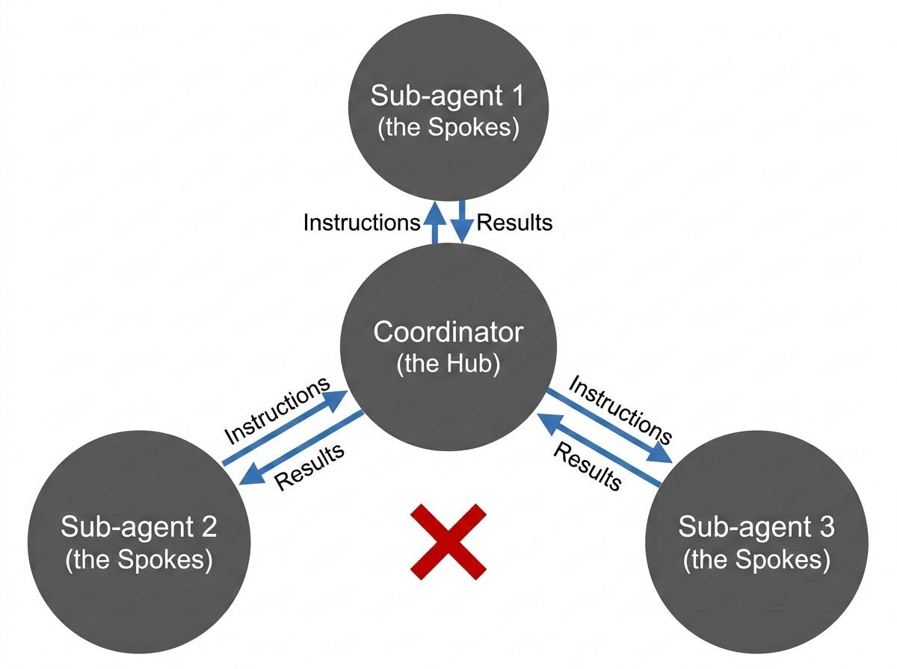
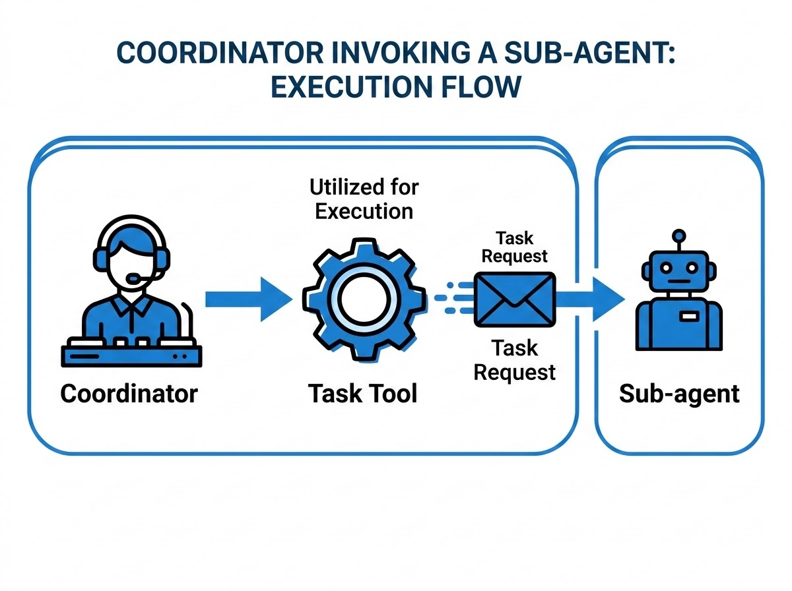
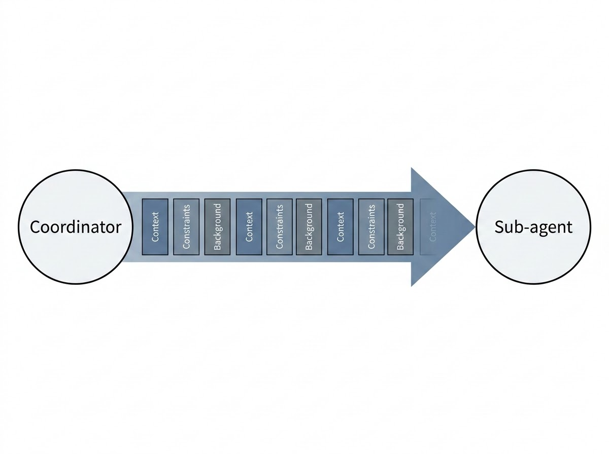
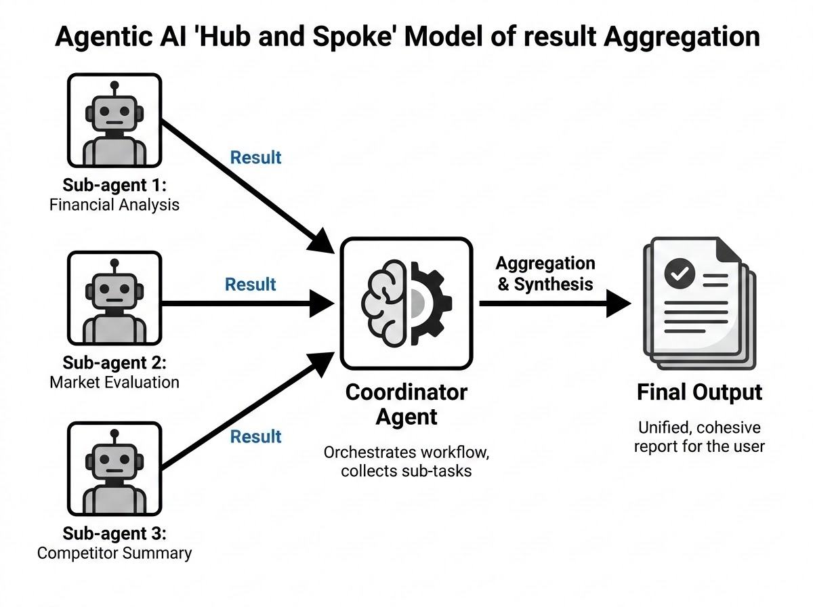

# The Hub-and-Spoke Model

Chapter 1 introduced the agentic loop: a single agent composes a request, the model responds, the harness inspects `stop_reason`, and the loop acts on whatever came back. That pattern works well for one agent working on one thread of reasoning. This chapter scales it up. You'll learn how Claude-based systems coordinate *multiple* agents through the hub-and-spoke model — a central coordinator managing a set of specialized subagents — and why almost every failure in a multi-agent system traces back to how the coordinator decomposed, delegated, and reassembled the work rather than to the subagents themselves. Expect the CCA-F exam to test this distinction directly: given a broken multi-agent output, you'll need to identify which stage of coordination broke down.

## Why a Single Agent Doesn't Scale

A single agent running a single agentic loop handles a single line of reasoning well. Give it one clear task, a focused set of tools, and a well-scoped context window, and it performs reliably. Problems start when you ask that same agent to do too much at once — research a market, analyze a balance sheet, evaluate legal exposure, and write an executive summary, all inside one continuous loop.

Cramming unrelated responsibilities into one context creates three compounding problems. Instructions for different sub-tasks compete for the model's attention, so none of them get followed as precisely. Reasoning threads bleed into each other — financial assumptions creep into the risk analysis, risk language creeps into the summary. And because everything lives in one loop, a single stuck tool call or a single confused turn stalls the entire task instead of just one piece of it.

The hub-and-spoke model solves this by giving each concern its own isolated agent and its own loop, all managed by a central coordinator. Instead of one agent trying to be a financial analyst, a risk assessor, and a copywriter simultaneously, three narrowly scoped subagents each do one job well, and a coordinator organizes the handoffs.

> 💡 **Tip:** If you find yourself writing a system prompt that lists five unrelated responsibilities for one agent, that's usually a sign the task should be decomposed into a hub-and-spoke workflow instead.

## The Anatomy of a Hub-and-Spoke System

### The Coordinator (the Hub)

The coordinator sits at the center of the architecture. It receives the user's request, decides how to break it into smaller pieces, launches the subagents needed to handle each piece, supplies each one with the context it needs, and combines their outputs into a single response. The coordinator rarely does the domain work itself — its job is orchestration, not execution.

### Subagents (the Spokes)

Subagents are the specialized workers connected to the hub. Each one is scoped to a narrow responsibility: analyze financial statements, evaluate market risk, summarize findings, check inventory, draft a contract clause. A subagent receives a task from the coordinator, executes it independently, and returns a result. It has no visibility into what other subagents are doing and no independent channel back to the user — everything it produces goes back through the coordinator.


*Figure 2.1: The coordinator exchanges instructions and results with each subagent individually along its own spoke; the marked X between the subagents shows the one connection that never exists — direct subagent-to-subagent communication.*

## The Golden Rule: All Communication Flows Through the Coordinator

The single rule that defines a hub-and-spoke system is this: subagents never communicate directly with one another. Every instruction, every piece of context, and every result passes through the coordinator. This is not a limitation to work around — it's the design decision that makes the whole architecture manageable.

### Why Subagents Never Talk to Each Other Directly

It's tempting to assume that letting subagents coordinate among themselves would be more efficient — skip the middleman, let the financial analyst agent ping the risk agent directly. In practice, direct subagent-to-subagent communication creates exactly the problems centralization is meant to prevent:

- **Hidden dependencies.** If Agent A quietly relies on something Agent B said, that dependency exists nowhere in the coordinator's plan. Change Agent B's behavior later, and Agent A breaks for a reason no one can see.
- **Uncontrolled context sharing.** Agents start passing each other information the coordinator never authorized, making it impossible to reason about what each agent actually knows at any point.
- **Duplicated work.** Without a central authority tracking what has already been assigned, two agents can end up doing the same analysis from two different angles.
- **Unpredictable, hard-to-debug workflows.** When something goes wrong, there's no single place to look — the failure could have originated in any agent-to-agent exchange that happened outside the coordinator's view.

Keeping communication centralized trades a small amount of theoretical efficiency for a large amount of predictability, debuggability, and control — and at production scale, that trade is almost always worth making.

### Walkthrough: Analyzing a Company's Financial Health

Consider a user request: *"Analyze this company's financial health and summarize the risks."* A coordinator receiving this doesn't attempt the whole task itself. It decomposes the work, assigns one subagent to examine financial statements, another to evaluate market risk, and a third to write the executive summary. Each subagent receives its task, the specific context it needs, and the expected output format from the coordinator — never from each other. Each works independently and reports back. The coordinator then merges the three results into one response for the user.

Now consider a customer support variant of the same pattern: a triage coordinator receives *"the customer wants a refund on order 8831 and is threatening to cancel their subscription."* It might dispatch one subagent to check refund-policy eligibility and a second to assess account-retention risk. Neither subagent needs to know what the other is doing — the coordinator holds the full picture and decides how to combine a refund decision with a retention offer.

> ✅ **Best Practice:** Design each subagent's task so it could be handed to a different engineer's system entirely, with no knowledge of the other agents in the workflow. If a subagent's output only makes sense assuming it "knows" what another agent did, communication has leaked outside the coordinator.

## Task Decomposition: Turning One Big Ask Into Several Small Ones

Task decomposition is the process of transforming one large, ambiguous objective into smaller, independent tasks that subagents can execute without guessing. It's the coordinator's first and most consequential responsibility — get it wrong, and no amount of subagent capability can rescue the final output.

Think of the coordinator as a project manager rather than a specialist. It doesn't do the financial modeling, the risk scoring, or the writing itself. It figures out what pieces of work exist, who should do each one, and how the pieces will eventually fit back together — and it has to do this *before* any subagent starts working, because subagents cannot infer a responsibility the coordinator never assigned to anyone.

### The Five-Step Decomposition Framework

1. **Understand the primary objective.** What is the user actually asking for, stripped of any assumptions?
2. **Identify independent subtasks.** Split the objective into pieces that can be worked on cleanly, without one piece depending on the output of another (unless a dependency is genuinely unavoidable).
3. **Assign specialization.** Decide which subagent — or type of subagent — is best suited to each subtask.
4. **Define expected outputs.** Specify the format, scope, and level of detail each subagent should return, not just the topic.
5. **Plan the aggregation.** Decide up front how the pieces will be combined. Strong coordinators design for synthesis before any subagent starts working, not after the results come back.

### Weak Decomposition vs. Strong Decomposition

A weak coordinator, given *"analyze this company's business performance,"* forwards that entire sentence to a single subagent as its instruction. The subagent now has to guess what kind of analysis matters, how much depth is expected, and what shape the output should take — three guesses that all introduce risk of a mismatched result.

A strong coordinator splits the same request into scoped responsibilities: one subagent analyzes financial performance, another evaluates competitive positioning, a third assesses operational risk, and a fourth drafts the executive summary once the other three are done. Each subagent now has a clear, narrow objective — and narrow objectives are what make subagent outputs consistent and easy to validate.

> ⚠️ **Important:** If the final output is missing something — say, operational risk was never assessed — the almost-always-correct diagnosis is that the coordinator never assigned that responsibility to anyone. No subagent volunteers to cover a gap it doesn't know exists.

**Real-world use case:** A content-operations pipeline that turns a product brief into a published article can use the same framework — one subagent researches competitor messaging, one drafts the article body, one checks brand-voice compliance, and one formats it for the CMS. Decomposition succeeds or fails on whether those four responsibilities together actually add up to "publish a compliant, well-researched article" with nothing missing.

**Common mistakes:**
- Assigning one subagent an objective so broad it can't be validated ("analyze the company").
- Letting subtask boundaries overlap heavily, so two agents produce redundant analysis instead of complementary pieces.
- Deciding how to aggregate results only after all subagents have already returned unstructured output.

## Invoking Subagents with the Agent Tool

Decomposing tasks well doesn't help if the coordinator has no way to actually launch the subagents it planned. Execution, not just planning, is where orchestration either works or stalls.

### Subagents Are Spawned on Demand, Not Pre-Existing

Subagents are not persistent processes sitting idle, waiting for work. They're invoked dynamically, exactly when the coordinator needs them, using the **agent tool**. From the coordinator's own agentic loop, this isn't exotic — invoking a subagent is simply another `tool_use` block. The model decides to call the agent tool, `stop_reason` comes back as `tool_use`, the harness spins up the subagent with the task and context provided, and the subagent's output returns to the coordinator as a tool result — appended to history exactly the way any other tool result would be.

That mechanism has one hard prerequisite: the coordinator's own configuration must include the agent tool among its `allowedTools`. A configuration such as:

```json
{
  "allowedTools": ["agent", "read_file", "web_search"]
}
```

is what actually grants the coordinator the ability to delegate. Without that entry, a coordinator has no mechanical path to spawn subagents — no matter how well-reasoned its decomposition plan is on paper.

> ⚠️ **Important:** This is a common exam trap. A scenario can describe a logically sound coordinator with a perfect task breakdown, but if the agent tool isn't listed in `allowedTools`, the described workflow simply cannot execute. Chapter 3 covers `allowedTools` configuration and its common misconfigurations in depth — for this chapter, the takeaway is narrower: authorization is a prerequisite for orchestration, not a detail you can assume away.

Each invocation is a structured request: a task ("analyze financial risks for Q4"), the context the subagent needs ("revenue declined 12% year over year"), and the expected output ("identify the top three financial risks"). The more explicit that request is, the more consistent the subagent's output will be — vague requests produce vague results, no matter how capable the underlying model is.


*Figure 2.2: When the coordinator's model calls the agent tool, the harness turns that call into a task request and routes it to the target subagent, which executes independently and returns its result.*

### Sequential vs. Parallel Invocation

Not every subtask needs to wait for the one before it. When subtasks are genuinely independent — financial analysis, competitor analysis, and sentiment analysis don't depend on each other's outputs — a well-designed coordinator invokes them in parallel rather than one after another. Running three independent subagents sequentially when they could run concurrently adds latency for no benefit, and on the exam, choosing sequential execution when parallel execution was clearly available is treated as an architectural mistake, not a stylistic preference.

Sequential invocation is still correct when a genuine dependency exists — for example, an executive-summary subagent that needs the financial and risk analyses to already be complete before it can write anything meaningful.

**Real-world use case:** A code-review coordinator handling a pull request can launch a static-analysis subagent, a test-coverage subagent, and a security-scan subagent all in parallel, since none of their findings depend on the others. Only the final "summarize findings for the reviewer" subagent needs to wait until all three have returned.

> 🚀 **Pro Tip:** Before wiring up a multi-subagent workflow, sketch a quick dependency graph of the subtasks. Anything with no incoming edges from another subtask is a candidate for parallel invocation.

## Passing Context Explicitly: Why Subagents Have No Memory of the Coordinator

This is the single most important operational fact about hub-and-spoke systems, and the one most often assumed away by mistake: **subagents share no memory with the coordinator or with each other.** A subagent knows only what's explicitly included in the task it was given. It cannot see the coordinator's conversation history, cannot infer what another subagent already found, and cannot recall a previous invocation from earlier in the workflow.

This isolation is deliberate, not a limitation to be patched over. Shared memory sounds convenient in theory, but in practice it creates the same problems as direct subagent-to-subagent communication: hidden dependencies, context pollution, and workflows where a subagent's behavior depends on state nobody explicitly passed to it. Isolation keeps every interaction intentional, and intentional interactions are the ones you can actually debug.

Consider a weak handoff: *"Continue analyzing the issue."* The subagent has no idea what "the issue" refers to, what analysis (if any) has already happened, or what output is expected. This isn't a failure of the subagent's reasoning — it's a failure of the instruction it was given.

Compare it to a strong handoff: *"The customer requested a refund for order number 8831. Prior analysis indicates the shipment was delayed by 12 days. Determine whether the refund policy applies, and return an eligibility decision with an explanation."* Every piece of information the subagent needs is present in the instruction itself.

### The Four Essential Pieces of Context

A coordinator should pass four things to every subagent it invokes:

1. **Task objective** — exactly what the subagent is expected to accomplish.
2. **Relevant context** — the background information required to reason correctly (prior findings, customer details, relevant data).
3. **Constraints or rules** — policies, limits, or requirements the subagent must respect.
4. **Expected output** — the format or structure the result should take, so it can be aggregated later without rework.

Leave any of these out, and the subagent is forced to guess. Once a workflow depends on subagents guessing at missing context, outputs stop being consistent — and inconsistency is much harder to debug in a multi-agent system than in a single-agent one, because you can't tell whether the model reasoned poorly or simply never received the information it needed.


*Figure 2.3: Everything a subagent will use — background, constraints, and task details alike — has to be packaged explicitly into the handoff itself, since nothing about the coordinator's state carries over automatically.*

### The Contractor Analogy

A useful mental model: think of subagents as independent contractors — an electrician, a plumber, a structural engineer — each hired for one job on the same construction project. Each one knows only the brief you personally hand them and the materials you provide. None of them automatically knows what you discussed with the other contractors, or what design decisions were made in a meeting they weren't in. The coordinator is the general contractor, responsible for making sure each specialist gets exactly the information they need — nothing assumed, nothing left implicit.

> 💡 **Tip:** When context passing fails, it fails silently. The subagent won't complain that it's missing information — it will simply produce a plausible-sounding but shallow or incorrect result, because that's what a model does when it's asked to reason from an incomplete brief.

**Real-world use case:** A legal-review coordinator handing a contract clause to a compliance subagent must include which jurisdiction applies, what prior clauses have already been approved, and what specific risk category to flag — not just "review this clause." Omit the jurisdiction, and the subagent may apply the wrong regulatory standard entirely, producing a confident but wrong answer.

## Aggregation: Turning Multiple Outputs Into One Answer

Subagents can each produce excellent individual work and the final response can still be weak, because the coordinator has one responsibility left after every subagent returns: aggregation. Aggregation is the process of collecting subagent outputs, resolving any overlap or contradiction between them, prioritizing what matters most, and producing one coherent answer.

The most common mistake here is treating aggregation as copy-and-paste — stitching subagent outputs together in the order they arrived, with no interpretation. That produces a response that reads like three disconnected reports stapled together, not an answer to the user's question.

### Resolving Apparent Contradictions

Subagents don't coordinate their conclusions with each other, so their outputs can appear to conflict even when both are correct. Suppose one subagent reports strong revenue growth and concludes the business is performing well, while another reports severe operational risk that threatens long-term stability. Those aren't necessarily contradictory — they can both be true at once, describing different time horizons. A weak coordinator picks one conclusion and drops the other, or presents both without comment, leaving the user to reconcile them. A strong coordinator recognizes the relationship — strong short-term performance alongside a longer-term structural risk — and synthesizes that relationship explicitly into the final answer.

### Structuring the Final Response

Good aggregation is also about presentation, not just content. A well-organized response leads with a high-level summary, follows with the most important supporting findings, and places detailed evidence afterward — because users need the key insight before they need the supporting detail. Structuring the response this way increases clarity, reinforces that the findings were actually synthesized rather than assembled, and builds trust that the system understood the request rather than just executing tasks mechanically.


*Figure 2.4: Independent subagent results converge on the coordinator, which aggregates and synthesizes them into a single unified report — an interpretation step, not a simple merge of the raw outputs.*

**Real-world use case:** In a due-diligence workflow, one subagent might flag a target company's strong customer retention while another flags pending litigation. A coordinator that simply appends both bullet points has technically "aggregated" the results but hasn't done its job; a coordinator that explains how litigation exposure could offset retention strength has.

> ✅ **Best Practice:** Plan the aggregation format as part of task decomposition — before subagents run — rather than improvising it after results arrive. Deciding in advance what "done" looks like makes it much easier to spot missing pieces later.

## When a Subagent Fails: The Coordinator's Responsibility

Failures are a normal part of any multi-agent system — a subagent can hit a timeout, receive malformed input, run into a policy it can't override, or lack permission to reach a system it needs. What distinguishes a reliable orchestration design from a fragile one isn't whether failures occur; it's who decides what happens next. A subagent can only report what it observed. The coordinator decides the recovery strategy.

A subagent reporting a failure should never send back something as unhelpful as *"task failed."* A useful failure report includes, at minimum: what the subagent was attempting, what specifically went wrong, any partial results already produced, and any alternative approach the subagent can suggest. Give the coordinator that much, and it can make an informed decision instead of guessing blind.

Not every failure calls for the same response. A subagent that times out reaching an external pricing API is in a fundamentally different situation from a subagent that's denied access to a restricted financial database. Retrying makes sense for the first case — the problem is temporary. Retrying accomplishes nothing for the second — the problem is authorization, and no number of retries changes that. Chapter 6 formalizes this distinction into a four-category failure taxonomy (transient, validation, business logic, and permission failures) with a matched recovery strategy for each. The architectural point to take from this chapter is narrower but just as important: classifying the failure type and choosing a recovery path is the coordinator's job — not something a subagent decides for itself, and not something a blanket "retry everything" policy can substitute for.

**Real-world use case:** An expense-auditing subagent asked to pull a vendor's payment history from a restricted finance system returns a permission error. Retrying won't help — the account genuinely lacks access. A well-designed coordinator recognizes the failure type, escalates to a human reviewer with appropriate access, and reports the partial results already gathered rather than silently discarding the entire run.

> ⚠️ **Important:** Treating every subagent failure the same way — always retry, or always abandon — is one of the most common orchestration mistakes. The correct response depends entirely on *why* the subagent failed, which is exactly why structured failure reporting matters more than a terse error message.

## Diagnosing Incomplete Coordinator Output

When a multi-agent system produces a final answer that feels shallow, missing key findings, or oddly fragmented, the instinct is to blame the model's intelligence. In a hub-and-spoke system, that instinct is usually wrong. Incomplete output is almost always a symptom of an orchestration failure — something the coordinator did (or failed to do) — not a sign that the underlying model reasoned poorly.

Because the coordinator owns decomposition, invocation, context passing, and aggregation, diagnosing an incomplete result means walking through each of those stages in order and finding where the breakdown actually happened.

### A Four-Point Diagnostic Checklist

1. **Was the task decomposed completely?** Check whether every responsibility implied by the user's request was actually assigned to a subagent. A financial-health report that's missing risk analysis usually means no subagent was ever asked to assess risk — not that a risk subagent failed silently.
2. **Was sufficient context passed to each subagent?** Even a correctly assigned subtask produces a weak result if the subagent didn't receive the background, constraints, or expected output it needed. Missing context tends to show up as shallow analysis or unsupported assumptions rather than an obvious error.
3. **Did aggregation drop or ignore valid findings?** Sometimes every subagent does excellent work, but the coordinator's synthesis step ignores a contradiction, discards a finding it didn't know how to reconcile, or simply forgets to include something in the final structure. From the outside, this looks identical to a subagent failure — it isn't.
4. **Did the workflow terminate too early?** A coordinator that stops after the first subagent result, or exits immediately after a recoverable error, produces an incomplete answer for a reason that has nothing to do with subagent quality — the orchestration simply never finished.

**Real-world use case:** A market-research report comes back covering pricing and competitor positioning but says nothing about regulatory risk, even though the original request asked for a "complete market entry assessment." Tracing the checklist reveals the coordinator never assigned a regulatory-risk subtask in the first place — a decomposition failure, not a subagent that quietly failed to deliver.

> 🚀 **Pro Tip:** When debugging a multi-agent system, request each subagent's raw output alongside the coordinator's final answer. Comparing the two tells you immediately whether the gap is in what the subagents produced or in how the coordinator combined it.

## Chapter Summary

The hub-and-spoke model distributes work across specialized subagents while a central coordinator retains full control over communication. All instructions, context, and results flow through the coordinator; subagents never talk to each other directly, because doing so would introduce hidden dependencies and unpredictable behavior. The coordinator's job breaks into four stages: decomposing the request into independent subtasks, invoking subagents through the agent tool (in parallel wherever tasks are genuinely independent), passing each subagent everything it needs since none of them share memory, and aggregating the results into one coherent, synthesized answer. When a subagent fails, the coordinator — not the subagent — decides the recovery strategy based on the type of failure. And when a final output looks incomplete, the root cause is almost always traceable to one of the coordinator's four responsibilities, not to the intelligence of the subagents it delegated to.

## Key Takeaways

- The hub-and-spoke model centralizes all communication through a single coordinator; subagents (the spokes) never communicate directly with one another.
- Task decomposition is the coordinator's responsibility, following a five-step pattern: understand the objective, identify independent subtasks, assign specialization, define expected outputs, and plan aggregation up front.
- Subagents are invoked dynamically through the agent tool, which must be present in the coordinator's `allowedTools` before any delegation can occur.
- Independent subtasks should be invoked in parallel to reduce latency; sequential invocation is reserved for genuine dependencies.
- Subagents share no memory with the coordinator or with each other — every task objective, piece of context, constraint, and expected output must be passed explicitly.
- Aggregation is synthesis, not concatenation: the coordinator must resolve contradictions, remove redundancy, and structure the response with the key insight first.
- Subagent failures should be classified before choosing a recovery strategy; the coordinator owns that decision, not the subagent.
- Incomplete coordinator output is almost always traceable to a decomposition, context-passing, aggregation, or premature-termination failure — not to subagent intelligence.

## Interview Questions

1. Explain the hub-and-spoke model to someone unfamiliar with multi-agent architectures. What problem does it solve that a single agent cannot?
2. Why are subagents prevented from communicating directly with one another, and what specific failure modes does that restriction avoid?
3. Walk through the five-step task decomposition framework using an example of your choosing. What happens to the final output if step one is done poorly?
4. What does it mean for a subagent to have "no memory" of the coordinator, and what four pieces of context should a coordinator pass with every task to compensate for that?
5. Describe a scenario where two subagents return findings that appear contradictory but are both correct. How should the coordinator handle it?
6. Given a multi-agent system that produces an incomplete final report, describe the diagnostic process you'd use to determine whether the fault lies in decomposition, context passing, aggregation, or premature termination.
7. Why is parallel invocation of subagents preferred over sequential invocation whenever subtasks are independent, and how would you identify which subtasks qualify?
8. What is the difference between a subagent's responsibility when it encounters an error and the coordinator's responsibility? Why does that distinction matter for reliability?

## Practice Questions & Answers

**Practice Question (unofficial) 1:**
A coordinator receives the request "evaluate our top three vendors and recommend which one to renew." It launches a single subagent with the instruction "look into the vendors." What's wrong with this design, and how would you fix it?

*Answer:* The instruction is a single, vague task handed to one subagent, which forces that subagent to guess the evaluation criteria, the depth of analysis, and the expected output format. The fix is proper decomposition: identify independent subtasks (e.g., one subagent per vendor, evaluating cost, reliability, and contract terms against defined criteria), assign each to a subagent with an explicit expected output (a structured comparison on the same criteria), and plan a final aggregation step that compares all three and produces a recommendation with justification.

**Practice Question (unofficial) 2:**
Two subagents in a due-diligence workflow return the following: Subagent A — "Customer retention is strong, churn is down 8% year over year." Subagent B — "The company faces a material pending lawsuit that could result in significant financial liability." Should the coordinator discard one finding in favor of the other? Why or why not?

*Answer:* No. Both findings can be true simultaneously and describe different aspects of the company's health — one operational, one legal/financial risk. The coordinator's job is not to pick a winner but to synthesize the relationship: strong retention supports current business performance, while the pending litigation represents a distinct risk that could materially affect future value. The final response should present both, explicitly connected, rather than dropping either one.

**Practice Question (unofficial) 3:**
A coordinator's configuration lists `allowedTools: ["read_file", "web_search"]`. Its system prompt describes a detailed plan to decompose a research task across three subagents. Will this workflow execute as designed? Explain.

*Answer:* No. The agent tool is not included in `allowedTools`, so the coordinator has no mechanical way to invoke any subagent, regardless of how well-reasoned its decomposition plan is. The design is logically sound but not executable — this is a configuration failure, not a reasoning failure, and it's a distinction the exam tests directly.

**Practice Question (unofficial) 4:**
A subagent tasked with checking refund eligibility fails and reports back only: "Task failed." What's missing from this failure report, and why does it matter to the coordinator?

*Answer:* Missing are: what specifically the subagent was attempting, the type/cause of the failure, any partial results already obtained, and any alternative approach available. Without this, the coordinator cannot distinguish a transient issue (worth retrying) from a permission or business-logic issue (not worth retrying), and cannot make an informed recovery decision — it's forced to guess, which is exactly the failure mode hub-and-spoke systems are designed to avoid.

**Practice Question (unofficial) 5:**
A final report on "Company X's market position" only discusses pricing and competitors, even though the original user request asked for a "complete competitive and regulatory assessment." Using the four-point diagnostic checklist, identify the most likely point of failure.

*Answer:* The most likely failure is in task decomposition (checklist item 1): no subagent was ever assigned the regulatory-assessment responsibility. Since subagents cannot infer responsibilities the coordinator never assigned, the omission would produce exactly this symptom — a report that reads as if regulatory analysis simply never happened, because it never did.

## Multiple Choice Questions

**Q1.** In the hub-and-spoke model, what is the coordinator's primary role?
A. Performing all domain-specific analysis itself, using subagents only for verification
B. Decomposing requests, invoking subagents, passing context, and aggregating results
C. Storing shared memory that all subagents can access
D. Executing tool calls that subagents are not permitted to make

**Correct Answer: B**

*Explanation:* The coordinator's defining responsibility is orchestration — breaking down the task, launching subagents with the right context, and synthesizing their outputs — not doing the domain work itself. **A** is wrong because the coordinator delegates the domain work rather than performing it. **C** is wrong because hub-and-spoke systems have no shared memory layer; context is passed explicitly per task. **D** is wrong because subagents make their own tool calls within their scoped task; the coordinator's tool use is the agent tool itself.

**Q2.** Why do subagents in a hub-and-spoke architecture never communicate directly with one another?
A. Direct communication is technically impossible in any AI system
B. It would introduce hidden dependencies, uncontrolled context sharing, and unpredictable workflows
C. Subagents are incapable of generating tool calls
D. Only the coordinator is licensed to use the underlying model

**Correct Answer: B**

*Explanation:* Centralizing communication through the coordinator keeps orchestration predictable and debuggable; direct subagent communication reintroduces the exact problems centralization avoids. **A** is false — it's an architectural choice, not a technical impossibility. **C** is false — subagents can and do call tools within their own tasks. **D** is not a real constraint in this architecture; any agent with model access can generate outputs, but the *design* restricts communication paths, not licensing.

**Q3.** A coordinator forwards the instruction "continue analyzing the issue" to a subagent that has never previously been invoked in this workflow. What is the most likely outcome?
A. The subagent will retrieve the missing context from the coordinator's memory automatically
B. The subagent will produce a shallow or guessed result because it has no shared memory with the coordinator
C. The subagent will request clarification from another subagent
D. The workflow will fail immediately with a configuration error

**Correct Answer: B**

*Explanation:* Subagents have no memory of the coordinator's context; a vague instruction like this gives the subagent nothing concrete to reason from, so it will guess. **A** is wrong because there is no shared memory to retrieve from. **C** is wrong because subagents cannot communicate with each other at all. **D** is wrong because vague context doesn't trigger a hard configuration failure — it produces a low-quality but syntactically valid response, which is precisely why the failure mode is so easy to miss.

**Q4.** Which four elements should a coordinator include when passing context to a subagent?
A. Model name, temperature setting, token limit, and system prompt
B. Task objective, relevant context, constraints/rules, and expected output
C. Prior conversation history, coordinator credentials, other subagents' names, and a timestamp
D. User's name, request timestamp, session ID, and API key

**Correct Answer: B**

*Explanation:* These four elements give a subagent everything it needs to execute a task without guessing. **A** and **D** list configuration/metadata details, not the substantive task information a subagent needs to reason correctly. **C** incorrectly implies subagents need visibility into other subagents or coordinator-level credentials, which violates the isolation principle.

**Q5.** A coordinator needs to run financial analysis, competitor analysis, and sentiment analysis, none of which depend on each other's output. What is the best execution strategy?
A. Run them sequentially to conserve compute resources
B. Run them in parallel, since they are independent
C. Merge them into a single subagent task to reduce coordination overhead
D. Run only one of them and infer the others from its output

**Correct Answer: B**

*Explanation:* Independent subtasks should run in parallel to reduce total latency; this is a core efficiency principle of hub-and-spoke orchestration. **A** unnecessarily increases latency with no accuracy benefit. **C** reintroduces the single-agent overload problem the architecture is designed to avoid. **D** is not a valid substitute for actually performing each independent analysis.

**Q6.** What must be true of a coordinator's configuration before it can invoke any subagent?
A. The subagent must already be running in the background
B. The coordinator's `allowedTools` must include the agent tool
C. The user must explicitly name each subagent in the original request
D. The coordinator must share memory with the subagent in advance

**Correct Answer: B**

*Explanation:* Without the agent tool present in `allowedTools`, the coordinator has no mechanism to spawn subagents at all, regardless of how sound its plan is. **A** is wrong because subagents are invoked on demand, not pre-existing. **C** is wrong because the coordinator, not the user, decides how to decompose and delegate work. **D** is wrong because shared memory does not exist in this architecture.

**Q7.** A user asks a coordinator to "analyze this company's business performance." A weak coordinator forwards that entire sentence, unmodified, to one subagent. What is the main risk of this approach?
A. The subagent will refuse the task outright
B. The subagent must guess the scope, depth, and expected output format, increasing inconsistency
C. The task will automatically be split by the underlying model into subtasks
D. The coordinator will be unable to use the agent tool at all

**Correct Answer: B**

*Explanation:* A vague, undecomposed instruction leaves scope, depth, and format entirely to the subagent's guesswork, producing inconsistent results. **A** is incorrect — models generally attempt vague tasks rather than refusing them. **C** is incorrect — the model does not automatically decompose tasks on the coordinator's behalf; decomposition is the coordinator's explicit responsibility. **D** is unrelated to this scenario — tool access is a separate concern from decomposition quality.

**Q8.** In the five-step task decomposition framework, what is the purpose of planning aggregation before subagents begin working?
A. It lets the coordinator skip invoking some subagents later
B. It ensures the coordinator knows how outputs will be combined, which shapes what each subagent should be asked to return
C. It removes the need to define expected outputs for each subagent
D. It allows subagents to communicate their results directly to one another

**Correct Answer: B**

*Explanation:* Deciding the aggregation approach in advance shapes what output format and content to request from each subagent, making later synthesis reliable. **A** is unrelated to aggregation planning. **C** is the opposite of correct — planning aggregation actually depends on having defined expected outputs. **D** incorrectly reintroduces direct subagent-to-subagent communication, which the architecture prohibits.

**Q9.** Subagent A reports strong revenue growth; Subagent B reports significant operational risk for the same company. What is the best aggregation approach?
A. Discard Subagent B's finding since growth is the more favorable outcome
B. Present both findings as an unordered list with no further comment
C. Synthesize the relationship between the two findings into a coherent explanation
D. Ask Subagent A to re-run its analysis until it matches Subagent B's conclusion

**Correct Answer: C**

*Explanation:* Both findings can be simultaneously true, describing different aspects (short-term performance vs. long-term risk); strong aggregation connects them into one coherent picture. **A** improperly discards valid information. **B** is a copy-paste approach that fails to add the interpretation aggregation requires. **D** misunderstands the situation as an error to reconcile through re-analysis rather than two valid, complementary findings.

**Q10.** A subagent reaching an external pricing API encounters a timeout. What is the most appropriate coordinator response?
A. Escalate immediately to a human reviewer without attempting anything further
B. Retry the request, possibly with backoff, since the issue is likely temporary
C. Permanently remove that subagent from the workflow
D. Ignore the failure and proceed with aggregation as if the subagent succeeded

**Correct Answer: B**

*Explanation:* A timeout is characteristic of a transient failure — the task itself is valid, but the environment failed temporarily — so retrying (with backoff) is the appropriate strategy. **A** is excessive for a transient, recoverable issue. **C** is an overreaction that removes a potentially valid subagent from future use. **D** silently discards a real failure and risks aggregating incomplete or fabricated results.

**Q11.** A subagent is denied access to a restricted financial database. What should the coordinator do?
A. Retry the same request repeatedly until it succeeds
B. Recognize this as an authorization issue and escalate rather than retry
C. Reassign the same restricted task to a different subagent with identical permissions
D. Treat it identically to a network timeout

**Correct Answer: B**

*Explanation:* Permission failures are not resolved by retrying — the blocker is authorization, not a temporary condition — so escalation to someone with appropriate access is the correct response. **A** wastes effort on a failure type retries cannot fix. **C** doesn't solve the problem if the new subagent has the same permission constraints. **D** conflates two very different failure categories that require different responses.

**Q12.** A final multi-agent report on "Company X" covers financials and competitors but omits regulatory risk, which the original request explicitly asked for. Using the diagnostic checklist, what is the most likely root cause?
A. The regulatory-risk subagent produced output but the coordinator ignored it during aggregation
B. The coordinator never assigned a regulatory-risk subtask to any subagent
C. The user's original request was ambiguous about regulatory risk
D. The subagent responsible for regulatory risk experienced a permission failure

**Correct Answer: B**

*Explanation:* When an entire category of requested analysis is absent from the final output, the most common cause is that no subagent was ever tasked with producing it — a decomposition failure. **A** assumes output exists that was discarded, which is possible but less likely than the responsibility never being assigned at all, especially with no other evidence. **C** contradicts the premise, since the request explicitly asked for regulatory risk. **D** assumes a specific failure mode not indicated by the scenario.

**Q13.** Why is the "contractor" analogy (electrician, plumber, structural engineer) useful for understanding subagents?
A. It shows that subagents can hire their own subagents
B. It illustrates that each specialist works only from the brief they're personally given, without knowledge of what other specialists were told
C. It demonstrates that all specialists should share one unified memory of the project
D. It proves that subagents are billed per task like independent contractors

**Correct Answer: B**

*Explanation:* The analogy captures context isolation: each contractor (subagent) knows only what's explicitly briefed to them, mirroring how subagents receive only what the coordinator explicitly passes. **A** introduces a concept (subagents spawning subagents) not part of the analogy. **C** is the opposite of the analogy's point — the whole value is that specialists do *not* share unified memory. **D** is a literal, irrelevant reading of "contractor" that misses the architectural point.

**Q14.** Which scenario best demonstrates a coordinator using parallel invocation correctly?
A. Running a competitor-analysis subagent only after the financial-analysis subagent completes, even though neither depends on the other
B. Running financial-analysis, competitor-analysis, and sentiment-analysis subagents simultaneously, since none depend on each other's output
C. Running an executive-summary subagent before the analyses it depends on have completed
D. Running all subtasks sequentially by default to simplify debugging

**Correct Answer: B**

*Explanation:* Parallel invocation is correct precisely when subtasks are independent, as in this example. **A** describes unnecessary sequential execution despite no dependency — a missed optimization. **C** is invalid regardless of parallel/sequential strategy, since the summary genuinely depends on the other outputs and must wait. **D** treats sequential execution as a default rule, which contradicts the guidance to parallelize independent work whenever possible.

**Q15.** What is the most accurate description of why incomplete coordinator output is usually not the subagents' fault?
A. Subagents are only capable of following a fixed set of prewritten instructions
B. Subagents can only act on tasks and context the coordinator explicitly provides; gaps usually trace back to decomposition, context passing, or aggregation
C. Subagents lack access to any tools, so they cannot be responsible for incomplete results
D. The model powering subagents is inherently less capable than the model powering the coordinator

**Correct Answer: B**

*Explanation:* Since subagents operate strictly within the scope of what they're assigned and told, missing responsibilities, missing context, or dropped findings during synthesis are the coordinator's failures, not a reasoning failure by the subagent. **A** mischaracterizes subagents as rigidly scripted rather than reasoning models working from the input they're given. **C** is factually wrong — subagents commonly use tools within their assigned tasks. **D** introduces an unsupported and generally false assumption; subagents and coordinators typically run on comparable models, with the difference being scope and orchestration role, not capability.

## Evaluate Yourself

1. **Scenario:** You're designing a hub-and-spoke workflow for an insurance company that wants to automatically process claims. Identify at least three subagents you would create, the specific context each one needs from the coordinator, and how their outputs would be aggregated into a final claim decision.
2. **Architecture design:** Draft the `allowedTools` configuration you'd expect for a coordinator in a customer-support triage system, and justify which tools belong on the coordinator versus which belong only on its subagents.
3. **Short answer:** A coordinator's final report on a security audit is missing any mention of third-party vendor risk, even though the request asked for a "full-scope" audit. Walk through the four-point diagnostic checklist and identify exactly where you'd start looking, and why.
4. **Scenario:** Two subagents in a product-launch readiness review return conflicting signals — one says supply chain capacity is sufficient, the other says a key component is on extended backorder. Write the aggregation logic you would want the coordinator to follow, in plain language.
5. **Architecture design:** You're told that a coordinator repeatedly fails to invoke any subagents even though its decomposition logic in the system prompt looks correct. List, in order, the configuration checks you would perform before assuming the decomposition logic itself is at fault.
6. **Reflection:** Think of a real workflow you've built or used (a support ticketing system, a research assistant, a data pipeline) that could be redesigned as a hub-and-spoke system. What would the coordinator's responsibilities be, and what would go wrong if you let the individual pieces communicate directly instead of through a central coordinator?
