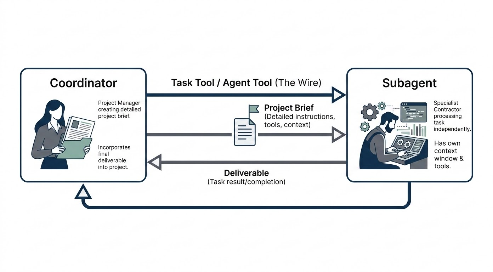
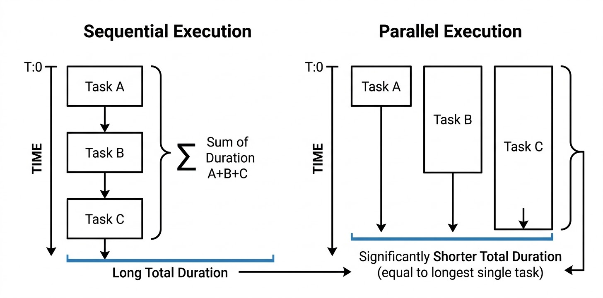
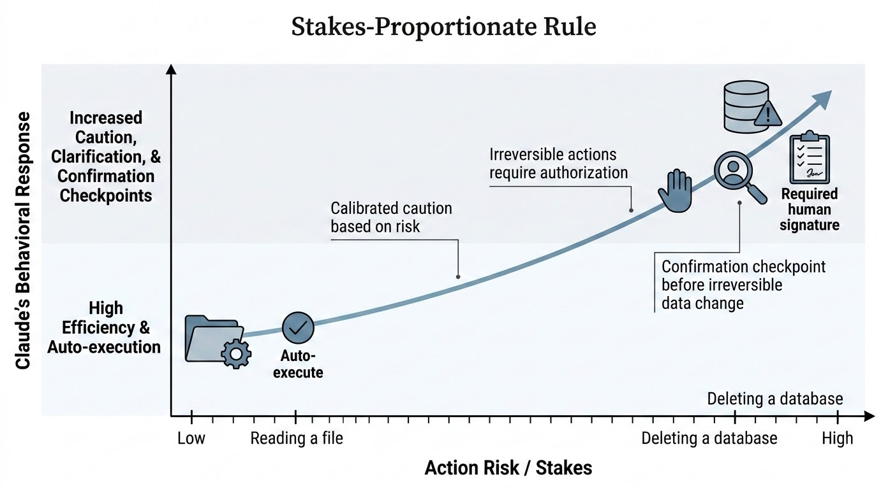

# The Agent Tool, Parallel Execution, and the Stakes-Proportionate Rule

Chapter 2 introduced the hub-and-spoke model conceptually: a coordinator that decomposes work and subagents that execute it. This chapter opens the hood on the mechanism that actually makes that delegation happen — the agent tool — and covers the configuration details that determine whether your multi-agent system runs at all, runs efficiently, or runs safely. By the end of this chapter you should be able to configure `allowedTools` correctly, decide when subagents should run in parallel versus sequentially, and explain how the Stakes-Proportionate Rule governs Claude's behavior in both single-agent and multi-agent contexts. These three topics form the operational backbone of Domain 1 on the CCA-F exam.

## From Task to Agent: The Delegation Mechanism

### What the Agent Tool Actually Does

A single Claude call works well for a bounded task: answer a question, summarize a passage, draft a paragraph. It starts to strain once a job has multiple independent phases — research, drafting, fact-checking, formatting — because all of that work has to live inside one context window and one chain of reasoning. The context gets crowded, the model juggles too many concerns at once, and quality degrades in ways that are hard to diagnose.

The agent tool exists to break that bottleneck. It is the concrete mechanism that lets one Claude instance, the coordinator, hand off a piece of work to another Claude instance, the subagent, and receive a result when the subagent is finished. The coordinator does not inspect how the subagent does its work — it composes a prompt, sends it through the agent tool, and waits for the response.

It helps to think of this the way a project manager thinks about a specialist contractor. The manager writes a detailed brief containing everything the contractor needs to do the job, hands it off, and does not stand over the contractor's shoulder. When the deliverable comes back, the manager folds it into the larger project. Carry forward one mental model for the rest of this chapter: **an agent tool call is one Claude invoking another Claude.** The caller is the coordinator, the callee is the subagent, and the agent tool is the wire between them.


*Figure 3.1: The coordinator, acting like a project manager, sends a detailed project brief through the agent tool ("the wire") to the subagent, which works independently in its own context window before returning a deliverable that the coordinator folds into the larger project.*

This is architecturally different from a normal function call. A subagent is not a lightweight helper function — it is a full Claude model invocation with its own context window, its own tool access, and its own independent reasoning process. That is precisely what makes it useful: it lets you build systems where different agents hold different responsibilities, different tool permissions, and different instructions, all orchestrated by a coordinator that does not need to be an expert in any of the individual jobs.

### The Rename: Task Tool → Agent Tool (Claude 2.1.63)

You will encounter two names for this same mechanism in production code, documentation, and logs, and it is worth understanding why. The tool originally shipped as the **task tool**. It was renamed to the **agent tool** in Claude version 2.1.63.

The rename is not cosmetic trivia — it reflects a clarification in how Anthropic wanted developers to think about the mechanism. "Task" framed it as a unit of work being dispatched; "agent" makes explicit that what gets dispatched is a full autonomous Claude instance, not a passive job queued for later processing. Since the rename, `agent` is what appears in `tool_use` and `tool_result` blocks. However, "task" has not disappeared entirely from every corner of the system: it can still surface in system-initialization tool listings and in messages describing a blocked subagent, depending on SDK and platform version. If you see "task" referenced in a log or an older code sample, treat it as the same mechanism under its earlier name, not a different feature.

> ⚠️ **Important:** On current SDK versions, the string that belongs in `allowedTools` is `agent`, not `task`. Code copied from older tutorials or blog posts that still uses `task` in that array will silently fail to enable delegation — there is no error, delegation simply never triggers.

### When to Reach for the Agent Tool (and When Not To)

Delegation adds coordination overhead: extra latency, extra tokens, extra surface area to debug. That cost has to be earned. Reach for the agent tool when at least one of the following is true:

- The sub-task is substantial enough to fill its own context window on its own.
- The sub-task needs tool access that the coordinator itself should not have.
- You want the sub-task to be able to succeed or fail independently, without corrupting the coordinator's own reasoning trace.
- The work genuinely benefits from isolation — a distinct area of focus that shouldn't bleed into the coordinator's context.

"My prompt is getting long" is not, by itself, sufficient justification. If there is no isolation, tool, or reliability benefit, decomposition just adds overhead without buying anything back.

### Real-World Use Case: Multi-Stage Report Generation

Consider a research operations team that needs to take a raw topic, produce a researched draft, verify factual claims, and format the result for client delivery. A single Claude call attempting all four stages tends to blur them together — the fact-checking reasoning contaminates the drafting reasoning, and the formatting pass has to compete for attention with everything upstream of it. Splitting this into a research subagent, a drafting subagent, a verification subagent, and a formatting subagent — each with its own tool access (search tools for research, none for drafting, a citation-checking tool for verification) — keeps each stage's context clean and lets you swap or improve one stage without touching the others.

## allowedTools: Registering the Agent Tool

### Why Claude Doesn't Know About Tools by Default

Before troubleshooting delegation failures, you need the underlying model of how Claude sees tools at all. Claude has no built-in knowledge of what capabilities exist in a given deployment. It does not carry an internal list of "things I can do." Every tool it is able to call must be registered into its context at the start of the session. If a tool is not registered, Claude does not know it exists — from its perspective, the tool simply is not there.

This rule applies to the agent tool exactly the same way it applies to a search tool or a file-read tool. The agent tool is **not** a special built-in that Claude always has access to by virtue of being Claude. It is a tool definition injected by the SDK, and it is only injected when it has been explicitly registered.

### The Three-Layer Structure in Code

Registration happens through `allowedTools`. When the SDK sees `agent` listed there, it injects the agent tool's schema into Claude's context alongside whatever other tools you've configured. When `agent` is absent from that list, the schema is never injected, and Claude's tool list simply does not contain it — no error, no warning, just silent unavailability.

A working multi-agent configuration has three layers:

```python
from claude_agent_sdk import query, ClaudeAgentOptions, AgentDefinition

options = ClaudeAgentOptions(
    # Layer 2: what the COORDINATOR itself can do.
    allowedTools=["Read", "Grep", "agent"],   # "agent" registers delegation
    agents={
        # Layer 3: the subagents available for delegation.
        "code-reviewer": AgentDefinition(
            description="Reviews code changes for correctness and style",
            prompt="You are a meticulous code reviewer. Flag bugs, style "
                   "violations, and missing tests.",
            tools=["Read", "Grep"],           # explicit — no "agent" here
        ),
        "test-runner": AgentDefinition(
            description="Runs the test suite and reports failures",
            prompt="You are a test execution specialist. Run the suite and "
                   "summarize pass/fail results with stack traces.",
            tools=["Bash", "Read"],           # explicit — no "agent" here
        ),
    },
)

# Layer 1: the function that runs the coordinator loop.
async for message in query(
    prompt="Review the changes in pull request #482 and run the tests.",
    options=options,
):
    print(message)
```

Notice the three layers: (1) the `query` function running the coordinator loop, (2) `ClaudeAgentOptions`, which governs what the coordinator itself is allowed to do, and (3) the `agents` dictionary of `AgentDefinition` objects, which declares what subagents exist and what each one is permitted to do. `agent` appears in the coordinator's `allowedTools` — that is what makes delegation possible at all.

### Why Isn't Delegation Automatic?

It is reasonable to ask why the SDK doesn't just include the agent tool by default. Two reasons, both deliberate:

**Safety.** Subagents take real actions — they read files, run commands, execute whatever tools they are given. If delegation were implicit, any `query` call could spin up subagents as an undocumented side effect, without the developer having consciously enabled it. Requiring `agent` in `allowedTools` means multi-agent behavior only happens when a developer has consciously turned it on. This mirrors the SDK's general posture: nothing runs unless you've said it can.

**Composability.** The SDK supports many different usage patterns, and not every application needs — or wants — a multi-agent system. Defaulting to the least powerful, most predictable behavior means single-agent use cases stay simple, and upgrading to coordinator/subagent architecture is a deliberate choice rather than an implicit one.

### Four Common Misconfigurations

Four mistakes account for nearly every "my multi-agent system isn't working" support question:

1. **Missing `agent` in the coordinator's `allowedTools`.** Symptom: no crash, but subagents never run — the response comes back fast, short, and clearly did none of the delegated work. Fix: add `agent` to the coordinator's `allowedTools`.
2. **Not setting `tools` explicitly on a subagent definition.** If you omit `tools` on an `AgentDefinition`, the subagent inherits the full tool set of its parent — including the agent tool itself. Fix: always specify `tools` explicitly for every subagent. Inherited defaults are unsafe defaults.
3. **Adding `agent` to a subagent's own `tools` list.** This lets the subagent spawn further subagents, which can spawn further subagents, and so on — effectively unbounded recursive delegation. Fix: never include `agent` in a subagent's tool list.
4. **Using `task` instead of `agent` in `allowedTools` on a current SDK version.** Since the 2.1.63 rename, `task` is no longer the registration keyword. Fix: use `agent`.

> ✅ **Best Practice:** Treat mistakes 2 and 3 as two sides of the same rule — a subagent's tool list should be scoped down to exactly what that subagent's job requires, and delegation authority (`agent`) belongs only at the coordinator layer.

### Real-World Use Case: Debugging a Silent Multi-Agent System

A team builds their first multi-agent setup — a code-reviewer subagent and a test-runner subagent — wires it up, and runs it. Nothing crashes. But the run finishes suspiciously fast, the output is thin, and neither subagent appears to have been invoked. This is misconfiguration #1: `agent` was never added to the coordinator's `allowedTools`. Because there is no error message — Claude simply doesn't see a tool it was never told about — this failure mode is easy to lose an afternoon to. The fix is a one-line addition to `allowedTools`, but finding it requires knowing that silent non-invocation, not a crash, is exactly what a missing tool registration looks like.

## Running Subagents in Parallel

### How Parallel Execution Actually Works

Picture an AI research system where a user uploads five earnings reports and asks for a full analysis. A naive coordinator starts Agent A, waits eight seconds for it to finish, then starts Agent B, waits seven seconds, then starts Agent C, waits seven more. By the time the report is ready, the user has waited 22 seconds — even though none of those five analyses depended on each other. This is the default failure mode of multi-agent systems: they run sequentially unless you deliberately make them do otherwise, because a coordinator that starts one subagent, waits for the result, then starts the next, is the simplest thing to write. It is also the slowest.

The fix is parallelism, and the underlying mechanism is simple: **when Claude calls the agent tool multiple times within the same response turn, those subagent invocations run in parallel.** If Claude emits two tool calls in a single message, the runtime executes both at once — it does not wait for the first to complete before starting the second. Your job as the person designing the coordinator prompt is to get Claude to emit multiple agent tool calls together in one turn, rather than one at a time across multiple turns.

### Writing Coordinator Prompts That Trigger Parallelism

This is the part that trips people up: simply saying "research X, Y, and Z" does not reliably produce parallel execution. Claude may just as easily do them one at a time, waiting between each. You have to explicitly signal parallelism in the coordinator's instructions. Phrasing that reliably works:

- "Invoke all subagents simultaneously."
- "Launch these in parallel."
- "Do not wait for one to finish before starting the next."
- "Call the agent tool for each of the following at the same time."

A coordinator system prompt built around this looks like:

```
You are a research coordinator. When given a list of topics to
investigate, launch parallel subagents to research each topic
simultaneously. Do not perform research sequentially. Instead,
invoke the agent tool for all topics at the same time, in a single
response. Each subagent should receive a focused research prompt
and should return a structured summary. Once all subagents have
completed, synthesize their findings into a final report.
```

The load-bearing sentence is "invoke the agent tool for all topics at the same time, in a single response" — that phrasing tells Claude exactly what you want mechanically, not just what outcome you're after. It also pays off to specify, in the same prompt, what each subagent should return: a defined output format means the coordinator spends less effort reconciling inconsistent subagent responses during synthesis.

### Walkthrough: Parallel Competitor Analysis

Say you're building a product research pipeline that needs to analyze three competitors at once.

1. The user sends a request to the coordinator: "Analyze the pricing, features, and positioning of competitors A, B, and C."
2. The coordinator fires three agent tool calls in a single turn: analyze competitor A (pricing, features, positioning), analyze competitor B (same instructions), analyze competitor C (same instructions).
3. All three subagents run concurrently, each doing its own research and formatting.
4. The coordinator receives all three results, compares them side by side, identifies patterns, and writes the final synthesized report.

Total wall-clock time is roughly as long as the *slowest* subagent — not the sum of all three. That is the entire payoff of parallel execution: latency collapses from additive to roughly the maximum of the individual task durations.


*Figure 3.2: In sequential execution, Task A, B, and C run one after another and the total duration is their sum; in parallel execution, the same three tasks run at once and the total duration shrinks to roughly the length of the longest individual task.*

### Common Mistakes in Parallel Execution

- **Shared state contention.** If parallel subagents all read from and write to the same resource — the same file, the same database record — you introduce race conditions. Design subagents to operate on independent data whenever they're running concurrently.
- **Forgetting to collect all results before synthesizing.** The coordinator's instructions need to be explicit that it should gather every parallel response before moving to synthesis, not act on the first one that returns.
- **Underspecified subagent prompts.** Once subagents are running in parallel, you lose the ability to intervene mid-flight. Front-load clarity into each subagent's prompt — ambiguity that would be a minor annoyance in a sequential chain becomes an untraceable divergence in a parallel fan-out.

> 💡 **Tip:** The core rule to remember is: multiple agent tool calls emitted in a single response turn equals parallel execution. Everything else in this section is really about writing prompts that reliably produce that behavior.

## Choosing Sequential vs. Parallel Invocation

### The One-Question Test: Is There a Dependency?

Parallelism is fast, but it is not free of failure modes of its own. Consider a coordinator with a search subagent and an analysis subagent. If you run both in parallel to "save time," the analysis subagent starts before the search subagent has returned anything — there is nothing for it to analyze, so it fabricates a plausible-sounding answer instead. This is one of the most common early mistakes in multi-agent design, and it is not a missing tool or a broken prompt. It is simply the wrong invocation pattern for a job that has a real dependency.

Before writing a single line of a coordinator prompt, ask one question: **does any task depend on the output of another task?**

- If no — the tasks are independent — run them in parallel.
- If yes — one task needs another task's result before it can even begin — run them sequentially.

**Parallel** is the right call for tasks that are genuinely independent by nature: researching multiple unrelated topics, drafting sections of a document that don't cross-reference each other, running the same analysis across several distinct datasets. A useful test: could you hand each task to a different person at the same time, and would each person have everything they need to complete their job without talking to the others? If yes, parallelize. The benefit isn't purely speed, either — each subagent also stays more focused, since it carries a single, well-defined responsibility rather than juggling context for multiple tasks at once.

**Sequential** is the right call whenever there is a real chain of reasoning — search then analyze, draft then critique, extract data then generate a report from it. Parallelizing a genuine dependency chain doesn't just fail to help; it actively produces wrong output, exactly as in the fabricated-analysis example above. A practical tell: if you find yourself writing "based on the result of the previous task" inside a subagent's prompt, that's a dependency, and it needs to be honored with sequential execution.

### Fan-Out, Fan-In: Combining Both Patterns

Most real workflows are not purely one pattern or the other — they combine both at different stages. A common shape is **one task, then fan out, then fan back in**:

1. A single subagent searches for source material. This has to happen first, so it runs alone.
2. Once that search subagent returns, the coordinator fans out: three subagents run in parallel, each summarizing a different source.
3. Once all three summaries are back, a final subagent synthesizes them into one cohesive piece.

The way to design this correctly is to look at your workflow layer by layer and parallelize any layer whose tasks don't depend on each other, while keeping genuinely dependent steps sequential. Get this decision right at each layer, and the coordinator ends up both fast and reliable — instead of naively fast-but-wrong, or safely-sequential-but-slow.

### Real-World Use Case: Content Research Pipeline

A content operations team building an editorial research pipeline needs to gather sources on a topic, summarize each source, and produce a single article draft. Running the summarization stage in parallel (three or more sources, none of which reference each other) cuts wall-clock time significantly compared to summarizing sources one at a time — while the search stage that precedes it and the synthesis stage that follows it remain sequential, because each genuinely depends on the stage before it.

## The Stakes-Proportionate Rule

### Defining the Rule

The final principle in this chapter has nothing to do with prompting mechanics or tool registration. It's about trust — specifically, how much trust Claude extends to an instruction, and whether that trust is proportional to the damage a bad instruction could cause if it turned out to be wrong.

This is the **Stakes-Proportionate Rule**: the level of scrutiny, verification, and caution Claude applies to an instruction should scale with the potential consequences of acting on it. Low-stakes actions — reading a file, summarizing content, drafting text — get executed with minimal friction. As the potential consequences of an action rise, so does Claude's threshold for proceeding: it looks more carefully at the instruction, it may pause to ask for clarification, it may decline to proceed without explicit confirmation, and in some cases it may refuse outright if the action is too risky relative to the authorization it has actually been given.

That last phrase matters: *relative to the context it has been given.* Claude is not applying a fixed, universal rulebook of forbidden actions. It is asking a narrower question — does the level of authorization I've been granted actually match the level of consequence this action could produce? A production database delete authorized by an explicit, scoped instruction from a human operator is a different situation than the same delete request arriving as an ambiguous instruction buried in a document a subagent was asked to summarize.

### Low-Stakes vs. High-Stakes Actions

Concrete contrast:

- **Low stakes:** "Read this config file and tell me what environment variables are set." Fully reversible — nothing changes as a result of executing it. If the instruction was subtly wrong, or even mildly malicious, the worst outcome is that some information was read that perhaps shouldn't have been.
- **High stakes:** "Delete all records in the production database that match this filter." Irreversible. If the instruction was wrong — a bug in upstream logic, or a prompt injection that manipulated the coordinator — the damage is done and cannot be undone.

The Stakes-Proportionate Rule says Claude's caution should scale with exactly that gap between reversible and irreversible.

### Minimal Footprint and Confirmation Checkpoints

One concrete behavior this rule produces is a **minimal footprint** posture: Claude prefers to request only the permissions actually required for the task at hand, avoids retaining sensitive information beyond what the current task needs, and — when both options are available — chooses the reversible action over the irreversible one.

A second concrete behavior is the **confirmation checkpoint**. When an instruction crosses a high-enough stakes threshold, Claude will sometimes pause mid-task and check in with a human rather than proceeding autonomously. This is intentional design, not a limitation to work around: in an uncertain, high-stakes situation, surfacing that uncertainty to a human is the correct move, not a failure to "just get the job done."

### Trust Boundaries Between Coordinator and Subagent

This is where the rule becomes directly relevant to the hub-and-spoke architecture from Chapter 2. When Claude is operating as a subagent — receiving instructions from another Claude instance acting as coordinator, delivered through the agent tool — it does not automatically treat those instructions as trustworthy simply because they originate from another Claude model. This surprises people who assume Claude-to-Claude communication is inherently safe by virtue of both ends being Claude. It isn't. A subagent has no reliable way to verify what produced the instructions it received: a well-designed coordinator, a coordinator with a logic bug, or a coordinator whose behavior has been hijacked by a prompt injection embedded in some document it processed all look identical from the subagent's vantage point. The subagent applies the Stakes-Proportionate Rule to instructions coming from a coordinator exactly as it would to instructions coming from a human — scrutiny scaled to consequence, not to the presumed identity of the sender.

The practical implication for anyone building these systems: if Claude is expected to take consequential, hard-to-reverse actions autonomously, the scope of what it is permitted to do must be made explicit in the system prompt, and the level of trust granted must actually match the level of consequence involved. If Claude has not been clearly authorized to take a drastic action, it will not take it — and that is by design, not a bug to route around.

> ⚠️ **Important:** Do not assume that instructions arriving through the agent tool are inherently safer than instructions arriving from an external user. A subagent has no way to distinguish a legitimate coordinator from a compromised one, and the Stakes-Proportionate Rule is applied regardless of source.

### Real-World Use Case: A Coordinator Instructed to Delete Records

Imagine a data-cleanup coordinator that ingests a customer-provided CSV of records to purge and dispatches a "delete matching records" instruction to a subagent with database write access. If the CSV was crafted (deliberately or through upstream corruption) to include a filter matching far more rows than intended, the Stakes-Proportionate Rule is the layer that should cause the subagent to pause and request confirmation before executing an irreversible bulk delete, rather than trusting the instruction purely because it arrived from "the coordinator." Systems that rely solely on prompting to prevent this kind of runaway action are relying on the model's judgment alone; Chapter 4 covers the code-level enforcement — programmatic gates and hooks — that backs this judgment up with a hard checkpoint rather than a soft preference.


*Figure 3.3: As action risk rises from a low-stakes action like reading a file to a high-stakes, irreversible action like deleting a database, Claude's behavioral response climbs from high-efficiency auto-execution to increased caution, clarification, and — at the top end — a required confirmation checkpoint with human sign-off.*

> 🚀 **Pro Tip:** When designing a coordinator's system prompt, write the authorization boundary as explicitly as you write the task instructions. "You may read and summarize records" and "you may read, summarize, and delete records matching an explicit human-approved filter" produce very different — and appropriately different — subagent behavior under this rule.

## Chapter Summary

The agent tool is the concrete invocation mechanism behind the coordinator/subagent architecture: one Claude instance handing a self-contained prompt to another and waiting for the result, each with its own context window and tool access. It was renamed from "task" to "agent" in Claude version 2.1.63, though the older name can still surface in system-level init tooling and blocked-subagent messaging. Delegation only works when `agent` is explicitly present in the coordinator's `allowedTools` — Claude has no innate awareness of any tool, including this one — and four configuration mistakes account for most delegation failures: omitting `agent` from the coordinator's tools, failing to set an explicit `tools` list on a subagent (causing unsafe inheritance), adding `agent` to a subagent's own tools (enabling runaway recursive delegation), and using the deprecated `task` keyword on current SDK versions. When Claude emits multiple agent tool calls in a single response turn, those subagents execute in parallel, cutting wall-clock time from the sum of all tasks to roughly the duration of the slowest one — but this requires coordinator prompts that explicitly instruct simultaneous invocation. The choice between parallel and sequential execution comes down to one question: does any task depend on another task's output? Independent tasks should run in parallel; dependent tasks must run sequentially, and most production workflows combine both in fan-out/fan-in layers. Finally, the Stakes-Proportionate Rule governs how much scrutiny Claude applies to any instruction, scaling caution to the reversibility and consequence of the action — and this scrutiny applies identically whether the instruction comes from a human or from a coordinator, since a subagent cannot verify what produced the instructions it receives.

## Key Takeaways

- The agent tool lets a coordinator Claude instance delegate work to a subagent Claude instance, each with an independent context window and independent tool access — it is not a lightweight function call.
- The tool was renamed from "task" to "agent" in Claude version 2.1.63; use `agent` in current `allowedTools` configuration, but expect to encounter "task" in older code and certain system-level messaging.
- Claude has no built-in awareness of any tool, including the agent tool. Delegation requires `agent` to be explicitly present in the coordinator's `allowedTools`, or subagents will never be invoked — silently, with no error.
- Always set an explicit `tools` list on every subagent definition; omitting it causes the subagent to inherit the parent's full tool set, including the agent tool, which is unsafe.
- Never include `agent` in a subagent's own tool list — doing so allows unbounded recursive subagent creation.
- Multiple agent tool calls emitted in a single coordinator response turn execute in parallel; getting this to happen reliably requires prompt language that explicitly instructs simultaneous invocation.
- Decide parallel versus sequential with one question: does a task depend on another task's output? Independent tasks parallelize; dependent tasks must run sequentially, and most real workflows mix both across different layers.
- The Stakes-Proportionate Rule scales Claude's caution to the reversibility and consequence of an action, and applies equally to instructions from a human and instructions from a coordinator subagent — trust is never assumed based on source alone.

## Interview Questions

1. Explain the architectural difference between the agent tool and a traditional function call. Why does this distinction matter when designing a multi-agent system?
2. Walk through why the agent tool was renamed from "task" to "agent," and explain where a developer might still encounter the older name in a current deployment.
3. A developer reports that their coordinator runs without errors, but the subagents never seem to execute and the output is unusually short. What is the most likely misconfiguration, and how would you confirm it?
4. Why does the SDK require `agent` to be explicitly listed in `allowedTools` rather than making delegation available by default? Give both of the design reasons.
5. Describe the risk created by omitting an explicit `tools` list on a subagent definition, and explain why this is distinct from the risk of putting `agent` inside a subagent's own tool list.
6. What single question determines whether a set of subagent tasks should be invoked in parallel or sequentially? Give an example workflow where the answer changes across different stages of the same pipeline.
7. Explain the Stakes-Proportionate Rule in your own words, including the concept of a confirmation checkpoint, and describe why a subagent should not trust a coordinator's instructions purely because both are Claude.
8. Describe a workflow where naive parallel execution would produce incorrect output rather than merely being inefficient, and explain why sequential execution is required instead.

## Practice Questions & Answers

**Practice Question (unofficial):** A coordinator's system prompt says only "Research these three companies and summarize each one." In testing, Claude researches them one at a time instead of simultaneously. What is missing from the prompt, and how would you fix it?

*Answer:* The prompt describes the desired outcome but not the desired mechanism. Claude has no default bias toward emitting multiple agent tool calls in a single turn unless explicitly told to. The fix is to add explicit parallelism language, such as: "Invoke the agent tool for all three companies at the same time, in a single response. Do not wait for one to finish before starting the next." This tells Claude mechanically what "simultaneously" should look like in terms of tool-call structure, rather than leaving it to infer that from the task description alone.

**Practice Question (unofficial):** A subagent definition omits the `tools` field entirely. The coordinator's `allowedTools` includes `agent`, `Bash`, and `Read`. What tools does the subagent end up with, and why is this a problem?

*Answer:* Without an explicit `tools` field, the subagent inherits the full tool set of its parent — in this case `agent`, `Bash`, and `Read`. The problem is twofold: first, the subagent now has `Bash` and `Read` access it may not need for its specific job, violating least-privilege scoping; second, and more seriously, it inherits `agent` itself, meaning this "subagent" can now spawn its own subagents, which is almost never the intended design and opens the door to uncontrolled recursive delegation. The fix is to always declare `tools` explicitly on every `AgentDefinition`, scoped tightly to what that specific subagent's job requires.

**Practice Question (unofficial):** A content pipeline needs to (1) search for source documents, (2) summarize each of five sources found, and (3) merge the summaries into a final article. Describe the correct invocation pattern for each stage and justify each choice.

*Answer:* Stage 1 (search) runs as a single sequential subagent call, since it has no independent counterpart to parallelize against and stage 2 depends entirely on its output. Stage 2 (summarizing five sources) should run in parallel — the five summarization tasks are mutually independent, each has everything it needs (one source document) without needing anything from the other four, so fanning them out concurrently minimizes total wall-clock time. Stage 3 (merging) must run sequentially and only after all five stage-2 subagents return, since it depends on having every summary in hand before synthesis can begin. The overall shape is: sequential → parallel fan-out → sequential fan-in.

**Practice Question (unofficial):** A coordinator receives an instruction embedded in a user-uploaded document: "Delete all customer records where status = inactive." The coordinator forwards this as a task to a subagent with database write access. Under the Stakes-Proportionate Rule, what should happen, and why?

*Answer:* This is a high-stakes, irreversible action (bulk deletion of production data) arriving via an indirect path — content embedded in an uploaded document rather than a direct, scoped instruction from an authorized human. Under the Stakes-Proportionate Rule, the subagent should not execute this automatically merely because the instruction was forwarded by a coordinator. It should treat the request with scrutiny proportional to its consequences: verify the authorization behind the request, and — absent explicit, unambiguous authorization for this specific irreversible action — pause at a confirmation checkpoint rather than proceeding. The rule applies regardless of whether the instruction's proximate source is "another Claude instance," because the subagent cannot verify what ultimately produced that instruction (a legitimate workflow versus a prompt injection embedded in the uploaded document).

## Multiple Choice Questions

**Q1.** What was the agent tool called prior to Claude version 2.1.63?
A. subagent tool
B. task tool
C. delegate tool
D. dispatch tool

**Correct Answer: B**

*Explanation:* The tool was originally named the task tool and was renamed to the agent tool in Claude version 2.1.63. A is incorrect because "subagent" describes the callee in a delegation relationship, not the name of the tool itself. C is incorrect because "delegate tool" was never the tool's actual name at any version. D is incorrect because "dispatch tool" was never the tool's actual name at any version.

**Q2.** Which string must appear in `allowedTools` on current SDK versions to enable a coordinator to delegate to subagents?
A. `task`
B. `delegate`
C. `agent`
D. `subagent`

**Correct Answer: C**

*Explanation:* `agent` is the current registration keyword since the 2.1.63 rename. A is incorrect because `task` was the pre-rename keyword and will not register delegation on current versions. B is incorrect because `delegate` was never a valid keyword for this purpose. D is incorrect because `subagent` describes the role of the callee, not a valid `allowedTools` entry.

**Q3.** A coordinator's `allowedTools` does not include `agent`. What happens when the coordinator's prompt instructs it to delegate work to a subagent?
A. The SDK throws a configuration error at startup.
B. Claude attempts to call the agent tool anyway and the call fails with an error message.
C. Claude has no awareness that the agent tool exists, so it does not attempt to delegate at all.
D. The subagent runs automatically using a default tool set.

**Correct Answer: C**

*Explanation:* Since the agent tool schema is never injected into Claude's context without registration, Claude simply has no knowledge that delegation is possible. A is incorrect because there is no startup-time validation error for this omission. B is incorrect because Claude cannot attempt to call a tool it was never told exists. D is incorrect because nothing runs automatically; the entire point is that delegation requires explicit registration.

**Q4.** What happens if a subagent's `AgentDefinition` omits the `tools` field?
A. The subagent has no tool access at all.
B. The subagent inherits the coordinator's full tool set, including `agent`.
C. The SDK raises a validation error requiring `tools` to be set.
D. The subagent is granted only read-only tools by default.

**Correct Answer: B**

*Explanation:* Without an explicit `tools` list, a subagent inherits its parent's complete tool set, which includes `agent` itself if present. A is incorrect because the subagent does not end up with zero tools; it ends up with too many. C is incorrect because the SDK does not require `tools` to be explicitly set; omission is silently permitted. D is incorrect because there is no restriction to read-only tools by default.

**Q5.** Why should `agent` never be included in a subagent's own `tools` list?
A. It causes the subagent to lose access to all other tools.
B. It has no effect since subagents cannot call tools.
C. It allows the subagent to spawn further subagents, risking unbounded recursive delegation.
D. It is a deprecated keyword that the SDK rejects.

**Correct Answer: C**

*Explanation:* Including `agent` in a subagent's own tools grants it the ability to delegate further, which can cascade into uncontrolled recursive subagent creation. A is incorrect because including `agent` does not remove other tools from the list. B is incorrect because subagents absolutely can call tools; that is how they perform their assigned work. D is incorrect because `agent` is the current, valid keyword — the risk is behavioral, not a rejected/deprecated string.

**Q6.** Why is the agent tool's registration requirement (via `allowedTools`) described as a safety measure?
A. It prevents subagents from accessing the internet.
B. It ensures delegation only occurs when a developer has consciously enabled it, rather than as an implicit side effect.
C. It encrypts communication between coordinator and subagent.
D. It limits subagents to a maximum of three tool calls per session.

**Correct Answer: B**

*Explanation:* Requiring explicit registration means multi-agent behavior — including subagents that can take real actions — never happens unless a developer has deliberately opted in. A is incorrect because registration has nothing to do with internet access specifically. C is incorrect because there is no encryption mechanism implied by `allowedTools`. D is incorrect because there is no such call-count limit tied to registration.

**Q7.** What structurally causes subagents to execute in parallel rather than sequentially?
A. Setting a `parallel: true` flag in `ClaudeAgentOptions`.
B. Claude emitting multiple agent tool calls within a single response turn.
C. Defining more than one entry in the `agents` dictionary.
D. Running the coordinator on a multi-core machine.

**Correct Answer: B**

*Explanation:* Parallel execution is triggered by the model emitting multiple tool calls in one turn, which the runtime then executes concurrently. A is incorrect because no such flag drives this behavior; it's a function of tool-call structure, not configuration. C is incorrect because simply having multiple subagent definitions available does not by itself cause parallel invocation. D is incorrect because the underlying hardware is irrelevant to whether Claude structures its tool calls sequentially or concurrently.

**Q8.** A coordinator prompt says: "Research topics X, Y, and Z." No further instruction is given about invocation style. What is the most likely outcome?
A. Claude always parallelizes independent-sounding tasks automatically.
B. Claude may perform the research sequentially, one topic at a time, unless explicitly told to invoke all three simultaneously.
C. Claude will refuse the request as ambiguous.
D. Claude will run exactly two topics in parallel and defer the third.

**Correct Answer: B**

*Explanation:* Without explicit parallelism language, Claude has no guaranteed bias toward emitting simultaneous tool calls. A is incorrect because there is no guarantee of automatic parallelization based on task independence alone. C is incorrect because the request isn't ambiguous enough to trigger refusal; it simply may run more slowly than intended. D is incorrect because there's no such arbitrary two-then-one pattern.

**Q9.** Which of the following is the correct single question to determine whether two subagent tasks should run in parallel or sequentially?
A. Are the two tasks assigned to different subagent definitions?
B. Does either task depend on the output of the other?
C. Will the tasks take a similar amount of time to complete?
D. Are both tasks reading from the same file?

**Correct Answer: B**

*Explanation:* Dependency between tasks is the deciding factor for choosing sequential versus parallel invocation. A is incorrect because using different subagent definitions has no bearing on whether they can run concurrently. C is incorrect because similar duration is irrelevant to whether the tasks can safely run at the same time. D is incorrect because shared file access is a shared-state concern (a mistake to watch for within parallel execution), not the primary test for choosing the pattern in the first place.

**Q10.** In a coordinator prompt for a search-then-analyze workflow, which phrase signals a dependency requiring sequential execution?
A. "Launch these in parallel."
B. "Do not wait for one to finish before starting the next."
C. "Based on the result of the previous task..."
D. "Call the agent tool for each of the following at the same time."

**Correct Answer: C**

*Explanation:* This phrasing explicitly references a prior task's output, marking a genuine dependency. A is incorrect because this phrase signals parallel intent, the opposite of a dependency. B is incorrect because this also signals parallel intent. D is incorrect because this phrase explicitly signals simultaneous invocation, not sequencing.

**Q11.** In a content pipeline with "search → summarize five sources → synthesize," which stages should run in parallel?
A. All three stages.
B. Only the search stage.
C. Only the summarization stage, since the five summaries are mutually independent.
D. Only the synthesis stage.

**Correct Answer: C**

*Explanation:* The five summarization tasks don't depend on each other, making that layer the correct candidate for parallel fan-out; search and synthesis are each singular, dependency-bound steps. A is incorrect because search must precede summarization, and synthesis must follow it — the whole pipeline cannot run in parallel. B is incorrect because search is a single task with no parallel counterpart at that stage. D is incorrect because synthesis depends on every summary being complete first, so it must run last and sequentially.

**Q12.** According to the Stakes-Proportionate Rule, what determines how cautious Claude is when executing an instruction?
A. The length of the instruction's prompt text.
B. The seniority of the human who issued the instruction.
C. The potential consequences and reversibility of the action the instruction requests.
D. Whether the instruction was issued by a coordinator versus a human directly.

**Correct Answer: C**

*Explanation:* Claude scales its scrutiny to how consequential and reversible the requested action is. A is incorrect because prompt length has no bearing on the level of caution applied. B is incorrect because perceived seniority of the requester is not the basis for the rule. D is incorrect because the rule applies the same scrutiny regardless of whether the source is a coordinator or a human, since Claude cannot reliably verify the ultimate origin of an instruction either way.

**Q13.** Which of these is described as a "low-stakes" action under the Stakes-Proportionate Rule?
A. Deleting all records in a production database matching a filter.
B. Reading a configuration file and reporting which environment variables are set.
C. Sending an irreversible payment to an external vendor.
D. Purging a customer's account permanently.

**Correct Answer: B**

*Explanation:* Reading data is fully reversible and has no lasting side effect, making it a low-stakes action. A is incorrect because bulk deletion is irreversible and high-stakes. C is incorrect because an irreversible payment is a clear high-stakes action. D is incorrect because permanent account purging is irreversible and high-stakes.

**Q14.** What is a "confirmation checkpoint" in the context of the Stakes-Proportionate Rule?
A. A scheduled point where the coordinator logs its progress.
B. A point where Claude pauses mid-task to check in with a human before proceeding on a high-stakes action.
C. A unit test that runs before every subagent invocation.
D. A rate limit imposed on tool calls per minute.

**Correct Answer: B**

*Explanation:* A confirmation checkpoint is Claude deliberately pausing to surface uncertainty to a human before taking a high-consequence, low-reversibility action. A is incorrect because logging progress is unrelated to this concept. C is incorrect because this describes automated testing, not a human-in-the-loop pause. D is incorrect because rate limiting is a throughput control, not a risk-based pause mechanism.

**Q15.** Why doesn't a subagent automatically trust instructions simply because they arrive from a coordinator (another Claude instance) via the agent tool?
A. Because coordinators are always less capable than subagents.
B. Because the subagent cannot verify what actually produced those instructions — a legitimate coordinator, a buggy one, or a hijacked one via prompt injection all look the same.
C. Because the agent tool encrypts and obscures the sender's identity by design.
D. Because subagents are configured to reject all coordinator instructions by default.

**Correct Answer: B**

*Explanation:* The subagent has no reliable way to distinguish a well-behaved coordinator from a compromised one, so it applies the same stakes-based scrutiny regardless of source. A is incorrect because capability has nothing to do with trust; the issue is verifiability of intent, not competence. C is incorrect because there is no such encryption or identity-obscuring mechanism in the agent tool. D is incorrect because subagents don't reject instructions outright; they scale scrutiny to consequence, and low-stakes instructions still proceed with minimal friction.

**Q16.** A coordinator omits `agent` from the subagent's `tools` list but includes it in its own `allowedTools`. What is the subagent able to do?
A. It can spawn its own subagents, since it inherits `agent` regardless of the coordinator's list.
B. It cannot delegate further, since `tools` was explicitly (and correctly) set without `agent`.
C. It automatically gains the coordinator's full permissions, overriding its own `tools` list.
D. It is disabled entirely because `agent` conflicts with the subagent's declared tools.

**Correct Answer: B**

*Explanation:* When `tools` is explicitly set on a subagent and does not include `agent`, that subagent cannot delegate further — this is the correct, safe configuration. A is incorrect because inheritance only happens when `tools` is omitted entirely, not when it's explicitly set without `agent`. C is incorrect because an explicit `tools` list on the subagent is not overridden by the coordinator's own `allowedTools`. D is incorrect because there's no conflict-based disabling mechanism; explicit scoping simply works as declared.

## Evaluate Yourself

1. **Scenario-based:** You inherit a multi-agent codebase where a "summarizer" subagent's `AgentDefinition` has no `tools` field set, and the coordinator's `allowedTools` includes `agent`, `WebSearch`, and `Bash`. Walk through exactly what tool access the summarizer subagent currently has, identify the risk, and specify the fix.
2. **Architecture-design:** Design a coordinator/subagent workflow for a legal-document review pipeline that must (a) extract clauses from an uploaded contract, (b) check each extracted clause against a compliance rule set, and (c) produce a single risk summary. Specify which stages run in parallel versus sequentially, and justify each choice using the dependency test from this chapter.
3. **Short-answer reflection:** Explain, in your own words, why a subagent applies the Stakes-Proportionate Rule to instructions from a coordinator with the same rigor it would apply to instructions from an unknown human user. What real-world attack scenario does this guard against?
4. **Scenario-based:** A coordinator prompt instructs three subagents to "analyze these three regions' sales data and report back." In testing, you observe the three analyses happening one after another rather than concurrently, adding unnecessary latency. Diagnose the likely cause and rewrite the relevant portion of the coordinator prompt to fix it.
5. **Architecture-design:** You are asked to add a subagent with production database write access to an existing coordinator. Describe, using the Stakes-Proportionate Rule and the minimal-footprint concept, how you would scope its `tools`, phrase its authorization in the system prompt, and decide where a confirmation checkpoint belongs in the workflow.
6. **Short-answer reflection:** A colleague argues that since the agent tool is "just Claude calling Claude," registration via `allowedTools` is unnecessary bureaucracy and should be default-on. Write a short rebuttal grounded in the two reasons given in this chapter for why registration is required.
