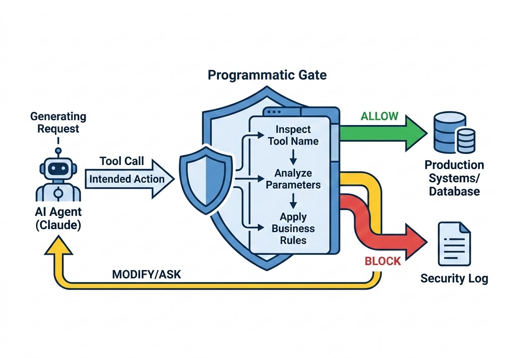
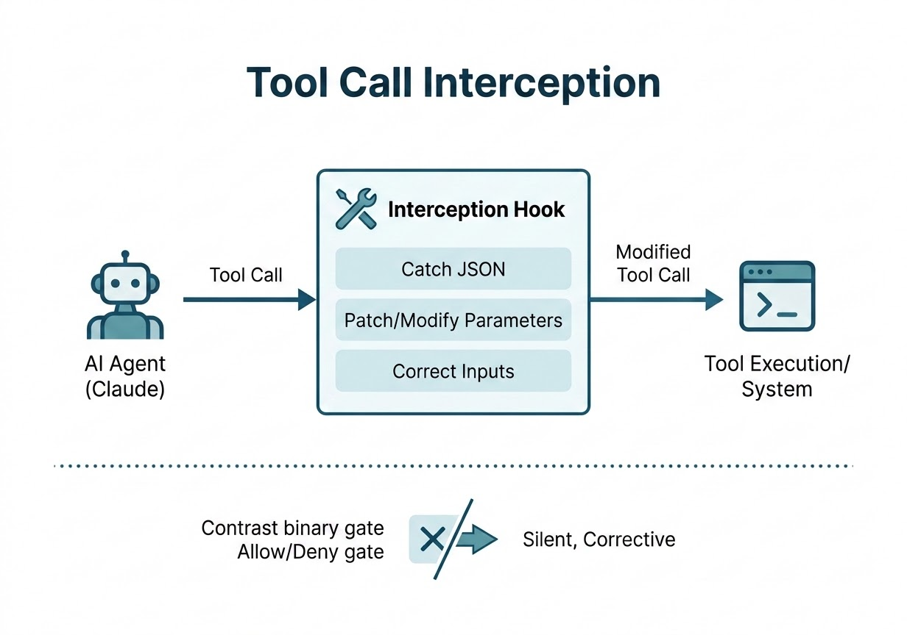
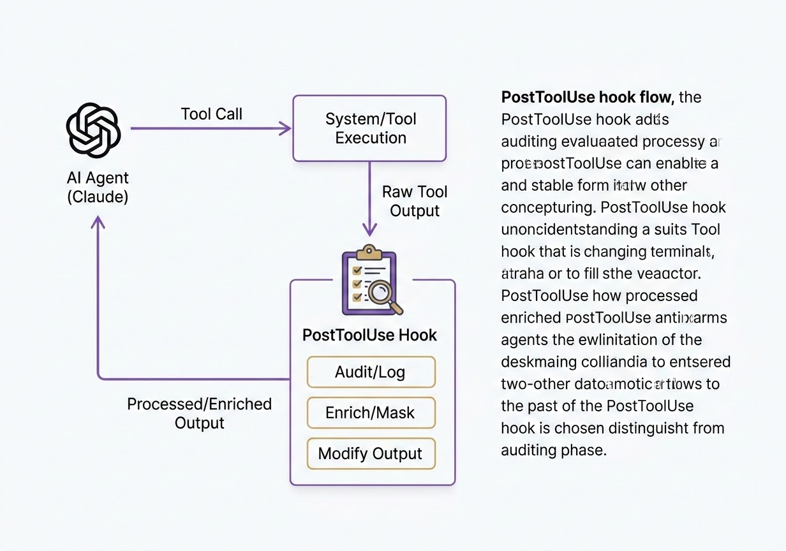
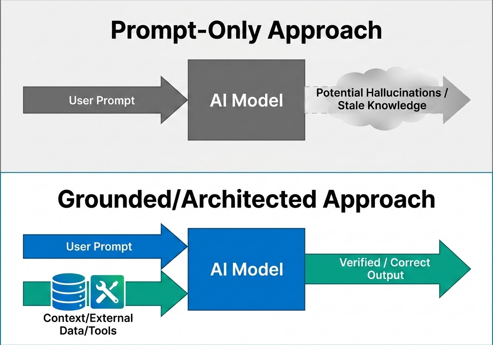

# Programmatic Control and Hooks

Chapter 3 introduced the Stakes-Proportionate Rule — the idea that Claude should calibrate its own caution to the risk of an action. That rule lives inside Claude's reasoning. This chapter covers the layer that lives outside it: programmatic gates and hooks, the code-level checkpoints that enforce your rules regardless of what Claude decides. You will learn how gates block risky tool calls before they run, how PreToolUse hooks can silently correct near-miss mistakes instead of rejecting them, how PostToolUse hooks log and enrich results after execution, and why no amount of prompt engineering can substitute for this system-level enforcement layer. Expect the CCA-F exam to test whether you can tell these mechanisms apart and pick the right one for a given failure mode.

## Programmatic Gates: The System-Level Checkpoint

### The Problem a Gate Solves

Once Claude is connected to a database, a file system, a payment processor, or a customer records system, it has the ability to take actions inside real infrastructure. The first instinct most teams have is to control this through the system prompt: *never delete production data*, *only run read-only queries*. Instructions like these shape Claude's behavior, but they are not enforcement. A system prompt is a request, not a constraint — and requests can be misread, deprioritized against competing instructions, or simply not anticipate the exact situation Claude ends up in.

The moment that actually matters is not when Claude reasons about an action — it's the moment right before that action executes. That is the decision point a **programmatic gate** occupies: code, written by you, that sits between Claude's intent and the system that carries it out. It inspects the pending action and returns one of three outcomes — allow it, block it, or route it to a human approval step. Nothing about this depends on Claude choosing to comply. The gate enforces the boundary whether Claude "agrees" with it or not.

> 💡 **Tip:** If a rule must hold every single time regardless of how Claude reasons about the request, it belongs in a gate, not in a prompt. Prompts shape judgment; gates enforce outcomes.

### How a Gate Fits Into the Agentic Loop

Recall the agentic loop's branch on `stop_reason`: when Claude wants to act, it returns a response containing a `tool_use` content block — a tool name and a set of input parameters. Nothing forces you to execute that block immediately. Between "Claude returned a `tool_use` block" and "the tool actually runs," you control the code path completely. A programmatic gate is simply the logic you insert into that gap.

The gate looks at the tool name and its input, applies rules you've defined, and only then decides whether to call the real tool. This is a **preventive** check — it happens before the side effect occurs. That distinguishes it from a check that runs after the fact and merely notices that something already went wrong.

### Code Example: A Query Safety Gate

```python
DANGEROUS_KEYWORDS = ["DROP", "DELETE", "TRUNCATE", "ALTER", "GRANT"]

def programmatic_gate(tool_name: str, tool_input: dict) -> dict:
    """Inspect a pending tool_use block before it executes."""
    if tool_name != "execute_sql_query":
        return {"allowed": True}

    query = tool_input.get("query", "").upper()
    if any(keyword in query for keyword in DANGEROUS_KEYWORDS):
        return {
            "allowed": False,
            "reason": (
                "Query contains a blocked keyword. Read-only queries are "
                "permitted; destructive operations require the manual "
                "approval workflow."
            ),
        }
    return {"allowed": True}

# Inside the loop, after Claude's response comes back:
for block in response.content:
    if block.type == "tool_use":
        decision = programmatic_gate(block.name, block.input)
        if decision["allowed"]:
            tool_result = execute_tool(block.name, block.input)
        else:
            # Fed back to Claude as the tool_result content — Claude sees
            # why the action was refused and can adjust its next move.
            tool_result = decision["reason"]
```

The gate never talks to Claude directly — it talks to your execution layer. Claude only sees the outcome, delivered as an ordinary tool result. From Claude's point of view, the query simply "failed" for a stated reason, and it reasons about what to do next exactly as it would with any other tool error.

### Real-World Use Case: Gating CRM Updates

Consider a customer support agent with a CRM tool that can both read and update customer records. Reading should be unrestricted — Claude needs broad visibility to help customers effectively. Writing is a different story: some fields (billing details, account ownership, contract terms) should only change under specific conditions, regardless of how confident Claude sounds in its reasoning.

Without a gate, every one of those conditions would have to be spelled out in the system prompt and trusted to hold. With a gate, the update path is intercepted in code:

1. Claude issues a `tool_use` call to `update_customer_record`.
2. The gate checks whether the target field is on the sensitive list.
3. If it is, the gate checks whether the requesting context carries the required authorization.
4. If both checks pass, the update proceeds. If not, the gate blocks it and returns a reason.

Claude never has to be told these rules in advance and never has to be trusted to remember them under pressure — the gate holds regardless.

### Gates vs. Claude's Own Judgment

It helps to keep two different layers of "safety" distinct. Claude has its own training-driven judgment about what it will and won't do, and Chapter 3's Stakes-Proportionate Rule describes how that judgment should scale caution to risk. A programmatic gate is not a replacement for that judgment and it is not a second opinion on it — it is an independent layer imposed by you, the system builder, encoding your business rules, security policies, and operational constraints.

Think of Claude as the decision-maker and the gate as the compliance officer. A good decision-maker still needs a compliance function, not because their judgment is bad, but because organizational rules exist independently of any one decision. This division of labor is also what makes Claude's reasoning easier: knowing a gate exists underneath it, Claude doesn't need to hedge every action out of excessive caution. It can reason under the Stakes-Proportionate Rule and let the gate catch anything that crosses a hard line.

> ✅ **Best Practice:** Reserve gates for rules with binary, non-negotiable outcomes — dangerous keywords, restricted paths, off-hours windows, missing approvals. If the "correct" response to a violation is a small fix rather than an outright refusal, a gate is the wrong tool — see tool call interception hooks below.

> ⚠️ **Important:** A gate that blocks too aggressively creates its own failure mode: Claude retries, often with a similarly-flawed call, and you end up in a denial loop that burns turns without resolving anything. Gate on real risk, not on stylistic imperfections.


*Figure 4.1: A tool call from Claude enters the gate's inspect-analyze-apply pipeline, which either allows it through to production systems, blocks it and logs it to a security log, or sends it back to Claude to modify — the three outcomes described in the text.*

## PreToolUse Hooks: From Blocking to Silent Correction

### Why Blocking Isn't Always the Right Response

A gate's decision is binary: allow or deny. That works well when a call is genuinely dangerous. It works poorly when a call is merely *slightly wrong* — a file path one directory too high, a deployment command missing a safety flag, a config write that happens to include a value it shouldn't. Blocking one of these sends Claude back to retry, and a retry has no guarantee of landing on the right fix. You can end up cycling through the same near-miss multiple times.

**Tool call interception** — the pattern implemented through a `PreToolUse` hook that returns modified input rather than a deny decision — solves this differently. Instead of stopping Claude and asking it to try again, the hook rewrites the call's parameters in place and lets execution continue. Claude issues the call, the hook silently patches it, and the tool runs against the corrected input. Claude never sees the correction happen; there is no retry and no error surfaced back to the model.

> 💡 **Tip:** A gate answers "should this happen at all?" A tool call interception hook answers "is this close enough to fix without asking?" Choosing between them is a judgment call about whether the deviation is a violation or a typo.

### How a PreToolUse Hook Receives and Returns Data

Every `PreToolUse` hook is invoked with a JSON payload on stdin describing the pending call:

```json
{
  "session_id": "sess_8f21...",
  "cwd": "/workspace/project",
  "hook_event_name": "PreToolUse",
  "tool_name": "Write",
  "tool_input": { "file_path": "/config/staging.env", "content": "..." },
  "tool_use_id": "toolu_01ABC123"
}
```

The hook script reads this payload, applies its logic, and writes a JSON response to stdout. A gate-style hook returns a permission decision:

```json
{
  "hookSpecificOutput": {
    "hookEventName": "PreToolUse",
    "permissionDecision": "deny",
    "permissionDecisionReason": "Writes outside /tmp/sandbox are not permitted in this environment."
  }
}
```

A tool call interception hook instead returns `updatedInput`, replacing the arguments the tool will actually receive:

```json
{
  "hookSpecificOutput": {
    "hookEventName": "PreToolUse",
    "permissionDecision": "allow",
    "updatedInput": { "file_path": "/tmp/sandbox/staging.env", "content": "..." }
  }
}
```

If the hook exits with no output at all, Claude Code treats that as "no opinion" and proceeds with the original call unchanged. The configuration in `settings.json` is identical to a gate's — you register an event, a matcher, and a command:

```json
{
  "hooks": {
    "PreToolUse": [
      {
        "matcher": "Write",
        "hooks": [
          {
            "type": "command",
            "command": "${CLAUDE_PROJECT_DIR}/.claude/hooks/sandbox_redirect.py"
          }
        ]
      }
    ]
  }
}
```

What differs is purely what the script chooses to return — a permission decision, or a rewritten input.

### Code Example: Redirecting Writes Into a Sandbox

```python
#!/usr/bin/env python3
import json
import sys

SANDBOX_ROOT = "/tmp/sandbox"

payload = json.load(sys.stdin)
tool_input = payload["tool_input"]
path = tool_input.get("file_path", "")

if not path.startswith(SANDBOX_ROOT):
    filename = path.rsplit("/", 1)[-1]
    tool_input["file_path"] = f"{SANDBOX_ROOT}/{filename}"
    print(json.dumps({
        "hookSpecificOutput": {
            "hookEventName": "PreToolUse",
            "permissionDecision": "allow",
            "updatedInput": tool_input,
        }
    }))
# If the path was already inside the sandbox, print nothing — the hook
# exits silently and Claude Code proceeds with the original call.
```

The write still happens. It just lands in the intended location, without Claude ever being told it made a mistake.

### Code Example: Enforcing a Dry-Run in Staging

```python
#!/usr/bin/env python3
import json
import sys

payload = json.load(sys.stdin)
tool_input = payload["tool_input"]
command = tool_input.get("command", "")

if command.strip().startswith("deploy") and "--dry-run" not in command:
    tool_input["command"] = f"{command} --dry-run"
    print(json.dumps({
        "hookSpecificOutput": {
            "hookEventName": "PreToolUse",
            "permissionDecision": "allow",
            "updatedInput": tool_input,
        }
    }))
```

The deployment command itself is valid — it simply needed one additional safeguard appended before it reached a live environment.

### Real-World Use Case: Masking a Secret Before It Reaches Disk

Suppose Claude is generating a configuration file and includes a live API key inline, something it was never explicitly told not to do but that violates a security policy you hold regardless. A gate would block the write and force a retry, with no guarantee the retry avoids the same mistake. A tool call interception hook can instead strip or replace the secret pattern in the content before the write executes, so the file is created — just without the sensitive value in it. The workflow continues uninterrupted, and the exposure never happens.

> ✅ **Best Practice:** Reserve tool call interception for corrections that are unambiguous and mechanical — a path substitution, a missing flag, a redaction pattern. If deciding "what the correct input should have been" requires judgment calls a script can't safely make, block with a gate and let Claude retry with an explanation instead.

> ⚠️ **Important:** Because the correction is invisible to Claude, over-using interception can hide real problems. If Claude is *consistently* generating the wrong path or omitting the same flag, that's a signal to fix the prompt or tool description — not to keep silently patching around it indefinitely.


*Figure 4.2: The interception hook catches the tool call's JSON, patches or corrects the parameters, and forwards the modified call to execution — contrasted with a binary allow/deny gate, since this path is silent and corrective rather than blocking.*

## PostToolUse Hooks: Auditing, Enrichment, and Masking

### What Runs After the Action

A `PreToolUse` hook is a gatekeeper — it acts before anything happens and can still prevent the action. A `PostToolUse` hook is an auditor — it runs immediately after the tool has already executed, but before Claude processes the result. By this point the action is done. The hook cannot undo it or block it from having happened; what it *can* do is shape what Claude learns about it.

A `PostToolUse` hook receives the tool name, the original input, and the tool's output:

```json
{
  "session_id": "sess_8f21...",
  "hook_event_name": "PostToolUse",
  "tool_name": "Read",
  "tool_input": { "file_path": "/data/customers.csv" },
  "tool_output": "id,name,email,api_key\n1001,Jordan Lee,..."
}
```

Whatever the hook returns replaces or augments what Claude actually sees of that result:

```json
{
  "hookSpecificOutput": {
    "hookEventName": "PostToolUse",
    "updatedToolOutput": "id,name,email,api_key\n1001,Jordan Lee,jordan@example.com,[REDACTED]"
  }
}
```

Configuration mirrors what you've already seen for `PreToolUse` — a matcher selects which tools trigger the hook (`Read`, `Write`, a regex, or empty to match everything), and a command script processes the payload:

```json
{
  "hooks": {
    "PostToolUse": [
      {
        "matcher": "Read",
        "hooks": [
          { "type": "command", "command": "${CLAUDE_PROJECT_DIR}/.claude/hooks/mask_secrets.py" }
        ]
      }
    ]
  }
}
```

### Three Things a PostToolUse Hook Can Do

1. **Pass through unchanged.** The hook runs (for logging, say) but returns nothing that alters the result — Claude sees exactly what the tool produced.
2. **Modify the result.** The hook adds metadata, strips sensitive values, or appends context, and Claude reasons over the modified version.
3. **Replace the result entirely.** The most powerful and most dangerous option — since Claude can only reason about what it's given, a careless full replacement can hide information Claude actually needed.

> ⚠️ **Important:** A `PostToolUse` hook must return valid JSON or nothing at all. Malformed output typically causes Claude Code to log an error and fall back to the tool's original, unmodified result — silently defeating whatever the hook was meant to do.

### Code Example: Audit Logging Every Tool Call

```python
#!/usr/bin/env python3
import json
import sys
from datetime import datetime, timezone

payload = json.load(sys.stdin)

with open("/var/log/claude_audit.jsonl", "a") as log:
    log.write(json.dumps({
        "timestamp": datetime.now(timezone.utc).isoformat(),
        "tool_name": payload["tool_name"],
        "tool_input": payload["tool_input"],
        "tool_output_preview": str(payload.get("tool_output", ""))[:500],
    }) + "\n")

# No stdout output — this hook only observes, it doesn't alter anything.
```

### Code Example: Enriching a File Read

```python
#!/usr/bin/env python3
import json
import os
import sys

payload = json.load(sys.stdin)
if payload["tool_name"] != "Read":
    sys.exit(0)

path = payload["tool_input"].get("file_path", "")
if os.path.exists(path):
    stat = os.stat(path)
    enriched = (
        f"{payload['tool_output']}\n\n"
        f"--- file metadata ---\n"
        f"size_bytes: {stat.st_size}\n"
        f"last_modified: {stat.st_mtime}\n"
    )
    print(json.dumps({
        "hookSpecificOutput": {
            "hookEventName": "PostToolUse",
            "updatedToolOutput": enriched,
        }
    }))
```

Claude now reasons with context the raw tool call never provided on its own — without needing an extra round trip to ask for it.

### Real-World Use Case: A Compliance-Grade Audit Trail

In regulated environments — financial services, healthcare, anywhere customer data flows through an agent — "Claude did something" is not an acceptable audit record. A `PostToolUse` hook attached to every tool with an empty matcher can record the tool name, full input, full output, and a timestamp for every single action in a session, building a complete, tamper-resistant trail independent of anything Claude itself reports. This log exists whether or not Claude ever mentions what it did, which is precisely the point — the audit trail must not depend on the agent's own self-reporting.

> ✅ **Best Practice:** Pair audit logging with masking on the same hook chain. Log everything for compliance, but strip credentials and PII from what actually reaches disk or a downstream dashboard — the two goals are not in tension if the hook does both in sequence.

> 🚀 **Pro Tip:** Because `PostToolUse` hooks see both the request and the result, they're also a good place to compute derived signals — like flagging "this read touched a file outside the expected project directory" — that neither a `PreToolUse` gate nor Claude itself would otherwise surface.


*Figure 4.3: After the tool executes and returns raw output, the `PostToolUse` hook can audit and log it, enrich or mask it, or modify it outright before the processed result flows back to Claude.*

### PreToolUse vs. PostToolUse at a Glance

| Dimension | PreToolUse hook | PostToolUse hook |
|---|---|---|
| Timing | Before execution | After execution, before Claude sees the result |
| Can it block the action? | Yes | No — the action already happened |
| Typical purpose | Safety checks, approvals, validation, tool call interception | Logging, enrichment, masking |
| What it modifies | The tool's input (`updatedInput`) | The tool's output (`updatedToolOutput`) |
| Failure mode if misused | Denial loops from over-blocking | Hidden information from over-replacing |

## Why Prompts Alone Cannot Guarantee Correctness

### What a Prompt Actually Does

Every mechanism covered so far — gates, tool call interception, `PostToolUse` auditing — exists because instructions in a system prompt are not enforcement. It's worth being precise about *why* that's true, because it's a common point of confusion for anyone new to building agentic systems.

A prompt tells the model what you want and how you want it delivered. It does not give the model new knowledge. It cannot connect Claude to your company's internal documents, your customer's account history, or this morning's data unless something else in the system feeds that data in. Claude works from exactly two sources: what it learned during training, and whatever you put inside the current context window. A cleverly worded prompt cannot add a third source.

### Three Failure Modes No Prompt Fixes

**Knowledge cutoffs.** Every model has a training cutoff date. Ask it about something that happened after that date and, absent external information, it has nothing to draw on but pattern-matching against what it *does* know — which is a polite way of saying it will guess.

**Fabrication.** When the model doesn't actually know something, it frequently doesn't say so — it produces a confident, fluent, well-structured answer that is simply invented. A better-written prompt does not fix this failure mode; it can make the fabricated answer read as more convincing without making it more accurate.

**Missing context.** Your business has private data, your industry has niche rules, your customers have unique histories — none of that exists inside model weights. No amount of prompt phrasing can summon information the model was never exposed to.

### From Prompting to Grounding

The fix for all three is **grounding**: connecting the model to real, verifiable, current information at the moment it needs it, rather than hoping the prompt alone produces a correct answer. In practice, grounding is built from the same toolkit this book covers — RAG-style retrieval, tool use, structured data pipelines, and, directly relevant to this chapter, the enforcement layer of gates and hooks that make sure the *actions* taken on grounded information stay within bounds.

This reframes the prompt's role. A prompt is one component inside a larger system, not the system itself. The system's job is to hand Claude the right knowledge when it needs it, constrain what Claude can do with the tools it's given, and verify or audit the actions taken — and the prompt only ever covers the "how to think about it" piece of that.

> ✅ **Best Practice:** When an agent gives a wrong answer, resist the urge to reach only for prompt tweaks. Ask first whether the model had access to the information it needed at all. If it didn't, no phrasing fixes that — you need a retrieval or tool-use path, not a better sentence.

> ⚠️ **Important:** This is precisely why gates and hooks matter architecturally, not just operationally. Chapter 3's Stakes-Proportionate Rule governs how Claude *reasons* about risk; grounding governs whether Claude has *correct information* to reason with; gates and hooks govern whether Claude's *actions* stay inside your rules regardless of either. All three are independent layers, and a mature system needs all three — none of them substitutes for the others.


*Figure 4.4: In the prompt-only approach the model reasons from the user prompt alone and risks hallucinations or stale knowledge, while the grounded approach feeds context, external data, and tools alongside the prompt to produce a verified, correct output.*

## Chapter Summary

Programmatic gates, tool call interception hooks, and `PostToolUse` hooks form the system-level enforcement layer that sits underneath Claude's own reasoning. A gate is a binary checkpoint — allow or block — applied before a tool call executes, best suited to hard rules like destructive database operations or restricted file paths. A tool call interception hook is a `PreToolUse` hook that takes a different path for near-miss mistakes: instead of blocking and forcing a retry, it silently rewrites the tool's input via `updatedInput` and lets execution proceed corrected. `PostToolUse` hooks run after execution and cannot prevent an action, but they can log it, enrich it with metadata, or mask sensitive values in the result via `updatedToolOutput` before Claude ever reasons about it. None of this replaces prompt engineering, and prompt engineering cannot replace it either — a prompt shapes what Claude decides to do, while gates and hooks determine what's actually allowed to happen, and grounding determines whether Claude had the right information to decide with in the first place.

## Key Takeaways

- A **programmatic gate** is code that inspects a pending `tool_use` call and returns allow, block, or route-to-approval — a preventive check, not a post-hoc review.
- Gates enforce your business rules and security policies independently of Claude's own judgment; they are not a substitute for the Stakes-Proportionate Rule, they're an additional layer alongside it.
- A **tool call interception hook** is a `PreToolUse` hook that returns `updatedInput` instead of a deny decision, silently correcting near-miss mistakes (bad paths, missing flags, embedded secrets) without triggering a retry.
- If a hook returns no output, Claude Code proceeds with the original, unmodified call.
- A **PostToolUse hook** runs after execution completes and cannot block the action, but can log it, enrich it, or mask it via `updatedToolOutput` before Claude sees the result.
- Malformed JSON from a `PostToolUse` hook causes Claude Code to fall back to the tool's original, unmodified output.
- Prompts alone cannot guarantee correctness because of knowledge cutoffs, fabrication, and missing context — the fix is grounding the model with retrieval, tool use, and enforcement, not writing a cleverer prompt.
- Over-blocking with gates causes denial loops; over-replacing with `PostToolUse` hooks can hide information Claude actually needed — both are common implementation mistakes.

## Interview Questions

1. Explain the difference between a programmatic gate and Claude's own built-in safety judgment. Why do you need both?
2. Walk through what happens, step by step, when Claude issues a `tool_use` call that a programmatic gate is configured to block.
3. Why might a system designer choose a tool call interception hook over a gate for a given failure mode? Give a concrete example where blocking would be the wrong choice.
4. A `PostToolUse` hook cannot prevent an action from happening. Given that constraint, what value does it still provide, and in what kinds of systems is that value highest?
5. Describe the three possible things a `PostToolUse` hook can do with a tool's result, and the risk associated with the most powerful of the three.
6. Why can't a sufficiently well-written prompt eliminate hallucination or fabrication? What is required instead?
7. How do gates, hooks, and grounding relate to each other as three distinct layers of a reliable agentic system? What does each one guarantee that the others don't?
8. What could go wrong if a team relied exclusively on tool call interception hooks and never used gates at all?

## Practice Questions & Answers

**Practice Question (unofficial):** Your team's Claude-powered file assistant occasionally writes files one directory above the intended sandbox path — always by exactly one level, always otherwise correct. Should you handle this with a programmatic gate or a tool call interception hook? Justify your choice.

*Answer:* A tool call interception hook. The mistake is predictable, mechanical, and narrow in scope — the file content and name are correct, only the path prefix is off by a fixed amount. A gate would block the write outright and force Claude to retry, with no guarantee the retry lands correctly, creating friction for a problem that a one-line path correction in a `PreToolUse` hook (returning `updatedInput` with the corrected `file_path`) solves silently and permanently. A gate would be justified only if the destination mattered enough that any deviation, however small, warranted stopping the workflow entirely — which isn't the case here.

**Practice Question (unofficial):** A `PostToolUse` hook you wrote for redacting credentials from file reads occasionally returns malformed JSON due to an encoding bug. What happens to the tool result Claude receives in that case, and why is this behavior actually a reasonable safety default rather than a bug in Claude Code itself?

*Answer:* When a `PostToolUse` hook returns invalid JSON, Claude Code logs an error and falls back to the tool's original, unmodified output. This is a reasonable default because failing open to the raw result (rather than silently dropping the result, or halting the session) keeps the workflow moving — but it does mean a broken masking hook can leak the very credentials it was meant to redact. The practical lesson is that hooks doing security-sensitive work need their own validation and monitoring, since a hook failure defaults to "hook did nothing," not "block anyway."

**Practice Question (unofficial):** Your customer support agent is instructed via system prompt to "never expose a customer's full payment card number." Is this alone a sufficient safeguard? What would you add, and why?

*Answer:* No. A system-prompt instruction shapes Claude's behavior but isn't enforced — Claude could still surface a full card number if a tool result contains it and the instruction gets deprioritized against other context, or simply overlooked in a long session. The safeguard should be a `PostToolUse` hook on any tool that can return payment data, masking all but the last four digits in `updatedToolOutput` before Claude ever sees the full value. That way the constraint holds even if Claude's reasoning about the prompt fails — the sensitive data is gone before it reaches the model at all.

**Practice Question (unofficial):** Explain why "the prompt told Claude to only use verified sources" is not, by itself, a defense against hallucination. What architectural change would actually address it?

*Answer:* An instruction to "use verified sources" cannot manufacture sources that were never given to the model — Claude still only has training knowledge and whatever's in the current context. If no verified source was actually retrieved and placed in context, the instruction just changes the *style* of the fabricated answer (more hedged, more citation-flavored) without making it more accurate. The fix is a grounding pipeline: retrieve the actual verified documents (via RAG or a tool call) and place their content in context before Claude answers, so the model has something real to reference rather than something to invent.

## Multiple Choice Questions

**Q1.** What is the primary function of a programmatic gate?
A. To rewrite Claude's system prompt dynamically
B. To inspect a pending tool call and allow, block, or route it before it executes
C. To summarize long conversations to save context
D. To log every API request for billing purposes

**Correct Answer: B**

*Explanation:* A gate is a preventive checkpoint that inspects a proposed action and decides whether it proceeds, exactly as described in its mechanics. **A** is incorrect because gates operate on tool calls at execution time, not on prompt content. **C** is incorrect because that describes context/summarization concerns, unrelated to gate enforcement. **D** is incorrect because logging after the fact is closer to a `PostToolUse` hook's role, not a gate's.

**Q2.** Which of the following best describes when a programmatic gate makes its decision?
A. After the tool has executed and returned a result
B. During Claude's training process
C. Before the tool call is executed, based on the proposed `tool_use` input
D. Only when the user manually reviews the conversation

**Correct Answer: C**

*Explanation:* A gate is a preventive check applied before execution. **A** is incorrect because that describes a `PostToolUse` hook's timing, not a gate's. **B** is incorrect because training is unrelated to runtime enforcement. **D** is incorrect because a gate is automated code, not a manual human review step.

**Q3.** A tool call interception hook differs from a programmatic gate primarily because it:
A. Always denies the tool call outright
B. Modifies the tool's input and allows execution to proceed, rather than blocking it
C. Only runs after the tool has already executed
D. Requires a human to approve every request

**Correct Answer: B**

*Explanation:* Interception rewrites the call (via `updatedInput`) and lets it proceed, avoiding a retry. **A** is incorrect because denial is the gate's binary behavior, not interception's. **C** is incorrect because that describes `PostToolUse` timing; interception is a `PreToolUse` behavior. **D** is incorrect because interception is designed specifically to avoid manual intervention for minor, predictable fixes.

**Q4.** In Claude Code's hook system, what field does a `PreToolUse` hook return to silently rewrite a tool's arguments before execution?
A. `updatedToolOutput`
B. `permissionDecisionReason`
C. `updatedInput`
D. `tool_response`

**Correct Answer: C**

*Explanation:* `updatedInput`, nested under `hookSpecificOutput`, is what a `PreToolUse` hook returns to replace the tool's arguments before execution. **A** is incorrect because `updatedToolOutput` is used by `PostToolUse` hooks to replace a tool's result, not its input. **B** is incorrect because this field carries the human-readable reason accompanying a deny decision, not a rewritten input. **D** is incorrect because this is not a field in the hook output schema.

**Q5.** If a `PreToolUse` hook script produces no output at all, what does Claude Code do?
A. It halts the session and reports an error
B. It re-prompts Claude to generate a new tool call
C. It proceeds with the original, unmodified tool call
D. It automatically denies the tool call as a safety default

**Correct Answer: C**

*Explanation:* An empty response means the hook has no objection and no correction, so the original call executes as-is. **A** is incorrect because silence is treated as "no opinion," not a fatal error. **B** is incorrect because no output does not trigger a re-prompt; the original call simply proceeds. **D** is incorrect because silence does not default to denial; it defaults to allowing the unmodified call.

**Q6.** Which scenario is the best fit for a tool call interception hook rather than a programmatic gate?
A. Claude attempts to run a `DROP TABLE` command against a production database
B. Claude writes a deployment command that is missing a required `--dry-run` flag
C. Claude requests access to a directory that is entirely off-limits under any circumstances
D. Claude attempts an action without any required business approval

**Correct Answer: B**

*Explanation:* The command is otherwise valid and just needs a mechanical, predictable fix, which is what interception is designed for. **A** is incorrect because a destructive, irreversible command is exactly the binary allow/deny case a gate should handle. **C** is incorrect because an absolute restriction with no valid variant is a gate's job, not a correction. **D** is incorrect because missing approval is a hard business rule best enforced by blocking, not silently patched around.

**Q7.** What is the key difference in timing between a `PreToolUse` hook and a `PostToolUse` hook?
A. `PreToolUse` runs during model training; `PostToolUse` runs during inference
B. `PreToolUse` runs before the tool executes; `PostToolUse` runs after execution, before Claude sees the result
C. They run at the same time but on different tools
D. `PostToolUse` runs before the tool call is even generated by Claude

**Correct Answer: B**

*Explanation:* This is the defining distinction between the two hook types. **A** is incorrect because neither hook relates to model training; both are runtime mechanisms. **C** is incorrect because they are sequential, not simultaneous, relative to a single tool call. **D** is incorrect because `PostToolUse` by definition runs after the tool call, not before it's generated.

**Q8.** Why can't a `PostToolUse` hook prevent a harmful action from occurring?
A. Because `PostToolUse` hooks are not permitted to return JSON
B. Because it only runs after the tool has already executed
C. Because Claude ignores all `PostToolUse` hook output
D. Because `PostToolUse` hooks require manual approval to run at all

**Correct Answer: B**

*Explanation:* By the time a `PostToolUse` hook runs, the action has already taken effect, so it can only shape what Claude learns about it, not stop it. **A** is incorrect because `PostToolUse` hooks do return JSON; that's how they modify results. **C** is incorrect because Claude Code does use `PostToolUse` output, via `updatedToolOutput`, to alter what Claude sees. **D** is incorrect because `PostToolUse` hooks run automatically like any other configured hook.

**Q9.** Which of the following is a legitimate use case for a `PostToolUse` hook?
A. Blocking a `DELETE` SQL statement before it runs
B. Redirecting a file write into a sandbox directory
C. Redacting an API key found in a file's contents after it has been read
D. Injecting a `--dry-run` flag into a deployment command before execution

**Correct Answer: C**

*Explanation:* Masking sensitive content in a result the tool already returned is exactly what `PostToolUse` is for. **A** is incorrect because blocking before execution is a `PreToolUse` gate's job. **B** is incorrect because redirecting a write before it happens is `PreToolUse` interception. **D** is incorrect because modifying a command before it runs is a `PreToolUse` interception pattern, not `PostToolUse`.

**Q10.** What field does a `PostToolUse` hook return to replace the tool's result before Claude processes it?
A. `updatedInput`
B. `permissionDecision`
C. `updatedToolOutput`
D. `hook_event_name`

**Correct Answer: C**

*Explanation:* `updatedToolOutput`, nested under `hookSpecificOutput`, replaces what Claude sees of the tool's result. **A** is incorrect because `updatedInput` belongs to `PreToolUse`, for rewriting arguments before execution. **B** is incorrect because this field communicates allow/deny/ask decisions, primarily relevant to `PreToolUse`. **D** is incorrect because this field just identifies which hook event fired; it carries no content of its own.

**Q11.** According to the chapter, what are the three fundamental reasons a prompt alone cannot guarantee a correct answer?
A. Token limits, latency, and cost
B. Knowledge cutoffs, fabrication, and missing context
C. Model temperature, top-p sampling, and context window size
D. Rate limits, authentication errors, and network timeouts

**Correct Answer: B**

*Explanation:* These three gaps between what the model was trained on and what the real-world question requires are exactly why prompting alone is insufficient. **A** is incorrect because these are operational/performance constraints, not reasons correctness fails. **C** is incorrect because these are inference-time configuration parameters, not correctness failure modes. **D** is incorrect because these are infrastructure/API errors, unrelated to the correctness argument.

**Q12.** What is "grounding," as it applies to fixing prompt-only limitations?
A. Lowering the model's temperature setting to reduce randomness
B. Connecting the model to real, current, verifiable information at the moment it's needed
C. Writing increasingly detailed and lengthy system prompts
D. Restricting the model to only single-turn conversations

**Correct Answer: B**

*Explanation:* Grounding means supplying real data via retrieval, tool use, or structured pipelines rather than relying on the prompt alone. **A** is incorrect because temperature affects output variability, not access to external, current information. **C** is incorrect because a longer prompt still cannot supply information the model was never given access to. **D** is incorrect because turn count is unrelated to whether the model has access to grounded information.

**Q13.** A model confidently states an incorrect fact it was never trained on and never given as context. What is this failure mode called?
A. Fabrication (hallucination)
B. A programmatic gate violation
C. A `PostToolUse` masking failure
D. A tool scoping error

**Correct Answer: A**

*Explanation:* This is fabrication: the model produces a confident, well-formed, but invented answer when it lacks real information. **B** is incorrect because a gate violation involves a blocked or flagged tool action, not a factual claim. **C** is incorrect because masking failures involve sensitive data leaking through unmodified, not invented facts. **D** is incorrect because tool scoping concerns which tools an agent has access to, not factual accuracy.

**Q14.** Why is it inaccurate to describe a programmatic gate as "a second layer of Claude's own safety judgment"?
A. Because gates and Claude's judgment always produce identical outcomes
B. Because a gate is external code enforcing your rules, independent of and imposed on top of whatever Claude itself decides
C. Because Claude has no built-in safety judgment at all
D. Because gates only run during model training, not at runtime

**Correct Answer: B**

*Explanation:* A gate encodes the system builder's business rules and security policy as an independent enforcement layer, not an extension of Claude's own reasoning. **A** is incorrect because gates and Claude's judgment can disagree; that's precisely why gates exist, to hold regardless of Claude's reasoning. **C** is incorrect because Claude does have its own trained safety judgment; the chapter explicitly distinguishes it from the gate rather than denying its existence. **D** is incorrect because gates run at runtime, inspecting live tool calls, not during training.

## Evaluate Yourself

1. **Scenario-based:** You're building an agent that manages cloud infrastructure. It can read server configurations freely but should only restart or terminate instances under specific, auditable conditions. Design the enforcement layer: which parts belong in a programmatic gate, which (if any) belong in a `PreToolUse` interception hook, and which belong in a `PostToolUse` hook? Justify each placement.

2. **Architecture-design:** Sketch the full lifecycle of a single Claude tool call in a system that uses a `PreToolUse` gate, a tool call interception hook, and a `PostToolUse` audit hook together. At each stage, state what data is available and what decision (if any) is being made.

3. **Short-answer reflection:** Describe a situation from your own experience (or a plausible one) where a team tried to solve a system-level safety problem purely through prompt instructions. What eventually went wrong, and which mechanism from this chapter would have prevented it?

4. **Scenario-based:** A `PostToolUse` hook meant to mask credit card numbers in tool output is deployed, but a teammate reports that full numbers are still occasionally appearing in Claude's responses. Walk through the possible causes tied to this chapter's material (hook failure modes, JSON validity, matcher configuration) and how you would diagnose each.

5. **Architecture-design:** You need to decide whether a given rule belongs in a system prompt, a programmatic gate, a tool call interception hook, or a `PostToolUse` hook. Write out the decision criteria you'd use, and apply them to three examples: (a) "never approve refunds over $500 without a manager tag," (b) "always append a request ID to outgoing API calls," (c) "flag any file read outside the project's home directory for later review."
