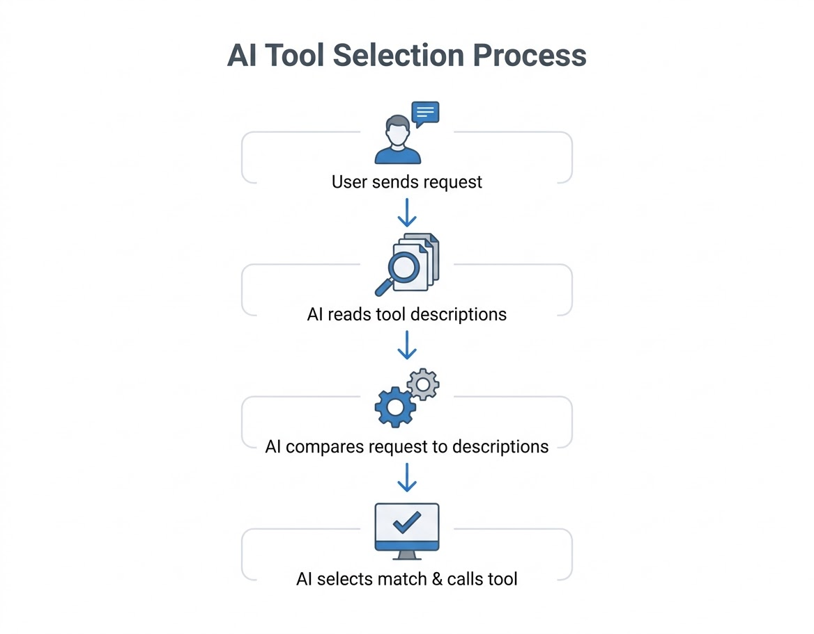
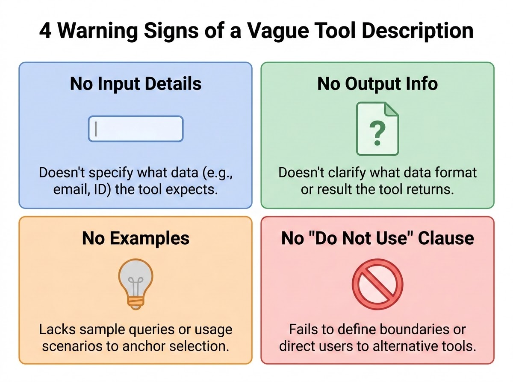
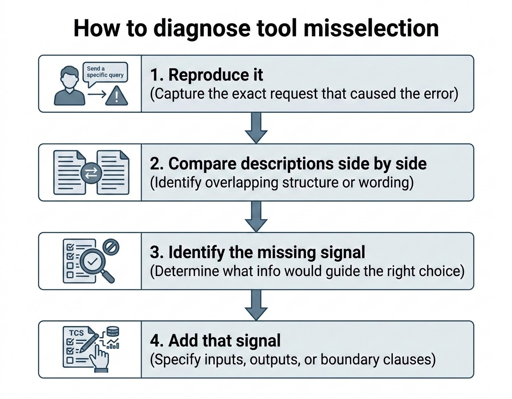
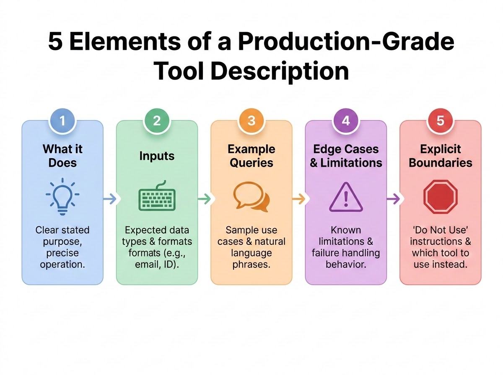
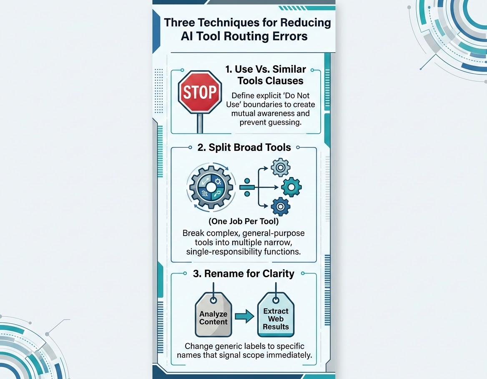

# Tool Descriptions

Every tool-using AI system depends on one small, easy-to-underestimate piece of text: the tool description. This chapter opens Domain 2 of the CCA-F exam, Tool Design and MCP (Model Context Protocol) Integration, by showing why that piece of text is the single highest-leverage lever you have over an agent's behavior. You'll learn how Claude selects between tools, what a vague description looks like in practice, how to diagnose misselection systematically instead of guessing, and the five-element framework that turns an ambiguous tool into one Claude routes to correctly every time.

## Domain 2 at a Glance: Tool Design and MCP Integration

Domain 2 covers how language models interact with tools, external systems, and structured workflows. In production, a model rarely just generates text — it retrieves data, calls APIs, and executes actions as part of a larger application. That only works reliably if the tools themselves are well designed: each one needs a clear statement of what it does, when to use it, and how it fails.

Across the next few chapters, Domain 2 builds out that picture. This chapter covers tool descriptions — the primary mechanism Claude uses to pick a tool. Chapter 6 covers error handling patterns — how tools should communicate failure once they've been selected correctly. Chapter 7 covers MCP configuration — the standardized way Claude connects to external tools and resources. Chapter 8 covers tool scoping — why an agent with too many tools available becomes less accurate, not more capable.

All four chapters share a theme: reliable agentic systems aren't built through clever architecture alone. They're built through precise, unambiguous communication between the system designer and the model — starting with the words used to describe each tool.

## Why Tool Descriptions Drive Tool Selection

### What a Tool Description Actually Is

A tool description is a plain-language label attached to a function in an agent's toolkit. Functionally, it does three jobs at once:

1. **A label** — what the tool is called.
2. **A purpose statement** — what it actually does.
3. **A boundary** — what it does *not* handle.

When a request comes in, Claude doesn't inspect your tool's implementation, your database schema, or your API contract. It reads the tool descriptions available to it in that turn and picks the one whose description best matches the request. If the description is vague, Claude is left guessing — and guesses produce errors that look, from the outside, like the model is "confused" or "unreliable," when the actual defect is in the text you wrote.

> 💡 **Tip:** Treat every tool description as user-facing documentation, except the "user" is Claude at inference time, deciding in milliseconds whether your tool matches the request in front of it.

### How Tool Selection Works Step by Step

The selection process Claude runs through follows a consistent sequence:

1. **A request arrives.** For example, a user asks: "Check my order 12345."
2. **Claude reads every available tool description simultaneously.** Not just the one you'd expect it to pick — all of them, in the same pass.
3. **Claude compares the request against each description and scores the match.** This comparison happens against whatever text you supplied — nothing more, nothing less.
4. **Claude calls the tool that scores best.**

This is a purely text-matching process at its core. If two tools have descriptions that overlap in structure and vocabulary, the model has no reliable signal to separate them, and it will occasionally pick the wrong one — not because it's incapable of reasoning, but because the disambiguating information was never written down.

### Real-World Use Case: A Customer Support Agent

Consider a customer support agent wired up with two tools: `get_customer` (looks up account/profile data) and `lookup_order` (looks up order status and shipment data). A user types "Check my order 12345."

If both tools are described only as "retrieves customer information" and "retrieves order details," Claude has to guess which one applies to an order number. Suppose it calls `get_customer` instead of `lookup_order`. The tool executes successfully — no error is thrown — but it returns the wrong data entirely: an account profile instead of shipment status. The user sees their loyalty tier and shipping address instead of a delivery date. If this call feeds into a longer workflow (say, an automated refund-eligibility check), every downstream step now operates on the wrong data, and the failure compounds silently. From the user's perspective, the product is simply broken. From an architecture standpoint, nothing crashed — the wrong tool was simply the best available match for an ambiguous description.

> ⚠️ **Important:** A misrouted tool call is often not visible as an error. The call succeeds, returns a valid response, and the system keeps going — just with the wrong data. This makes tool-description defects some of the hardest production bugs to trace back to their root cause.

### The Rule That Matters Most in This Domain

**Tool descriptions are the primary mechanism Claude uses for tool selection.** When you observe a misrouted tool call, the first fix to reach for is the description — not the routing logic, not the surrounding architecture, not a pile of few-shot examples. Fixing the description is low effort and high leverage: a well-placed sentence can eliminate an entire class of routing errors, while restructuring your agent's architecture to compensate for an ambiguous description is expensive and usually unnecessary.

> ✅ **Best Practice:** Whenever an agent calls the wrong tool, write down the exact user request that triggered it, then read the competing tool descriptions side by side before touching anything else in the system.


*Figure 5.1: This diagram traces a single request through Claude's selection process, showing that every available description is evaluated in the same pass rather than being checked one at a time.*

## Anatomy of a Vague Tool Description

### The Four Warning Signs

Two tools can each have descriptions that read as polished and professional in isolation, and still cause routing failures the moment they sit side by side. Consider these two:

- `get_customer`: "Retrieves customer information."
- `lookup_order`: "Retrieves order details."

Both start with the same verb. Both concern something a customer might ask about. Neither one tells Claude anything that separates it from the other. When a user asks "What's the status of order 12345?", both descriptions are plausible matches, and Claude has no basis to choose reliably between them.

Four warning signs reliably identify a vague description:

| Warning sign | What's missing | Why it matters |
|---|---|---|
| No input details | The description doesn't say what data the tool needs — an email? a customer ID? an order number in a specific format? | Claude can't match identifiers in the user's message to the right tool. |
| No output information | The description doesn't say what comes back — a profile? a status? a list? | Claude can't judge whether the tool's result will actually answer the request. |
| No example queries | There's nothing to anchor the tool to real phrasing a user might type. | Claude has no concrete language pattern to match against. |
| No do-not-use clause | There's no explicit statement of what the tool is *not* for. | Similar tools have no boundary separating them, so Claude guesses whenever they overlap. |

The fourth sign — the missing do-not-use clause — causes the most damage in practice and gets a full section of its own later in this chapter.


*Figure 5.2: This infographic recaps the four warning signs just described, giving a quick visual checklist for spotting a vague tool description before it causes a routing failure.*

### Vague vs. Production-Grade: A Side-by-Side Comparison

The difference between a description that fails and one that works is rarely about length. It's about whether the description actually removes ambiguity.

**Vague version:**

```json
{
  "name": "get_customer",
  "description": "Retrieves customer information.",
  "input_schema": {
    "type": "object",
    "properties": {
      "id": { "type": "string" }
    },
    "required": ["id"]
  }
}
```

**Production-grade version:**

```json
{
  "name": "get_customer",
  "description": "Looks up a customer account by email address, phone number, or customer ID. Returns the customer profile: name, account status, and loyalty tier. Use this when you need to verify who the customer is (e.g., 'What's my account status?', 'Am I a gold member?'). Returns null if no matching account is found — this is a valid empty result, not an error. Do not use for order-related queries; use lookup_order instead.",
  "input_schema": {
    "type": "object",
    "properties": {
      "identifier": {
        "type": "string",
        "description": "Customer email address, phone number, or customer ID (format: CUST-XXXXX)."
      }
    },
    "required": ["identifier"]
  }
}
```

The production-grade version answers four questions the vague one doesn't: what inputs does it accept, what does it return, when should it be used, and — critically — when should it *not* be used. Notice that the extra text lives entirely in the `description` field of the tool's JSON Schema definition. No code changed. No new parameters were added. The only difference is the sentence-level content of the description string that Claude reads at selection time.

> 🚀 **Pro Tip:** Specificity beats length. A two-sentence description with a clear input format and an explicit boundary will consistently outperform a four-paragraph description that never states what the tool does *not* handle.

### Real-World Use Case: Internal Developer Tooling

The same pattern shows up outside customer service. Picture an internal engineering assistant with MCP-connected tools for `search_code` (full-text search across a repository) and `get_file_contents` (fetch a specific file's contents by path). If `search_code` is described only as "searches the codebase" and `get_file_contents` as "reads a file," a request like "show me the retry logic in the payment service" is genuinely ambiguous — is that a search request or a direct file read? Without input format details (a search query string vs. an exact file path) and without an explicit boundary ("use search_code when you don't know the exact file path; use get_file_contents when you already have one"), the assistant will inconsistently pick between them, sometimes reading the wrong file and confidently reporting on code that isn't the code the developer meant.

### Common Mistakes

- Writing a description that reads well in isolation but was never checked against its neighbors.
- Assuming a professional tone substitutes for concrete, checkable information (input formats, output fields, boundaries).
- Adding a longer description that's still just padding — more words about *what the tool does generally*, with no new disambiguating facts.

## Diagnosing Tool Misselection

### The Scenario

A user says, "Check my order number 12345." The agent calls `get_customer` instead of `lookup_order`. The call succeeds, returns the wrong data, and the workflow that depends on it breaks. You now have to decide how to fix it — and there are several options that look reasonable but aren't the right first move.

### Four Candidate Fixes, and Why Only One Is Right First

When a tool is misselected, four fixes typically get proposed. Only one addresses the actual root cause with proportionate effort.

**Option A — Expand the tool descriptions.** This directly removes the ambiguity that caused the misselection. It's low effort (a text edit) and high leverage (it fixes the actual defect). This is the correct first move in virtually every case.

**Option B — Add few-shot examples to the prompt.** This treats a symptom, not the cause. You're showing Claude the right answer for one specific phrasing without explaining *why* that answer is right. The underlying ambiguity in the tool descriptions remains, token overhead increases, and any request phrased slightly differently from your examples can still misroute.

**Option C — Build a routing classifier.** This is over-engineered for a problem that a few words of text can solve. A dedicated classification layer adds infrastructure, latency, and a new component to maintain — all to compensate for information that could simply have been written into the tool description in the first place.

**Option D — Consolidate the tools.** Merging `get_customer` and `lookup_order` into one tool might be architecturally justified someday, but it requires real design work (what does the merged input schema look like? what does the merged output look like?) and changes your system's capability surface. It's not a proportionate response to a description-clarity problem.

The governing principle: **always prefer the lowest-effort fix that addresses the actual root cause.** Description edits are almost always that fix.

### The Four-Step Diagnostic Framework

When misselection happens, work through it in this order:

1. **Reproduce it.** Capture the exact request that triggered the wrong tool call. Don't work from a vague memory of "it sometimes picks the wrong tool" — get the literal input text.
2. **Compare descriptions side by side.** Lay the competing tools' descriptions next to each other and look for overlapping structure or vocabulary — shared opening verbs, shared subject matter, no distinguishing detail.
3. **Identify the missing signal.** Ask: what single piece of information, if present, would have made the correct tool the obvious match? Usually it's an input format, an output field, or a boundary statement.
4. **Add that signal — and only that signal.** Update the description with the missing information. Don't rewrite the whole thing from scratch unless the whole thing genuinely needs it.

This is a targeted, four-step process with no new infrastructure and no architectural change required.

### The Hidden Failure Mode: The System Prompt Trap

Even a perfectly written pair of tool descriptions can be undermined by a system prompt that instructs Claude to behave a certain way regardless of what the descriptions say. For example, if a system prompt states "always check customer details before proceeding," Claude may route any customer-adjacent query toward `get_customer`, overriding the boundary you carefully wrote into `lookup_order`'s description. This conflict is subtle and easy to miss, because the tool descriptions themselves look correct under inspection — the sabotage is coming from a different document entirely.

> ⚠️ **Important:** Every time you update or add a tool description, re-read the system prompt for keyword-sensitive instructions that might override the boundary you just wrote. This is one check, and skipping it is one of the most common causes of "the descriptions look fine but it's still misrouting" bugs.

### Real-World Use Case: A Support Bot with a Hidden Override

A team ships new descriptions for `get_customer` and `lookup_order`, complete with do-not-use clauses in both directions. Misselection persists. After hours of re-checking the descriptions — which are, in fact, correct — the team finds the actual cause: a system prompt instruction from an earlier iteration reading "for any customer-facing question, start by pulling the customer record." That single line was overriding every boundary the descriptions established. Removing it (and replacing it with role-appropriate guidance that doesn't hard-code a specific tool) resolved the issue without touching the tool descriptions at all.

### Best Practices and Common Mistakes

> ✅ **Best Practice:** Reproduce the exact failing request before making any change. Diagnosing from memory or from a general sense that "routing feels unreliable" leads to fixes that don't target the actual defect.

**Common mistakes:**
- Reaching for a few-shot example as the first fix. It's fast to add but doesn't remove the ambiguity — it just papers over one specific case.
- Proposing a routing classifier before confirming the descriptions themselves are the problem. This adds a maintenance burden disproportionate to a text-editing fix.
- Forgetting to check the system prompt after updating descriptions, and concluding — incorrectly — that description edits "don't work" for this agent.


*Figure 5.3: This flowchart traces the four-step diagnostic sequence — reproduce the exact request, compare the competing descriptions, identify the missing signal, and add that signal — in the order it should be applied whenever a tool call is misselected.*

## The Five-Element Tool Description Framework

A production-grade tool description reliably contains five elements. Miss one, and you reopen the door to the exact ambiguity this chapter has been describing.

### Element 1: What It Does

Write one clear, precise sentence. The goal is precision, not comprehensiveness. Compare "Looks up a customer account" against "Retrieves customer information." The first tells Claude this is a search operation keyed on an identifier. The second could describe almost any operation involving a customer record. Word choice at this stage does real work.

### Element 2: Inputs

State exactly what identifiers or formats the tool accepts. For a customer lookup: "email, phone number, or customer ID." For an order lookup: "order number in the format ORD-XXXXX, or a tracking ID." When Claude sees a token like `ORD-12345` in a user's message, an explicit input format lets it match that token to the right tool without ambiguity.

### Element 3: Example Queries

Include concrete sample phrases the tool is meant to handle — for example, "use this when verifying who a customer is," paired with a sample phrase like "Am I a gold member?" These are not few-shot examples added to a prompt; they're baked directly into the description text itself, so they travel with the tool definition regardless of which prompt is currently in use.

### Element 4: Edge Cases and Limitations

This element is the one most often skipped, and skipping it produces subtle bugs later. State what happens at the boundaries: does the tool return `null` when no account exists? Does it support partial name matches, or does it require an exact identifier? Is there a data freshness limit? When Claude knows in advance that a tool can't handle a certain input shape, it stops attempting to force that input through the tool — instead of calling it and receiving a result that looks like failure but is actually a documented limitation.

> 💡 **Tip:** A `null` result and an access failure look identical from the outside unless the description tells Claude which one to expect. Documenting this here is the tool-description-level version of the access-failure-vs-valid-empty-result distinction that Chapter 6 covers in depth for error handling generally.

### Element 5: Explicit Boundaries

The do-not-use clause tells Claude not just what the tool is for, but what it is explicitly *not* for — and which tool to use instead. This single sentence removes the most common source of routing confusion: two tools that look similar enough to be mistaken for each other.

> ✅ **Best Practice:** If you can only add one thing to an otherwise-vague description, add the do-not-use clause. It does more disambiguating work per word than any other element in this framework.

### Putting It All Together

Here is a complete description with all five elements labeled:

```json
{
  "name": "get_customer",
  "description": "Looks up a customer account. [1: what it does] Accepts an email address, phone number, or customer ID. [2: inputs] Returns the customer profile: name, account status, and loyalty tier. Use this when you need to verify who the customer is (e.g., 'What's my account status?'). [3: example use case] Returns null if no matching account is found — this is a valid empty result, not an error. [4: edge case] Do not use for order queries; use lookup_order instead. [5: explicit boundary]"
}
```

Five elements, one paragraph, and each sentence removes a specific kind of ambiguity. This is a reusable template — the same five-part structure applies whether the tool queries a database, calls a REST API, or wraps an MCP server resource.

> 🚀 **Pro Tip:** As a quick recall aid, the five elements spell out an easy checklist: **P**urpose, **I**nput, **O**utput/examples, **U**nusual cases (edge cases), **D**on't-use. Run any new tool description against this checklist before shipping it.


*Figure 5.4: This infographic recaps the five-element framework as a single visual checklist, matching the P-I-O-U-D mnemonic introduced above for auditing any tool description before shipping it.*

### Real-World Use Case: A Financial Services Agent

A finance-team agent has two tools: `get_account_balance` and `get_transaction_history`. Both plausibly answer a request like "What's going on with my account?" Applying the five-element framework: `get_account_balance` states it accepts an account ID, returns a current balance and available credit, is meant for "what do I have available right now" questions, returns zero (not null) for a closed account, and explicitly says not to use it for spending-pattern or historical questions — use `get_transaction_history` instead. The reverse boundary appears in `get_transaction_history`'s description. A vague request that could have gone either way now has a deterministic answer, because the boundary — not the general subject matter — decides it.

## Why the Do-Not-Use Clause Matters Most

### Mutual Disambiguation Between Similar Tools

The core mechanism behind the do-not-use clause is this: when two tools sit side by side with vague descriptions, Claude guesses. But when each tool explicitly states "do not use me for X — use Y instead," Claude has a hard boundary telling it exactly when to stop using one tool and switch to the other.

This only works fully when **both** tools in a similar pair carry the clause, pointing at each other:

- `get_customer`: "Not for order queries. Use `lookup_order` instead."
- `lookup_order`: "Not for identity verification. Use `get_customer` instead."

Together, these two sentences form a complete disambiguation map. Reading either tool's description tells Claude the other tool exists and roughly what it's for — so the boundary isn't just a restriction, it's also a pointer to the correct alternative.

> ⚠️ **Important:** A one-directional do-not-use clause is incomplete. If only `get_customer` says "not for orders," but `lookup_order` says nothing about identity verification, Claude still lacks a signal in the other direction. Write the clause into both tools whenever two tools are similar enough to be confused.

### When Splitting a Tool Beats Describing It Better

Sometimes no amount of description-writing fixes the underlying problem, because the tool itself is doing too many jobs. Consider a tool named `analyze_document` with the description "Analyzes a document and returns results." What kind of analysis? What results? No description can meaningfully answer that, because the tool's actual scope is undefined.

The fix here isn't a better sentence — it's splitting the tool into narrower, single-purpose tools:

- `extract_data_points` — only for pulling structured fields out of a document.
- `summarize_content` — only for producing a summary.
- `verify_claim_against_source` — only for fact-checking a specific claim.

Each resulting tool has one job, one input shape, one output shape, and one description that can actually be precise. Once the split is done, Claude can reliably choose among them, because each one's boundary is implicit in its narrow scope.

### Tool Renaming as a Disambiguation Shortcut

A complementary, near-zero-cost technique is renaming. If two tools are named `analyze_content` and `analyze_data`, Claude has to work harder to tell them apart — the names themselves carry almost no distinguishing signal. Renaming the second one to something like `extract_web_results` signals its actual scope before Claude even reads the full description. The name does part of the disambiguation work up front, with no change to the underlying implementation — only the label changes.

> 🚀 **Pro Tip:** Before writing a longer description to compensate for an ambiguous name, check whether a better name would make the long description unnecessary. Renaming is often cheaper than describing.

### Real-World Use Case: Splitting an Overbroad DevOps Tool

An internal platform team has a single MCP-exposed tool called `manage_pipeline` that can trigger a build, cancel a build, or roll back a deployment, depending on an internal `action` parameter. Engineers report that Claude frequently picks the wrong action — triggering a build when a rollback was requested, for instance — because the tool's single description has to summarize three unrelated operations at once, and no phrasing can make all three unambiguous simultaneously. Splitting `manage_pipeline` into `trigger_build`, `cancel_build`, and `rollback_deployment` — each with its own five-element description and do-not-use clauses pointing at its siblings — eliminates the misselection entirely. No routing logic changed; the tool boundary itself became the disambiguator.

### Best Practices and Common Mistakes

> ✅ **Best Practice:** Whenever you add a new tool, check every existing tool whose subject matter overlaps and add a mutual do-not-use clause where needed — don't wait for a misselection incident to reveal the gap.

**Common mistakes:**
- Writing a do-not-use clause on only one side of a pair, leaving the other tool's description "silent" about the boundary.
- Trying to fix an overbroad tool by adding more description text instead of splitting it into narrower tools.
- Treating tool naming as a cosmetic detail rather than an active disambiguation tool in its own right.


*Figure 5.5: This infographic summarizes the three complementary techniques covered in this section — do-not-use clauses, splitting overbroad tools, and renaming for clarity — that together close the ambiguity gap between similar tools.*

## Chapter Summary

Tool descriptions are the primary mechanism Claude uses to select between available tools — not routing logic, not architecture, not few-shot examples. A vague description shares surface-level structure with its neighbors but gives Claude no way to tell them apart: no input format, no output description, no example queries, and no boundary. When misselection happens, diagnose it with a four-step process — reproduce the failing request, compare the competing descriptions, identify the missing signal, and add exactly that signal — while also checking whether the system prompt is silently overriding the boundary you just wrote. A production-grade description consistently contains five elements: what the tool does, what inputs it accepts, example queries it handles, edge cases and limitations, and an explicit boundary stating what it does not handle and which tool to use instead. Of these five, the do-not-use clause does the most disambiguating work, especially when both tools in a similar pair carry it, pointing at each other. When a tool is fundamentally overbroad, no description can fix it — split it into narrower, single-purpose tools instead, and consider renaming as a low-cost complement to a clearer description.

## Key Takeaways

- Tool descriptions are plain-language labels that Claude reads to select the right tool for a request; when they're vague, misselection follows.
- Misrouted tool calls usually succeed without an error — they just return the wrong data — which makes them hard to trace back to a description defect.
- The four warning signs of a vague description are: no input details, no output information, no example queries, and no do-not-use clause.
- When misselection occurs, the correct first fix is expanding the description — not few-shot examples, not a routing classifier, not tool consolidation.
- The four-step diagnostic framework is: reproduce, compare, identify the missing signal, add the signal.
- A system prompt can silently override even a well-written tool boundary; re-check it after every description update.
- The five-element framework — what it does, inputs, example queries, edge cases, explicit boundaries — is the reusable template for any production-grade tool description.
- The do-not-use clause is the single highest-leverage element, and it must point in both directions between similar tools to fully close the ambiguity gap.
- An overbroad tool can't be fixed with better wording alone; split it into narrower, single-responsibility tools.
- Renaming a tool is a near-zero-cost way to pre-signal its scope before Claude even reads the description.

## Interview Questions

1. Explain, in your own words, why tool descriptions function as the primary mechanism for tool selection rather than a secondary detail of implementation.
2. A misrouted tool call in production doesn't throw an error — it just returns data for the wrong entity. Walk through how you would trace this back to its root cause.
3. Describe the four warning signs of a vague tool description and explain why each one specifically increases ambiguity for the model.
4. You're asked to fix a misselection bug. Walk through the four-step diagnostic framework and explain why it's ordered the way it is.
5. Why are few-shot examples, routing classifiers, and tool consolidation considered secondary fixes rather than first responses to a misselection bug?
6. What is the "system prompt trap," and why can it undermine even a well-written tool description?
7. Explain the five-element tool description framework and give an example of a description that's missing exactly one element, along with the specific failure that omission would cause.
8. When does splitting a tool into multiple narrower tools become the correct fix instead of rewriting its description?

## Practice Questions & Answers

**Practice Question (unofficial):** You have two tools, `get_invoice` ("Retrieves invoice data.") and `get_payment_status` ("Retrieves payment information."). A user asks, "Has invoice 4471 been paid?" and the agent calls `get_invoice`, which doesn't contain payment status, producing an incomplete answer. Diagnose the problem and rewrite both descriptions to fix it.

*Answer:* Both descriptions exhibit all four warning signs of vagueness: neither specifies input format (an invoice number vs. some other identifier), neither states its output fields, neither includes an example query, and neither has a do-not-use clause. Given the specific request, the missing signal is a boundary distinguishing "invoice data" (line items, amount, due date) from "payment status" (whether/when it was paid). Rewritten:

- `get_invoice`: "Looks up invoice details by invoice number (format: INV-XXXX). Returns line items, total amount, and due date. Use this for questions about what's on an invoice. Do not use for payment status questions; use `get_payment_status` instead."
- `get_payment_status`: "Looks up whether an invoice has been paid by invoice number (format: INV-XXXX). Returns payment status (paid/unpaid/partial) and payment date if applicable. Use this for questions like 'has this been paid?' Do not use for invoice line-item details; use `get_invoice` instead."

**Practice Question (unofficial):** After adding do-not-use clauses to two previously conflicting tools, your team still observes the same misselection roughly 20% of the time. The descriptions, reviewed carefully, are correct and complete. What's the most likely remaining cause, and how would you confirm it?

*Answer:* The most likely cause is the system prompt trap — an instruction elsewhere in the system prompt that hard-codes a preference for one tool regardless of the request (e.g., "always check the customer's invoice history first"). Confirm it by reading the full system prompt for keyword-sensitive language tied to the misrouted tool's subject matter, and test by temporarily removing or neutralizing that instruction to see if the misselection rate drops.

**Practice Question (unofficial):** A tool named `process_request` handles account creation, account deletion, and password resets via an internal `type` field. Users report the agent frequently performs the wrong action. Is the fix a better description, a do-not-use clause, or something else? Justify your answer.

*Answer:* Something else — splitting the tool. `process_request` is fundamentally overbroad: it combines three unrelated operations with materially different risk profiles (deletion is destructive; creation and reset are not) into a single description that cannot be precise about all three at once. No amount of description tuning fixes an ambiguity that stems from the tool's own scope. The correct fix is splitting it into `create_account`, `delete_account`, and `reset_password`, each with its own five-element description and mutual do-not-use clauses among the three.

**Practice Question (unofficial):** Rank these four responses to a misselection bug from lowest to highest effort, and state which one should be attempted first: (a) build a routing classifier, (b) expand the tool descriptions, (c) add few-shot examples, (d) consolidate the two tools into one.

*Answer:* From lowest to highest effort: (b) expand descriptions < (c) add few-shot examples < (d) consolidate tools < (a) build a routing classifier. Expanding descriptions should be attempted first — it's the lowest-effort change and it addresses the actual root cause (missing disambiguating information), whereas the others either treat symptoms (few-shot examples) or require disproportionate architectural investment (consolidation, a classifier).

## Multiple Choice Questions

**Q1.** What is the primary mechanism Claude uses to select which tool to call for a given request?

A. The order in which tools are listed in the system configuration
B. The tool's description text
C. The number of parameters a tool accepts
D. The tool's historical success rate

**Correct Answer: B**

*Explanation:* The tool description is the text Claude actually reads and matches against the request at selection time; it is the primary and most direct lever over tool selection. (A) is wrong because listing order isn't a semantic signal Claude relies on for matching intent. (C) is wrong because parameter count says nothing about what the tool does or when to use it. (D) is wrong because Claude has no built-in mechanism for tracking a tool's historical success rate across calls.

**Q2.** A misrouted tool call in production typically manifests as which of the following?

A. An exception thrown by the agent framework
B. A successful call that returns data for the wrong entity
C. A timeout on the tool call
D. A schema validation failure

**Correct Answer: B**

*Explanation:* Misselection usually means the *wrong* tool was called successfully — it executes fine and returns valid data, just not the data the request needed. (A) is wrong because there's no error condition inherent to picking the wrong (but valid) tool. (C) is wrong because a timeout is an execution-layer issue unrelated to which tool was chosen. (D) is wrong because schema validation concerns whether the input matches the expected shape, not whether the right tool was selected.

**Q3.** Which of the following is NOT one of the four warning signs of a vague tool description?

A. No input details
B. No output information
C. No do-not-use clause
D. No version number in the tool name

**Correct Answer: D**

*Explanation:* Versioning in a tool's name has nothing to do with ambiguity in tool selection. (A), (B), and (C) are all genuine warning signs — missing input details, missing output information, and a missing do-not-use clause all directly increase the chance Claude cannot distinguish between similar tools.

**Q4.** Two tools, `get_customer` and `lookup_order`, both begin their descriptions with "Retrieves..." and provide no further detail. What is the most likely consequence?

A. Claude will always default to alphabetical order between the two
B. Claude may confuse the two tools and call the wrong one for ambiguous requests
C. The Claude API will reject both tool definitions at request time
D. Both tools will be called simultaneously on every request

**Correct Answer: B**

*Explanation:* Overlapping, information-poor descriptions give Claude no basis for choosing reliably, so it may pick the wrong match. (A) describes behavior with no basis in how selection works. (C) is wrong because vague descriptions are not a schema validation error — the API doesn't reject tools for being underspecified. (D) is wrong because a single request typically results in one tool call being selected, not a simultaneous call to every plausible match.

**Q5.** When a tool is misselected, what is the recommended first fix?

A. Build a dedicated routing classifier to pre-select the correct tool
B. Add several few-shot examples covering the failing case
C. Expand and clarify the tool's description
D. Merge the conflicting tools into a single tool

**Correct Answer: C**

*Explanation:* Expanding the description directly addresses the root cause — missing disambiguating information — with minimal effort. (A) is over-engineered for a problem that text edits usually solve. (B) treats a symptom rather than the underlying ambiguity and adds token overhead without removing the root cause. (D) requires significant design work and may not even be architecturally appropriate.

**Q6.** Why are few-shot examples considered a secondary fix for tool misselection rather than a first response?

A. They are more expensive to compute than description changes
B. They only cover the specific case shown and don't remove the underlying ambiguity in the descriptions
C. Claude does not support few-shot examples for tool selection
D. They always conflict with the tool's input schema

**Correct Answer: B**

*Explanation:* A few-shot example demonstrates the right answer for one phrasing but leaves the descriptions themselves just as ambiguous for any other phrasing. (A) isn't the stated reason — the issue is precision, not compute cost. (C) is factually wrong; few-shot examples can be used, they're just not the right first tool for this specific problem. (D) is an unrelated and incorrect claim.

**Q7.** What does the "system prompt trap" refer to?

A. A system prompt that is too long for the model's context window
B. A system prompt instruction that overrides a tool's boundary regardless of what the tool description says
C. A bug where the system prompt is silently dropped from the request
D. A conflict between two system prompts loaded at different scope levels

**Correct Answer: B**

*Explanation:* The trap occurs when a system prompt instruction (e.g., "always check customer details first") biases tool choice in a way that overrides a carefully written do-not-use clause. (A) describes a context-budget issue, unrelated to this failure mode. (C) describes a transport/configuration bug, not a semantic conflict. (D) describes a multi-scope precedence issue, which is a different topic from an in-prompt instruction overriding a tool boundary.

**Q8.** According to the five-element tool description framework, which element specifically addresses what a tool returns when there's no matching data?

A. What it does
B. Inputs
C. Edge cases and limitations
D. Explicit boundaries

**Correct Answer: C**

*Explanation:* Edge cases and limitations is where a tool documents behavior like returning `null` when no account is found, so Claude can distinguish a valid empty result from an error. (A) describes the tool's general purpose, not its boundary behavior. (B) describes accepted input formats, not output edge cases. (D) describes what the tool is not for and which alternative to use, not empty-result behavior.

**Q9.** Which of the following best exemplifies Element 2 (Inputs) of the five-element framework?

A. "Use this when verifying who a customer is."
B. "Accepts email address, phone number, or customer ID."
C. "Do not use for order-related queries; use lookup_order instead."
D. "Looks up a customer account."

**Correct Answer: B**

*Explanation:* This sentence specifies exactly what identifiers or formats the tool accepts, which is the defining content of the Inputs element. (A) is an example-use-case statement (Element 3). (C) is the explicit boundary/do-not-use clause (Element 5). (D) is the what-it-does statement (Element 1).

**Q10.** Why must a do-not-use clause typically appear in both of two similar tools' descriptions, rather than just one?

A. The Claude API requires symmetric fields across all tool definitions
B. A one-directional clause leaves the other tool with no boundary signal, so ambiguity remains in that direction
C. Adding it to only one tool causes a schema validation error
D. It has no effect unless both tools were created in the same file

**Correct Answer: B**

*Explanation:* If only one tool states a boundary, the other tool's description is still silent about when not to use it, leaving a gap Claude can fall into from that direction. (A) is not a real API requirement. (C) misdescribes how schema validation works — this is a content, not a structural, issue. (D) is an irrelevant and incorrect claim about file organization.

**Q11.** A tool called `analyze_document` handles summarization, data extraction, and fact-checking through an internal mode parameter, and no description reliably prevents misselection. What is the recommended fix?

A. Add a longer, more detailed description covering all three modes
B. Split the tool into three narrower, single-purpose tools
C. Add five separate do-not-use clauses to the single tool
D. Remove the tool's description entirely and rely on the tool name alone

**Correct Answer: B**

*Explanation:* When a tool is fundamentally overbroad, no description — however long — can make its scope unambiguous; splitting into single-purpose tools (e.g., `extract_data_points`, `summarize_content`, `verify_claim_against_source`) resolves it structurally. (A) doesn't fix the underlying issue, since combining three jobs in one description remains inherently imprecise. (C) doesn't address the core problem of one tool doing multiple unrelated jobs. (D) removes information rather than adding the clarity needed, making selection worse, not better.

**Q12.** What is the primary benefit of renaming a tool such as `analyze_data` to something like `extract_web_results`?

A. It changes the tool's underlying implementation to be more efficient
B. It pre-signals the tool's scope before Claude even reads the full description, at no engineering cost
C. It is required by the Claude API for all tool names
D. It automatically adds a do-not-use clause to the tool

**Correct Answer: B**

*Explanation:* A more specific name gives Claude a head start on disambiguation purely from the label, without any implementation change. (A) is incorrect — renaming is purely a labeling change with no effect on the underlying code. (C) is false; there's no such API requirement. (D) is incorrect; renaming and adding a do-not-use clause are two separate, complementary techniques.

**Q13.** In the four-step diagnostic framework for misselection, what is the correct order of steps?

A. Add the missing signal, reproduce it, compare descriptions, identify the missing signal
B. Compare descriptions, reproduce it, add the missing signal, identify the missing signal
C. Reproduce it, compare descriptions side by side, identify the missing signal, add that signal
D. Identify the missing signal, reproduce it, add that signal, compare descriptions

**Correct Answer: C**

*Explanation:* The framework starts by capturing the exact failing request, then compares the competing descriptions, then pinpoints exactly what information is missing, and only then makes the targeted edit. (A), (B), and (D) all reorder the steps in ways that either add a fix before understanding the cause or identify the cause after already acting — both defeat the purpose of a diagnostic sequence.

**Q14.** Where does a tool's description text technically live in a Claude API tool definition?

A. In the `input_schema` object's `required` array
B. In the `description` field of the tool definition, alongside its JSON Schema-defined `input_schema`
C. In a separate configuration file unrelated to the tool definition
D. In the system prompt only, never in the tool definition itself

**Correct Answer: B**

*Explanation:* Each tool definition carries a `description` field as part of its overall definition, sitting alongside the JSON Schema `input_schema` that defines accepted parameters. (A) confuses the description with the schema's required-fields list, which serves a different, structural purpose. (C) is incorrect; the description is part of the tool definition itself, not an external file. (D) is incorrect — while system prompts can influence tool choice, the description lives in the tool definition, not exclusively in the system prompt.

**Q15.** A team observes that adding a do-not-use clause to two overlapping tools didn't fully resolve misselection, and on inspection the descriptions are complete and correctly worded. What should be checked next?

A. Whether the tools were defined in alphabetical order
B. Whether the system prompt contains an instruction that overrides the tool boundary
C. Whether the Claude API key has sufficient permissions
D. Whether the input schema uses camelCase or snake_case field names

**Correct Answer: B**

*Explanation:* This is the classic system prompt trap: correct, complete tool descriptions can still be overridden by a competing instruction elsewhere in the prompt. (A) has no bearing on tool selection behavior. (C) concerns authentication, not selection logic, and wouldn't produce this specific symptom. (D) is a naming-convention detail with no effect on which tool gets selected.

**Q16.** Which statement correctly distinguishes the do-not-use clause from a few-shot example?

A. They are functionally identical and interchangeable
B. The do-not-use clause is baked into the tool description itself and applies regardless of prompt content; a few-shot example is added separately and only covers the specific case shown
C. A few-shot example is part of the tool's JSON Schema; the do-not-use clause is not
D. The do-not-use clause can only be used with MCP-based tools

**Correct Answer: B**

*Explanation:* The do-not-use clause travels with the tool's own description and applies to any request, while a few-shot example is prompt-level content that only demonstrates one specific case. (A) is incorrect since they operate at different levels and solve different problems. (C) reverses the actual relationship — the do-not-use clause is the one embedded in the schema-adjacent description field. (D) is incorrect; do-not-use clauses apply to any tool description, MCP-based or otherwise.

**Q17.** A tool description reads: "Looks up a customer account by email, phone, or customer ID. Returns a profile with name, status, and loyalty tier." It is missing which element of the five-element framework?

A. What it does
B. Inputs
C. Explicit boundaries (do-not-use clause)
D. Nothing — this description is complete

**Correct Answer: C**

*Explanation:* The description states purpose and inputs and implies output, but never states what the tool should not be used for or which alternative tool applies instead — the explicit boundary is missing. (A) is present ("Looks up a customer account"). (B) is present ("by email, phone, or customer ID"). (D) is incorrect because the do-not-use clause and edge-case behavior (e.g., what happens with no match) are both absent.

**Q18.** Why is tool consolidation considered a disproportionate fix for a simple misselection bug caused by vague descriptions?

A. Consolidating tools is against Claude API terms of service
B. It requires real design work on merged input/output shapes and changes the system's capability surface, when a text edit would have sufficed
C. Consolidated tools cannot have a description field
D. It always increases the number of tool calls needed per request

**Correct Answer: B**

*Explanation:* Merging two tools means redesigning what the combined input and output should look like and changes what the agent can do structurally — a significant undertaking compared to editing description text. (A) is a fabricated constraint with no basis. (C) is false; a consolidated tool has a description like any other tool. (D) is an unsupported and incorrect generalization about call volume.

## Evaluate Yourself

- **Scenario-based:** Your agent has three tools — `create_ticket`, `update_ticket`, and `escalate_ticket` — all related to a support ticketing system. A user says "This needs to go to a manager." Walk through how you'd write or audit the descriptions for all three tools to ensure this request routes to `escalate_ticket` and not one of the others.
- **Architecture-design:** Design the five-element description for a hypothetical MCP-exposed tool called `search_knowledge_base` that coexists with a `get_article_by_id` tool. Write out all five elements explicitly, including a do-not-use clause that names the other tool.
- **Architecture-design:** You've split an overbroad `manage_user` tool into `create_user`, `update_user`, and `delete_user`. Describe how you would structure the do-not-use clauses across all three so that every pair is mutually disambiguated, not just adjacent pairs.
- **Short-answer reflection:** Think of a tool-based system you've worked with (or could imagine building). Identify one tool whose description would fail the four-warning-signs test today, and rewrite it using the five-element framework.
- **Short-answer reflection:** Explain, in two or three sentences, why "the AI picked the wrong tool" is usually a documentation problem rather than a model-capability problem.
- **Scenario-based:** A teammate proposes fixing a recurring misselection bug by adding ten few-shot examples to the system prompt. Write the argument you'd make for trying a description fix first, including what you'd check if the description fix alone didn't fully resolve the issue.
