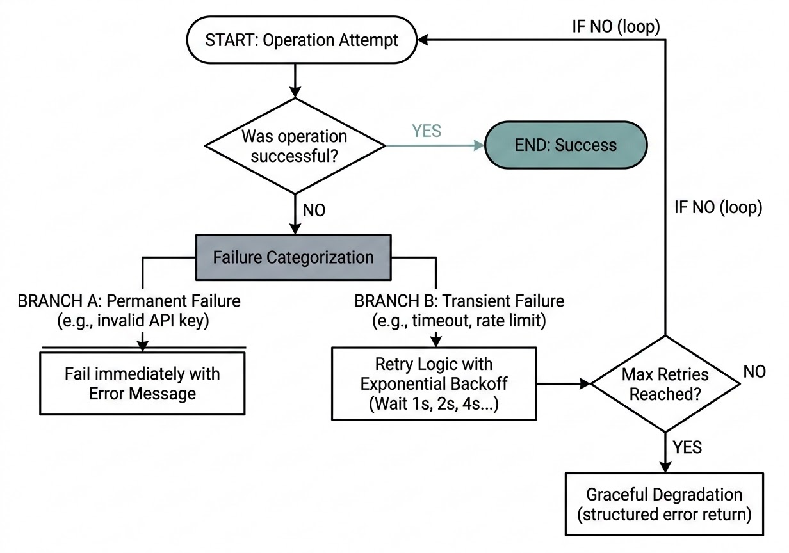
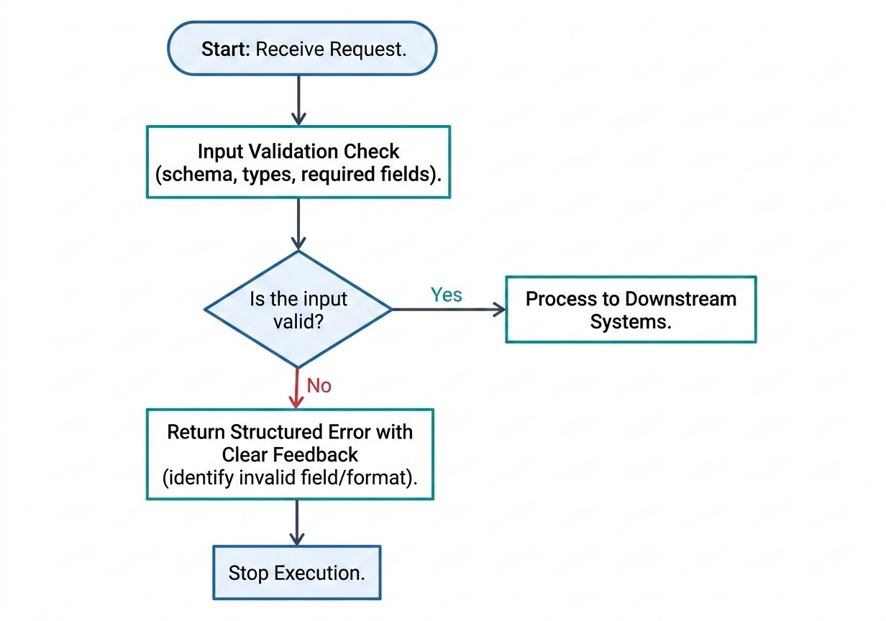
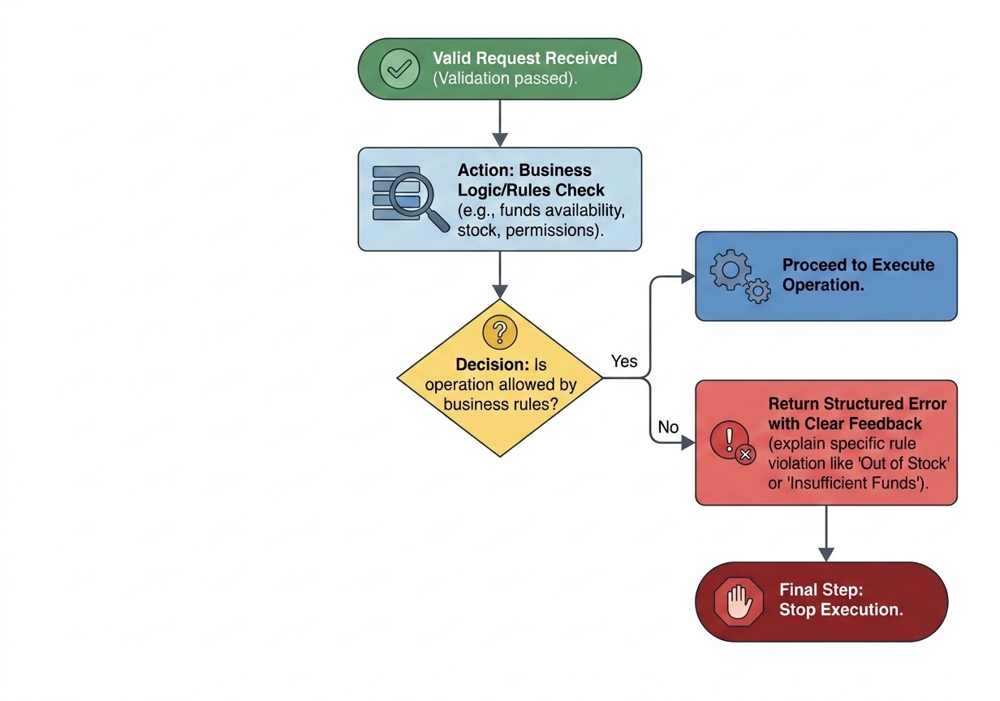
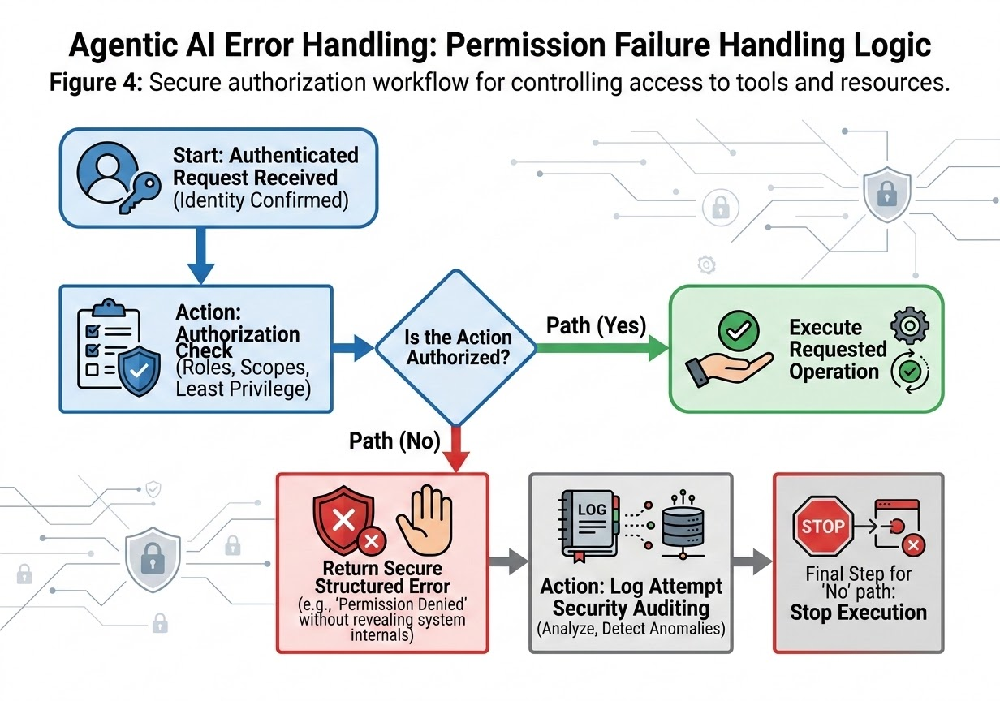
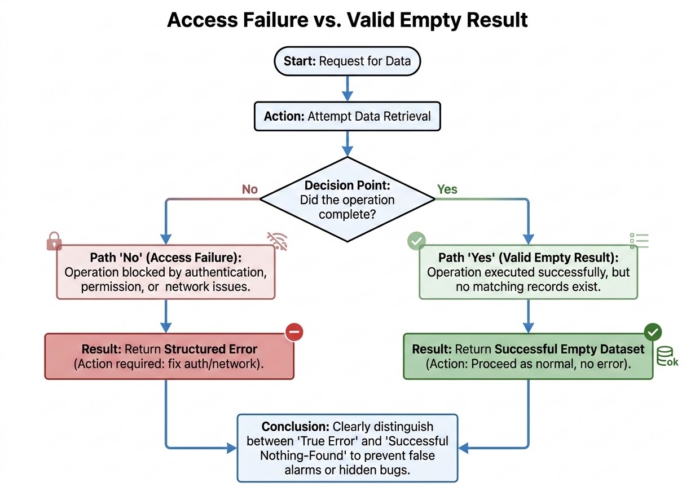
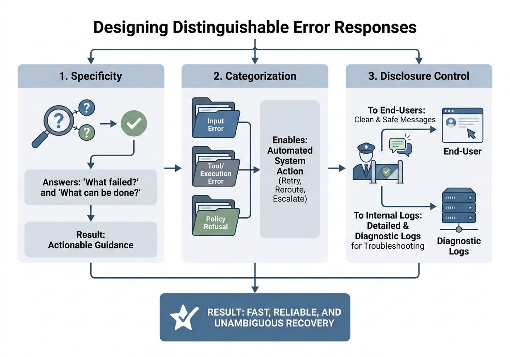

# Error Handling Patterns

Chapter 5 covered how Claude decides which tool to call. This chapter covers what happens after that call — specifically, what happens when it fails. You will learn to sort tool and MCP (Model Context Protocol) server failures into four distinct categories, tell an access failure apart from a query that legitimately found nothing, and design error responses precise enough for Claude to act on without a human in the loop. These patterns are core to Domain 2 of the CCA-F exam, and they resurface directly in Chapter 18's discussion of multi-agent error context.

## Why Failure Classification Matters

A surprising number of production tool integrations handle every error the same way: log it, return a generic failure message, and let the caller figure out what to do. This works until it doesn't. A system that retries a malformed request three times has wasted three calls on a request that was never going to succeed. A system that gives up on a request after one timeout has abandoned an operation that would have succeeded on the second try. A system that returns "Request failed" for a permissions problem, a stock-out, and a dropped network connection has given Claude nothing to reason about.

Reliable tool design starts from a different premise: failures are not interchangeable. Each failure type has a different cause, a different correct response, and a different downstream consequence if handled wrong. This chapter builds around three ideas that work together:

1. A **four-category failure taxonomy** — transient failure, validation failure, business logic failure, and permission failure — that tells you *why* something failed and what the correct first response is.
2. The distinction between an **access failure and a valid empty result** — two outcomes that look identical on the wire but mean opposite things.
3. A small set of design principles for writing **error responses** that are specific, machine-parseable, and safe to expose.

The table below is worth memorizing; it is the fastest way to reason about any tool failure you encounter.

| Category | Trigger | Temporary? | Retry? | Correct first response |
|---|---|---|---|---|
| Transient failure | External hiccup: timeout, rate limit, brief outage | Yes | Yes, with backoff | Retry, then a structured error if retries are exhausted |
| Validation failure | Malformed, incomplete, or schema-violating request | No | No | Reject immediately; explain what to fix |
| Business logic failure | Structurally valid request blocked by a rule | No, unless the condition changes | No | Explain the rule that blocked execution |
| Permission failure | Authenticated caller lacks authorization | No | No | Deny securely; log for audit |

## Transient Failures: When Retrying Is the Right Answer

### What Counts as Transient

A transient failure is a temporary, recoverable error. The operation didn't succeed this time, but nothing about the request itself was wrong — the underlying system was momentarily unavailable, overloaded, or unreachable. Retrying the same request a few seconds later has a real chance of success.

Common transient failures include:

- HTTP `429` (rate limit exceeded)
- HTTP `503` (service temporarily unavailable)
- Network timeouts and dropped connections
- MCP server connection interruptions
- Short-lived infrastructure outages (a database failover, a load balancer restart)

Contrast this with a **permanent failure**: an invalid API key, a decommissioned endpoint, a malformed request. Retrying an invalid API key a hundred times produces the same rejection a hundred times — the fix requires a human to rotate credentials, not a retry loop. Confusing "temporary" with "permanent" is the single most common transient-handling mistake: systems that retry permanent failures burn time and quota for zero benefit, and systems that fail immediately on a genuinely transient blip give up prematurely.

> ⚠️ **Important:** Before writing retry logic, classify the error first. A retry loop wrapped around a permission failure or a validation failure doesn't make the system more reliable — it just delays the inevitable failure while wasting calls.


*Figure 6.1: A failed operation is categorized as either a permanent failure, which fails immediately, or a transient failure, which retries with exponential backoff until it succeeds or exhausts its retry budget and falls back to graceful degradation.*

### Designing Retry Logic

Good retry behavior is controlled, not automatic. At minimum, it needs:

- A **maximum retry count** — retries must stop eventually.
- **Exponential backoff** — the wait between attempts grows after each failure (1s, 2s, 4s, 8s...), instead of hammering the same endpoint at a fixed interval.
- **Jitter** — a small random offset added to each backoff interval, so that many clients failing at the same moment don't all retry in lockstep and create a synchronized second wave of load.
- **Logging** — every retry attempt should be recorded, so failures are debuggable after the fact.
- **A graceful failure path** — if retries are exhausted, the system returns a clear structured error rather than hanging indefinitely or crashing.

```python
import random
import time

def call_with_retry(operation, max_retries=3, base_delay=1.0):
    for attempt in range(max_retries + 1):
        try:
            return operation()
        except TransientError as e:
            if attempt == max_retries:
                return {
                    "is_error": True,
                    "error_type": "transient_failure",
                    "message": f"Operation failed after {max_retries} retries: {e}",
                }
            delay = base_delay * (2 ** attempt) + random.uniform(0, 0.5)
            log.warning(f"Retry {attempt + 1}/{max_retries} after {delay:.1f}s: {e}")
            time.sleep(delay)
        except PermanentError as e:
            # Do not retry — surface immediately
            return {"is_error": True, "error_type": "permanent_failure", "message": str(e)}
```

Notice the two exception branches: `TransientError` gets backoff and a retry budget; `PermanentError` — an invalid credential, a malformed endpoint — is surfaced on the first attempt. Merging these two paths into one generic `except Exception` block is what causes most retry-storm incidents in production.

> 🚀 **Pro Tip:** Retrying blindly is safe only for idempotent operations — ones where running them twice has the same effect as running them once (a read, a lookup, a status check). For non-idempotent operations like "charge this card" or "create this order," an automatic retry after an ambiguous timeout can create a duplicate side effect. Pair retries on writes with an idempotency key so the downstream system can recognize and discard a duplicate attempt.

### Transient Failures Across an MCP Chain

MCP integrations add hops, and every hop is a place things can go wrong. Claude calls an MCP server; that server may call a database, a third-party API, or another internal service. A robust MCP server absorbs transient failures at its own layer rather than passing every hiccup straight back to Claude: it detects the temporary condition, retries safely, and only returns a structured error to Claude once its own retry budget is exhausted.

For example, if a weather API the MCP server depends on times out once, the server should retry once or twice internally before telling Claude anything failed. But if the same call fails because the server's API key was revoked, it should fail immediately — retrying an authentication failure never resolves it, and delaying that failure only wastes the turn.

This is also where **graceful degradation** matters: if retries are exhausted, the tool should still respond — with a structured error explaining what failed and whether retrying later might help — rather than hanging or crashing the whole agentic loop.

### Real-World Use Case

Consider an MCP server that wraps a third-party shipment-tracking API for an order-management agent. During peak shopping periods, the tracking API rate-limits aggressively, returning `429` responses in bursts. Without backoff, the MCP server's naive retry loop would hammer the API immediately after each rejection, extending the rate-limit window and potentially getting the server's API key temporarily blocked entirely — a self-inflicted cascading failure. With exponential backoff, a retry cap of three attempts, and jitter across concurrent requests, the same server absorbs the rate limit gracefully: most requests succeed within two retries, and the ones that don't return a clear "tracking temporarily unavailable, retry recommended" error that Claude can relay to the user or attempt again on a later turn.

**Best practices:**
- Cap retries and always use increasing backoff with jitter.
- Log every retry attempt for later debugging.
- Only auto-retry idempotent operations without an idempotency key.

**Common mistakes:**
- Infinite retries with no cap, which can cascade load across dependent systems.
- Fixed-interval retries with no backoff, which resynchronize failed clients into repeated bursts.
- Treating every exception as retryable, including permanent failures like bad credentials.

## Validation Failures: Rejecting Bad Input Early

### What Counts as a Validation Failure

A validation failure means the request itself doesn't meet the tool's structural requirements: a required field is missing, a value has the wrong data type, the JSON is malformed, an enum value isn't among the supported options, or a format constraint (an email address, a date) isn't satisfied.

Unlike a transient failure, a validation failure is not temporary. Retrying the identical malformed request produces the identical rejection every time — there is nothing to wait out. This is why validation failures should never trigger retry logic. The correct response is to reject the request immediately and tell the caller precisely what to fix.


*Figure 6.2: An incoming request passes an input validation check for schema, types, and required fields — valid requests continue to downstream systems, while invalid ones are rejected immediately with a structured error identifying the bad field.*

### Building Effective Validation

Validation should happen as early as possible in the request path — ideally before a tool or MCP server has done any real work, and certainly before an invalid request is allowed to reach a downstream system. A validation pass typically checks, in order:

1. **Presence** — are all required parameters included?
2. **Type** — does each value match its expected data type (integer, string, boolean)?
3. **Format** — does the value satisfy expected formatting rules (a valid email, an ISO date)?
4. **Constraints** — does the value fall within allowed bounds or match an allowed set (an enum, a numeric range)?

This ordering matters: checking constraints before confirming a field is even present just produces a confusing error about a value that doesn't exist.

```json
{
  "is_error": true,
  "error_type": "validation_failure",
  "field": "customer_id",
  "message": "Missing required field: customer_id",
  "expected": "non-empty string"
}
```

```json
{
  "is_error": true,
  "error_type": "validation_failure",
  "field": "quantity",
  "message": "Expected integer, received string for parameter 'quantity'",
  "received_value": "\"five\""
}
```

Both responses name the exact field, state what was wrong, and state what was expected. Compare that to a bare `{"error": "Request failed"}` — technically true, practically useless.

> 💡 **Tip:** Chapter 14 covers how JSON Schema-constrained tool calls prevent many validation failures before they happen, by forcing Claude's tool input to conform to a schema at generation time. Validation logic in the tool itself remains the last line of defense — schemas reduce malformed input, they don't eliminate the need to check it.

### Validation in MCP Integrations

An MCP server sits between Claude and a downstream system, and it should validate structure, required fields, supported operation names, and value constraints *before* forwarding anything downstream. If validation fails, the server stops immediately and returns a structured error — it never forwards a request it already knows is malformed. Skipping this step means invalid input can reach a downstream system where it causes harder-to-diagnose failures, wastes an API call, or in the worst case exposes a security gap (for example, an unvalidated parameter reaching a database query unsanitized).

### Real-World Use Case

An internal expense-reporting tool accepts a `submit_expense` call with fields `amount`, `category`, and `receipt_url`. A caller sends a request missing `amount`. Without early validation, the tool might forward a partial record to the finance system, which could either silently store a zero-dollar expense or throw an opaque downstream error days later during a reconciliation batch job. With input validation at the tool boundary, the request is rejected immediately with `"Missing required field: amount"`, and the caller (or Claude, on the caller's behalf) can correct and resubmit within the same turn.

**Best practices:**
- Validate before any downstream call, not after.
- Name the specific field and the specific problem in every validation error.
- Never retry an unmodified request that failed validation.

**Common mistakes:**
- Returning `"Invalid request"` with no indication of which field or rule failed.
- Letting partially valid requests pass through "just this once."
- Wrapping validation failures in the same retry logic used for transient failures.

## Business Logic Failures: When the Rules, Not the Request, Are the Problem

### What Counts as a Business Logic Failure

A business logic failure happens *after* validation succeeds. The request is well-formed, the tool executes, the system is reachable — and the operation still can't complete, because it violates a rule specific to the application or organization. A bank transfer that exceeds the account balance, a purchase of an out-of-stock item, an attempt to book a room beyond its capacity, or a request for data the requester's account tier doesn't include are all business logic failures: nothing is technically wrong with the request, but the operation isn't permitted under the system's rules.

This sits in a distinct middle ground: it isn't a validation failure (the input was structurally fine), and it isn't a transient failure (retrying the identical request won't help unless the underlying condition — the balance, the stock level, the capacity — actually changes).


*Figure 6.3: After validation passes, a business logic/rules check — funds availability, stock, permissions — either lets the operation proceed or returns a structured error naming the specific rule it violated, such as insufficient funds or out-of-stock.*

### Handling Business Logic Failures in MCP Integrations

These failures often surface from a downstream system the MCP server calls on Claude's behalf — a payment processor, an inventory database, a scheduling platform. The MCP server itself worked fine; the rejection came from business rules enforced further downstream. A robust MCP server passes that rejection through as a clear, structured explanation rather than swallowing it, retrying it pointlessly, or crashing.

```json
{
  "is_error": true,
  "error_type": "business_logic_failure",
  "rule": "insufficient_inventory",
  "message": "Purchase could not be completed: item SKU-4471 is currently out of stock.",
  "recoverable": false
}
```

A `recoverable` flag (or equivalent) is useful here: some business logic failures resolve on their own (stock gets replenished, a booking slot opens up), while others won't without an entirely different request (a spending limit that requires an account upgrade). That distinction helps Claude decide whether to suggest "try again later" or "here's an alternative."

### Real-World Use Case

An e-commerce checkout tool receives a valid, well-formed order for a shoe in size 10. The size is out of stock. A generic `"Request failed"` gives Claude nothing to work with beyond apologizing. A structured business logic failure — `"Size 10 is out of stock; sizes 8, 9, and 11 are available"` — lets Claude immediately offer the customer a workable alternative in the same turn, without a second round trip.

**Best practices:**
- State the specific rule or constraint that blocked the request.
- Indicate whether the condition might change (and thus whether a later retry could succeed).
- Keep business rule explanations descriptive enough for Claude to suggest a next step.

**Common mistakes:**
- Returning the same generic error for business logic failures as for technical failures, erasing a distinction Claude could otherwise act on.
- Auto-retrying a business logic failure as if it were transient.
- Silently failing without stating *why* the operation was blocked.

## Permission Failures: Authentication Is Not Authorization

### Authentication vs. Authorization

A permission failure occurs when a caller's identity is confirmed, but the specific action they're attempting isn't allowed for that identity. This is fundamentally an **authorization** problem, not an **authentication** problem, and the distinction matters:

- **Authentication** answers "who are you?" — verifying an identity, a token, or a credential.
- **Authorization** answers "what are you allowed to do?" — checking whether that verified identity has permission for a specific action.

A user can authenticate successfully — their token is valid, their identity is confirmed — and still be denied access to a specific tool, resource, or operation. A regular employee's login is completely valid; that doesn't mean their account should be able to call an admin-only tool.

### The Principle of Least Privilege

Reliable systems grant each identity the minimum set of permissions required to do its job, nothing more. This limits the blast radius of a mistake or a compromised credential: if a service account is scoped only to read customer names, a leaked token for that account can't be used to modify billing records, even though the leak itself is still a problem to fix. Least privilege doesn't prevent every incident, but it bounds the damage any single incident can cause.

### Enforcing Permissions Across an MCP Chain

Permission checks can — and should — happen at more than one layer. Claude requests a tool action; the MCP server checks whether the calling token is authorized for that action; the downstream API the MCP server talks to may enforce its own authorization independently. Relying on a single checkpoint means a bug or misconfiguration at that one layer removes all protection. Defense at multiple layers means a gap in one layer is still caught by another.

```json
{
  "is_error": true,
  "error_type": "permission_failure",
  "message": "Insufficient permissions for this operation.",
  "required_scope": "write_access"
}
```


*Figure 6.4: An authenticated request passes through an authorization check — an authorized action executes normally, while an unauthorized one returns a secure structured error, logs the attempt for security auditing, and stops execution.*

### Secure Error Messaging

Permission errors need to say enough to be useful without exposing anything a caller could use to map or attack the system. Avoid naming internal database tables, file paths, service names, or configuration details in an error message a caller can see. `"Administrator access required"` is useful and safe; `"No row found for user_id=4471 in admin_roles table on db-shard-3"` leaks internal architecture for no benefit to a legitimate caller.

Reliable systems also **log** permission failures internally — even (especially) when the external-facing message is deliberately generic. Those logs are what let a security team notice a pattern of repeated unauthorized attempts against the same resource, which a single denied request would never reveal on its own.

> ⚠️ **Important:** A permission error should tell a legitimate caller enough to fix the problem (request the right role, contact an admin) without telling an attacker anything about how your authorization system is structured internally.

### Real-World Use Case

An internal HR tool exposes a `get_compensation_data` MCP action restricted to HR administrators. A regular employee's Claude session, acting on the employee's own valid credentials, attempts to call it out of curiosity or by mistake. The correct response is a generic `"Administrator access required for this operation"` returned to the session, paired with an internal log entry recording the attempted call, the identity, the timestamp, and the resource — visible to the security team, invisible to the caller.

**Best practices:**
- Enforce authorization checks at every layer that can enforce them, not just the outermost one.
- Apply least privilege to every token, role, and service account by default.
- Log denied attempts internally even when the external message stays generic.

**Common mistakes:**
- Treating a valid authentication token as automatic authorization for every action.
- Exposing internal resource names, paths, or schema details in a denial message.
- Failing to log permission failures, losing the audit trail needed to detect abuse patterns.

## Access Failure vs. Valid Empty Result

### Two Different Kinds of "Nothing"

A tool can return no data for two entirely different reasons, and confusing them is one of the more damaging mistakes in tool design:

- An **access failure** means the operation never completed. The system could not reach or read the resource — because of a missing permission, an authentication problem, a network issue, or a rejected request. This is a genuine error and should be surfaced as one.
- A **valid empty result** means the operation completed exactly as intended. Access was fine, the query ran, and there was simply nothing matching the criteria to return. A search with zero matches, an inbox with no new messages, a report with no qualifying transactions — these are all successes, not failures.

On the wire, both can look like "empty" — an empty array, a null value, a zero-length response. The meaning behind that emptiness is opposite in each case, and only the tool itself knows which one actually happened.


*Figure 6.5: A data-retrieval attempt that never completes is an access failure requiring a structured error, while one that completes successfully with no matching records is a valid empty result requiring no error at all.*

### Why the Distinction Matters

Collapsing these two outcomes into one shape causes damage in both directions:

- If an **access failure is treated as an empty result**, a real problem — an expired credential, a broken permission grant, a failed integration — gets hidden behind what looks like an ordinary "nothing found" response. Nobody investigates a bug that looks like a normal outcome.
- If a **valid empty result is treated as a failure**, the system generates false alarms: unnecessary retries, alerts, and Claude repeatedly re-querying a tool that already worked correctly and simply found nothing.

### How MCP Encodes This Distinction

The Claude API's tool result format includes an `is_error` flag on `tool_result` content blocks specifically to make this distinction explicit rather than implicit in the shape of the payload. An MCP server retrieving customer records that can't reach the database because of a missing permission should return:

```json
{
  "type": "tool_result",
  "tool_use_id": "toolu_01A2b3C4d5",
  "is_error": true,
  "content": "Access denied: insufficient permissions to query customer records."
}
```

A query that ran successfully but matched nothing should return:

```json
{
  "type": "tool_result",
  "tool_use_id": "toolu_01A2b3C4d5",
  "is_error": false,
  "content": "[]"
}
```

Same empty-looking payload shape, opposite `is_error` value. That single flag is what lets Claude — or any downstream system reading the result — respond appropriately instead of guessing whether "nothing" means "problem" or "done."

### Real-World Use Case

A CRM lookup tool serves two very different scenarios. In the first, an API key scoped to a regional sales team is used to query a customer segment outside that region — the query never runs because the permission layer blocks it before reaching the database. That's an access failure, and it should come back with `is_error: true` and a message pointing at the permission gap. In the second, a sales rep queries for customers matching an unusually specific filter (a rare combination of industry, region, and deal size) and genuinely none exist. That's a valid empty result, and it should come back with `is_error: false` and an empty list — no alarm, no retry, just an accurate "nothing matched."

**Best practices:**
- Set an explicit success/error signal on every tool result — never let an empty payload alone be the only signal.
- Write access-failure messages that name the actual blocker (permission, auth, network) so recovery is possible.
- Treat a valid empty result as a normal, quiet outcome that requires no further action.

> ✅ **Best Practice:** Never let "empty" be ambiguous. Every tool result should make explicit, via a status flag, whether the operation completed successfully or was blocked — regardless of how much or how little data came back.

**Common mistakes:**
- Returning an empty array for both a permission failure and a genuine zero-match query.
- Triggering retries or alerts on a normal empty result.
- Silently swallowing an access failure as if it were a legitimate "nothing found" response.

## Designing Distinguishable, Actionable Error Responses

### Three Design Principles

Regardless of which of the four categories a failure falls into, the response itself should follow three rules.

**1. Specificity.** Every error should answer two questions: what failed, and what can be done about it. `"I can't do that"` gives no direction. `"The search tool returned no results — try a broader query, or verify the data source is connected"` is actionable; the reader, human or agent, knows exactly what to try next.

**2. Categorization.** Attaching a structured label — `input_error`, `tool_error`, `policy_refusal` — lets a downstream system react to the *type* of the error without parsing free-form text. This matters most in multi-step or multi-agent pipelines, where one component's output becomes another component's input. A labeled error lets an orchestrator decide to retry, reroute, or escalate automatically, instead of relying on brittle string matching against a human-readable message.

**3. Containment.** What gets revealed differs by audience. Logs can and should carry full diagnostic detail — stack traces, internal identifiers, timing data. Anything shown to an end user or fed back to Claude as a tool result should be clean: no raw stack traces (confusing to non-technical users), no internal endpoint or service names (reveals system architecture), no fragments of a system prompt (can undermine the assistant's intended behavior). The rule is simple: detailed and diagnostic in logs, clean and safe in outputs.


*Figure 6.6: The three design principles for distinguishable error responses — specificity (what failed and what to do), categorization (a structured label enabling automated routing), and disclosure control (clean messages to end users, full diagnostics to internal logs) — together produce fast, reliable, unambiguous recovery.*

### A Second Lens: Input, Tool, and Policy Errors

The four-category taxonomy from earlier in this chapter — transient, validation, business logic, permission — describes the *root cause* of a failure. There's a second, complementary way to label errors, oriented around *where in the pipeline* the problem originated and how an automated consumer should react:

- **Input errors** — the request itself was the problem (this overlaps heavily with validation failures above).
- **Tool or execution errors** — something failed while Claude was using an external resource: a search API, a database, a code executor (this covers transient, business logic, and some permission failures).
- **Policy refusals** — not a failure at all. Claude is working exactly as designed, but the request falls outside what's permitted. The response still needs a clean, structured signal — without exposing the reasoning behind the policy itself.

These two lenses aren't competing systems — they answer different questions. The four-category taxonomy tells you *why* something failed and what the correct first response is (retry, reject, explain, deny). The input/tool/policy label tells a downstream consumer, especially an orchestrator in a multi-agent pipeline, *how to route* the outcome without re-deriving the root cause from a message string.

```json
{
  "is_error": true,
  "category": "tool_error",
  "root_cause": "transient_failure",
  "retryable": true,
  "message": "The search tool timed out. Retrying may succeed.",
  "detail": "upstream_timeout: search-index-svc, attempt 1/3, 4200ms"
}
```

Here, `message` is what a caller or Claude sees; `detail` is what the logs keep. `category` and `retryable` are what an orchestrator reads to decide the next step without parsing either string.

### Real-World Use Case

In a hub-and-spoke research pipeline (see Chapter 2), a coordinator dispatches a search subagent to pull data from an external index. The subagent's tool call fails with a structured response tagged `category: tool_error`, `root_cause: transient_failure`, `retryable: true`. The coordinator's routing logic reads those two fields directly and decides to retry once through the same subagent before falling back to an alternate data source — no free-form text interpretation required, and no wasted turns re-deriving what already happened.

**Best practices:**
- Give every error response a machine-readable category alongside its human-readable message.
- Keep diagnostic detail in logs; keep responses shown to users or fed back to Claude clean.
- Treat policy refusals as a distinct, clearly labeled category — not a bug and not a generic failure.

**Common mistakes:**
- Returning a single free-form string with no structured fields, forcing every consumer to regex-match a message.
- Leaking stack traces, internal hostnames, or prompt fragments into user-facing or model-facing output.
- Blurring a policy refusal into a generic "error," making it indistinguishable from an actual system failure.

## A Decision Framework for Any Tool Failure

Putting the whole chapter together, a reliable tool or MCP server can run every failure through the same four questions:

1. **Did the operation complete?** If no, was the blocker temporary (transient — retry with backoff) or permanent (validation, business logic, or permission — don't retry)?
2. **If it completed, did it return the requested data, or genuinely nothing?** A completed operation with no matches is a valid empty result, not an error.
3. **What category and root cause describe this outcome?** Label it so a downstream consumer — human or automated — can route it correctly.
4. **What does each audience need to see?** Full diagnostic detail in logs; a specific, safe, actionable message everywhere else.

Reliable systems are not the ones that never fail. They're the ones that classify failure correctly, respond to each category appropriately, and give Claude — and every human downstream of it — enough information to retry, reroute, explain, or stop safely.

## Chapter Summary

Tool and MCP failures fall into four categories, each with a different correct response: transient failures (temporary — retry with backoff), validation failures (malformed input — reject and explain), business logic failures (valid input blocked by a rule — explain the rule), and permission failures (authenticated but not authorized — deny securely and log). Layered on top of this taxonomy is a separate but related distinction: an access failure means the operation never completed, while a valid empty result means it completed successfully and found nothing — conflating the two either hides real problems or manufactures false alarms. Finally, every error response, regardless of category, should be specific about what failed and what to do next, carry a structured machine-readable label, and keep diagnostic detail out of anything shown to an end user or fed back to Claude.

## Key Takeaways

- Transient failures are temporary and should trigger controlled retries with exponential backoff, jitter, a retry cap, and logging — never infinite or fixed-interval retries.
- Validation failures are structural and permanent; retrying an unmodified invalid request never helps. Validate early, and name the specific field and rule that failed.
- Business logic failures occur when a technically valid request is blocked by an application rule (insufficient funds, out of stock, over capacity). Explain the rule; don't treat it as a technical error.
- Permission failures are authorization problems, not authentication problems. A valid identity can still be denied a specific action. Enforce least privilege, check permissions at every layer, and log denials without exposing internal system details.
- An access failure (the operation never completed) and a valid empty result (the operation completed and found nothing) must be signaled differently — an explicit status flag, not an empty payload alone, carries that meaning.
- Good error responses are specific, categorized with structured labels, and contain only safe, audience-appropriate detail — full diagnostics in logs, clean messages everywhere else.
- Root-cause categorization (transient/validation/business logic/permission) and pipeline-routing categorization (input/tool/policy) answer different questions and can be used together.

## Interview Questions

1. Walk through how you would distinguish a transient failure from a permanent one in a tool that calls a third-party API, and explain why that distinction changes your retry strategy.
2. Why shouldn't a validation failure ever trigger automatic retry logic? Give a concrete example of what goes wrong if it does.
3. Explain the difference between a business logic failure and a validation failure using a real-world example, and describe how each should be communicated back to the caller.
4. What is the difference between authentication and authorization, and why does that distinction matter when designing permission error responses?
5. Describe a scenario where confusing an access failure with a valid empty result caused (or could cause) a real production incident.
6. What fields would you include in a structured error response schema to make it usable by both a human reading logs and an automated orchestrator making a retry/reroute decision?
7. How would you design retry logic to avoid a cascading failure across a system of dependent services during a partial outage?
8. Why is it dangerous to expose stack traces or internal endpoint names in an error message returned to an end user or to Claude?

## Practice Questions & Answers

**Practice Question (unofficial):** An MCP server wrapping a payment API returns `{"error": "failed"}` whenever a charge attempt doesn't go through — whether the card was declined, the payment gateway timed out, or the request was missing a required `amount` field. What's wrong with this design, and how would you redesign the response?

*Answer:* The response collapses three completely different failure categories — a business logic failure (card declined), a transient failure (gateway timeout), and a validation failure (missing field) — into one indistinguishable message. A caller (or Claude) receiving `{"error": "failed"}` has no way to decide whether to retry, ask the user for a different payment method, or fix the request and resubmit. The redesign should tag each case with its category and a specific message: a declined card returns a `business_logic_failure` with a message like "Card declined by issuer — try a different payment method"; a gateway timeout returns a `transient_failure` marked `retryable: true`; a missing field returns a `validation_failure` naming the field. Each category then drives a different, correct downstream action instead of a single generic retry-or-give-up guess.

**Practice Question (unofficial):** A search tool returns an empty result set both when the caller lacks permission to query a given index and when the query is well-formed but genuinely matches nothing. A monitoring system has started paging engineers every time a "no results" response comes back, because a handful of those were actually silent permission failures. How should the tool be fixed, and why did the original design cause this problem?

*Answer:* The tool is conflating an access failure with a valid empty result — both currently return the same empty payload with no distinguishing signal. The fix is to add an explicit status flag (such as `is_error`) to every response: a permission-blocked query returns `is_error: true` with a message identifying the missing permission, while a genuinely empty match returns `is_error: false` with an empty list. The original design caused the paging problem in two directions at once: real permission failures were silently treated as normal "nothing found" outcomes (masking the actual bug), while — once someone tried to compensate by treating all empty results as suspicious — the far more common case of a legitimately empty query started triggering false alarms. Separating the two signals resolves both problems simultaneously.

**Practice Question (unofficial):** You're designing an MCP server that calls an internal inventory database. Describe the retry strategy you would implement, including what happens if all retries fail.

*Answer:* First classify the failure mode at each call: a database connection timeout or a transient `503` from the inventory service is retryable; an invalid query or a permissions rejection is not. For the retryable case, implement exponential backoff (e.g., 1s, 2s, 4s) with added jitter, capped at a small maximum retry count (e.g., three attempts), with each attempt logged. If all retries are exhausted, the server does not hang or crash — it returns a structured `transient_failure` response with `is_error: true`, a message stating the operation could not complete and retrying later may succeed, and enough diagnostic detail in the internal log (not the response) to debug the outage. This is graceful degradation: the caller gets a clear, safe answer instead of silence or a crash.

**Practice Question (unofficial):** An internal tool exposes an admin-only "delete user account" action. A non-admin user's session attempts to call it. Design the error response, and explain what should and shouldn't be included in it.

*Answer:* The response should be a `permission_failure` with `is_error: true` and a message such as "Administrator privileges required for this operation" — enough for a legitimate caller to understand they need a role change, and nothing more. It should not include the internal role table name, the specific permission-check logic that failed, the requesting user's full role list, or any other implementation detail that could help someone map the authorization system. Separately, the attempt itself — identity, timestamp, target resource, and outcome — should be written to an internal audit log that the caller never sees, so a security team can detect a pattern of repeated unauthorized attempts against sensitive actions.

**Practice Question (unofficial):** In a multi-agent pipeline, a coordinator dispatches three subagents to call three different external tools. One subagent's tool call fails. What information does the coordinator need in that subagent's error response to decide whether to retry, reroute, or escalate — and why is a single free-form error message insufficient?

*Answer:* The coordinator needs at minimum: a root-cause category (transient, validation, business logic, or permission), a `retryable` flag, and a concise, specific message. With those structured fields, the coordinator can programmatically decide — retry immediately if `retryable: true` and the cause is transient; reroute to an alternate tool or data source if the cause is a business logic failure specific to that data source; escalate to a human if the cause is a permission failure requiring a credential fix. A single free-form string forces the coordinator to pattern-match against message text to infer the category, which is brittle — any change in wording breaks the routing logic, and ambiguous phrasing can lead to the wrong action (for example, retrying a permission failure because the message happened to contain the word "unavailable").

## Multiple Choice Questions

**Q1.** A tool call fails because the API key used to authenticate has been revoked. What is the correct handling strategy?
A. Retry with exponential backoff since this may be a temporary condition
B. Retry indefinitely until the key is rotated
C. Fail immediately — this is a permanent failure, and retrying will not help
D. Return a valid empty result

**Correct Answer: C**

*Explanation:* A revoked API key is a permanent failure — no amount of retrying changes the outcome, since the underlying condition (an invalid credential) doesn't resolve itself over time. (A) is wrong because backoff logic is for transient conditions, not permanent ones. (B) is wrong for the same reason and additionally wastes resources indefinitely. (D) is wrong because this is a genuine access/authentication failure, not a successful operation that happened to find nothing.

**Q2.** Which of the following is NOT a typical example of a transient failure?
A. HTTP 429 rate limit response
B. A required field missing from the request payload
C. A brief network interruption
D. HTTP 503 service unavailable

**Correct Answer: B**

*Explanation:* A missing required field is a validation failure — the request is structurally invalid, and retrying the identical request will fail identically. (A), (C), and (D) are all classic transient conditions that can resolve on their own and are reasonable candidates for a retry.

**Q3.** What is the primary purpose of exponential backoff in a retry strategy?
A. To guarantee that every request eventually succeeds
B. To increase the wait time between retries so repeated failures don't overload the system further
C. To validate the request before retrying
D. To convert a permanent failure into a transient one

**Correct Answer: B**

*Explanation:* Exponential backoff spaces out retries with increasing delays specifically to avoid piling more load onto an already struggling system. (A) is false — backoff improves the odds of eventual success but guarantees nothing. (C) confuses backoff with validation, an unrelated concern. (D) is not something backoff can do; the nature of the failure doesn't change based on retry timing.

**Q4.** A validation failure should generally be handled by:
A. Retrying with exponential backoff
B. Rejecting the request immediately and returning a specific, actionable error
C. Silently ignoring the invalid fields and processing the rest of the request
D. Escalating directly to a human without returning any response

**Correct Answer: B**

*Explanation:* Validation failures are not temporary, so the correct response is immediate rejection paired with a clear explanation of what's wrong and how to fix it. (A) wastes retries on a request that will fail identically every time. (C) risks processing incomplete or incorrect data, which can cause harder-to-diagnose downstream failures. (D) is unnecessary and slower than simply returning a clear, correctable error.

**Q5.** A checkout tool receives a structurally valid order for an item that is out of stock. This is best classified as:
A. A validation failure
B. A transient failure
C. A business logic failure
D. A permission failure

**Correct Answer: C**

*Explanation:* The request is technically well-formed (no validation problem) and there's no permission or authentication issue — the operation is blocked by a business rule (available inventory). (A) is wrong because the input itself is valid. (B) is wrong because retrying the identical request won't succeed unless stock is actually replenished. (D) is wrong because this has nothing to do with authorization.

**Q6.** What distinguishes authentication from authorization?
A. Authentication checks what a user is allowed to do; authorization checks who they are
B. Authentication confirms identity; authorization determines permitted actions for that identity
C. They are two names for the same check
D. Authorization always happens before authentication

**Correct Answer: B**

*Explanation:* Authentication answers "who are you," while authorization answers "what are you allowed to do" once identity is established. (A) reverses the definitions. (C) is incorrect — they are distinct checks that can each pass or fail independently. (D) is backwards; authorization checks presuppose a confirmed identity, so authentication logically precedes it.

**Q7.** Which statement best describes the principle of least privilege?
A. Every identity should be granted the maximum permissions available, to avoid future access requests
B. Every identity should receive only the minimum permissions necessary for its task
C. Permissions should never be checked more than once in a request path
D. Authentication tokens should never expire

**Correct Answer: B**

*Explanation:* Least privilege minimizes the potential damage from a compromised or misused credential by limiting what any single identity can do. (A) is the opposite of the principle. (C) is unrelated and actually contradicts the recommended practice of checking permissions at multiple layers. (D) is an unrelated credential-lifecycle concern, not a privilege-scoping principle.

**Q8.** A tool result comes back as an empty list. What additional information is needed to determine whether this is a valid empty result or an access failure?
A. The size of the payload
B. An explicit success/error status signal on the result
C. The name of the tool that was called
D. Nothing further is needed — an empty list always means the query succeeded

**Correct Answer: B**

*Explanation:* Only an explicit status signal (such as an `is_error` flag) reliably distinguishes a completed-but-empty query from a blocked operation, since both can produce an identical empty payload. (A) doesn't help — both cases can produce a payload of the same (empty) size. (C) provides no information about the outcome of this particular call. (D) is the exact assumption that causes real access failures to be silently hidden.

**Q9.** Why is it dangerous to treat every empty tool result as an error requiring a retry?
A. It has no negative consequences beyond a slightly slower response
B. It generates false alarms and unnecessary retries for outcomes that are actually successful
C. It causes the tool to return incorrect data
D. It automatically escalates the request to a human

**Correct Answer: B**

*Explanation:* A valid empty result is a successful outcome; treating it as an error triggers retries, alerts, or escalations for a situation where nothing is actually wrong, wasting time and creating noise. (A) understates the real cost — repeated unnecessary retries and alert fatigue are meaningful operational problems. (C) is incorrect; the data returned (an accurate empty result) was correct. (D) is not a guaranteed or even typical consequence.

**Q10.** What are the three design principles for distinguishable error responses discussed in this chapter?
A. Speed, brevity, and encryption
B. Specificity, categorization, and containment
C. Logging, caching, and compression
D. Retrying, validating, and escalating

**Correct Answer: B**

*Explanation:* A well-designed error response states specifically what failed and what to do next, carries a structured category label for machine parsing, and contains only audience-appropriate detail (full diagnostics in logs, clean messages elsewhere). (A), (C), and (D) list unrelated or only tangentially related concerns that aren't the chapter's core design principles.

**Q11.** Which of the following is an appropriate use of a structured error category label like `input_error`, `tool_error`, or `policy_refusal`?
A. Replacing the four-category root-cause taxonomy entirely
B. Letting a downstream orchestrator decide how to route the outcome without parsing free-form text
C. Hiding the true cause of a failure from internal logs
D. Making error messages longer for end users

**Correct Answer: B**

*Explanation:* These structured labels exist specifically to let automated consumers, like an orchestrator in a multi-agent pipeline, act on the error type directly rather than inferring meaning from a human-readable string. (A) is incorrect — this labeling scheme complements the root-cause taxonomy (why it failed) rather than replacing it (how to route it). (C) is the opposite of good practice; internal logs should retain full cause detail. (D) is unrelated and not a stated goal.

**Q12.** A user-facing error message should generally avoid including which of the following?
A. A clear statement of what went wrong
B. A suggested next step
C. A raw stack trace or internal endpoint name
D. A structured error category

**Correct Answer: C**

*Explanation:* Stack traces and internal endpoint names expose implementation details that confuse non-technical users and reveal system architecture to anyone who receives the message. (A), (B), and (D) are all things a well-designed user-facing error response should include, not avoid.

**Q13.** A policy refusal, where Claude declines a request because it falls outside permitted behavior, should be treated as:
A. Identical to a system failure, using the same generic error category
B. A distinct, clearly labeled outcome — not a bug and not treated like a technical failure
C. A validation failure requiring the caller to reformat their request
D. A transient failure that should be retried automatically

**Correct Answer: B**

*Explanation:* A policy refusal reflects Claude functioning as intended, not a malfunction, so it deserves its own clear label distinct from technical failure categories. (A) erases a meaningful distinction that helps downstream systems respond correctly. (C) is incorrect — the request may be perfectly well-formed; it's simply disallowed. (D) is incorrect and potentially harmful — retrying an identical request against a policy boundary will produce the identical refusal every time.

**Q14.** Why should an MCP server validate a request's parameters before forwarding it to a downstream system?
A. To make the request larger and more thorough
B. To prevent malformed input from causing harder-to-diagnose failures, wasted calls, or security exposure downstream
C. Because downstream systems never perform their own validation
D. To guarantee the operation will always succeed

**Correct Answer: B**

*Explanation:* Catching malformed input at the MCP server boundary stops problems before they propagate into systems where they're harder to trace, and it avoids wasting a downstream call or exposing an unvalidated input to a system that assumes clean data. (A) misstates the goal — validation is about correctness, not size. (C) is not a safe assumption to build a design around, and even where downstream validation exists, early validation remains good defense in depth. (D) is false; validation prevents one class of failure but does not guarantee overall success, since transient, business logic, or permission failures can still occur afterward.

**Q15.** Which pairing of failure category and correct default response is accurate?
A. Transient failure → reject immediately with no retry
B. Validation failure → retry with exponential backoff
C. Business logic failure → explain the rule or constraint that blocked the operation
D. Permission failure → retry until authorization succeeds

**Correct Answer: C**

*Explanation:* A business logic failure means the request is valid but a rule blocks it, so the correct response explains that rule (e.g., insufficient funds, out of stock). (A) is backwards — transient failures are the category that should be retried, not rejected outright. (B) is backwards — validation failures should never be retried unmodified, since the same invalid input reproduces the same failure. (D) is incorrect and unsafe — a permission failure should be denied securely and logged, not retried, since repeated authorization attempts don't grant access on their own.

## Evaluate Yourself

1. **Scenario:** You're reviewing an MCP server implementation and find that every possible failure — timeouts, missing fields, insufficient funds, and permission denials — returns the exact same `{"error": "operation failed"}` response. Identify every problem this causes and redesign the response schema.
2. **Architecture design:** Design the error-handling layer for an MCP server that sits between Claude and three downstream systems: a payment gateway, an inventory database, and a customer permissions service. Specify what each of the four failure categories looks like for each downstream system, and how your server would signal them distinctly.
3. **Short answer:** Explain, in your own words, why a validation failure and a business logic failure require fundamentally different responses even though both mean the requested operation didn't happen.
4. **Scenario:** A monitoring dashboard shows a spike in retries against a search tool. On investigation, you find the tool is retrying every time it receives zero search results, not just when it hits a real error. Diagnose the root cause and describe the fix.
5. **Architecture design:** Sketch a retry policy (including backoff strategy, retry cap, and idempotency handling) for a tool that submits a financial transaction, and explain why this policy needs to be stricter than the retry policy for a read-only lookup tool.
6. **Reflection:** Think about a system you've built or used where an error message was too vague to act on. What information was missing, and how would applying the specificity, categorization, and containment principles from this chapter have changed that message?
7. **Scenario:** A permission-denied error currently returns the message: "Access denied — user 4471 lacks role ADMIN_L3 in table user_roles on shard db-east-2." Identify every security problem with this message and rewrite it following the containment principle.
