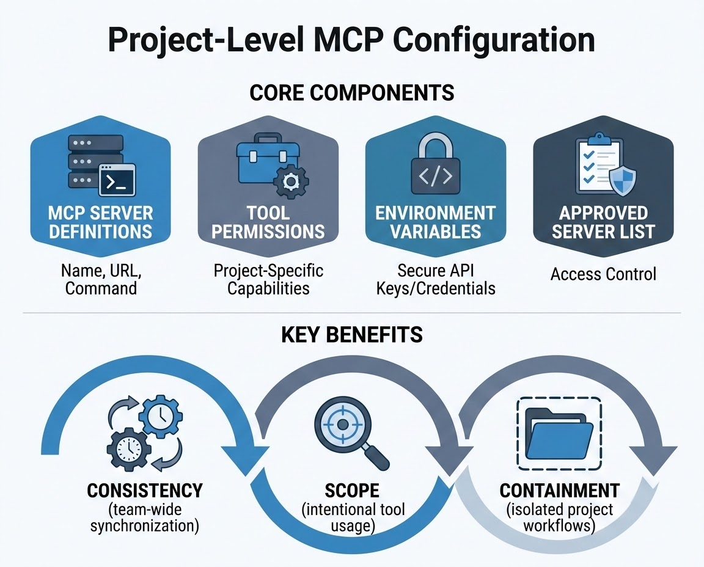
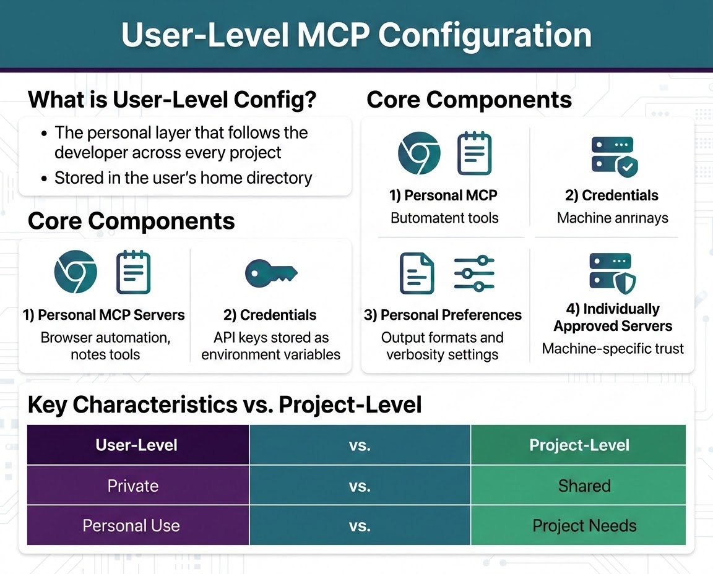

# MCP Configuration

Every capability Claude reaches through MCP — a database query tool, a ticketing integration, a browser-automation server — has to be configured somewhere before Claude can see it. This chapter covers the two places that configuration lives: project-level, which ships with your codebase, and user-level, which lives on your machine, along with the precedence rules that apply when both are active at once. You'll also learn a systematic four-step process for tracking down why a properly built MCP server isn't showing up in a session. This continues Domain 2 of the CCA-F exam — tool design and MCP integration — turning the tool-selection and error-handling principles from earlier chapters into the concrete configuration decisions that make MCP integrations reliable in practice.

## MCP Configuration Layers: Project and User

MCP (Model Context Protocol) is the open standard that lets Claude connect to external tools, APIs, and data sources without those integrations being hard-coded into the model or the application layer. Instead, Claude discovers what's available by reading configuration: which MCP servers exist, how to reach them, and what they're allowed to do. That configuration doesn't live in one single place — it's layered.

Two layers matter most in day-to-day work:

- **Project-level configuration** — declared inside the project itself, shared by the whole team, and typically checked into version control.
- **User-level configuration** — declared in your own environment, private to you, and never committed to any repository.

Both layers can be active in the same session. When you open a project that has its own MCP configuration, Claude also has access to whatever you've configured for yourself at the user level — your personal note-taking server, a browser-automation tool, whatever you've wired up independent of any single project. The two layers coexist rather than replace each other.

They do, however, have a precedence order. **When a conflict exists — most commonly, both layers declaring a server under the same name — project-level configuration wins inside that project.** The reasoning is straightforward: the project is the more specific context, and its declared configuration reflects what the team has explicitly agreed the project needs. Your personal servers that don't collide with anything the project declares remain available alongside it.

Some Claude Code setups also expose a narrower, third scope — project-specific configuration that's private to you and never committed, distinct from the shared project file. Treat it as a personal override that sits between the shared project layer and your general user layer. For exam purposes, the distinction that matters most is the two-layer model: shared/project versus personal/user, and the rule that the more specific, project-facing declaration takes precedence.


*Figure 7.1: Summarizes project-level MCP configuration's four core components — server definitions, tool permissions, environment variables, and an approved server list — alongside the three benefits, consistency, scope, and containment, that come from keeping this configuration at the project level.*

## Project-Level MCP Configuration

### What Belongs in Project-Level Config

Project-level configuration is the project's own declaration of what Claude can connect to and what it's allowed to do there. It typically holds four things:

1. **MCP server definitions** — the name of each server, how to reach it (a local command or a remote URL), and its transport type.
2. **Tool permissions** — which specific tools exposed by a connected server are actually available inside this project. A server can expose a dozen tools; the project doesn't have to expose all of them.
3. **Environment variable references** — credentials and other secrets are never hard-coded here. The config holds the *name* of an environment variable; the actual value stays in the shell environment.
4. **The approved server list** — an explicit declaration of which MCP servers Claude is permitted to use inside this project.

A minimal project-level configuration file looks like this:

```json
{
  "mcpServers": {
    "internal-tickets": {
      "type": "stdio",
      "command": "node",
      "args": ["./mcp-servers/tickets/index.js"],
      "env": {
        "TICKETS_API_TOKEN": "${TICKETS_API_TOKEN}"
      }
    },
    "analytics": {
      "type": "sse",
      "url": "https://mcp.internal.example.com/analytics"
    }
  }
}
```

Two server definitions, two transport types. `internal-tickets` runs as a local process and communicates over stdio (standard input/output) — the config launches it with a command and arguments. `analytics` is a remote service reached over SSE (server-sent events) — the config just needs its URL. Neither server has a secret written directly into the file; `TICKETS_API_TOKEN` is a reference, resolved from whatever value exists in the environment when Claude Code runs.

### Where Project-Level Config Lives

Project-level configuration lives inside the project directory itself — typically a JSON file at the project root (commonly named `.mcp.json` in Claude Code setups). Because the file is part of the project, it's part of version control. Commit it, and every developer who clones the repository inherits the exact same MCP setup the moment they open the project. Nobody has to manually wire up the ticketing server or the analytics connector on their own machine; it's already declared.

### Why Project-Level Config Exists as Its Own Layer

Three reasons justify keeping this configuration at the project level rather than pushing everything into personal setup:

- **Consistency.** Every developer on the team works from the same MCP configuration from day one. There's no drift between what one engineer's machine can reach and what another's can.
- **Scope.** Each project connects only to the tools it actually needs. An internal analytics server has no reason to be reachable from a customer-support project, and vice versa.
- **Containment.** Servers declared at the project level stay inside that project. They don't leak into unrelated repositories or workflows just because they happen to be configured on a shared machine.

### Real-World Use Case: Shared Tooling Across a Team

A platform engineering team maintains an internal service catalog and a change-management system, each exposed as an MCP server. Both are declared in the project's `.mcp.json` and committed alongside the codebase. When a new engineer joins and clones the repository, Claude Code already knows both servers exist, what transport each uses, and which of their tools are permitted in this project — the engineer doesn't spend their first day manually recreating a setup someone else already solved. The only thing left for them to supply locally is the credential value itself, via an environment variable, which is deliberately never part of the committed file.

### Best Practices and Common Mistakes

> ✅ **Best Practice:** Scope tool permissions narrowly. If a connected server exposes fifteen tools and the project only needs three, declare only those three. This limits both the project's attack surface and how much irrelevant tool metadata competes for Claude's attention when selecting a tool.

> ⚠️ **Important:** Never write a credential value directly into a project-level config file "temporarily." Even a file meant only for local testing has a way of getting committed by accident, and once that happens, the fix isn't as simple as deleting the line later — see credential handling below.

A common mistake is treating project-level config as a place to also declare personal, cross-project tools "just because it's convenient right now." That defeats containment — the whole point of the layer — and forces every teammate to either adopt tools they don't need or manually strip them out.

## User-Level MCP Configuration

### What Belongs in User-Level Config

User-level configuration is the personal counterpart to the project layer. It defines the tools, preferences, and credentials that follow *you* across every project you work in, regardless of what any individual project declares. Four things typically live here:

1. **Personal MCP servers** — tools you rely on across many projects independent of any one project's needs: a local browser-automation server, a personal notes integration, a productivity tool you've wired up for yourself.
2. **Credentials** — stored the same way as at the project level: as environment variable references, never as inline values.
3. **Personal preferences** — default output formats, verbosity settings, and other behavioral defaults you've configured for how Claude operates in your own environment.
4. **Individually approved servers** — the MCP servers you've personally trusted on your machine, independent of whatever a given project declares and approves for itself.

### Where User-Level Config Lives

User-level configuration lives in your home directory, outside of any project folder. It follows you from project to project on your machine, but it's never committed to a repository — it isn't part of any project's version-controlled history, because it isn't the project's concern. That separation is intentional: some configuration describes the project; this configuration describes the developer.

### Project vs. User: Precedence and Coexistence

| | Project-level config | User-level config |
|---|---|---|
| Location | Inside the repo, project root | Home directory, outside any repo |
| Version control | Committed, shared with the team | Never committed |
| Defines | What this project needs | What you personally use |
| Scope | This project only | Every project on your machine |
| On conflict | Wins | Yields to project-level |

The two layers are additive, not exclusive. When you're working inside a project, both are active at once. If the project declares a server the user layer doesn't know about, it's available. If your user layer declares a personal tool the project never mentions, it's still available too. The precedence rule only applies when both layers declare something under the same name — at that point, the project's declaration governs inside that project's context, while your personal declaration remains untouched and fully available the moment you step into a different project that doesn't override it.


*Figure 7.2: Summarizes user-level MCP configuration's core components — personal MCP servers, credentials, personal preferences, and individually approved servers — and contrasts its private, per-developer nature against project-level configuration's shared, per-project scope.*

### Real-World Use Case: Personal Tooling Across Every Project

A solutions architect who consults across multiple client codebases keeps a personal browser-automation server and a personal notes server declared at the user level. Every client project she opens has its own project-level MCP configuration — different databases, different internal APIs — but her personal tools are available in all of them without her having to redeclare them in every client repository, and without any client project ever seeing her personal tooling in their committed config.

### Best Practices and Common Mistakes

Keep genuinely personal, cross-project tools out of project-level config entirely, even when you're the only person currently working in that repository — someone else will clone it eventually, and they don't need your personal notes server sitting in their tool list.

> ⚠️ **Important:** The most common mistake in MCP setup is placing a personal API key directly into a project config file and committing it. Once a credential lands in version control, it's exposed — and deleting the line in a later commit doesn't undo the exposure, because the value still exists in the repository's commit history and needs to be treated as compromised.

## Securing Credentials Across Both Layers

The credential-handling pattern is identical at both layers, and it's worth stating as a rule on its own because it's the single most consequential mistake in MCP setup: **the config file holds the name of the environment variable, never the value.**

```json
{
  "mcpServers": {
    "github": {
      "type": "stdio",
      "command": "npx",
      "args": ["-y", "@modelcontextprotocol/server-github"],
      "env": {
        "GITHUB_PERSONAL_ACCESS_TOKEN": "${GITHUB_PERSONAL_ACCESS_TOKEN}"
      }
    }
  }
}
```

The literal string `${GITHUB_PERSONAL_ACCESS_TOKEN}` is what gets committed — harmless on its own. The actual token lives in the shell environment where Claude Code runs, set through whatever mechanism your team already uses for secrets (a `.env` file excluded from version control, a secrets manager, your shell profile). This pattern holds whether the server is declared at project level or user level.

> ⚠️ **Important:** If a secret is ever committed by mistake, rotating the credential is not optional. Removing it from the latest commit does not remove it from history; anyone with access to the repository's history — or a fork taken before the fix — still has it.

## Diagnosing Missing MCP Server Access

Configuration eventually drifts out of sync with reality: a server that used to work stops showing up, a newly declared server never appears, or Claude reports it doesn't have access to something you're confident is configured. This is common enough that it's worth having a fixed order of checks rather than guessing. Work through four layers, in this order: **config → transport → runtime/approval → environment.**

### Step 1: Verify the Config File

Start with the file itself — project config, user config, or both. Confirm the server is actually declared, and check three specific things:

- Is the entry present at all, or was it never saved or never merged?
- Is the server name spelled exactly right? A typo in the name is indistinguishable from a missing server.
- Is the transport type field correct for how that server actually runs?

### Step 2: Verify the Transport

Transport mismatches are a common source of silent failure. Local servers that run as a process communicate over stdio. Remote servers communicate over SSE. Declare a local process as SSE, or a remote endpoint as stdio, and the connection simply fails — usually without an error message that points at the real cause.

For a remote server, confirm the endpoint is actually live before assuming the configuration is wrong: a `curl` request or opening the URL in a browser tells you immediately whether it's reachable. Most MCP servers also write logs, and checking them is often the fastest way to see exactly where the connection broke down.

> 💡 **Tip:** If a server "was working yesterday" and stopped, transport and runtime are good first suspects — remote endpoints get redeployed, and local server processes get killed when a terminal session closes, without either event touching the config file at all.

### Step 3: Verify Runtime Status and Approval

A correct config file with the right transport still won't help if the server itself isn't reachable or hasn't been trusted.

For a local, stdio-based server, the process has to actually be running. If the terminal session that launched it was closed, or the process crashed, there's nothing on the other end of that connection regardless of what the config says.

Separately, Claude only connects to MCP servers that have been explicitly approved — this is a deliberate security boundary, not a bug. In Claude Code, the `/mcp` command shows exactly which servers are connected, which are pending approval, and which have been rejected. A server that's correctly declared and actually running but still shows as pending simply hasn't been approved yet, and it won't be usable until it is. This step is easy to overlook the first time you wire up a new server, because everything else about the setup can be perfectly correct.

### Step 4: Verify the Environment

If the server requires authentication and the config references an environment variable, that variable has to exist in the same shell session Claude Code is actually running in — not a different terminal tab, not a shell you set it in yesterday. Check with:

```bash
echo $TICKETS_API_TOKEN
```

An empty result means the credential is missing from this session. The server will fail to authenticate silently, which looks identical to the server not being available at all, even though the config, transport, and approval are all correct.

> ⚠️ **Important:** Environment variables are read when Claude Code starts, not continuously. Setting the variable after Claude Code is already running has no effect on the current session — set it, then restart Claude Code.

### Real-World Use Case: Tracing a Missing Internal Tool

A new engineer adds an internal ticketing MCP server to the project's config and expects to see its tools immediately. They don't appear. Working the four steps in order: the config entry is present and correctly spelled (step 1 clears); the transport is declared as stdio and the server is meant to run locally (step 2 clears); running `/mcp` shows the server listed as **pending** — it was declared but never approved (step 3 catches it). One approval later, the tools appear. Without the fixed order, it's easy to jump straight to suspecting the credential or the server code, when the actual blocker was a one-time trust step that has nothing to do with either.

### Best Practices and Common Mistakes

Most missing-access issues trace back to one of these four places, and almost always in a way that's obvious once you check it directly rather than guess:

- Mixing up stdio and SSE for a given server.
- Forgetting to start a local server process before expecting Claude to reach it.
- Assuming approval happened automatically instead of confirming it in `/mcp`.
- Setting a required environment variable in the wrong shell session.
- Setting the environment variable correctly but not restarting Claude Code afterward.

> 🚀 **Pro Tip:** Run `/mcp` as a matter of habit any time you add or change a server, even if you're confident the config is right. It's the fastest single check in the whole list, and it rules out two of the four layers — runtime and approval — in one look.

## Bringing It Together: A New-Project MCP Checklist

When you're setting up MCP for a new project — or onboarding onto one someone else built — the layers and the diagnostic order combine into a short, repeatable checklist:

1. Confirm the project-level config file exists and lists the servers you expect, each with the correct transport type.
2. Confirm your own user-level config doesn't declare a conflicting server name that would shadow something the project needs (remember: project-level wins on conflict, but it's worth knowing what's happening).
3. Set any required environment variables in the shell you'll actually launch Claude Code from.
4. Start Claude Code, run `/mcp`, and approve any servers still pending.
5. If a tool is still missing at this point, walk the four-step diagnostic in order: config → transport → runtime/approval → environment.

Following this sequence once, deliberately, is faster than debugging blind the first time a tool doesn't show up — and it's the same sequence you'll fall back on every time configuration drifts later.

## Chapter Summary

MCP configuration lives in two coexisting layers. Project-level configuration is checked into version control, shared by the whole team, and defines what a given project can connect to — server definitions, tool permissions, environment variable references, and an approved server list, all scoped narrowly to what that project actually needs. User-level configuration lives privately in your home directory, follows you across every project, and defines your own personal tools, credentials, and preferences. Both layers are active at once; project-level configuration wins only when the two directly conflict, most commonly on server naming. Credentials are handled identically at both layers: the config file holds an environment variable's name, never its value. When a configured server doesn't show up, a fixed four-step order — config, transport, runtime/approval, environment — finds the cause faster than guessing, because each step rules out an entire category of failure before moving to the next.

## Key Takeaways

- MCP configuration has two active layers: project-level (shared, committed, project-scoped) and user-level (private, uncommitted, follows you everywhere).
- Project-level config holds four things: server definitions, tool permissions, environment variable references, and an approved server list.
- User-level config holds personal servers, credentials, personal preferences, and individually approved servers.
- Both layers are active simultaneously; project-level configuration takes precedence only when the two conflict, typically on a shared server name.
- Project-level config exists for consistency, scope, and containment — not just convenience.
- Credentials are always stored as environment variable references, at both layers — never as inline values in a config file.
- A committed secret stays exposed in commit history even after the line is deleted; rotation, not deletion, is the fix.
- Diagnose missing MCP access in a fixed order: config → transport → runtime/approval → environment.
- stdio serves local process-based servers; SSE serves remote servers — mixing the two up is a common, silent failure.
- Claude only connects to explicitly approved servers; check status with `/mcp` before assuming a deeper problem.
- Environment variables are read at Claude Code startup; changing them requires a restart to take effect.

## Interview Questions

1. Walk through the difference between project-level and user-level MCP configuration, and explain a scenario where getting that distinction wrong would cause a real problem for a team.
2. Why does project-level configuration take precedence over user-level configuration when both declare a server under the same name? What would go wrong if it were the other way around?
3. Explain why MCP configuration files should never contain a literal credential value, even for "internal-only" or "temporary" setups. What's the actual risk if one does?
4. A colleague tells you a newly added MCP server "just isn't showing up in Claude." Describe the process you'd use to find out why, and explain why the order of your checks matters.
5. What's the practical difference between stdio and SSE as MCP transport types, and why does mixing them up tend to fail silently instead of throwing a clear error?
6. Why does Claude require explicit approval of MCP servers rather than trusting anything declared in configuration? What does this protect against?
7. Describe the three reasons project-level MCP configuration exists as its own layer rather than everyone just configuring servers individually. Which of the three matters most on a large team, and why?
8. If you changed an environment variable a running MCP server depends on, why wouldn't Claude pick up the new value immediately, and what does that imply about how you should sequence configuration changes?

## Practice Questions & Answers

**Practice Question (unofficial):** Your team's project declares an MCP server named `database` pointing at a shared staging environment in the committed project config. You personally have a `database` server declared at the user level pointing at a local sandbox you use for experiments. When you open this project, which `database` server does Claude use, and what happens to your personal one?

**Answer:** Inside this project, the project-level `database` server wins because project-level configuration takes precedence when both layers declare a server under the same name. Your personal `database` server isn't deleted or broken — it simply isn't the one used in this project's context. The moment you open a different project that doesn't declare its own `database` server, your personal one is available again there.

---

**Practice Question (unofficial):** A remote MCP server's config entry is correctly named and its URL is correct, but Claude can't connect. You check the server logs and there's no incoming connection at all. What layer of the four-step diagnostic process does this point to, and why wouldn't fixing the config file's name or URL help?

**Answer:** This points to the transport layer. If the config declares the wrong transport type for how the server actually operates — for instance, marking a remote SSE-based server as if it were a local stdio process — Claude never attempts the connection the server is expecting, so nothing arrives in the logs. The name and URL being correct doesn't matter if Claude is trying to reach the server the wrong way; the fix is correcting the transport type, not touching the name or URL.

---

**Practice Question (unofficial):** An engineer commits a project config file with a real API key hard-coded into it, notices the mistake an hour later, and immediately deletes the line in a follow-up commit. Is the credential now safe? Explain what else needs to happen.

**Answer:** No. Deleting the line in a later commit removes it from the current state of the file, but the original commit still contains the value in the repository's history, and anyone with access to that history — or a clone or fork made before the fix — can still retrieve it. The credential must be treated as compromised: rotate it (issue a new key and revoke the old one) at the source system, then update the environment variable with the new value. Deleting the line is a cleanup step, not a remediation step.

---

**Practice Question (unofficial):** A developer sets a required environment variable in one terminal tab, then switches to a different terminal tab where Claude Code is already running, and expects the MCP server to authenticate successfully. It doesn't. What are the two separate issues at play here, and what does the developer need to do?

**Answer:** Two issues stack here. First, environment variables are scoped to the shell session where they're set — setting a variable in one terminal tab doesn't make it visible in a different tab's shell, so the Claude Code session may never see it regardless of timing. Second, even in the correct shell, Claude Code reads environment variables at startup, not continuously, so a session already running won't pick up a newly set variable. The developer needs to set the variable in the exact shell session that will launch Claude Code, then start (or restart) Claude Code from that session.

## Multiple Choice Questions

**Q1.** Where does project-level MCP configuration typically live?
A. In the user's home directory
B. Inside the project directory, checked into version control
C. Inside Claude's model weights
D. In a separate private repository maintained by each developer

**Correct Answer: B**

*Explanation:* Project-level configuration is part of the project itself, typically at the project root, so it can be committed and shared automatically with every contributor. A is wrong because that describes user-level configuration, the personal counterpart. C is wrong because configuration is external metadata read at runtime and has nothing to do with model weights. D is wrong because a separate per-developer repository would defeat the purpose of shared, consistent team configuration.

**Q2.** When both project-level and user-level MCP configuration declare a server under the same name, which one governs inside that project?
A. User-level, because personal configuration is always more specific
B. Whichever was configured most recently
C. Project-level configuration
D. Neither — the server becomes unavailable until the conflict is manually resolved

**Correct Answer: C**

*Explanation:* Project-level configuration takes precedence within the project context when a naming conflict exists. A is wrong because it inverts the actual precedence rule. B is wrong because precedence is determined by layer, not by recency of configuration. D is wrong because the server doesn't become unavailable — one definition simply governs over the other.

**Q3.** Which transport type is used by MCP servers that run as a local process?
A. SSE (server-sent events)
B. HTTP polling
C. stdio
D. WebSocket

**Correct Answer: C**

*Explanation:* Local, process-based MCP servers communicate over stdio. A is wrong because SSE is used for remote servers, not local processes. B is wrong because HTTP polling isn't one of the transport types covered here. D is wrong because WebSocket isn't the transport type used for local MCP servers in this context.

**Q4.** Which of the following is NOT one of the four things typically found in project-level MCP configuration?
A. MCP server definitions
B. Tool permissions
C. A five-element tool description framework
D. An approved server list

**Correct Answer: C**

*Explanation:* The four typical components of project-level config are server definitions, tool permissions, environment variable references, and an approved server list. A, B, and D are each wrong as "not included" answers, since server definitions, tool permissions, and the approved server list are all core components; a tool description framework is a separate concept from tool design, not part of MCP configuration content.

**Q5.** A local MCP server was working correctly yesterday. Today, Claude reports it isn't available, and the config file hasn't changed. What's the most likely cause?
A. The server's transport type silently changed in the config
B. The terminal session running the local server process was closed or the process crashed
C. Project-level configuration was overridden by user-level configuration
D. The MCP protocol version was upgraded

**Correct Answer: B**

*Explanation:* Local, stdio-based servers depend on an actively running process; closing the terminal or a process crash breaks the connection without touching the config file at all. A is wrong because the question states the config hasn't changed. C is wrong because that's a precedence issue, not a runtime issue, and doesn't match "worked yesterday, config unchanged." D is wrong because a protocol version change isn't indicated by anything in the scenario.

**Q6.** What should a project-level or user-level MCP config file contain in place of an actual credential value?
A. The credential, base64-encoded
B. A reference to the environment variable's name
C. A comment explaining where the credential is stored
D. Nothing — credentials should be omitted from configuration entirely

**Correct Answer: B**

*Explanation:* The config should reference the environment variable name; the actual value stays in the environment, never in the file. A is wrong because encoding a secret doesn't stop it from being a secret — it's still exposed if committed. C is wrong because a comment doesn't provide the server with a usable credential at runtime. D is wrong because the server still needs the credential to authenticate; it just isn't stored in the file.

**Q7.** A credential was accidentally hard-coded into a committed project config file. The line is deleted in the very next commit. Is the credential now secure?
A. Yes, because the current version of the file no longer contains it
B. Yes, as long as the repository is private
C. No, because the value remains in the repository's commit history and must be treated as compromised
D. No, but only until the next scheduled credential rotation cycle

**Correct Answer: C**

*Explanation:* Deleting a line in a later commit doesn't remove the value from history; anyone with history access can still retrieve it, so the credential must be rotated immediately. A is wrong because commit history persists independently of the file's current state. B is wrong because repository privacy limits who can currently see it but doesn't undo the exposure or change the required response. D is wrong because waiting for a scheduled rotation leaves the compromised credential valid in the meantime — it should be rotated immediately, not on a routine schedule.

**Q8.** In Claude Code, which command shows which MCP servers are connected, pending approval, or rejected?
A. `/tools`
B. `/mcp`
C. `/servers`
D. `/status`

**Correct Answer: B**

*Explanation:* `/mcp` is the command that surfaces exactly this connection and approval status for MCP servers. A is wrong because that's not the command associated with MCP server status. C is wrong because it isn't a real command referenced for this purpose. D is wrong because a general status command wouldn't be the specific view for MCP approval state.

**Q9.** Why does Claude require MCP servers to be explicitly approved before use, even if they're correctly declared in config and actively running?
A. Approval is a formality with no functional purpose
B. It's an intentional security boundary that prevents silently trusting any declared server
C. It only matters for remote SSE servers, not local stdio servers
D. Approval is required only the first time Claude Code is ever installed

**Correct Answer: B**

*Explanation:* Explicit approval is a deliberate trust boundary — being declared and running isn't sufficient; a server also has to be explicitly trusted before Claude will use it. A is wrong because approval has a real functional effect: an unapproved server isn't usable regardless of its config. C is wrong because the approval requirement applies to servers generally, not only remote ones. D is wrong because approval applies per server, not as a one-time install-level event.

**Q10.** A required environment variable is set correctly, in the correct shell session, after Claude Code has already been running for an hour. What happens?
A. Claude Code picks up the new value immediately
B. The variable is ignored until Claude Code is restarted
C. The server automatically restarts to pick up the change
D. The config file must be re-saved for the variable to take effect

**Correct Answer: B**

*Explanation:* Environment variables are read at Claude Code's startup, not continuously; a running session won't see a variable set after it started until it's restarted. A is wrong because that's precisely the behavior that doesn't happen. C is wrong because nothing in the setup triggers an automatic server restart from an environment change. D is wrong because re-saving the config file doesn't refresh environment variable values already read into the running process.

**Q11.** Which of the following is a valid reason project-level MCP configuration exists as its own layer, according to this chapter?
A. It allows each developer to bypass approval requirements
B. It ensures consistency, appropriate scope, and containment of tools within the project
C. It removes the need for any user-level configuration
D. It automatically encrypts all credentials referenced in the file

**Correct Answer: B**

*Explanation:* Consistency, scope, and containment are the three reasons given for project-level config existing as its own layer. A is wrong because approval requirements aren't bypassed by project-level config; they still apply. C is wrong because user-level config still serves a distinct, necessary purpose for personal tools. D is wrong because project-level config doesn't perform encryption; it simply avoids storing credentials directly.

**Q12.** Where does user-level MCP configuration live?
A. Inside the project repository, in a hidden folder
B. In the user's home directory, outside any project
C. On a centrally managed server controlled by an organization's admins
D. Inside the same file as project-level configuration, in a separate section

**Correct Answer: B**

*Explanation:* User-level configuration lives in the developer's home directory, independent of any specific project. A is wrong because that describes a project-scoped location, not user-level. C is wrong because that describes a managed/org-wide configuration tier, a different concept from personal user-level config. D is wrong because the two layers are stored separately, which is part of why user-level config is never committed.

**Q13.** Which transport type is appropriate for a remote MCP server?
A. stdio
B. SSE (server-sent events)
C. FTP
D. A local named pipe

**Correct Answer: B**

*Explanation:* Remote MCP servers are reached over SSE. A is wrong because stdio is for local, process-based servers, not remote ones. C is wrong because FTP isn't an MCP transport type. D is wrong because a local named pipe describes local, not remote, communication.

**Q14.** An engineer wants a personal browser-automation MCP server available in every project they open, without any project ever seeing it in committed config. Where should they declare it?
A. In every project's project-level config file
B. In their user-level config
C. In a shared team config file
D. In an environment variable

**Correct Answer: B**

*Explanation:* A tool that should follow the developer across every project, without being shared or committed, belongs in user-level configuration. A is wrong because declaring it in every project's committed config would expose a personal tool to the whole team and violate containment. C is wrong because a shared team config file is, by definition, shared — the opposite of what's wanted here. D is wrong because an environment variable holds a value, not a server declaration.

**Q15.** What is the correct order for diagnosing a missing MCP server, according to this chapter's four-step process?
A. Environment → runtime/approval → transport → config
B. Transport → config → environment → runtime/approval
C. Config → transport → runtime/approval → environment
D. Runtime/approval → config → transport → environment

**Correct Answer: C**

*Explanation:* The recommended order works from the most foundational layer outward: confirm the declaration is correct, then confirm the connection method is correct, then confirm the server is live and trusted, then confirm credentials are actually present in the session. A, B, and D are each wrong because they reorder the sequence in a way that risks debugging a later layer, like environment variables, before ruling out a simpler, earlier cause, like a misspelled server name.

**Q16.** A server is correctly declared, uses the correct transport, and is actively running, but its tools still don't appear in a session. `/mcp` shows it listed as "pending." What's the issue?
A. The environment variable is missing
B. The server hasn't been approved yet
C. The transport type is wrong
D. The config file wasn't saved

**Correct Answer: B**

*Explanation:* A server can be perfectly configured and actively running and still be unusable because it hasn't cleared the explicit approval step; "pending" in `/mcp` indicates exactly this. A is wrong because a missing environment variable would typically show as an authentication failure, not a "pending" approval status. C is wrong because the scenario states the transport is correct. D is wrong because the scenario states the server is declared and running, which wouldn't be true if the file weren't saved.

## Evaluate Yourself

1. **Scenario:** You're setting up MCP for a five-person team building an internal support tool. The team needs a shared database connector and a shared knowledge-base search server. Two team members also each want their own personal automation tools available only on their own machines. Sketch out what goes in project-level config versus what goes in each person's user-level config, and explain your reasoning.

2. **Architecture design:** Design the MCP configuration layout for an organization that has one core "platform" repository and a dozen smaller service repositories, all needing access to the same internal logging and internal deployment MCP servers. Would you duplicate the server declarations across every repository's project-level config, or is there a better structure? Justify your answer using the reasons project-level config exists as its own layer.

3. **Short answer:** In your own words, explain why "project-level config wins on conflict, but user-level tools remain available" is a more useful rule than either layer completely overriding the other. Give an example where full override in either direction would cause a real problem.

4. **Scenario:** A teammate reports that an MCP server they just added "isn't showing up," and they've already spent 20 minutes checking whether their API key is correct. Based on the four-step diagnostic order, what would you have them check first, and why might starting with the credential have been the wrong instinct?

5. **Short answer:** Explain how you would justify to a security-conscious engineering lead why referencing environment variables in MCP config, rather than allowing inline credential values, is a meaningful safeguard rather than just a style preference.

6. **Architecture design:** A remote MCP server your project depends on gets redeployed behind a new load balancer, and its endpoint now requires a slightly different connection pattern, but the transport type itself (SSE) hasn't changed. Walk through which of the four diagnostic steps you'd expect to catch this, and what you'd check to confirm it before touching any other part of the configuration.
