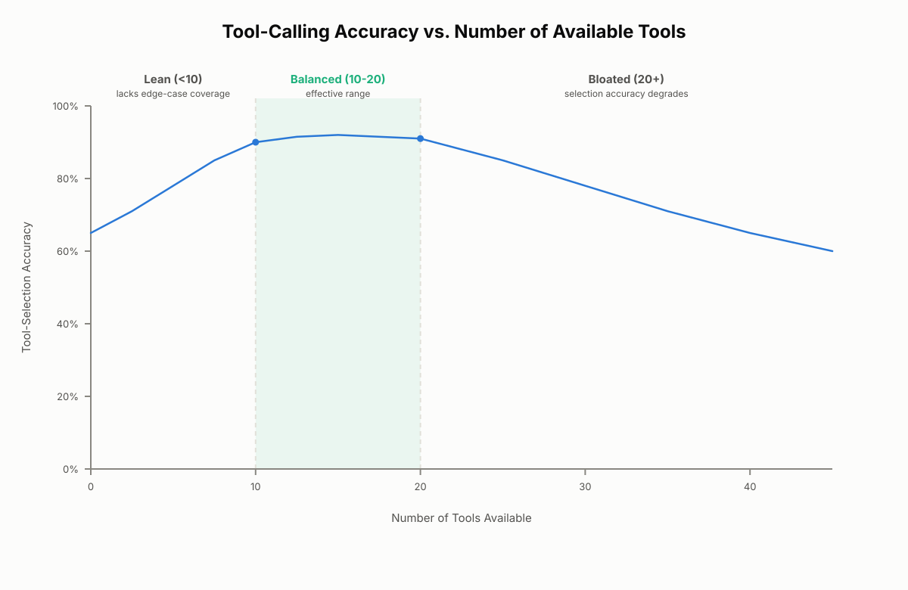
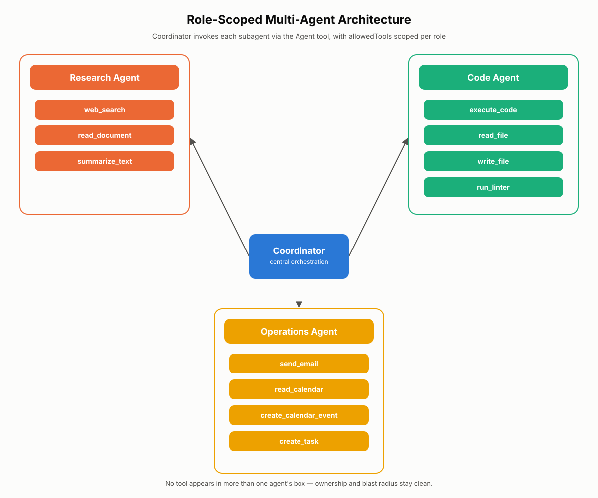
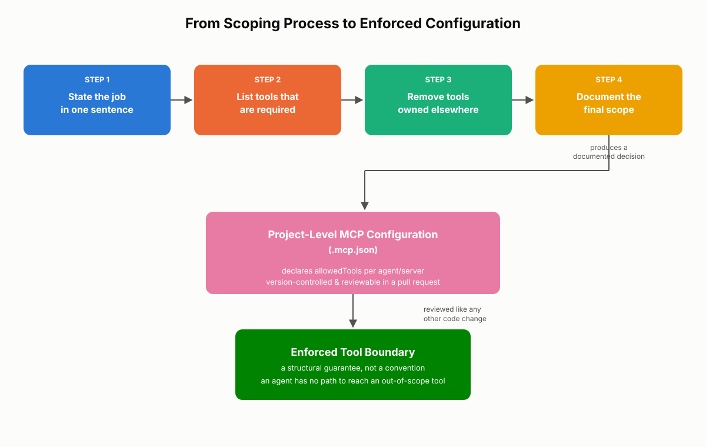

# Tool Scoping and Agent Roles

Every agent you build has access to a set of tools, and it is tempting to treat that set as a wish list — if a tool might help, why not include it? This chapter explains why that instinct backfires, why tool count has a measurable effect on selection accuracy, and how to right-size an agent's toolset to roughly 10-20 tools. It closes out the tool-design domain by turning scoping decisions into enforceable configuration, connecting directly to the project-level MCP (Model Context Protocol) configuration you learned to diagnose in the previous chapter. For the CCA-F exam, expect scenario questions that ask you to identify an over-scoped agent and redesign it.

## Why Too Many Tools Hurt Selection

More tools should mean more capability. That assumption feels obvious, and it is wrong. Past a certain point, adding tools does not expand what an agent can do — it degrades how reliably the agent does anything at all.

### The Selection-as-Search Problem

Every time Claude receives a task, it chooses a tool by reasoning over the name, description, and parameter schema of every tool currently available in context. With 5 tools, that comparison is trivial. With 50, it becomes a search problem: the model has to evaluate dozens of candidates, many of which overlap in purpose, and make a choice under real ambiguity.

That ambiguity has a direct, measurable consequence: selection accuracy drops. The model doesn't fail randomly — it tends to pick something *adjacent* to the correct tool. A tool that is functionally close but not actually right for the task looks plausible enough to win out, especially when the truly correct tool is buried among twenty similar-sounding options.

Consider a fintech operations agent wired to 45 tools spanning a CRM MCP server, a billing MCP server, and a ticketing MCP server. Asked to "check on a customer's refund," the agent has to distinguish `check_refund_status`, `issue_refund`, `get_transaction_history`, and `create_billing_ticket` — four tools that all sound relevant. In production, this agent occasionally called `issue_refund` when the user only wanted a status check, because the description boundaries between "check" and "issue" tools were not distinct enough for the model to reliably tell apart at that volume of candidates.

> ⚠️ **Important:** Wrong-tool selection is not a random failure — it is systematic. As tool count grows, the model favors options that are semantically close to correct, which is exactly what makes the mistake hard to catch in casual testing. A demo with 3 example queries may never surface it; production traffic with edge cases will.

### Context Bloat: Tool Definitions Compete for Space

Every tool definition — its name, its description, its parameter schema — occupies tokens in the context window. That space is finite. When a large share of it is consumed by tool definitions, less remains for the conversation history, the source documents, and the task instructions the agent actually needs to reason about.

Here is a single, well-written tool definition:

```json
{
  "name": "search_customer_records",
  "description": "Searches the customer database by name, email, or account ID. Returns matching customer profiles including contact details and account status. Use this when you need to look up an existing customer. Do not use for creating new customer records — use create_customer_record instead.",
  "input_schema": {
    "type": "object",
    "properties": {
      "query": { "type": "string", "description": "Name, email, or account ID to search for" },
      "limit": { "type": "integer", "description": "Maximum number of results to return", "default": 10 }
    },
    "required": ["query"]
  }
}
```

That single definition runs to roughly 90-100 tokens once serialized. It is not expensive in isolation. But an agent carrying 45 tools of similar weight is spending 4,000-5,000 tokens on tool definitions alone, on every single turn, before the model reads a single line of the actual task. That is context spent on describing capability rather than using it — and it is paid on every request, not once.

> 💡 **Tip:** If you are debugging degraded reasoning quality in an agent and haven't looked at its tool count, check there first. A bloated toolset silently taxes the same context budget you are trying to preserve for conversation history and documents.

### Semantic Interference Between Overlapping Tools

Tool sets rarely start out messy. They get that way. A tool is added for one workflow, another is added later for a nearly identical purpose, and over time the boundaries between them blur. This is especially common when multiple MCP servers are combined into one agent's toolset without a review pass — each server was designed independently, so their tools were never coordinated to avoid overlap.

When two tools have similar names or overlapping descriptions — say, `get_customer`, `fetch_customer_record`, and `lookup_account` all sitting in the same toolset — the model has no strong signal for choosing between them. It falls back to weak cues: whichever tool appears first in the list, or whichever name pattern the model has seen more often in training. Neither of those is a reliable basis for a production system.

**Real-world use case.** A support platform integrated three MCP servers over the course of a year: one for its legacy ticketing system, one for its newer CRM, and one for an internal knowledge base. Each server exposed its own "search" tool — `search_tickets`, `search_accounts`, and `search_kb_articles` — plus each had its own generic `search` alias for backward compatibility. The combined agent ended up with six overlapping search-shaped tools. Tool misselection became frequent enough that the team had to consolidate the aliases and rename the remaining tools with distinct, non-overlapping prefixes before reliability recovered.


*Figure 8.1: Tool-calling accuracy holds steady in the 10-20 tool range, degrades noticeably past approximately 20 tools, and lacks coverage below approximately 10 tools — illustrating the effective range described later in this chapter.*

### Best Practices and Common Mistakes

> ✅ **Best Practice:** Treat tool count as a design constraint from the start of a project, not a cleanup task you get to later.

> ✅ **Best Practice:** When combining multiple MCP servers into one agent, audit for overlapping tool names and descriptions before deployment.

> ⚠️ **Common Mistake:** Adding a tool "just in case it's useful later." Convenience is not justification — every unused tool is pure selection risk with no offsetting benefit.

> ⚠️ **Common Mistake:** Assuming that because each tool description is individually well-written (per the five-element framework), the toolset as a whole is fine. Descriptions can each be excellent and the *set* can still be too large or too overlapping.

## Right-Sizing the Toolset: The 10-20 Tool Framework

Once you accept that more tools can hurt reliability, the practical question becomes: how many tools should a given agent actually carry? There is no single correct number — the right answer depends on what the agent is built to do — but there is a usable framework for getting there.

### The Effective Range

A narrow, single-purpose agent might need only 3 to 5 tools. A broader orchestrator managing a multi-step workflow might reasonably use up to 20. Empirically, tool-calling accuracy tends to hold up well through roughly 20 tools and decline noticeably beyond that point. Below approximately 10 tools, an agent may lack the coverage to handle the edge cases that come up in its domain.

That gives a working range: **10 to 20 tools** is the effective zone for most agents — broad enough to cover a real job, tight enough to select from reliably. This is a signal, not a hard ceiling. An agent with 22 well-differentiated tools is not automatically broken, and an agent with 9 tools is not automatically incomplete. But every tool past 20 is a point where you should ask whether the agent's scope has grown beyond a single coherent role.

| Toolset size | Characterization | Typical outcome |
|---|---|---|
| 3-9 tools | Lean | Fast, high-accuracy selection; may lack edge-case coverage |
| 10-20 tools | Balanced | Broad enough for real workflows, still selects reliably |
| 20+ tools | Bloated | Selection accuracy degrades even if every tool is well-designed individually |

### The Four Diagnostic Questions

When you're deciding whether a tool belongs on an agent, or whether an agent's toolset has grown too large, four questions do most of the work:

1. **What is this agent's core job?** If you cannot state it in a single sentence, the agent's scope isn't defined clearly enough to make good tool decisions yet.
2. **Which tools are genuinely required, not just convenient?** Required means the task is impossible without the tool. Convenient means it would be nice to have but the job can be done without it. Convenience alone is never sufficient reason to add a tool.
3. **Do any tools duplicate each other in capability?** Two overlapping tools don't give an agent twice the power — they give it twice the selection ambiguity, for no net capability gain.
4. **Does this tool actually belong to a different part of the system?** A tool that supports a different workflow phase should live with the agent responsible for that phase, not ride along on this one.

### From Bloated to Balanced — A Worked Example

Take the fintech operations agent from the previous section, sitting at 45 tools across CRM, billing, and ticketing. Running it through the four questions:

- **Core job?** Stated in one sentence: "Answer customer questions about their account status and transaction history." That sentence excludes refund issuance, ticket creation, and marketing communication — all of which had crept into the toolset.
- **Required vs. convenient?** Of the 45 tools, only 11 were actually needed to answer status and history questions. The rest — refund issuance, ticket creation, campaign tools — were convenient to have on hand "in case," not required by the stated job.
- **Duplicates?** Three separate tools could all retrieve a customer's transaction history with slightly different filters. One was kept; the other two were removed and their functionality folded into the surviving tool's parameters.
- **Belongs elsewhere?** Refund issuance and ticket creation were reassigned to a separate operations agent (see the next section) whose actual job includes taking action, not just answering questions.

The result was an 11-tool read-focused agent — solidly inside the 10-20 range — plus a separate operations agent for actions. Selection accuracy improved immediately, and the team could reason about failures more easily because each agent's blast radius was smaller.

> 🚀 **Pro Tip:** When an agent's toolset creeps past 20, the fix is almost never a longer, better-organized tool list. It's splitting the agent. Treat "beyond 20 tools" as a redesign trigger, not a tuning problem.

### Best Practices and Common Mistakes

> ✅ **Best Practice:** Apply the four questions any time a new tool is proposed for an existing agent — not only during initial design.

> ✅ **Best Practice:** Revisit an agent's toolset periodically as MCP servers and integrations are added; scope drifts even when no one intends it to.

> ⚠️ **Common Mistake:** Treating 20 tools as a target to reach rather than a ceiling to respect. A lean 8-tool agent that reliably does its job is a better outcome than a padded-out 20-tool agent doing the same job less reliably.

> ⚠️ **Common Mistake:** Solving a bloated toolset by writing longer, more detailed descriptions instead of removing tools. Better descriptions help at the margins; they do not fix a fundamentally oversized set.

## Scoping Tools to Agent Roles

Everything so far points at the same conclusion: give each agent precisely the tools that match its role, no more and no less. Tool scoping is the discipline of turning that principle into a deliberate design decision rather than letting a toolset accumulate by default.

Scoping is a two-sided decision. Deciding which tools an agent *should* have is only half of it — deciding, with equal deliberateness, which tools it should *not* have is the other half. A clean scope reads like a statement: this agent has these tools because this is its job, and nothing else.

### Why Scoping Matters: Reliability, Security, Ownership

Three distinct benefits make deliberate scoping worth the design effort, and each maps onto a different axis of system quality:

| Reason | What it delivers | Why it matters |
|---|---|---|
| **Reliability** | Fewer selection errors | An agent that only sees tools relevant to its job picks the right one more consistently — this is the direct payoff of everything covered earlier in the chapter. |
| **Security** | Principle of least privilege | Each agent accesses only what its role requires. If a code execution agent is compromised or misbehaves, it should have no path to email or calendar data — scope limits the blast radius of any single failure. |
| **Ownership** | Clear accountability | When tools map cleanly to roles, a failure investigation starts with "which agent, which tool" instead of "somewhere in this pile of 40 shared tools." |

The security benefit deserves particular attention on the exam and in practice. Least privilege is a standard security principle applied to agentic systems: an agent's tool access should be bounded by its job, not by what might theoretically be convenient during a future task. A well-scoped code agent that gets tricked by a malicious prompt injection into misusing its tools can still only touch code — it was never given the ability to send email or read calendars in the first place.

### Role Archetypes in Practice

Three common agent roles illustrate what a clean scope looks like:

- **Research agent** — web search, document reading, and summarization tools. Its job is to find and synthesize information; that is the complete extent of what it needs.
- **Code agent** — code execution, file reading, file writing, and linting. Its job is to work with code; it carries nothing related to communication or document retrieval.
- **Operations agent** — email, calendar, and task-creation tools. Its job is coordinating communication and workflow tasks; it has no code execution and no research access, because neither is part of its actual responsibility.

```json
{
  "agents": {
    "research-agent": {
      "allowedTools": ["web_search", "read_document", "summarize_text"]
    },
    "code-agent": {
      "allowedTools": ["execute_code", "read_file", "write_file", "run_linter"]
    },
    "ops-agent": {
      "allowedTools": ["send_email", "read_calendar", "create_calendar_event", "create_task"]
    }
  }
}
```

This maps directly onto the hub-and-spoke model: a coordinator invokes each subagent through the agent tool with `allowedTools` scoped exactly as shown, and each subagent operates within its own lane without visibility into the others' capabilities.

**Real-world use case.** A software delivery platform runs exactly this three-agent split. The research agent gathers context on a bug report from documentation and prior tickets. The code agent reproduces the issue, patches it, and runs tests. The operations agent notifies the reporter and updates the tracking ticket. Each agent has 6-9 tools, comfortably inside the lean-to-balanced range, and a failure in any one agent — say, the code agent hitting a permission error — never risks the operations agent sending a premature "fixed" notification, because the code agent has no tool that could trigger that message.


*Figure 8.2: Each subagent's toolset maps to a single workflow phase. No tool appears in more than one agent's box, which is what keeps ownership and blast radius clean.*

### A Repeatable Scoping Process

Use this four-step process for any agent, new or existing:

1. **Write the agent's job in a single sentence.** This sentence is the constraint everything else gets measured against.
2. **List the tools genuinely required to do that job.** Not convenient, not potentially useful later — required.
3. **Remove any tool that another agent in the system already owns.** Duplicate access across agents creates ambiguity about which agent should act, undermining the ownership benefit above.
4. **Document the final scope.** Write down which tools the agent has and why. That document becomes the design contract for your team today and for whoever maintains the system after you.

Step four is easy to skip and costly to skip. An implicit scope drifts — someone adds a tool during a hotfix, no one revisits it, and eighteen months later the "operations agent" quietly has code execution because it was convenient one afternoon. A documented scope is something a teammate can check a change against.

### Best Practices and Common Mistakes

> ✅ **Best Practice:** Run the four-step process before an agent's first deployment, not only as cleanup after problems appear.

> ✅ **Best Practice:** Store the documented scope alongside the code, where it is reviewed the same way any other design decision is.

> ⚠️ **Common Mistake:** Scoping by convenience during development ("I'll just give it everything and narrow it down later") — narrowing rarely happens once the agent works well enough to ship.

> ⚠️ **Common Mistake:** Assuming role boundaries are self-evident. Two engineers can disagree about whether "send a status update" belongs to the code agent or the operations agent; the single-sentence job statement is what resolves that disagreement instead of leaving it implicit.

## Enforcing Scope Through Project-Level MCP Configuration

A documented scope is a convention. Conventions can be forgotten, skipped under deadline pressure, or quietly violated by a teammate who doesn't know the design intent existed. The way to make a scope durable is to enforce it in configuration rather than in a document someone has to remember to consult.

### From Convention to Structural Guarantee

Project-level MCP configuration is where this enforcement happens. When you declare tool permissions in your project's MCP config file, you are not merely writing down a preference — you are defining the set of tools each agent is *able* to reach, at the system level, regardless of what any individual prompt asks for.

This is the direct extension of diagnosing MCP configuration: once you know how to trace missing server access through config, transport, runtime approval, and environment, the natural next step is using that same configuration surface to *grant exactly the right amount* of access per agent, rather than granting broad access and hoping prompts alone keep agents in their lane.

Because this configuration lives in the project repository, it inherits everything version control already gives you: it's diffable, it's reviewable in a pull request, and it's visible to the whole team in the same place the rest of the project lives. Scope stops being an informal best practice that lives in someone's memory and becomes a structural guarantee that a code reviewer can check.

> ⚠️ **Important:** Precedence still matters here. A broader user-level MCP configuration can grant a developer's local session tool access beyond what the project-level config declares. That's appropriate for individual exploration, but it means the project-level file — not a developer's personal setup — is the source of truth for what ships. Don't mistake a permissive local environment for a correctly scoped agent.

### Worked Example: A Scoped Multi-Agent Config

Continuing the research/code/ops example, a project-level configuration might declare each MCP server's tools and which agent can reach them:

```json
{
  "mcpServers": {
    "docs-search": {
      "command": "node",
      "args": ["./servers/docs-search-server.js"],
      "allowedTools": ["web_search", "read_document", "summarize_text"]
    },
    "code-tools": {
      "command": "node",
      "args": ["./servers/code-tools-server.js"],
      "allowedTools": ["execute_code", "read_file", "write_file", "run_linter"]
    },
    "ops-tools": {
      "command": "node",
      "args": ["./servers/ops-tools-server.js"],
      "allowedTools": ["send_email", "read_calendar", "create_calendar_event", "create_task"]
    }
  }
}
```

Each subagent invocation then references only the server(s) relevant to its role, with `allowedTools` on the agent tool call reinforcing the same boundary at the point of delegation. The two layers — MCP server-level tool permissions and per-invocation `allowedTools` — back each other up: even if a coordinator's prompt mistakenly asked the operations agent to run code, there is no path in configuration for that call to succeed.

**Real-world use case.** An engineering team requires that any change to `.mcp.json` — the file declaring these tool permissions — go through the same pull request review as application code. When a developer proposed adding `execute_code` to the operations agent's server as a shortcut for a one-off automation task, the reviewer caught it during review, pointed to the documented single-sentence job for that agent, and had the developer add a dedicated tool to the code agent instead. The enforcement wasn't a policy memo — it was a diff a reviewer could see and reject.


*Figure 8.3: The scoping process produces a documented decision; project-level MCP configuration is where that decision becomes an enforced boundary rather than a convention.*

### Best Practices and Common Mistakes

> ✅ **Best Practice:** Require review of MCP configuration changes with the same rigor as code changes — a scope change is an architecture change.

> ✅ **Best Practice:** Keep the documented single-sentence job statement next to the configuration it justifies, so reviewers can check new tools against it directly.

> ⚠️ **Common Mistake:** Treating MCP configuration as a one-time setup task instead of a living artifact that should be revisited whenever an agent's role or a system's tool inventory changes.

> ⚠️ **Common Mistake:** Relying on user-level configuration permissiveness during development and never verifying that the project-level configuration alone produces the correct, scoped behavior before shipping.

## Chapter Summary

More tools do not make an agent more capable past a certain point — they make it less reliable. Every additional tool adds a candidate the model must reason across, consumes context window space that could otherwise hold task-relevant information, and raises the odds of semantic interference when tool names or descriptions overlap. Empirically, accuracy holds up well through roughly 10-20 tools per agent and degrades noticeably beyond that.

Right-sizing a toolset means applying four questions — what's the job, what's required versus convenient, what duplicates, and what belongs elsewhere — rather than guessing at a number. When an agent's tools grow past the effective range, the fix is to split responsibilities across focused agents, not to keep appending to one growing list.

Tool scoping turns that discipline into practice: assign each agent exactly the tools its role requires, document the resulting scope, and enforce it through project-level MCP configuration so the boundary is a reviewable, version-controlled fact rather than an informal convention that quietly erodes.

## Key Takeaways

- Tool selection is a search problem that gets harder, not easier, as the candidate pool grows — expect wrong-but-adjacent tool choices as tool count rises.
- Every tool definition (name, description, parameter schema) consumes context window tokens on every turn, competing with conversation history and task content.
- Semantic interference — overlapping names or descriptions, often from combining multiple MCP servers without review — causes the model to fall back on weak cues like list order.
- The effective range for most agents is roughly 10-20 tools: below ~10, coverage may be incomplete; above ~20, selection accuracy tends to degrade.
- Use four diagnostic questions to decide what belongs on an agent: core job, required-vs-convenient, duplication, and correct workflow phase.
- When an agent exceeds the effective range, redesign into multiple focused agents rather than trimming descriptions or adding more detail.
- Tool scoping delivers three distinct benefits: reliability (fewer selection errors), security (least privilege, bounded blast radius), and ownership (clear accountability during failures).
- The scoping process has four repeatable steps: state the job in one sentence, list required tools, remove tools owned elsewhere, and document the final scope.
- Project-level MCP configuration is where scope becomes enforced rather than merely documented — tool permissions declared there are version-controlled and reviewable.
- User-level MCP configuration can be more permissive than project-level config; the project-level file remains the source of truth for what a shipped agent can actually reach.

## Interview Questions

1. Why does giving an agent more tools eventually reduce its reliability, even if every individual tool is well-designed and well-described?
2. Walk through the four diagnostic questions you would use to decide whether a candidate tool belongs in a given agent's scope.
3. An agent has grown to 38 tools over a year of incremental additions. Describe your process for redesigning it.
4. Explain the difference between a tool being "required" and a tool being "convenient." Why does that distinction matter when scoping an agent?
5. How does project-level MCP configuration change tool scoping from an informal best practice into an enforceable system boundary?
6. Describe a scenario where semantic interference between tools caused a wrong tool selection, and explain how you would resolve it at the design level.
7. Why is the security argument for tool scoping (least privilege) independent from the reliability argument (fewer selection errors)? Give an example where one applies without the other.
8. If an agent is selecting the wrong tool in production, how would you determine whether the root cause is tool count, ambiguous tool descriptions, or something else entirely?

## Practice Questions & Answers

**Practice Question (unofficial):** An agent handling customer inquiries has 32 tools spanning billing, shipping, account management, and marketing email. Selection errors are common. Using the four diagnostic questions, describe how you would approach reducing this toolset.

*Answer:* Start by writing the agent's job in one sentence — for example, "answer customer questions about their orders and account status." That sentence immediately excludes marketing email tools, since sending promotional content isn't part of answering inquiries. Next, separate required from convenient tools: order lookup and account status tools are required; a "send a discount code" tool is convenient at best and doesn't belong on this agent. Then check for duplicates — if there are two separate tools for retrieving shipping status with slightly different filters, consolidate into one with parameters covering both cases. Finally, check for misplaced tools — marketing email and any account-modification tools (like issuing refunds) belong to a different workflow phase and should move to a separate operations or billing-actions agent. The result should land the inquiry-handling agent in the 10-20 tool range, with the removed tools either dropped entirely or reassigned to agents whose job statement actually covers them.

**Practice Question (unofficial):** Two tools, `get_account_info` and `fetch_account_details`, exist in the same agent's toolset and return almost identical data with slightly different field names. Why is this a problem even though both tools work correctly, and how would you fix it?

*Answer:* This is a semantic interference problem, not a correctness problem — both tools function properly, but their near-identical names and descriptions give the model no reliable way to choose between them. In production, the agent may pick one at random, favor whichever appears first in the tool list, or become inconsistent across similar requests, none of which is acceptable for a reliable system. The fix is consolidation: pick one tool, merge any unique fields from the other into its response schema, and remove the duplicate. If both tools originated from different MCP servers with genuinely different data sources, the better fix is renaming them so their descriptions make the distinction explicit (for example, clarifying that one returns billing account data and the other returns support account data) rather than leaving two generically named tools to compete for the same use case.

**Practice Question (unofficial):** A team documents an agent's tool scope in a design wiki page but does not reflect that scope in the project's MCP configuration file. Six months later, the agent has tools the design document never mentioned. What went wrong, and what should the team change?

*Answer:* Documentation alone is a convention, not an enforcement mechanism — nothing prevented a developer from adding a tool directly to the MCP configuration without updating the wiki, and nothing prevented the configuration from drifting away from the documented intent. The fix is to make the project-level MCP configuration itself the source of truth for scope, reviewed through the same pull request process as code changes, rather than treating a separate wiki page as the record of intent. Ideally, the single-sentence job statement and the list of required tools should live as a comment or adjacent file next to the configuration itself, so any reviewer evaluating a proposed new tool can check it against the stated job in the same diff, rather than needing to cross-reference a document that may itself be stale.

## Multiple Choice Questions

**Q1.** According to the effective-range framework, in which range does tool-calling accuracy tend to hold up best for most agents?
A. 1-5 tools
B. 10-20 tools
C. 25-35 tools
D. 40-50 tools

**Correct Answer: B**

*Explanation:* 10-20 tools is described as the effective range — broad enough to cover real work, tight enough for the model to select reliably. A is wrong because that range often lacks the coverage needed for real edge cases. C and D are wrong because accuracy tends to degrade noticeably beyond approximately 20 tools, making both ranges past the point where redesign, not further additions, is the recommended response.

**Q2.** What is the primary reason tool-calling accuracy declines as the number of available tools grows?
A. The API enforces a hard technical limit on tool calls
B. Tool selection becomes a harder search problem across more, often overlapping, candidates
C. Claude cannot process JSON Schema past a certain number of definitions
D. Later-defined tools are silently ignored by the model

**Correct Answer: B**

*Explanation:* As tool count grows, the model must compare more names, descriptions, and schemas, increasing the odds of choosing something adjacent but incorrect. A is wrong because there is no hard API limit driving this effect — it's a reasoning/selection quality issue, not a technical ceiling. C is wrong because JSON Schema parsing isn't the bottleneck; the issue is selection accuracy under greater candidate ambiguity. D is wrong because tools aren't silently dropped — all defined tools remain candidates, which is exactly why more of them increases ambiguity.

**Q3.** Every tool definition available to an agent consumes context window space. What is the direct consequence of this fact when a toolset is large?
A. The agent automatically drops the least-used tools
B. Less of the context window remains available for conversation history, documents, and task instructions
C. The model's maximum output length is reduced proportionally
D. Tool descriptions are automatically compressed by the API

**Correct Answer: B**

*Explanation:* Tool definitions occupy real context window tokens on every turn, directly reducing the space left for everything else the model needs to reason about. A is wrong because there's no automatic dropping mechanism — oversized toolsets persist until a human redesigns them. C is wrong because this affects the input context budget, not a separate output length limit. D is wrong because descriptions are not auto-compressed — verbose or numerous definitions cost exactly the tokens they contain.

**Q4.** A system combines three MCP servers, each of which independently exposes a generically named "search" tool. What problem does this most directly illustrate?
A. Context window overflow
B. Semantic interference between overlapping tools
C. A transport-layer MCP configuration error
D. A permission failure in the failure taxonomy

**Correct Answer: B**

*Explanation:* Near-identical tool names and descriptions from independently designed servers give the model no reliable signal for choosing between them, which is the definition of semantic interference. A is wrong because three tools alone are unlikely to overflow context — the issue here is disambiguation, not raw token volume. C is wrong because this is a design/naming problem, not a transport connectivity issue. D is wrong because this isn't a runtime failure category — it's a tool-selection design problem, evaluated before any call fails.

**Q5.** Which of the following is the first step in the repeatable process for scoping an agent's tools?
A. Remove any tool another agent already owns
B. Document the final scope
C. Write the agent's job in a single sentence
D. List every tool available across all MCP servers

**Correct Answer: C**

*Explanation:* Stating the job in one sentence is the first step and the constraint every later decision is measured against. A is wrong because that is the third step, which depends on already having a required-tools list to filter. B is wrong because documentation is the final step, capturing the outcome of the prior three. D is wrong because the process starts from the job, not from an inventory of everything technically available.

**Q6.** In the three-reasons framework for why tool scoping matters, which benefit corresponds to "limiting the blast radius if an agent misbehaves or is compromised"?
A. Reliability
B. Security (least privilege)
C. Ownership
D. Convenience

**Correct Answer: B**

*Explanation:* Least privilege means an agent can only access what its role requires, so a failure or compromise in one agent cannot reach tools outside its scope. A is wrong because reliability refers to fewer selection errors from a focused toolset, not blast-radius containment. C is wrong because ownership refers to clear accountability during failure investigation, a related but distinct benefit. D is wrong because convenience is explicitly called out as an insufficient justification for adding tools, not a scoping benefit.

**Q7.** A code execution agent is scoped to only execution, file-read, file-write, and linting tools. Which benefit of tool scoping does this arrangement primarily demonstrate?
A. It guarantees the agent will never encounter a bug
B. It ensures that if the agent misbehaves, it cannot access email or calendar data
C. It reduces the agent's context window to zero
D. It eliminates the need for a project-level MCP configuration

**Correct Answer: B**

*Explanation:* This is least privilege in action — a narrowly scoped agent's potential failures are contained to its own toolset, regardless of what goes wrong within its job. A is wrong because scoping doesn't prevent bugs in the agent's own domain; it bounds what domains the agent can touch. C is wrong because scoping reduces token cost from irrelevant tool definitions but doesn't zero out context usage. D is wrong because scoping is enforced through project-level MCP configuration, not a replacement for it.

**Q8.** According to the four diagnostic questions, what should happen to a tool that is "nice to have" but not required for an agent's stated job?
A. It should be added anyway, since it costs nothing
B. It should generally be excluded, since convenience alone isn't sufficient justification
C. It should be added only if it has a well-written description
D. It should be duplicated across every agent for consistency

**Correct Answer: B**

*Explanation:* The framework explicitly treats "required" as the bar, not "convenient" — a nice-to-have tool should typically stay out of scope. A is wrong because it ignores the direct cost of added tools: increased selection ambiguity and context consumption. C is wrong because a good description reduces ambiguity for that one tool but does not address whether the tool belongs in scope at all. D is wrong because duplicating tools across agents undermines both the ownership and reliability benefits of scoping.

**Q9.** What is the recommended response when a well-defined agent's tool count grows past approximately 20?
A. Write shorter tool descriptions to save space
B. Redesign by splitting responsibilities across multiple focused agents
C. Disable the agent's access to its MCP servers
D. Increase the context window size to compensate

**Correct Answer: B**

*Explanation:* Beyond the effective range, the recommended fix is architectural — distribute the work across specialized agents rather than continuing to expand one agent's toolset. A is wrong because shortening descriptions may reclaim some tokens but does not resolve the underlying selection-ambiguity problem caused by having too many candidates. C is wrong because disabling access removes capability entirely rather than right-sizing it to the agent's actual job. D is wrong because a larger context window doesn't fix selection accuracy, which degrades due to candidate ambiguity, not token scarcity alone.

**Q10.** Why does documenting an agent's tool scope matter, even when the scoping decision seems obvious at design time?
A. Documentation is required by the MCP specification
B. Without documentation, scope tends to drift as tools are added informally over time
C. Documentation replaces the need for project-level MCP configuration
D. Documentation automatically prevents duplicate tools from being added

**Correct Answer: B**

*Explanation:* An undocumented scope is easy to erode informally, one convenient addition at a time, until the agent no longer matches its original job statement. A is wrong because there's no such formal MCP specification requirement — documentation is a design-discipline practice, not a protocol rule. C is wrong because documentation and configuration serve different purposes; configuration is what actually enforces the boundary at runtime. D is wrong because documentation informs reviewers but doesn't automatically block anything — enforcement still requires configuration and review practice.

**Q11.** How does project-level MCP configuration change tool scoping from an informal convention into a structural guarantee?
A. It makes tool permission declarations version-controlled and reviewable like any other code change
B. It automatically writes tool descriptions for every declared tool
C. It removes the need for the four diagnostic questions
D. It guarantees that user-level configuration cannot override project settings under any circumstance

**Correct Answer: A**

*Explanation:* Because the configuration lives in the project repository, tool permission changes go through the same review and diff visibility as any other code change, turning scope into an enforced, auditable boundary. B is wrong because configuration declares permissions; it does not generate descriptions. C is wrong because the diagnostic questions still apply when deciding what to declare — configuration enforces the outcome but doesn't replace the decision process. D is wrong because user-level configuration can still be more permissive in a given developer's local session; the project-level file is the source of truth for what ships, not an absolute override-proof lock.

**Q12.** A research agent is scoped to web search, document reading, and summarization tools only. A teammate proposes adding a code execution tool "in case the agent ever needs to verify a calculation." What does the scoping framework suggest about this proposal?
A. Approve it immediately, since more capability is always better
B. Reject or defer it unless code execution is genuinely required by the agent's stated job, not merely convenient for a hypothetical case
C. Approve it, but only if the tool description is well-written
D. Approve it and remove one of the existing three tools to keep the count the same

**Correct Answer: B**

*Explanation:* "In case it's ever needed" is a convenience justification, not a requirement, and should generally be excluded per the required-vs-convenient question. A is wrong because it is precisely the assumption the chapter argues against — unnecessary tools add ambiguity without reliable benefit. C is wrong because description quality doesn't resolve whether the tool belongs to this agent's job in the first place. D is wrong because arbitrarily swapping tools to preserve a count ignores whether the new tool is actually needed; count is a signal, not the goal itself.

**Q13.** What distinguishes an "access failure" style scoping mistake from a legitimate scoping decision when an operations agent lacks a code execution tool?
A. There is no distinction; every missing tool is a bug
B. The operations agent's job statement doesn't include writing or running code, so the absence is a deliberate, correct scoping outcome
C. Operations agents should always have code execution for flexibility
D. The absence indicates a project-level MCP configuration error that must be fixed

**Correct Answer: B**

*Explanation:* Scoping is working as intended when a tool absent from an agent is also absent from that agent's stated responsibilities. A is wrong because a missing tool is only a problem if the job actually requires it; otherwise it's the intended result of scoping. C is wrong because it contradicts the least-privilege and role-archetype guidance — operations agents should not carry code execution unless that is genuinely part of their job. D is wrong because a deliberately scoped absence is not a configuration error; it's the desired outcome of the scoping process.

**Q14.** Which combination correctly matches each role archetype to its scoped toolset?
A. Research agent: email, calendar, task creation
B. Code agent: web search, document reading, summarization
C. Operations agent: email, calendar, task creation
D. Code agent: email, calendar, execution

**Correct Answer: C**

*Explanation:* Communication and workflow tools (email, calendar, task creation) are exactly the operations agent's scope, matching its role of coordinating communication and task workflows. A is wrong because email, calendar, and task creation belong to the operations agent, not the research agent. B is wrong because web search, document reading, and summarization belong to the research agent, not the code agent. D is wrong because it mixes code execution with communication tools, which is exactly the kind of cross-role scope violation the chapter warns against.

**Q15.** An agent's toolset includes two tools that both retrieve a customer's order history, differing only in an optional date-range parameter. Per the scoping framework, what is the best resolution?
A. Keep both, since having options gives the model flexibility
B. Consolidate into a single tool whose schema includes the optional date-range parameter
C. Remove both and require manual lookups instead
D. Rename both tools to be more similar so the model treats them as equivalent

**Correct Answer: B**

*Explanation:* Merging the capability into one tool with an optional parameter preserves full functionality while eliminating the selection ambiguity of choosing between near-identical tools. A is wrong because this is the duplication problem the framework specifically warns against — two overlapping tools increase ambiguity rather than adding real capability. C is wrong because removing needed capability entirely is a worse outcome than consolidating it correctly. D is wrong because making the names more similar would increase, not resolve, semantic interference.

## Evaluate Yourself

1. **Scenario:** You inherit an agent that has accumulated 35 tools over eighteen months, added by several different engineers as needs came up. No documentation of intended scope exists. Walk through exactly how you would triage and redesign this agent's toolset, referencing the four diagnostic questions at each step.
2. **Architecture design:** Design a three-agent system (research, code, operations) for a technical support automation platform that reproduces bugs from customer reports, patches them, and communicates status back to the customer. Specify each agent's tool scope, justify every inclusion and exclusion, and show how you would express that scope in a project-level MCP configuration file.
3. **Short-answer reflection:** Think of a real system you've worked on (or a hypothetical one you know well) where two tools or API endpoints ended up serving nearly the same purpose. What caused the duplication, and how would you consolidate it without breaking existing callers?
4. **Self-check:** For the most complex agent in a system you currently work on or are designing, can you state its job in a single sentence? If you cannot, what does that difficulty tell you about the agent's current scope, and what would you split it into?
5. **Scenario:** A security review flags that your operations agent technically has access to a code execution tool that it has never actually used in production logs. Explain why this is a finding worth acting on even though no incident has occurred, and describe the fix.
6. **Architecture design:** Your organization wants to add a fourth MCP server (a marketing automation platform) to an existing three-agent system. Describe the process you would follow to determine which existing agent, if any, should receive tools from this new server — or whether a new agent is warranted.
