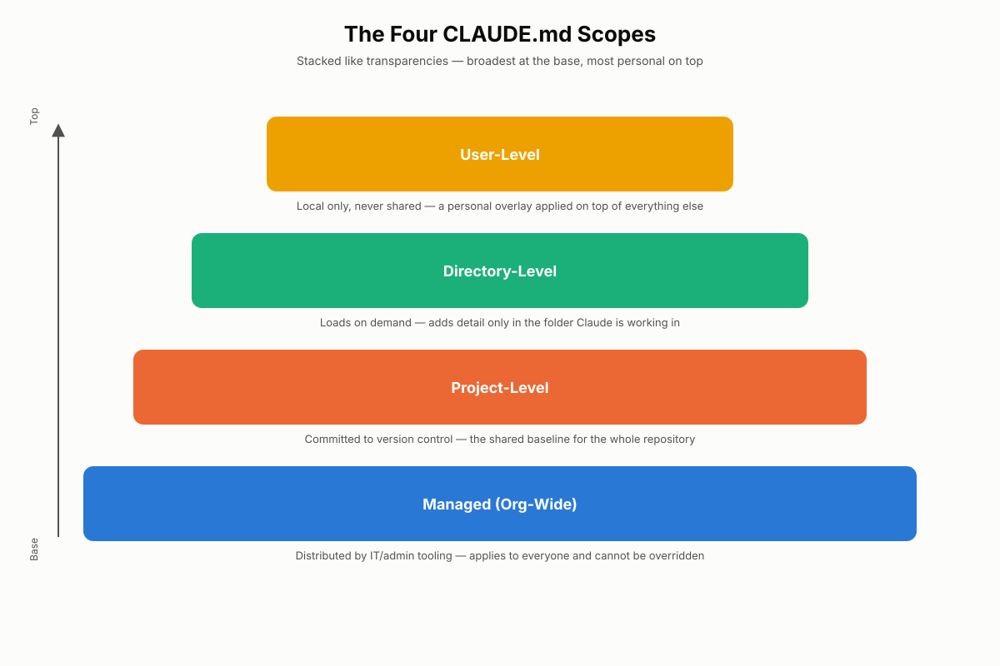
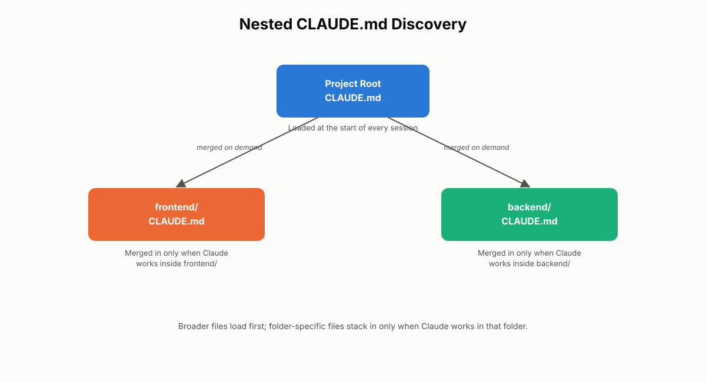
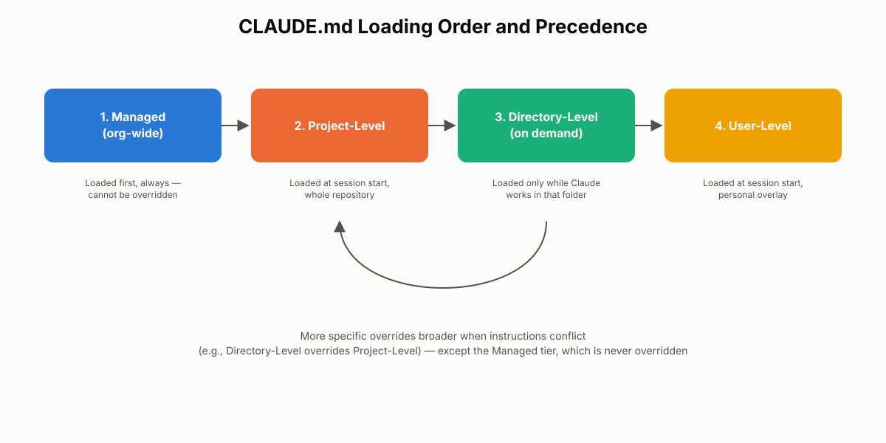

# The CLAUDE.md Hierarchy

Every Claude Code session needs project context — coding standards, build commands, architecture conventions — without an engineer retyping them every time. CLAUDE.md is the file format that supplies that context automatically, and it works at more than one scope at once. This chapter explains the full CLAUDE.md hierarchy — project-level, directory-level, user-level, and managed — how Claude Code decides which files to load and in what order, and how to diagnose the single most common configuration failure: a team convention that exists on paper but is never actually applied. Expect exam questions that present a "Claude is ignoring our standards" scenario and ask you to identify the misconfigured scope.

## Domain 3: Configuration and Workflow Organization

This chapter opens Domain 3 of the CCA-F exam blueprint. The first two domains covered how an agent thinks and acts — the agentic loop, multi-agent coordination through the hub-and-spoke model, and how tools are designed, described, and made to fail safely. Domain 3 asks a different question: once an agent works reliably in isolation, how do you keep it working reliably as the project, the team, and the codebase grow?

The answer is organization. Claude Code gives teams several distinct mechanisms for shaping agent behavior at scale:

- The **CLAUDE.md hierarchy** (this chapter) — layered, always-loaded project memory.
- **Agent skills** — on-demand capabilities activated only when relevant.
- **Context Fork** — running exploration inside an isolated subagent context.
- **Path-specific rules** — instructions scoped to file patterns rather than folders.

Each mechanism trades off differently between "always available" and "context-efficient." CLAUDE.md sits at the "always available" end of that spectrum, which is exactly why getting its scoping right matters so much — get it wrong, and either instructions never load where they're needed, or every session pays a context tax for guidance it doesn't need.

## What Is the CLAUDE.md Hierarchy?

CLAUDE.md is Claude Code's persistent memory system. Instead of one flat configuration file, Claude Code recognizes CLAUDE.md files at several scopes and loads them together, layering broad guidance underneath narrower, more specific guidance. Understanding this layering is the foundation for everything else in this chapter.

### Step-by-Step: How the Hierarchy Works

1. **A CLAUDE.md file is discovered at a given scope** — project root, a subdirectory, the user's home environment, or an organization-managed location.
2. **Claude Code reads the file as plain markdown** — no proprietary syntax, no special parser. Headings, lists, and code blocks are all it needs.
3. **The content is loaded into active context** as background guidance, not as a hard-coded rule engine. Claude treats it the way a competent new hire would treat an onboarding document — as authoritative but interpretable context.
4. **Multiple applicable files are combined**, with more specific scopes able to add to or override broader ones when instructions conflict.

The four recognized scope levels are:

| Scope | Audience | Shared via version control? | When it loads |
|---|---|---|---|
| Managed (org-wide) | Entire organization | Distributed by IT/admin tooling, not by the repo | Always, before anything else |
| Project-level | Entire repository/team | Yes | At the start of every session |
| Directory-level | One folder/subsystem | Yes | On demand, when Claude works in that folder |
| User-level | One individual developer | No — local machine only | At the start of every session, across all projects |

> 💡 **Tip:** A useful mental model is a stack of transparencies laid over one another. The managed layer sits on the bottom and can't be removed. Project-level sits above it as the shared base. Directory-level adds detail only where relevant. User-level is a personal overlay visible only to you, applied on top of everything else for your own sessions.

### Real-World Use Case

A mid-sized engineering org standardizes Claude Code across three teams working in one monorepo: a web team, a mobile team, and a platform team. Rather than every engineer re-explaining "we use Conventional Commits" and "never touch the `/legacy` folder" at the start of every session, the org captures those rules once in the appropriate CLAUDE.md scope. The web team's React conventions live in `web/CLAUDE.md`; the mobile team's Kotlin conventions live in `mobile/CLAUDE.md`; and the shared commit format and CI requirements live in the project-root `CLAUDE.md`. No engineer repeats the same instructions twice, and a new hire on the platform team automatically inherits the right subset of rules just by working in the right folder.


*Figure 9.1: The four CLAUDE.md scopes, from the non-overridable managed tier at the base to the personal user-level overlay at the top.*

---

## Project-Level CLAUDE.md

Project-level CLAUDE.md is the layer most teams reach for first, and for most repositories it does the majority of the work. It is the shared, version-controlled source of truth for how the repository operates.

### What It Is and Where It Lives

A project-level CLAUDE.md is nothing more than a markdown file. It requires no special configuration language — headings, bullet lists, tables, and fenced code blocks are all valid and all Claude Code needs to parse useful guidance from it. Claude Code recognizes it in either of two locations:

- `CLAUDE.md` at the repository root, for maximum visibility.
- `.claude/CLAUDE.md`, for teams that prefer to keep configuration-related files grouped together.

Both are treated identically as project-level instructions — the choice is purely organizational preference.

> 💡 **Tip:** Think of project-level CLAUDE.md as your repository's operating manual — the document that tells Claude how the project works, what standards matter, and how workflows are expected to behave, in the same way you'd brief a new engineer on their first day.

### How Claude Code Loads and Uses It

Claude Code reads the project-level CLAUDE.md at the start of every session and keeps it in active context for the duration of that session. This isn't limited to code generation — Claude draws on the same instructions while reading existing files, editing code, explaining repository structure, or interpreting project-specific conventions. If the file documents a folder-naming convention, Claude applies that understanding when navigating the repo, not just when writing new files.

For monorepos or nested projects, Claude Code walks the directory tree: it reads the closest CLAUDE.md first, then continues upward, so a nested sub-project can inherit guidance from its parent automatically.

### What Belongs Inside

Project-level CLAUDE.md should hold **stable, repository-wide instructions** — the kind of guidance that stays true across nearly every session, regardless of which file is being touched:

- Build and test commands (`npm run test`, `make lint`, etc.)
- Repository/folder architecture
- Coding standards and naming conventions
- Documentation expectations
- Shared workflow patterns (e.g., how API routes are structured)

```markdown
# Project: Orders Service

## Architecture
- REST API in `src/api`, business logic in `src/domain`, no framework
  imports inside `src/domain`.
- Database access only through the repository layer in `src/data`.

## Commands
- Run tests: `npm run test`
- Run lint: `npm run lint`
- Start locally: `npm run dev`

## Conventions
- Files: kebab-case. Components: PascalCase.
- Every new endpoint requires an integration test in `test/api`.
```

### What Should Never Go Inside

Project-level CLAUDE.md is for **reusable** guidance, not one-off requests. Temporary debugging notes, "just this once" instructions, or session-specific tasks belong in the conversation, not the file.

> ⚠️ **Important:** A simple rule resolves most of these judgment calls: chat instructions are for this session; CLAUDE.md is for every session. If a rule only needs to apply once, keep it in conversation. If it should apply to all future work in the repository, it belongs in CLAUDE.md.

### Best Practices and Common Mistakes

> ✅ **Best Practice:** Keep the file under roughly 200 lines. Claude Code loads it into every session's context, so a bloated file consumes budget that could otherwise go toward the actual task, and can dilute how consistently any single instruction is followed. If a rule only applies to one folder or file type, move it to a more specific scope (directory-level CLAUDE.md or path-specific rules) rather than growing the root file indefinitely.

> ✅ **Best Practice:** For a large file that's approaching that limit, Claude Code supports splitting content into separate files and pulling them in with `@path/to/file.md` import syntax inside the root CLAUDE.md. This keeps the root file scannable while still centralizing detailed guidance.

> ⚠️ **Common Mistake:** Treating CLAUDE.md as general documentation rather than actionable guidance. Instructions like "write good code" or "follow best practices" give Claude nothing concrete to act on. "Every new endpoint requires an integration test in `test/api`" is useful; "write clean, maintainable code" is not.

> ⚠️ **Common Mistake:** Letting the file accumulate duplicated or contradictory instructions as the project evolves. Because the file is treated as context rather than a strict rule engine, ambiguity or repetition inside it degrades reliability the same way a vague tool description degrades tool selection.

### Real-World Use Case

A platform team commits a project-level CLAUDE.md documenting that all new services must expose a `/healthz` endpoint and emit structured JSON logs. Every engineer who opens Claude Code in that repository — day one or year three — gets that guidance automatically, without a senior engineer having to repeat it in code review after code review. The convention scales with the team instead of depending on tribal knowledge.

---

## Directory-Level CLAUDE.md

Not every rule applies everywhere in a repository. A frontend folder and a backend folder often need different conventions entirely. Directory-level CLAUDE.md exists to scope instructions to exactly the part of the codebase they're relevant to.

### What It Is and When to Use It

A directory-level CLAUDE.md file is optional and lives alongside the code it describes — for example, `frontend/CLAUDE.md` or `backend/CLAUDE.md`. It's useful whenever a subsystem has genuinely different standards from the rest of the repository: a frontend folder with UI-specific patterns, a backend folder with API conventions, a test folder with its own fixtures and mocking rules, or a scripts folder with automation-specific guidelines.

### How Discovery and Loading Work

The key distinction from project-level files is **timing**. Project-level CLAUDE.md loads at the start of every session, whether or not that session ever touches the repository's frontend code. Directory-level CLAUDE.md loads **on demand** — only when Claude actually works inside that folder. This keeps context efficient: instructions only enter the active context when they're relevant to the work at hand.

Claude Code loads instructions cumulatively as it moves through nested folders. Working in `frontend/components/` pulls in the project-level file, then `frontend/CLAUDE.md`, then `frontend/components/CLAUDE.md` — each layer adding detail on top of the last, from broadest to narrowest.

```markdown
<!-- frontend/CLAUDE.md -->
# Frontend Conventions

- Use functional components with hooks; no class components.
- State management: Zustand only, no Redux.
- Test coverage target: 90% for this folder (overrides project default).
```

### Precedence When Instructions Conflict

When a directory-level instruction conflicts with a project-level one, **the more specific instruction wins**. If the project-level file sets an 80% test-coverage target repository-wide, but `frontend/components/CLAUDE.md` specifies 90% for components, Claude applies the 90% requirement inside that folder — because it's the closest, most targeted instruction to the work being done.

> 💡 **Tip:** This "closest wins" behavior mirrors how CSS specificity works, or how a more specific `.gitignore` in a subfolder can override a parent's rule. The pattern is the same: general guidance sets the floor, specific guidance refines it exactly where it applies.

### Avoiding Redundancy

The most common design mistake with directory-level files is duplicating project-level content instead of adding to it. If the project-level file already states "use two-space indentation," repeating that inside `frontend/CLAUDE.md` adds nothing and creates a maintenance burden — two places to update instead of one, and a real risk they drift out of sync. Directory-level files should hold only what's **unique** to that folder: framework-specific patterns, folder-specific commands, naming conventions particular to that subsystem.

Directory-level CLAUDE.md also pairs naturally with a rules directory inside `.claude/` for file-pattern-based instructions (covered in depth as path-specific rules later in this domain). The distinction to hold onto for now: directory-level CLAUDE.md scopes by **folder location**; path-specific rules scope by **file pattern**, regardless of which folder the matching file lives in.

### Best Practices and Common Mistakes

> ✅ **Best Practice:** Only create a directory-level file when a folder's standards genuinely diverge from the rest of the project. A `utils/` folder that follows the same conventions as everything else doesn't need its own CLAUDE.md — but a `mobile/` folder running a completely different architecture almost certainly does.

> ⚠️ **Common Mistake:** Creating directory-level files reflexively for every folder "just in case." This defeats the purpose — it re-fragments guidance the same flat-file sprawl the hierarchy was designed to avoid, just at a lower level.

### Real-World Use Case

A company running a monorepo with a Next.js frontend and a Python data-processing backend places `frontend/CLAUDE.md` (React patterns, component structure, Tailwind conventions) and `backend/CLAUDE.md` (Python style, Pandas conventions, data validation rules) alongside the project-root file (shared Git workflow, PR template requirements). An engineer working exclusively in `backend/` never pays the context cost of loading React-specific guidance they'll never use, while an engineer in `frontend/` gets focused, relevant instructions the moment Claude starts reading files there.


*Figure 9.2: Nested CLAUDE.md discovery: broader files load first, and folder-specific files are merged in only when Claude works inside that folder.*

---

## User-Level CLAUDE.md

Project-level and directory-level files are shared. User-level CLAUDE.md is the opposite by design: it's personal, local, and never distributed to teammates.

### What It Is For

User-level CLAUDE.md is stored locally, typically inside a user's own `.claude` directory in their home environment, and applies across every project that developer works on — not just one repository. It's designed to hold **individual workflow preferences**, not project or team standards:

- Preferred response style (e.g., concise explanations over verbose ones)
- Package-manager preference (`pnpm` instead of `npm`)
- Editor or terminal habits
- Personal productivity shortcuts

```markdown
<!-- ~/.claude/CLAUDE.md -->
# Personal Preferences

- Keep explanations concise; skip restating the question back to me.
- I use pnpm, not npm or yarn — assume pnpm for any package commands.
- Default to TypeScript examples over JavaScript when both are valid.
```

None of this is a repository standard. It's the equivalent of a personal IDE settings file — useful, but meaningless to anyone but the person who wrote it.

### The Core Mistake: Shared Conventions in a Personal File

The single most consequential mistake with user-level CLAUDE.md is placing **team-wide** rules there instead of at the project level — coding standards, naming conventions, architecture rules, testing requirements. Because user-level files live only on one machine and are never committed to version control, no other developer ever receives them. The result: one developer's Claude Code sessions follow the "team convention" flawlessly, while every other developer's sessions ignore it completely — not because Claude is unreliable, but because the instruction was never actually shared.

> ⚠️ **Important:** This is one of the most exam-relevant failure patterns in the CLAUDE.md hierarchy. Whenever a scenario describes inconsistent behavior between developers on the *same* repository, suspect scope placement before suspecting the model.

### The Governing Rule

A simple test resolves almost every placement decision:

> If an instruction only affects your personal workflow, it belongs in user-level CLAUDE.md. If it affects the project or the team, it belongs in project-level CLAUDE.md.

### Real-World Use Case

A new engineer joins a team and notices Claude Code in their sessions is verbose and slow to get to the point, while a teammate's sessions are terse and fast. Both are working in the identical repository with the identical project-level CLAUDE.md. The difference is entirely a user-level preference the teammate set months ago for their own working style — it says nothing about the shared repository conventions, and the new engineer is free to set their own version without touching anything the team depends on.

---

## The Managed (Org-Wide) Tier

Beyond project, directory, and user scopes, larger organizations often need a fourth tier: instructions that no individual project or developer should be able to override at all. This is the **managed** tier.

Managed CLAUDE.md configuration is distributed by an organization's Claude Code administrators — typically through enterprise deployment tooling — rather than through a repository's version control or a developer's personal machine. It sits above every other scope in precedence and is reserved for non-negotiable policy: security constraints, compliance requirements, or restrictions on tool and MCP (Model Context Protocol) server usage that must hold true regardless of which project, team, or individual is running a session.

> 🚀 **Pro Tip:** Reach for the managed tier sparingly. Its value comes from being the layer nobody can quietly override — treat it as a policy mechanism for genuinely organization-wide, non-negotiable constraints, not as a shortcut for propagating ordinary coding standards (that's what project-level CLAUDE.md, committed to each repository, is for).

---

## Loading Order and Precedence

With four possible scopes in play, the exam-relevant question is: in what order does Claude Code load them, and which one wins when instructions conflict?

### The Loading Sequence

1. **Managed (org-wide)** — loaded first, always, regardless of project or user.
2. **Project-level** — loaded at the start of every session, for the entire repository. If nested projects exist, the closest project-level file loads first, and Claude Code walks upward through parent directories, so a subproject inherits its parent's guidance.
3. **Directory-level** — loaded on demand, only as Claude works within a given folder. Nested directory files stack from broadest to narrowest (project → `frontend/` → `frontend/components/`).
4. **User-level** — loaded at the start of every session, applied on top of everything else, specific to that individual developer's machine.

### Precedence When Instructions Conflict

The general resolution rule is **most specific wins**, with one hard exception:

- The **managed** tier is not meant to be overridden by anything below it — that's the entire point of putting a rule there.
- Below the managed tier, a **directory-level** instruction overrides a conflicting **project-level** instruction for work done inside that directory (the 90%-vs-80% coverage example from earlier).
- **User-level** preferences apply to how *that developer's* sessions behave, but they don't override shared project or directory conventions — a personal preference for terse responses doesn't erase a project-level requirement to write integration tests.

> ✅ **Best Practice:** When you can't predict which of two instructions should win, ask which one is scoped more narrowly to the actual work being done. Narrower almost always means "more relevant right now."


*Figure 9.3: The full loading and precedence sequence, from the non-overridable managed tier down to the personal user-level layer.*

---

## Diagnosing Ignored Team Conventions

Documented conventions that Claude Code doesn't seem to follow are one of the most common support issues teams run into — and one of the most testable scenarios on the exam. In nearly every case, the root cause is not model reliability. It's configuration scope.

### The Four-Question Diagnostic Workflow

When a team convention appears to be ignored, work through these questions in order:

1. **Are the conventions actually shared, or do they exist only on one developer's machine?** If one developer's Claude Code follows the rules perfectly while another's doesn't, on the same repository, that's a strong signal the rules live in a user-level file rather than a shared one.
2. **Does the repository contain a project-level CLAUDE.md that is actually committed and available after a fresh clone?** Sometimes the file exists and looks correct, but was never added to version control — so nobody who clones the repo receives it.
3. **Is there a scope mismatch?** Check whether personal preferences and shared standards have been placed in the wrong file — team-wide rules stored at user-level, or narrow personal habits bloating the project-level file.
4. **Does onboarding actually produce consistent behavior?** Ask directly: if a new developer clones the repository today, will their Claude Code sessions automatically follow the team's conventions? If the answer is no, the shared configuration pipeline is incomplete somewhere in steps 1-3.

> ⚠️ **Important:** Notice that this workflow never asks "is the model behaving unpredictably?" That question is almost always a distraction. Configuration scope, not model reliability, explains the overwhelming majority of "Claude ignored our standards" reports.

### Real-World Use Case

A team's tech lead swears the repository has "always had" a documented commit-message format and a required PR checklist. A new hire's Claude Code sessions never apply either. Walking the diagnostic: (1) the tech lead's own sessions follow the conventions flawlessly, but a teammate's don't — scope is inconsistent across developers; (2) `git log` on the repository shows no CLAUDE.md was ever committed; (3) the tech lead confirms the rules live in their personal `~/.claude/CLAUDE.md`, written a year ago and never revisited; (4) onboarding is, unsurprisingly, inconsistent. The fix is not a prompting problem — it's moving the content into a project-root CLAUDE.md and committing it, so every future clone of the repository receives the same instructions automatically.

---

## Chapter Summary

Claude Code organizes persistent instructions into a layered hierarchy rather than one flat file. The managed tier, controlled by organization administrators, sits above everything else and enforces non-negotiable policy. Project-level CLAUDE.md, committed to source control, carries shared repository-wide standards and loads at the start of every session. Directory-level CLAUDE.md scopes instructions to specific folders and loads on demand, layering more specific guidance on top of the project-level baseline — with the more specific instruction winning when the two conflict. User-level CLAUDE.md is personal, local, and never shared, reserved for individual workflow preferences rather than team standards. When team conventions appear to be ignored, the cause is almost always a scoping problem — a shared rule stored in a personal file, or a project-level file that was never committed — diagnosable with a short, repeatable four-question workflow rather than by second-guessing the model.

## Key Takeaways

- CLAUDE.md is Claude Code's persistent memory system, organized into managed, project-level, directory-level, and user-level scopes.
- Project-level CLAUDE.md (root or `.claude/CLAUDE.md`) holds stable, repository-wide guidance, loads every session, and should stay under roughly 200 lines.
- Directory-level CLAUDE.md scopes instructions to a specific folder, loads on demand, and should avoid repeating anything already covered at the project level.
- When directory-level and project-level instructions conflict, the more specific (directory-level) instruction wins; the managed tier is the one exception that overrides everything below it.
- User-level CLAUDE.md is personal and local — it should never be the only place a team-wide convention lives.
- Ignored team conventions are almost always a configuration-scope problem, diagnosable by checking whether rules are shared, committed, correctly scoped, and consistently applied during onboarding.
- Chat instructions are for one session; CLAUDE.md instructions are for every session — use that distinction to decide what belongs in the file at all.

## Interview Questions

1. Explain the four CLAUDE.md scope levels and describe a situation where each one would be the correct place to store an instruction.
2. A teammate says, "Claude Code just doesn't follow our conventions reliably." How would you investigate this claim before assuming it's a model limitation?
3. Walk through what happens, step by step, when Claude Code starts a session in a monorepo with a project-root CLAUDE.md and a nested `frontend/components/CLAUDE.md`.
4. Why does Claude Code recommend keeping project-level CLAUDE.md under roughly 200 lines, and what should a team do once a project genuinely needs more guidance than that?
5. What is the practical difference between "context" and a "strict rule" when describing how Claude treats CLAUDE.md content, and why does that distinction matter for how you write instructions inside it?
6. Describe a real scenario where placing a shared convention in user-level CLAUDE.md would cause inconsistent team behavior, and explain the fix.
7. When would you create a directory-level CLAUDE.md file, and when would you deliberately choose not to, even though a folder has some minor differences from the rest of the project?
8. How does the managed (org-wide) tier differ in purpose from project-level CLAUDE.md, and why would an organization need both?

## Practice Questions & Answers

**Practice Question (unofficial):** A repository has a project-level CLAUDE.md that says "use 80% minimum test coverage across the project." The `frontend/components/` folder has its own CLAUDE.md that says "use 90% minimum test coverage for components." A developer asks Claude Code to add a new component with only 82% coverage. What should happen, and why?

**Answer:** Claude Code should apply the 90% requirement, because directory-level instructions override conflicting project-level instructions for work done inside that directory — the more specific scope wins. Claude should flag that 82% falls short of the 90% requirement that applies specifically to `frontend/components/`, not treat the project-wide 80% floor as sufficient just because it's also technically satisfied.

**Practice Question (unofficial):** Two developers work in the same cloned repository. Developer A's Claude Code sessions always follow the team's commit-message format. Developer B's sessions never do. Both have access to the same project-level CLAUDE.md. What's the most likely explanation, and how would you confirm it?

**Answer:** The most likely explanation is that the commit-message convention isn't actually stored in the shared project-level file at all — it's stored in Developer A's personal user-level CLAUDE.md, which only affects their own sessions. To confirm it, inspect the committed project-level CLAUDE.md directly (e.g., via `git show HEAD:CLAUDE.md`) and check whether the commit-format rule is present. If it's absent from the committed file, the fix is to move it into the project-level file and commit it so every developer's sessions inherit it.

**Practice Question (unofficial):** A team wants Claude Code to always use `pnpm` instead of `npm` when generating commands, but only for one developer who personally prefers it — the rest of the team uses `npm`. Where should this instruction be stored?

**Answer:** In that one developer's user-level CLAUDE.md. It's a personal tooling preference, not a repository-wide standard, so it should not go in the project-level file — doing so would silently change command generation for every other developer who doesn't use `pnpm`.

**Practice Question (unofficial):** A project-level CLAUDE.md has grown to 350 lines, covering frontend patterns, backend patterns, deployment steps, and testing conventions all in one file. What's the recommended fix, and why?

**Answer:** Split the content by scope rather than trimming it arbitrarily. Frontend- and backend-specific patterns should move into `frontend/CLAUDE.md` and `backend/CLAUDE.md` respectively, loaded only on demand when Claude works in those folders. Genuinely shared, repository-wide content (deployment steps that apply everywhere, for instance) can stay at the project level, ideally trimmed back toward the roughly 200-line guideline — potentially using `@path/to/file.md` imports to keep the root file scannable while still centralizing detail. This keeps every session's context focused on what's actually relevant to it.

## Multiple Choice Questions

**Q1.** Which of the following best describes the purpose of the CLAUDE.md hierarchy?

A. To replace the need for code comments across a repository
B. To organize persistent instructions into multiple scopes so behavior stays consistent without flattening everything into one file
C. To enforce hard, unbreakable rules that Claude cannot deviate from under any circumstance
D. To store a complete log of every past Claude Code session

**Correct Answer: B**

*Explanation:* The hierarchy exists precisely to avoid one unmanageable flat configuration file, letting instructions live at the scope where they're actually relevant. A is wrong — CLAUDE.md is unrelated to inline code comments. C is wrong — CLAUDE.md content is treated as context Claude interprets, not a rigid enforcement layer (that role belongs to programmatic gates and hooks). D is wrong — CLAUDE.md is forward-looking project guidance, not a session log.

**Q2.** Where can a project-level CLAUDE.md file be placed?

A. Only at the repository root
B. Only inside a `.claude` folder
C. Either at the repository root or inside a `.claude` folder
D. Only inside the user's home directory

**Correct Answer: C**

*Explanation:* Claude Code recognizes project-level instructions in either location and treats them identically; teams choose based on organizational preference. A and B are each only half correct — both locations are valid, not just one. D is wrong because the home directory is where user-level CLAUDE.md lives, not project-level.

**Q3.** When does Claude Code load a project-level CLAUDE.md file?

A. Only when explicitly requested by the developer during a session
B. At the start of every session, automatically
C. Only when Claude generates new code, never when reading existing files
D. Only the first time a repository is cloned

**Correct Answer: B**

*Explanation:* Project-level CLAUDE.md loads automatically at session start and remains active throughout, informing reading, editing, and explaining work, not just code generation. A is wrong — no manual request is needed. C is wrong — the guidance applies across all repository work, not just new code. D is wrong — it loads every session, not just once per clone.

**Q4.** A frontend folder needs a 90% test-coverage standard while the rest of the repository uses 80%. What is the best way to implement this?

A. Change the project-level CLAUDE.md to require 90% everywhere
B. Add a directory-level CLAUDE.md inside the frontend folder specifying 90% coverage
C. Ask Claude verbally in every session to remember the frontend exception
D. Store the frontend exception in the developer's user-level CLAUDE.md

**Correct Answer: B**

*Explanation:* A directory-level file scopes the stricter requirement to exactly the folder it applies to, without forcing an unrelated repository-wide change. A is wrong — it incorrectly raises the bar for code that doesn't need it. C is wrong — it's not persistent and must be repeated every session. D is wrong — a user-level file is personal and wouldn't apply to any other developer working in that folder.

**Q5.** Which statement about directory-level CLAUDE.md files is accurate?

A. They replace the need for a project-level CLAUDE.md entirely
B. They load at the start of every session regardless of which folder is being worked in
C. They load on demand, only when Claude works inside the relevant folder
D. They must duplicate all applicable project-level instructions for clarity

**Correct Answer: C**

*Explanation:* Directory-level files load on demand, keeping context efficient by only appearing when relevant to the current work. A is wrong — they work alongside project-level files, not instead of them. B is wrong — that describes project-level loading behavior, not directory-level. D is wrong — best practice is the opposite: avoid duplicating project-level content to prevent drift and maintenance overhead.

**Q6.** What is the primary purpose of user-level CLAUDE.md?

A. Storing team-wide coding standards so every developer inherits them
B. Storing an individual developer's personal preferences and workflow habits
C. Storing organization-wide compliance policy that cannot be overridden
D. Storing temporary, one-off debugging instructions for a single task

**Correct Answer: B**

*Explanation:* User-level CLAUDE.md is local to one developer's machine and intended for personal preferences like response style or tooling choices. A is wrong — that's exactly the mistake this file type invites; shared standards need project-level scope. C is wrong — that describes the managed tier, not user-level. D is wrong — one-off instructions belong in the conversation itself, not any persistent CLAUDE.md file.

**Q7.** A new developer clones a repository and immediately gets Claude Code sessions that follow all of the team's documented conventions without any extra setup. What does this indicate?

A. The conventions are stored correctly in a committed project-level CLAUDE.md
B. The conventions are stored in another developer's user-level CLAUDE.md
C. Claude Code has memorized the team's preferences from prior sessions
D. The managed tier has silently overridden the project configuration

**Correct Answer: A**

*Explanation:* Automatic, consistent onboarding behavior is the expected result of conventions being correctly committed at the project level, where every clone inherits them. B is wrong — user-level files are local and would never transfer to a new developer's machine. C is wrong — Claude Code does not retain memory across unrelated developers' sessions this way. D is wrong — nothing in the scenario indicates a managed override, and correct onboarding is the normal, expected outcome of proper project-level configuration.

**Q8.** Two developers on the same repository get inconsistent Claude Code behavior around a documented naming convention. What should be checked first?

A. Whether the model version differs between the two developers
B. Whether the convention is stored in a shared, committed project-level file versus a personal user-level file
C. Whether one developer has a faster internet connection
D. Whether the convention was ever discussed in a team meeting

**Correct Answer: B**

*Explanation:* Inconsistent behavior between developers on the same repository is the signature symptom of a scope mismatch — most often a rule that exists only in one developer's personal configuration. A, C, and D are all unrelated to how CLAUDE.md scoping determines which instructions a given developer's session actually receives.

**Q9.** Why does Claude Code recommend keeping a project-level CLAUDE.md under roughly 200 lines?

A. Markdown files longer than 200 lines cannot be parsed correctly
B. Longer files consume more session context and may reduce how consistently instructions are followed
C. Git has a hard limit on file size that 200 lines approximates
D. Claude Code truncates any file longer than 200 lines automatically

**Correct Answer: B**

*Explanation:* Because the file loads into every session's active context, excessive length competes with the actual task for context budget and can dilute instruction-following reliability. A is wrong — markdown has no such parsing limitation. C is wrong — this isn't a Git constraint. D is wrong — Claude Code doesn't silently truncate the file; the recommendation is about instruction clarity and context efficiency, not a hard technical cutoff.

**Q10.** Which of the following is the best candidate for a project-level CLAUDE.md entry?

A. "Fix the null pointer bug in checkout.js for this session only"
B. "All new API endpoints require an integration test in `test/api`"
C. "Write clean, maintainable, high-quality code"
D. "Remember that I prefer dark-mode terminal screenshots"

**Correct Answer: B**

*Explanation:* It's a specific, stable, repository-wide rule Claude can act on consistently across sessions. A is wrong — it's a one-off task that belongs in conversation, not persistent guidance. C is wrong — it's too vague to be actionable, the classic "documentation, not guidance" mistake. D is wrong — it's a personal preference that belongs in user-level CLAUDE.md, not a project-wide file.

**Q11.** What happens when project-level and directory-level CLAUDE.md instructions genuinely conflict?

A. Claude Code refuses to proceed until the conflict is manually resolved by a developer
B. The project-level instruction always wins because it was loaded first
C. The directory-level instruction wins because it is more specific to the current work
D. Both instructions are ignored and Claude falls back to default behavior

**Correct Answer: C**

*Explanation:* More specific, narrowly scoped instructions override broader ones when they conflict — this is the core precedence rule of the hierarchy. A is wrong — Claude Code doesn't halt work over this; it resolves the conflict by specificity. B is wrong — loading order alone doesn't determine precedence; specificity does. D is wrong — neither instruction is discarded; the more specific one is applied.

**Q12.** Which tier of the CLAUDE.md hierarchy is controlled by an organization's administrators rather than by a repository's contributors or an individual developer?

A. Directory-level
B. User-level
C. Project-level
D. Managed (org-wide)

**Correct Answer: D**

*Explanation:* The managed tier is distributed through enterprise administration rather than through repository commits or personal machine configuration, and it takes precedence over every other scope. A is wrong — directory-level files are authored by repository contributors. B is wrong — user-level files are controlled by the individual developer. C is wrong — project-level files are controlled collaboratively by repository contributors, not centralized IT administration.

**Q13.** A `utils/` folder follows the exact same conventions as the rest of the repository. Should it have its own directory-level CLAUDE.md?

A. Yes, every folder should have one for completeness
B. No, a directory-level file should only be created when a folder's standards genuinely diverge from the rest of the project
C. Yes, but only if the folder contains more than ten files
D. No, directory-level CLAUDE.md files are deprecated in favor of user-level files

**Correct Answer: B**

*Explanation:* Directory-level files exist to scope genuinely different guidance; creating one for a folder that follows identical conventions adds fragmentation with no benefit. A is wrong — reflexive creation defeats the purpose of the hierarchy. C is wrong — file count isn't the deciding factor; divergent standards are. D is wrong — directory-level files are a standard, current part of the hierarchy, not deprecated.

**Q14.** What is the correct way to think about the relationship between chat instructions and CLAUDE.md content?

A. Chat instructions and CLAUDE.md serve identical purposes and can be used interchangeably
B. Chat instructions are for this session only; CLAUDE.md instructions are meant to apply across every session
C. CLAUDE.md instructions should never contradict anything said in chat
D. Chat instructions always take permanent precedence over CLAUDE.md

**Correct Answer: B**

*Explanation:* This distinction is the practical test for deciding what belongs in CLAUDE.md at all — one-time needs stay in conversation, recurring needs move into the file. A is wrong — their scopes and lifespans are different by design. C is wrong — nothing prevents a specific chat instruction from temporarily overriding general guidance for the current task. D is wrong — precedence isn't about chat "always" winning; it's about matching instruction lifespan to storage location.

**Q15.** A developer notices their Claude Code sessions are unusually terse compared to a teammate's, even though both work in the same repository with the same project-level CLAUDE.md. What most likely explains this?

A. The teammate's user-level CLAUDE.md sets a personal preference for concise responses
B. The repository's project-level CLAUDE.md was edited without being committed
C. The managed tier enforces terse responses for senior developers only
D. Directory-level CLAUDE.md files always produce shorter responses

**Correct Answer: A**

*Explanation:* Response-style preferences are exactly the kind of personal habit that belongs in — and commonly is stored in — user-level CLAUDE.md, explaining why it varies between developers on an identical shared repository. B is wrong — an uncommitted edit to the shared file wouldn't explain a difference tied to one specific developer's habits. C is wrong — the managed tier doesn't target individuals by seniority. D is wrong — directory-level files affect scope of guidance, not response verbosity by design.

## Evaluate Yourself

1. **Scenario:** You inherit a repository where the project-level CLAUDE.md is 480 lines long and covers frontend components, backend services, deployment scripts, and personal editor shortcuts for the original author, all mixed together. Design a plan to reorganize this into a proper hierarchy. Which content moves where, and why?
2. **Architecture design:** You're setting up Claude Code configuration for a new monorepo with three subsystems (web, mobile, infrastructure-as-code) shared by four teams, plus an organization-wide security policy that must never be locally overridden. Sketch the CLAUDE.md files you would create, their locations, and roughly what each would contain.
3. **Short-answer reflection:** Explain, in your own words, why "chat instructions are for this session, CLAUDE.md is for every session" is a more reliable filter for what belongs in CLAUDE.md than trying to judge instructions by their apparent importance.
4. **Scenario:** A team lead insists their documented Git workflow "has always been there," but two out of five developers on the team never see Claude Code follow it. Walk through the four-question diagnostic workflow against this scenario and state your conclusion at each step.
5. **Architecture design:** A `payments/` folder in a repository handles regulated financial logic and needs stricter rules than the rest of the codebase (mandatory code review checklist, no direct database writes, specific audit-logging requirements). Would you implement this with a directory-level CLAUDE.md, a project-level addition, or something else? Justify your choice.
6. **Short-answer reflection:** Describe a past or hypothetical situation where you (or a team you know of) mistakenly treated a shared standard as a personal preference, or vice versa. What would the CLAUDE.md hierarchy have changed about that outcome?
