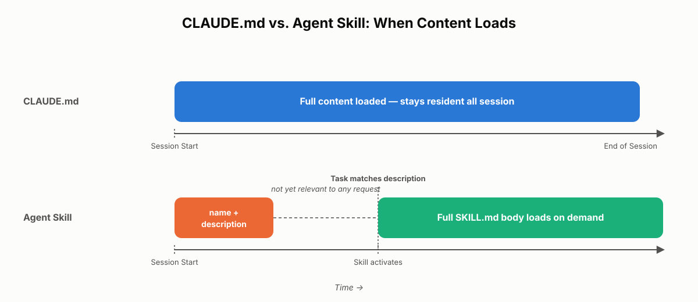
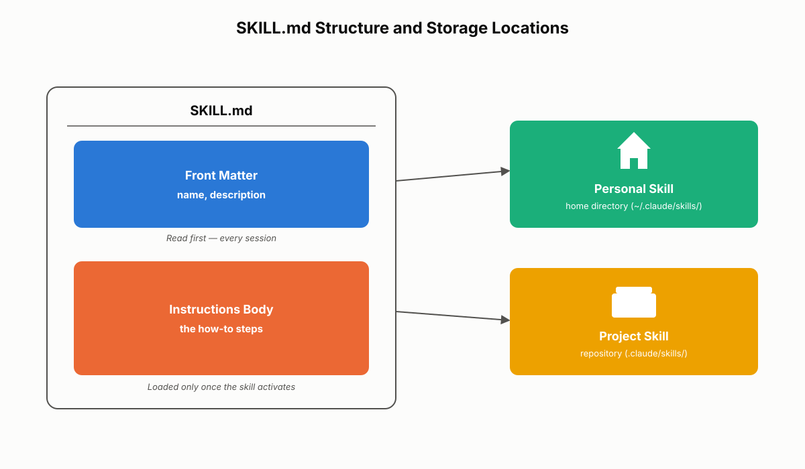
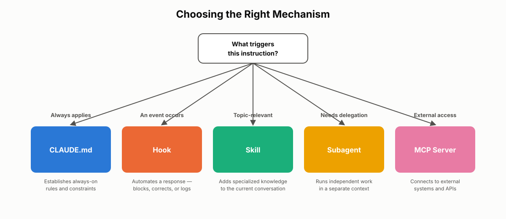
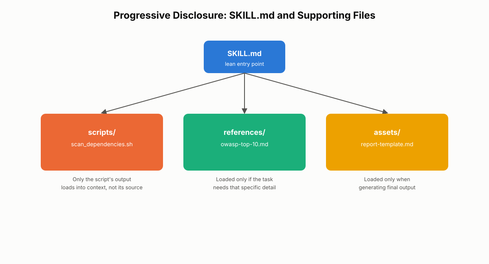

# Agent Skills

Every Claude Code project eventually accumulates two kinds of guidance: rules that should apply to *everything* Claude does, and specialized know-how that only matters for *certain* tasks. Chapter 9 covered the first kind through the CLAUDE.md hierarchy. This chapter covers the second kind — agent skills — and, just as importantly, how Claude Code decides which of the two systems to load and when. For the CCA-F exam, you need to be able to place a given instruction in the correct system, explain the loading-behavior difference between CLAUDE.md and skills, describe the SKILL.md structure, and choose correctly between a skill, a hook, a subagent, and an MCP (Model Context Protocol) server for a given problem.

## CLAUDE.md vs. Agent Skills: How Loading Differs

The single most important distinction in this chapter is *when* instructions enter Claude's context. CLAUDE.md and agent skills both shape Claude's behavior, but they get there through opposite mechanisms — one is always-on, the other is on-demand.

### The Two Loading Models

CLAUDE.md files are part of Claude Code's persistent memory system. They load automatically at the moment a session starts, before any work begins, and they stay resident for the entire session regardless of what the user asks for. Recall from Chapter 9 that CLAUDE.md has multiple scope levels — managed (org-wide), user-level, project-level, and directory-level — and that each of these (aside from directory-level files nested in subfolders) is loaded up front. Whether the current task is writing a new feature, fixing a typo, or answering a question about the codebase, all of that guidance is already "in the room."

An agent skill behaves differently. At session start, Claude Code does not load a skill's full contents. Instead, it loads a lightweight index: just the `name` and `description` of every available skill. Claude then compares the current request against that index of descriptions, using semantic matching rather than exact keyword matching. Only when Claude determines a skill is relevant does the full SKILL.md content — instructions, and any tool restrictions — get pulled into the active context. If a session never touches the kind of task a skill covers, that skill's instructions never load at all.

The table below summarizes the contrast:

| Dimension | CLAUDE.md | Agent skill |
|---|---|---|
| When it loads | Session start, automatically | On-demand, only when relevant |
| What loads first | The entire file content | Just the `name` and `description` |
| Scope model | Scoped by location (managed, user, project, directory) | Scoped by relevance (and optionally by file pattern) |
| Context cost | Paid immediately, every session | Paid only when the skill actually activates |
| Best suited for | Rules that always apply | Expertise needed only sometimes |


*Figure 10.1: CLAUDE.md loads in full the moment a session begins, while a skill loads only its name and description up front and defers its full body until Claude judges it relevant to the task at hand.*

### Why the Split Design Matters

This isn't an arbitrary implementation detail — it answers two different questions. CLAUDE.md answers "what should Claude always know about this project?" Agent skills answer "what specialized capability should Claude reach for when this particular kind of task shows up?" Loading everything all the time would waste context on instructions most turns never need; loading nothing until it's manually invoked would put the burden of remembering every specialized procedure back on the user. The split gives you both: a small, always-present baseline, and a larger library of expertise that only costs tokens when it earns its keep.

Consider a mid-sized engineering team running Claude Code across a monorepo. Their CLAUDE.md holds perhaps 40 lines: coding conventions, test requirements, and repository layout. Alongside it they maintain a dozen skills — security auditing, database query optimization, changelog generation, API contract review, and so on. On an average day, an engineer might touch two or three of those skills at most. If all twelve were folded into CLAUDE.md instead, every session would carry the weight of instructions for tasks that never come up that day.

> ⚠️ **Important:** Loading order is not a proxy for importance. A CLAUDE.md rule and a skill's instructions are equally authoritative once loaded — the difference is only *when* Claude sees them, not how strictly they should be followed.

## Where Universal Standards Belong: CLAUDE.md

Once you understand the loading split, the next skill is deciding where a given instruction actually belongs. Universal standards belong in CLAUDE.md.

### Recognizing a Universal Standard

A universal standard is a rule that should hold no matter what Claude is doing in the repository: writing a new feature, fixing a bug, refactoring, or reviewing a pull request. Think of it as the constitution of the project — it doesn't change based on the task in front of it. Common examples:

- Coding style and naming conventions
- Testing requirements (for example, minimum coverage thresholds)
- Git workflow expectations (commit message format, branch naming)
- Architecture patterns the codebase must follow
- Documentation standards
- Security baselines that apply to all code, not just security-sensitive code

A project-level CLAUDE.md encoding these might look like:

```markdown
# Project Standards

## Code Style
- All exported functions require JSDoc comments.
- TypeScript strict mode is mandatory; no `any` without justification.

## Testing
- Every new feature ships with unit tests at ≥80% line coverage.
- Integration tests are required for any change touching the payments module.

## Git Workflow
- Commit messages follow Conventional Commits (feat:, fix:, chore:, ...).
- No direct commits to `main`; all changes go through a pull request.

## Architecture
- Business logic lives in `/services`, never in route handlers.
```

Because this file loads automatically at session start, Claude applies these rules to *every* piece of work in the session without needing a reminder or a matching trigger phrase.

### The Cost of Skipping Persistent Loading

Imagine the JSDoc requirement above lived in a skill instead of CLAUDE.md. Claude would only apply it if the request happened to match that skill's description — but "fix this bug" or "refactor this helper" rarely mention documentation at all, so the skill would frequently fail to activate and the standard would get silently skipped. Worse, if the same standard is duplicated across several skills to increase the odds of a match, you now have multiple sources of truth to keep in sync, and they will eventually drift.

Keeping universal standards centralized in CLAUDE.md gives you:

- **Consistency** — the same rule applies whether Claude is coding, testing, or reviewing.
- **A single source of truth** — one place to update when a standard changes.
- **Faster onboarding** — new team members (and new Claude Code sessions) know exactly where to look for project expectations.
- **Lower cognitive overhead** — Claude has one reference point instead of reconciling instructions from several files.

> ✅ **Best Practice:** Write CLAUDE.md so it reads like a short constitution — organized by category (style, testing, git, architecture), reviewed periodically, and kept current as standards evolve. A stale CLAUDE.md is worse than none, because it actively misleads.

A common mistake is treating CLAUDE.md as a dumping ground for everything the team has ever told Claude, including one-off procedures that only apply to a single kind of task. That bloats the file every session pays for, and it's exactly the problem agent skills exist to solve.

## Where Task-Specific Workflows Belong: Agent Skills

Not every instruction is a universal standard. Some procedures are specialized — they matter a great deal when the matching task shows up, and not at all otherwise. These belong in agent skills.

### Recognizing a Task-Specific Workflow

A task-specific workflow is a focused procedure for a particular kind of operation, not a rule that should shape every interaction. Typical examples:

- Security auditing (checking authentication and authorization code for vulnerabilities)
- Code review procedures (what to check, in what order, how to format findings)
- Database query optimization
- Performance analysis
- Documentation generation
- Pull request description writing

None of these apply when Claude is, say, renaming a variable or fixing a typo. They only matter when the current task calls for that specific expertise — which is exactly why folding them into CLAUDE.md would be wasteful. If a security-audit procedure lived in CLAUDE.md, Claude would carry those instructions in every session, including sessions that never touch authentication code at all.

### Keeping Context Lean with On-Demand Activation

Agent skills solve this by activating only when relevant. At session start, Claude reads each skill's `name` and `description` — a lightweight index — but not its full instructions. When a request comes in that plausibly matches a skill's description, Claude loads that skill's full content into the active context for the remainder of the task. If no request ever matches, the skill's instructions never take up a single token.

Picture a team with three skills defined in their repository: a security-audit skill, a code-review skill, and a database-optimization skill, alongside a CLAUDE.md holding their universal standards. Over the course of a week:

- An engineer asks Claude to "review this login handler for auth bypass issues" → the security-audit skill activates.
- Another asks Claude to "look over this PR before I merge it" → the code-review skill activates.
- A third asks Claude to "why is this query so slow?" → the database-optimization skill activates.
- A fourth simply asks Claude to add a new field to a form → none of the three skills activate; only the CLAUDE.md standards apply.

Each session gets exactly the instructions it needs, and no more.

> 💡 **Tip:** A simple heuristic for spotting a skill candidate: if you find yourself giving Claude the same explanation for the third time, stop and write it down as a skill instead. Repeated explanation is the signal that a procedure has stabilized enough to be captured once and reused automatically.

## Anatomy of a Skill: The SKILL.md Structure

An agent skill is a folder of instructions that Claude Code can discover and load on demand. At minimum, that folder contains a single file: `SKILL.md`.

### Required Front Matter: name and description

Every SKILL.md begins with YAML front matter containing, at minimum, a `name` and a `description`. Below the front matter sits the body — the actual instructions for how to perform the task. Here is a minimal example:

```yaml
---
name: pr-description
description: >
  Use this skill when writing or summarizing a pull request description,
  including requests like "write a PR description," "summarize my branch
  changes for review," or "draft release notes for this diff."
---

# Pull Request Description Generator

## Process
1. Run `git diff` against the target branch to identify all changed files.
2. Group changes by feature or concern, not by file.
3. Write a summary paragraph explaining *why* the change was made, not just what changed.
4. List the main updates as bullet points.
5. Flag any breaking changes in a dedicated "Breaking Changes" section.

## Output format
Use this exact structure:

### Summary
### What Changed
### Breaking Changes (omit if none)
```

The `name` identifies the skill. The `description` is what actually matters for activation — it's the only part of the skill Claude sees before deciding whether to load the rest, so it needs to describe both *what* the skill does and *when* it should be used, ideally using the same phrasing a user would naturally type.

### Personal Skills vs. Project Skills

Skills can live in two places:

- **Personal skills** live in the user's home directory and follow that individual across every project they work on, regardless of which repository they're in.
- **Project skills** live inside a repository (typically under a `.claude/skills/` directory) and are shared with anyone who clones that repository — the same way a project-level CLAUDE.md is shared.

This mirrors the scope distinction from CLAUDE.md: a personal skill is analogous to a user-level CLAUDE.md (yours, everywhere), and a project skill is analogous to a project-level CLAUDE.md (the team's, for this repository).

A real-world case: a staff engineer who personally reviews security-sensitive diffs across five different repositories might keep a security-audit skill as a *personal* skill, so it travels with them regardless of which project they open. Meanwhile, that same team's PR-description skill — which encodes a house style specific to one product — belongs as a *project* skill checked into that repository, so every contributor gets the same behavior.


*Figure 10.2: A skill's front matter (name and description) is what Claude reads first; the instructions below it only load once the skill is judged relevant. Skills are stored either as personal skills in a user's home directory or as project skills checked into a repository.*

> ⚠️ **Important:** A vague description is the most common reason a skill "doesn't seem to work." If a skill never activates when you expect it to, the description almost certainly doesn't use the language the requester actually types — not a bug in the matching mechanism itself.

## How Skills Activate: Matching, Loading, and Priority

Understanding the mechanics of activation — not just the concept — is essential for debugging a skill that fires too often, too rarely, or not at all.

### Semantic Matching Against the Description

When a request comes in, Claude compares it against the description of every available skill using semantic matching, not literal string matching. A request phrased as "summarize my branch changes for a PR" can match a skill described as handling "pull request descriptions" even though the wording differs, because the underlying intent lines up. This is what makes skills feel automatic — the user never has to remember or type an exact command name; Claude recognizes the situation from ordinary conversation.

Skills can be scoped further using a `paths` field in the front matter, restricting activation to file patterns:

```yaml
---
name: api-contract-review
description: >
  Use this skill when reviewing changes to public API contracts for
  backward compatibility, versioning, and breaking-change risk.
paths:
  - "src/api/**/*.ts"
  - "openapi/**/*.yaml"
---
```

With `paths` set, the skill activates only when both conditions hold: the task is semantically relevant *and* the files involved match the declared patterns. This is the same file-pattern-scoping idea behind path-specific rules — a topic covered in depth alongside directory-level CLAUDE.md in the next chapter — applied here at the skill level instead.

### Skill Priority When Names Collide

Skills can come from more than one source at once: managed (org-wide) distribution, a user's personal skills, a project's checked-in skills, and skills bundled with plugins. If two skills share the same name, Claude Code resolves the conflict using a fixed priority order, from highest to lowest:

1. Managed (org-wide) skills
2. Personal skills
3. Project skills
4. Plugin skills

This ordering keeps behavior predictable in larger organizations: a managed skill distributed by a platform team always wins over a same-named personal or project skill, so a company-wide security-audit procedure can't be silently shadowed by an individual's local variant of the same name.

### Skills Don't Reload Every Turn

Once a skill activates and its full content loads into context, Claude Code does not re-read the SKILL.md file on every subsequent turn of that task. The content becomes part of the active working context and stays there for the duration of the task, which keeps the interaction efficient — Claude isn't paying the cost of re-parsing the same instructions repeatedly.

> 🚀 **Pro Tip:** When debugging why a skill seems to "forget" its own instructions partway through a long task, check whether the task has run long enough for earlier context to fall out of the active window — a context-management problem — rather than assuming the skill itself failed to load.

## Picking the Right Tool: Skills vs. Hooks vs. Subagents vs. MCP

Claude Code offers five distinct customization mechanisms — CLAUDE.md, agent skills, hooks, subagents, and MCP servers — and choosing the wrong one is the most common architectural mistake teams make when a project scales past its first few weeks. They are complementary, not competing, but each has a distinct trigger and a distinct effect.

### A Five-Way Decision Framework

| Mechanism | Trigger | Effect |
|---|---|---|
| CLAUDE.md | Always (session start) | Establishes always-on rules and constraints |
| Agent skill | A matching request | Adds specialized knowledge to the current conversation |
| PreToolUse hook / PostToolUse hook | An event (a tool is about to run, or just ran) | Automates an action — blocks, corrects, logs, or enriches |
| Subagent | An explicit delegation via the agent tool | Runs an independent worker in a separate context and returns a result |
| MCP server | A need for external access | Connects Claude to systems outside its own reasoning — APIs, databases, messaging platforms |

The cleanest way to internalize this is a short checklist:

- If it should **always apply**, use CLAUDE.md.
- If it's **triggered by an event** (a file save, a tool call), use a hook.
- If it's **knowledge that applies based on the topic** of the request, use a skill.
- If you need to **delegate work** to run independently, use a subagent.
- If you need **access to an external system**, use MCP.

Two distinctions trip people up most often. First, skills vs. subagents: a skill adds knowledge directly into the *current* conversation — it becomes part of how Claude reasons about the task it's already doing. A subagent, by contrast, runs in a *separate* context: it receives a task description, works independently with no visibility into the coordinator's conversation, and returns a result. Use a skill to make Claude smarter about the task at hand; use a subagent to hand off a chunk of work entirely. Second, skills vs. hooks: a skill responds to what you *ask for*; a hook responds to what *happens*, regardless of whether anyone asked. A PreToolUse hook that blocks writes to a protected directory fires every time that tool is invoked, whether or not the current request has anything to do with permissions.


*Figure 10.3: A five-way decision framework for choosing between CLAUDE.md, a hook, a skill, a subagent, and an MCP server, based on what triggers each mechanism and what it produces.*

### Combining Tools in a Real Workflow

These mechanisms are designed to be layered, not chosen exclusively. Consider a real deployment pipeline built on Claude Code:

- **CLAUDE.md** defines the universal standard: all changes to the payments module require an accompanying test.
- A **code-review skill** activates whenever a request mentions reviewing a diff, applying a structured checklist.
- A **PostToolUse hook** fires after every file write, automatically running a linter and appending any errors to the conversation.
- A **subagent** is delegated the job of running the full integration test suite in an isolated context and reporting back pass/fail.
- An **MCP server** connects Claude to the ticketing system so it can attach the finished PR to the originating Jira issue.

No single mechanism could do all five things well. The CLAUDE.md rule can't run a linter; a hook can't decide whether a diff is well-architected; a skill can't reach into an external ticketing system. Treating the five mechanisms as a toolbox — not as competing options where you must pick just one — is what separates a well-architected Claude Code setup from an over-engineered or fragile one.

> ⚠️ **Important:** A frequent mistake is reaching for a subagent when a skill would do, purely because delegation "feels" more powerful. If the task doesn't need an isolated context or independent execution, adding a subagent only adds coordination overhead (see Chapter 2) without any corresponding benefit.

## Advanced Skill Configuration: allowedTools and Progressive Disclosure

A skill with just a name, a description, and a short instruction body is enough for most use cases. Production skills used by teams, however, often need finer control over what the skill is allowed to do and how much content it carries — this is where `allowedTools` and progressive disclosure come in.

### Restricting Tool Access with allowedTools

By default, a skill inherits the tool access of the session it activates in. For sensitive workflows, that's often more access than the skill actually needs. The optional `allowedTools` front-matter field restricts a skill to a specific list of tools — it acts as a fence, and anything not on the list is blocked while that skill is active.

```yaml
---
name: codebase-explorer
description: >
  Use this skill for read-only exploration of an unfamiliar codebase —
  mapping module structure, tracing call paths, and summarizing
  architecture before making any changes.
allowedTools:
  - Read
  - Grep
  - Bash(git log:*)
---

# Codebase Explorer

Explore the repository read-only. Do not modify any files. Summarize:
1. Top-level module structure
2. Entry points and how they call into core logic
3. Any obvious architectural risks worth flagging before changes begin
```

This skill can read files, search with `grep`, and inspect git history — but it cannot write, edit, or run arbitrary shell commands, because those tools simply aren't on the list. This is exactly the kind of scoping you'd want for an onboarding scenario, a codebase audit, or any workflow where a new contributor (or an overly confident agent) should look but not touch.

A related optional field is `model`, which lets a skill specify which underlying model it should run with — useful when a task benefits from a faster, cheaper model (a simple formatting pass) or specifically needs the most capable model available (a nuanced security review).

> ✅ **Best Practice:** Apply `allowedTools` to any skill touching security-sensitive, audit, or onboarding workflows by default, even if you haven't hit a problem yet. It's far cheaper to add a restriction proactively than to discover after the fact that an exploratory skill quietly had write access.

### Scaling Skills with Progressive Disclosure

All skills share the same context window as the rest of the conversation — every word in a loaded skill is a word not available for anything else. A skill that grows large enough to hold every edge case, every reference table, and every script it might need starts to crowd out the very conversation it's supposed to support, and becomes harder to maintain in the process.

The fix is **progressive disclosure**: keep the main SKILL.md small and focused, and move detailed content into separate files that Claude only loads when actually needed. A widely used rule of thumb is to keep the main skill file under roughly 500 lines. Larger skills are typically organized into subfolders:

```
security-audit/
├── SKILL.md                  # Entry point: name, description, high-level process
├── scripts/
│   └── scan_dependencies.sh  # Executable logic — only its output is loaded, not its source
├── references/
│   └── owasp-top-10.md       # Detailed checklist, loaded only if the task needs it
└── assets/
    └── report-template.md    # Output template, loaded only when generating a report
```

The main SKILL.md acts as a guide: it tells Claude what each supporting file is for and when to open it, rather than inlining all of that detail up front. Scripts are the most efficient case of all — Claude can execute a script and use only its *output* in context, without ever loading the script's full source. A 200-line dependency-scanning script contributes nothing to context cost beyond whatever it prints.


*Figure 10.4: Progressive disclosure keeps SKILL.md as a lean entry point that references supporting scripts, reference documents, and asset templates, which load into context only when the task actually calls for them.*

Real-world case: a compliance team builds a "SOC 2 evidence review" skill. The naive version tries to inline every control description, every acceptable evidence format, and a full report template directly into SKILL.md, ballooning past 1,200 lines and slowing down every session that touches it. Restructured with progressive disclosure, SKILL.md drops to under 150 lines describing the review process and pointing to `references/soc2-controls.md` (loaded only when a specific control needs to be checked) and `assets/evidence-report-template.md` (loaded only at report-generation time). The skill becomes faster to activate and easier for the compliance team to maintain, since each concern lives in its own file instead of one sprawling document.

Common mistakes to avoid when scaling a skill:

- **Inlining reference material "just in case."** If a section is only needed for a subset of tasks the skill handles, it belongs in a `references/` file, not the main body.
- **Skipping `allowedTools` on a skill that later gets copied into a more sensitive context.** Scoping should travel with the skill, not be bolted on after an incident.
- **Writing a description that describes only the skill's *name*, not its trigger conditions.** "Handles security" is far weaker than "use when reviewing authentication, authorization, or session-handling code for vulnerabilities."

## Chapter Summary

CLAUDE.md and agent skills solve two different problems through two different loading mechanisms. CLAUDE.md loads automatically and persistently at session start and is the right home for universal standards — coding conventions, testing requirements, architecture patterns, and anything else that should apply to every task in the repository. Agent skills load on-demand: Claude reads only their `name` and `description` up front, and loads the full SKILL.md body only when a request semantically matches that description. This makes skills the right home for task-specific workflows — security audits, code review procedures, database optimization, and similar specialized expertise that shouldn't clutter every session.

A skill is a folder containing at minimum a SKILL.md file with YAML front matter (`name`, `description`) followed by an instruction body. Skills can be personal (home directory, follow the user) or project-based (checked into a repository, shared with the team), and when duplicate names collide, managed (org-wide) skills take priority over personal skills, which take priority over project skills, which take priority over plugin skills. Skills sit alongside four other customization mechanisms — CLAUDE.md, hooks, subagents, and MCP servers — each triggered differently (always-on, event-driven, request-matched, delegated, or externally-connected) and best understood as complementary layers of one system rather than competing choices. Advanced skills add `allowedTools` to restrict tool access like a fence, and use progressive disclosure — a lean SKILL.md under roughly 500 lines linking out to scripts, references, and assets — to scale without bloating every session's context.

## Key Takeaways

- CLAUDE.md loads automatically and persistently at session start; agent skills load their description at session start and their full content only on-demand, once Claude judges them relevant.
- Universal standards (coding style, testing, architecture, git workflow) belong in CLAUDE.md because they must apply to every task, every session.
- Task-specific workflows (security audits, code review, database optimization) belong in agent skills because they should activate only when relevant, keeping context lean.
- A skill is a folder with a required SKILL.md file; the YAML front matter needs `name` and `description`, and the description is what drives activation — it must state both what the skill does and when to use it.
- Skills are matched by meaning, not exact wording, and can be scoped further with a `paths` field for file-pattern-based activation.
- Skills can be personal (home directory) or project-based (checked into a repository); on a name collision, managed skills beat personal skills, which beat project skills, which beat plugin skills.
- Once a skill activates, its content stays in the active context for the task — Claude does not re-read the SKILL.md file every turn.
- CLAUDE.md, skills, hooks, subagents, and MCP servers are complementary: always-on rules, on-demand knowledge, event-triggered automation, delegated independent work, and external system access, respectively.
- `allowedTools` restricts which tools a skill can use, acting as a fence around sensitive or exploratory workflows.
- Progressive disclosure keeps the main SKILL.md small (roughly under 500 lines) and pushes detailed content into `scripts/`, `references/`, and `assets/` subfolders that load only when needed.

## Interview Questions

1. Explain, in terms of loading behavior, why a security-review procedure belongs in an agent skill rather than in CLAUDE.md.
2. A teammate says CLAUDE.md and agent skills are "basically the same thing, just different file names." How would you correct that, using the loading model as your evidence?
3. Walk through what happens, step by step, from the moment a user types a request to the moment a relevant skill's full instructions are active in context.
4. How does skill priority resolve a naming collision between a managed skill and a project skill, and why is that ordering important for a large organization?
5. Compare a skill and a subagent along two dimensions: what triggers each, and where the resulting work happens (same context vs. separate context).
6. What problem does `allowedTools` solve, and describe a real scenario where omitting it would create risk.
7. Describe progressive disclosure and explain why simply writing a longer SKILL.md is not an acceptable substitute for it.
8. Give an example of a single workflow that would reasonably combine CLAUDE.md, a hook, a skill, a subagent, and an MCP server, and explain what each one contributes.

## Practice Questions & Answers

**Practice Question (unofficial) 1:** Your team's CLAUDE.md currently contains a 40-line "Database Query Optimization Checklist" that only applies when someone is actively investigating a slow query. Is this the right placement? What would you change and why?

**Answer:** No — this is a task-specific workflow, not a universal standard, so it doesn't belong in CLAUDE.md. It should be moved into an agent skill (for example, `database-optimization`) with a description like "Use this skill when investigating slow queries, analyzing query plans, or optimizing database performance." Left in CLAUDE.md, those 40 lines load into every single session regardless of task — writing a new UI component, fixing a typo, updating documentation — none of which need the checklist. Moving it to a skill means it only enters context on the sessions that actually involve query performance work, while CLAUDE.md shrinks back down to genuinely universal rules.

**Practice Question (unofficial) 2:** A skill named `pr-writer` has the description: "Handles pull requests." Engineers report that asking Claude to "summarize my branch changes for review" never triggers it. Diagnose the problem and rewrite the description.

**Answer:** The description is too vague — it states roughly what the skill relates to but not the specific situations or phrasing that should trigger it, so semantic matching has little to work with. A stronger description states both function and trigger conditions using language a requester would actually use: "Use this skill when writing or summarizing a pull request description, drafting release notes from a diff, or asked to 'summarize my branch changes for review.'" The rewritten version explicitly includes the phrase the engineer used, which is exactly the kind of language a good description should anticipate.

**Practice Question (unofficial) 3:** Two skills are both named `code-review`: one distributed by the organization's platform team (managed) and one an individual engineer created locally as a project skill in their own repository fork. Which one activates, and why does this matter for consistency across the company?

**Answer:** The managed (org-wide) skill takes priority over the project skill whenever names collide. This matters because it guarantees that a company-mandated review procedure — say, one that enforces a specific compliance checklist — cannot be silently overridden by an individual's local variant sharing the same name, whether that override was intentional or accidental.

**Practice Question (unofficial) 4:** You're building a skill that lets Claude explore an unfamiliar codebase and produce an architecture summary, but the team is nervous about an exploration skill accidentally modifying files. What front-matter field addresses this, and what would you put in it?

**Answer:** The `allowedTools` field. You would restrict the skill to read-only tools — for example, `Read`, `Grep`, and a scoped `Bash(git log:*)` for history inspection — while excluding `Write`, `Edit`, and unrestricted `Bash`. This turns the skill's read-only intent into an enforced constraint rather than a hopeful instruction in prose, which the model could otherwise ignore or misjudge under ambiguous phrasing.

**Practice Question (unofficial) 5:** A SKILL.md file for "compliance-evidence-review" has grown to 1,400 lines because it inlines every control description and a full report template. Sessions using it feel sluggish and the file is hard to maintain. What's the fix, and what would the resulting folder look like?

**Answer:** Apply progressive disclosure. Trim SKILL.md down to a lean entry point (well under 500 lines) that describes the review process at a high level and references supporting files by name and purpose, rather than inlining them. The resulting folder would look like:

```
compliance-evidence-review/
├── SKILL.md
├── references/
│   └── controls-catalog.md
└── assets/
    └── evidence-report-template.md
```

SKILL.md tells Claude when to open `references/controls-catalog.md` (only when a specific control needs to be verified) and when to pull in `assets/evidence-report-template.md` (only at report-generation time), so most sessions never pay the cost of loading either file in full.

## Multiple Choice Questions

**Q1.** At session start, what does Claude Code load for an available agent skill that has not yet been triggered?

A. The entire SKILL.md file, including instructions
B. Only the skill's `name` and `description`
C. Nothing at all until the user explicitly invokes it by name
D. Only the `allowedTools` list

**Correct Answer: B**

*Explanation:* Claude reads the lightweight index of `name` and `description` for every available skill at session start, which is what it uses to judge relevance later. A is wrong because the full body loads only once the skill is judged relevant, not at session start. C is wrong because skills activate automatically based on matching — they don't require the user to type an explicit invocation command the way a slash command does. D is wrong because `allowedTools` is part of the front matter but is not what loads first; it's enforced once the skill activates, not used for initial discovery.

**Q2.** Which of the following is the strongest candidate for CLAUDE.md rather than an agent skill?

A. A procedure for auditing authentication code for vulnerabilities
B. A checklist for optimizing slow SQL queries
C. A requirement that every exported function include a JSDoc comment
D. A step-by-step process for generating release notes from a diff

**Correct Answer: C**

*Explanation:* A documentation requirement on every exported function applies to all coding work, regardless of task, which is the definition of a universal standard belonging in CLAUDE.md. A is wrong because security auditing is a specialized, task-triggered procedure, not something every task needs. B is wrong because query optimization only matters when investigating performance, making it a skill candidate instead. D is wrong because release-note generation is a specific, occasional task, better suited to a skill.

**Q3.** How does Claude decide whether a request matches an available skill's description?

A. It requires an exact keyword match between the request and the description text
B. It uses semantic matching based on meaning, not exact wording
C. It always asks the user to confirm which skill to use
D. It matches based solely on the file extensions present in the working directory

**Correct Answer: B**

*Explanation:* Matching is based on meaning, allowing requests phrased differently from the description to still trigger the right skill. A is wrong because exact keyword matching would fail on paraphrased requests like "summarize my branch changes," which should still match a PR-description skill. C is wrong because activation happens automatically — there's no mandatory confirmation step built into the mechanism. D is wrong because file extensions can factor in only when a skill declares an explicit `paths` scope, not as the general matching mechanism.

**Q4.** When two skills share the same name, what is the correct priority order, from highest to lowest?

A. Project, personal, managed, plugin
B. Plugin, project, personal, managed
C. Managed, personal, project, plugin
D. Personal, managed, plugin, project

**Correct Answer: C**

*Explanation:* Managed (org-wide) skills take precedence, followed by personal, then project, then plugin skills, keeping organization-wide policy from being silently shadowed. A is wrong because it places project skills above managed skills, which is backwards — org-wide policy should not be overridable by a single repository. B is wrong because it places plugin skills first, but plugin skills sit at the bottom of the priority order. D is wrong because it places personal skills above managed skills, again inverting the intended precedence.

**Q5.** A skill needs to read files and inspect git history but must never modify anything. Which front-matter field enforces this restriction?

A. `description`
B. `paths`
C. `allowedTools`
D. `model`

**Correct Answer: C**

*Explanation:* `allowedTools` lists exactly which tools the skill may use, acting as an enforced fence around its capabilities. A is wrong because `description` controls when the skill activates, not what it's permitted to do once active. B is wrong because `paths` scopes activation to matching file patterns; it doesn't restrict which tools are usable. D is wrong because `model` selects which underlying model runs the skill, unrelated to tool access.

**Q6.** What is the primary purpose of progressive disclosure in skill design?

A. To prevent a skill from ever activating more than once per session
B. To keep the main SKILL.md small by moving detailed content into separate files loaded only when needed
C. To automatically translate a skill's instructions into multiple languages
D. To require user confirmation before a skill's instructions are applied

**Correct Answer: B**

*Explanation:* Progressive disclosure keeps the entry-point file lean and defers scripts, reference material, and templates to separate files that load only on demand, conserving context. A is wrong because progressive disclosure has nothing to do with limiting activation frequency. C is wrong because translation isn't part of this concept at all. D is wrong because progressive disclosure doesn't introduce a confirmation step — it's purely about context efficiency.

**Q7.** What is the key difference between how a skill and a subagent contribute to a task?

A. A skill runs in a separate context and returns a result; a subagent adds knowledge to the current conversation
B. A skill adds knowledge directly into the current conversation; a subagent runs independently in a separate context and returns a result
C. There is no meaningful difference; both terms describe the same mechanism
D. A skill can only be triggered by hooks, while a subagent can only be triggered by the user

**Correct Answer: B**

*Explanation:* A skill folds its instructions into the ongoing conversation, while a subagent works independently in its own context and hands back a result, as covered in the hub-and-spoke model. A is wrong because it reverses the actual roles of skills and subagents. C is wrong because the two mechanisms have distinct triggers and distinct effects — conflating them leads to architectural mistakes. D is wrong because skills are triggered by matching requests, not by hooks; hooks are a separate, event-driven mechanism entirely.

**Q8.** Which statement correctly distinguishes a skill from a PreToolUse hook?

A. A skill activates based on an event, while a hook activates based on a user request
B. A skill activates based on a user request, while a hook activates based on an event
C. Both activate exclusively based on scheduled time intervals
D. A hook can only run after a skill has already activated

**Correct Answer: B**

*Explanation:* A skill responds to what's being asked for, while a PreToolUse hook or PostToolUse hook fires in response to an event, such as a tool call about to run or having just run. A is wrong because it reverses the actual trigger conditions. C is wrong because neither mechanism is scheduled by time — both are reactive to different kinds of triggers (requests vs. events). D is wrong because hooks and skills operate independently; a hook doesn't require a skill to have activated first.

**Q9.** Why does MCP occupy a different category from CLAUDE.md, skills, hooks, and subagents?

A. MCP is only used for formatting output
B. MCP extends what Claude can access — external systems like APIs, databases, and messaging platforms — rather than shaping how Claude behaves
C. MCP replaces the need for CLAUDE.md entirely
D. MCP servers can only be used inside agent skills

**Correct Answer: B**

*Explanation:* CLAUDE.md, skills, hooks, and subagents all shape Claude's behavior or delegate its work, while MCP (Model Context Protocol) expands Claude's reach into external systems it otherwise couldn't touch. A is wrong because MCP is about connecting to external systems, not output formatting. C is wrong because MCP and CLAUDE.md solve different problems and are used together, not as substitutes. D is wrong because MCP servers are a standalone connection mechanism and are not scoped exclusively to use inside skills.

**Q10.** A skill's front matter includes a `paths` field set to `src/api/**/*.ts`. What effect does this have?

A. It replaces the need for a `description` field entirely
B. It makes the skill activate only when both the task is relevant and the touched files match that pattern
C. It restricts which tools the skill can use
D. It forces the skill to run before every commit automatically

**Correct Answer: B**

*Explanation:* A `paths`-scoped skill becomes even more selective, requiring both topical relevance and a file-pattern match before it activates. A is wrong because `paths` narrows activation further; it doesn't substitute for the semantic relevance judgment the `description` still drives. C is wrong because tool restriction is the job of `allowedTools`, not `paths`. D is wrong because this describes hook-like, event-driven behavior (for example, a pre-commit trigger), not what a skill's `paths` field does.

**Q11.** Once an agent skill activates and its content loads into context, what happens on subsequent turns of the same task?

A. Claude re-reads the full SKILL.md file from disk on every turn
B. The skill's content remains part of the active context without being reloaded from disk each turn
C. The skill is discarded immediately after the first turn
D. The skill automatically re-activates a second, unrelated skill

**Correct Answer: B**

*Explanation:* Once loaded, the skill's instructions remain part of the working context for the duration of the task, without repeated reloading. A is wrong because re-reading the file every turn would be wasteful — that's precisely what the design avoids. C is wrong because the content persists through the task rather than disappearing after one turn. D is wrong because activating one skill has no bearing on triggering a second, unrelated skill.

**Q12.** Which of these is the best-written skill description?

A. "Security stuff"
B. "This skill is very useful and important for many tasks"
C. "Use this skill when reviewing authentication, authorization, or session-handling code for vulnerabilities, or when asked for a 'security review' or 'security audit.'"
D. "Handles all engineering tasks related to code"

**Correct Answer: C**

*Explanation:* It states clearly what the skill does and the specific situations and phrases that should trigger it, mirroring language a real requester would use. A is wrong because it is too vague to give the matching process anything concrete to work with. B is wrong because it describes importance, not function or trigger conditions, so it provides no matching signal. D is wrong because it is overly broad — a description covering "all engineering tasks" will either never activate precisely or activate far too often.

**Q13.** A team inlines a 300-line OWASP reference checklist directly into their SKILL.md's main body instead of placing it in a separate file. What is the main downside of this choice?

A. The skill will never activate again after first use
B. It consumes context on every session where the skill activates, even for tasks that never need that specific checklist detail
C. It automatically disables the `allowedTools` field
D. It causes the skill to be renamed automatically

**Correct Answer: B**

*Explanation:* Inlined detail loads every time the skill activates, whether or not that specific reference material is actually needed, which is exactly the inefficiency progressive disclosure is designed to avoid. A is wrong because activation behavior is unaffected by file size. C is wrong because file organization has no effect on `allowedTools`, which is a separate front-matter field. D is wrong because nothing about content length affects the skill's declared name.

**Q14.** In a workflow combining CLAUDE.md, a skill, a hook, a subagent, and an MCP server, which component would be responsible for connecting Claude to an external ticketing system to attach a finished pull request to a Jira issue?

A. CLAUDE.md
B. A skill
C. An MCP server
D. A PreToolUse hook

**Correct Answer: C**

*Explanation:* Connecting to an external system like a ticketing platform is exactly the role MCP (Model Context Protocol) plays, expanding what Claude can access beyond its own reasoning. A is wrong because CLAUDE.md sets always-on rules; it has no mechanism for reaching external systems. B is wrong because a skill adds specialized knowledge to the conversation but doesn't itself provide a connection to an external system. D is wrong because a PreToolUse hook automates a response to an event; it doesn't establish the underlying external connection itself.

**Q15.** Why is it a mistake to duplicate the same specialized procedure across several skills to increase the odds that at least one description matches a given request?

A. It's not a mistake; this is the recommended approach for reliability
B. It creates multiple sources of truth that will drift out of sync over time, and should instead be fixed by writing one clearer description
C. Skills automatically merge duplicate content, so there is no real cost
D. Claude Code blocks any two skills with overlapping instructions from being loaded

**Correct Answer: B**

*Explanation:* Duplicating instructions across multiple skills to "increase the odds of a match" creates parallel copies that will inevitably diverge as one gets updated and others don't; the real fix is a single, well-written description with trigger phrases that reliably match the intended requests. A is wrong because it reintroduces the exact problem CLAUDE.md's single-source-of-truth principle is meant to prevent, just inside the skills system instead. C is wrong because Claude Code does not merge overlapping skill content; each skill is independent. D is wrong because there's no built-in mechanism preventing overlapping skills from coexisting — the system relies on well-written descriptions and, where needed, the managed/personal/project/plugin priority order to resolve conflicts.

**Q16.** A skill activates for read-only codebase exploration but is not given an `allowedTools` restriction. Later, that same skill is copied into a more sensitive audit context with write access enabled by default. What is the architectural lesson here?

A. `allowedTools` should be added at the point of copying, and ideally would have been declared from the start rather than assumed from context
B. This is not a real risk because skills can never use tools other than `Read`
C. The `description` field alone would have prevented any unwanted tool access
D. Skills automatically inherit the most restrictive tool set from their original use case

**Correct Answer: A**

*Explanation:* Tool restriction should be an explicit, declared property of the skill (via `allowedTools`), not an assumption based on how the skill happened to be used originally; declaring it upfront means the restriction travels with the skill wherever it's reused. B is wrong because without an explicit `allowedTools` restriction, a skill inherits the full tool access of its session, which can include write-capable tools. C is wrong because `description` governs activation, not permitted tool access; it provides no enforcement over what the skill can do once active. D is wrong because skills do not automatically carry forward a restrictive tool set from a prior context; scoping must be declared explicitly each time.

## Evaluate Yourself

1. **Scenario-based:** Your team's CLAUDE.md has grown to 300 lines and includes a detailed, 60-line procedure for conducting a database migration review that only comes up roughly once a month. Engineers report that ordinary bug-fix sessions feel slower to start and Claude occasionally references migration terminology in unrelated conversations. Diagnose the problem and describe exactly what you would move, where, and why.

2. **Architecture-design:** You're setting up Claude Code for a five-person team building a payments platform. Design the full instruction architecture: what goes in CLAUDE.md, what becomes a skill (and what would each skill's description say), where a hook would add value, whether any subagent delegation makes sense, and where an MCP server might connect to an external system. Justify each placement using the decision framework from this chapter.

3. **Short-answer reflection:** Think of a real (or plausible) situation where you've given the same instructions to a colleague, a script, or an AI tool more than twice. Write the skill `description` you would use to capture that as an agent skill, and explain what phrasing you included specifically to improve match quality.

4. **Scenario-based:** A `code-review` skill defined as a project skill in one repository conflicts in name with a `code-review` skill distributed by your organization's platform team as a managed skill. An engineer insists their project-specific version should win because "it's more relevant to this repo." Explain why the system is designed to resolve this the opposite way, and what they should do instead if they genuinely need repository-specific review behavior.

5. **Architecture-design:** Design a progressive-disclosure folder structure for a "release-readiness-check" skill that needs to: (a) run a script checking for outstanding critical bugs, (b) reference a lengthy internal compliance checklist only for regulated modules, and (c) produce a formatted release report. Sketch the folder tree and describe what belongs in SKILL.md versus each supporting file.

6. **Short-answer reflection:** Explain, in your own words and without repeating the exact phrasing used in this chapter, why "if it always applies, use CLAUDE.md; if it applies sometimes, use a skill" is a reliable rule of thumb, and describe one edge case where the right placement might not be immediately obvious.
