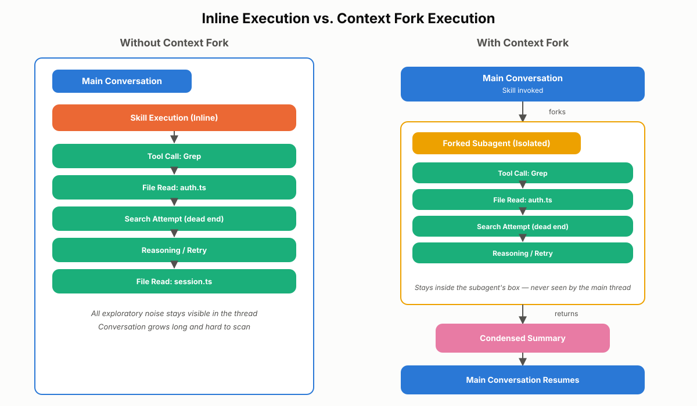
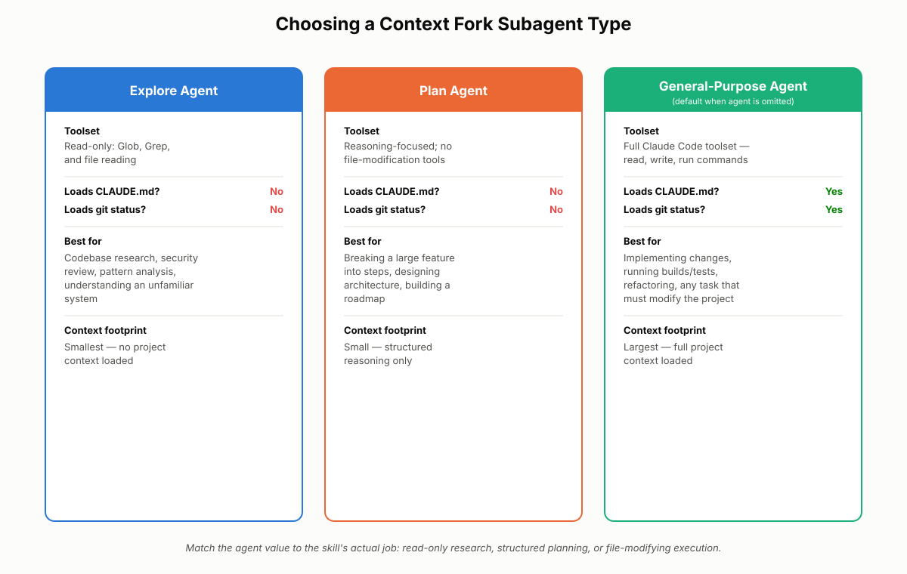
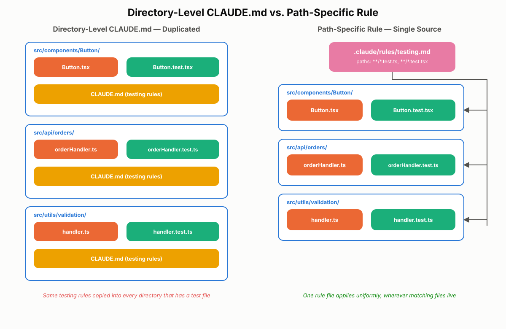
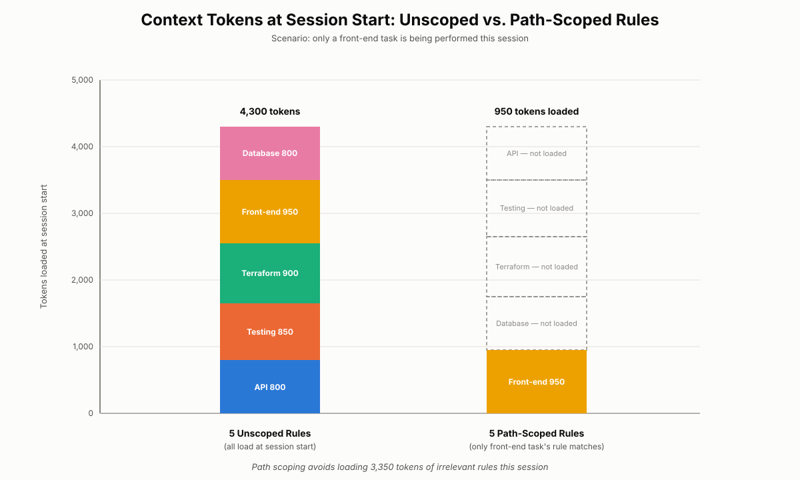

# Path-Specific Rules and Context Fork

Chapter 9 introduced the CLAUDE.md hierarchy and Chapter 10 showed how agent skills activate on demand instead of loading everywhere. This chapter tackles two more tools for controlling *where* work happens and *which* instructions apply: Context Fork, a skill front-matter option that runs a skill's execution in an isolated subagent instead of the main conversation, and path-specific rules, a file-pattern-based alternative to directory-level CLAUDE.md. Both exist to protect the same scarce resource — the context window — and the CCA-F exam expects you to know precisely when each one is the right call.

## Context Fork: Isolating a Skill's Execution

### The Problem Context Fork Solves

By default, an agent skill executes inside the same conversation context as the rest of your session. Every file it reads, every search it runs, every dead end it explores becomes part of the active conversation history. For a short, single-purpose skill this is harmless. For a skill that does open-ended investigation — searching across hundreds of files, trying multiple approaches, reasoning through a large problem — it turns your main conversation into a wall of intermediate noise. You end up scrolling past dozens of file reads and failed search attempts just to find the two paragraphs of actual findings you wanted.

Context Fork solves this by letting a skill run its work somewhere else entirely, and reporting back only the result.

### What Context Fork Does

Context Fork is a skill configuration that runs the skill inside an isolated subagent context rather than the main conversation. When a skill uses Context Fork:

- Claude Code spins up a separate subagent to execute the skill.
- The subagent's prompt is the skill's own content — nothing more. It does not receive your conversation history.
- The subagent works independently, using whichever tools its agent type provides.
- When it finishes, only a summarized result is returned to the primary conversation. All intermediate reasoning, file reads, and tool calls stay inside the subagent and never appear in your main session.

The effect is that a skill that would normally generate ten pages of exploratory back-and-forth instead contributes a few clean paragraphs to your conversation, while the actual investigative work still happens in full.

### Setting Up Context Fork

You enable Context Fork in a skill's YAML front matter, in the same `SKILL.md` file introduced in Chapter 10. Add a `context` field set to `fork`, and optionally an `agent` field to pick the subagent type:

```yaml
---
name: analyze-auth-security
description: Reviews the authentication system for security vulnerabilities and returns a findings summary.
context: fork
agent: explore
---

# Authentication Security Review

Search the authentication module for common vulnerability patterns:
missing session invalidation, weak password hashing, unvalidated
redirect targets, and tokens logged in plaintext. Report each
finding with file path, line number, severity, and a one-line fix
recommendation.
```

If you omit `agent`, Claude Code defaults to a general-purpose subagent. The `agent` field is what determines the subagent's toolset and whether it loads CLAUDE.md and git status.

### Choosing a Subagent Type

Three built-in agent types are available for a forked skill, and picking the right one is as important as deciding to fork in the first place.

| Agent type | Toolset | Loads CLAUDE.md / git status? | Best for |
|---|---|---|---|
| **Explore agent** | Read-only tools such as Glob and Grep, plus file reading | No — skipped to keep context small | Codebase research, security review, pattern analysis, understanding an unfamiliar system |
| **Plan agent** | Reasoning-focused; no file-modification tools | No — skipped to keep context small | Breaking a large feature into steps, designing architecture, building a roadmap |
| **General-purpose agent** (default) | Full Claude Code toolset — read, write, run commands | Yes — full project context loaded | Implementing changes, running builds/tests, refactoring, any task that must modify the project |

The Explore agent is deliberately lightweight: it can find and read files but cannot change anything, and it skips loading CLAUDE.md and git status entirely so its context stays small and focused on the search at hand. Use it for skills that are purely investigative.

The Plan agent is similarly stripped down but oriented toward structuring thought rather than searching code — it organizes a problem into steps without touching a single file. It also skips CLAUDE.md and git status, on the assumption that planning happens before any project-specific conventions need to be enforced.

The general-purpose agent is the only one of the three that loads CLAUDE.md and git status by default, because it's the only one expected to take real action inside the project. If your skill needs to write a file, run `npm test`, or apply a refactor, this is the only correct choice.

> 💡 **Tip:** Think of the `agent` field as answering "what kind of subagent does this skill's job require?" — read-only research, structured reasoning, or real execution. Match the agent type to the actual work, not to habit.

### How Isolation Works Under the Hood

The isolation Context Fork provides is intentional and total. The subagent:

- Receives only the skill's own content as its prompt — no conversation history, no prior turns.
- Does not have access to CLAUDE.md or git status unless it's running as a general-purpose agent (which loads them by default).
- Uses only the tools its agent type provides.
- Returns a summary, not a transcript, of what it did.

Nothing about the subagent's internal reasoning process leaks back into the main conversation unless the skill explicitly asks for it to be included in the summary. This is what keeps a large research task from turning a 20-message conversation into a 200-message one.

### When to Use Context Fork

Context Fork earns its complexity when a skill's work would otherwise flood your main conversation with exploration you don't need to see. Good candidates share a pattern: lots of intermediate steps, dead ends, or tool calls, where only the conclusion matters.

Reach for Context Fork when:

- A skill needs to search across dozens or hundreds of files before reaching a conclusion.
- The skill's job is research or analysis that supports — but isn't part of — the main task (for example, researching a library's API while you're mid-feature).
- You want a security review, code-pattern audit, or codebase orientation that produces a report, not a running commentary.
- A skill needs structured planning that doesn't require touching any files.

Avoid Context Fork when:

- The skill is simple and produces little or no intermediate noise (a formatter, a quick lint check).
- The skill depends on information from earlier in the conversation — the subagent can't see it, so the skill will silently lose that context.
- The skill needs CLAUDE.md or git status and you've selected Explore or Plan, both of which skip them.
- You or a downstream step actually need to see the reasoning and intermediate steps, not just the final answer.

> ⚠️ **Important:** A forked skill that references "the file we discussed earlier" or "the approach we agreed on" will fail silently — the subagent never saw that conversation. If a skill's instructions depend on prior context, either pass that context explicitly inside the skill content itself, or don't fork it.

### Real-World Use Case: Reviewing an Authentication System

Consider a developer mid-way through building a new feature who also needs the existing authentication system checked for security issues. Run naively, an analysis like this reads dozens of files, tries several detection strategies, and second-guesses a few false positives — all of it landing directly in the conversation the developer is using to build the feature.

With Context Fork and the Explore agent, that same request runs differently. The skill's front matter sets `context: fork` and `agent: explore`. Claude Code creates an isolated subagent whose only job is to search the authentication module, apply the vulnerability checklist from the skill content, and compile results. All of the file reads, search attempts, and internal back-and-forth happen inside that subagent. The main conversation only receives the final report: a list of findings, each with file, line, severity, and recommended fix. The developer keeps building the feature in a conversation that never got cluttered, and still gets a complete security review.

The mental model worth keeping is: instead of doing the research at your desk and leaving papers everywhere, you do the research in a separate room and bring back only the final report. The desk — your main conversation — stays clean.

> ✅ **Best Practice:** Default to Explore for anything read-only, Plan for anything structural, and general-purpose only when the skill genuinely needs to modify the project. Reaching for general-purpose "just in case" gives up the token savings and CLAUDE.md-skip benefits the other two agent types provide.


*Figure 11.1: Exploratory tool calls and intermediate reasoning stay inside the forked subagent's box, with only a condensed summary crossing back into the main conversation thread.*


*Figure 11.2: Helps an architect quickly match a skill's actual job — read-only research, structured planning, or file-modifying execution — to the correct `agent` value in a skill's front matter.*

## Path-Specific Rules: Scoping Instructions by File Pattern

### The Problem: Conventions That Don't Live in One Folder

Chapter 9 covered directory-level CLAUDE.md files, which load on demand when Claude Code reads a file inside that specific directory. That works well when a convention is genuinely contained in one folder — a `terraform/` directory with its own CLAUDE.md for infrastructure rules, for instance.

It breaks down when a convention applies to files that are scattered across the project instead of grouped in a folder. Test files are the classic example: `Button.test.tsx` sits right next to `Button.tsx`, `handler.test.ts` sits next to `handler.ts`, and this pattern repeats in dozens of directories. There is no single "tests" folder to attach a directory-level CLAUDE.md to. Without another option, you'd have to duplicate the same testing-conventions CLAUDE.md into every directory that happens to contain a test file — a maintenance problem that only gets worse as the codebase grows.

Path-specific rules exist for exactly this shape of problem.

### What Path-Specific Rules Are

Path-specific rules (also called path-scoped rules) are instruction files that live in a dedicated rules directory — `.claude/rules/` — and use YAML front matter with a `paths` field containing glob patterns. Instead of being tied to a single folder, a path-specific rule activates whenever Claude Code works with *any* file matching its glob pattern, no matter where that file sits in the project tree.

```yaml
---
paths:
  - "**/*.test.ts"
  - "**/*.test.tsx"
  - "**/__tests__/**"
---

# Testing Conventions

- Use `describe`/`it` blocks; do not use bare `test()` calls.
- Mock outbound HTTP calls with `nock` — never hit real endpoints in unit tests.
- Every React component test must import the shared `renderWithProviders`
  helper instead of calling `render` directly.
```

You can combine multiple glob patterns in the `paths` array, and you can use brace expansion to compress related patterns into one line, such as `"src/**/*.{test,spec}.{ts,tsx}"`. Whatever combination you use, the rule applies uniformly to every matching file across the entire codebase, defined once, from a single source of truth.

### Path-Specific Rules vs. Directory-Level CLAUDE.md

Both mechanisms scope instructions instead of applying them everywhere, but they scope on different axes: location versus pattern.

| | Directory-level CLAUDE.md | Path-specific rules |
|---|---|---|
| Scoping mechanism | Physical folder location | File-pattern glob match, regardless of folder |
| Where it lives | `CLAUDE.md` inside the target directory | Rule file in `.claude/rules/` with a `paths` front-matter field |
| Loads when | Claude Code reads a file inside that directory | Claude Code reads any file matching the glob pattern |
| Best fit | Conventions genuinely contained in one folder (e.g., `terraform/`) | Conventions tied to a file type or role that's spread across the project (tests, API handlers, migration files) |
| Duplication risk | High, if matching files are scattered across many folders | Low — one rule file covers every matching file everywhere |

The deciding question the exam wants you to ask is simple: *where do the files you're targeting actually live?* If they live in one place, a directory-level CLAUDE.md is the simpler, more direct tool. If they're identifiable by name or extension but scattered across the tree, path-specific rules are the only option that doesn't force duplication.

> 🚀 **Pro Tip:** You don't have to choose one system for the whole project. It's normal to have directory-level CLAUDE.md files for genuinely folder-bound conventions (like `terraform/CLAUDE.md`) alongside path-specific rules for cross-cutting file types (like all test files). They coexist and both stay out of context until relevant.

### Real-World Use Case: One Rule File for Every Test in the Repo

Picture a codebase where React components follow one convention, API handlers follow another, and test files are interleaved throughout both — `Button.test.tsx` next to `Button.tsx`, `orderHandler.test.ts` next to `orderHandler.ts`, repeated across dozens of directories. Dropping a CLAUDE.md into each folder that happens to contain a test file means maintaining the same instructions in a dozen places, and missing one the next time a new folder is added.

A single rule file, `.claude/rules/testing.md`, with `paths: ["**/*.test.ts", "**/*.test.tsx"]` in its front matter, replaces all of that. Whether Claude Code is editing a component test in `src/components/Button/` or an API handler test in `src/api/orders/`, the same testing conventions load automatically the moment it opens a matching file — and nowhere else. One file, one source of truth, full coverage.

### Common Mistakes with Path-Specific Rules

- **Overlapping glob patterns.** If two rule files both match the same file (for example, one pattern for `**/*.ts` and another for `**/*.test.ts`), both load together. That's sometimes intentional, but unnoticed overlap quietly doubles up instructions and burns tokens you didn't expect to spend.
- **Treating `paths` as a replacement for judgment.** A glob pattern that's too broad (`**/*.ts` for a rule meant only for tests) defeats the purpose — it will match far more files than intended and load almost as often as an unscoped rule would.
- **Forgetting the front matter entirely.** A rule file placed in the rules directory without a `paths` field doesn't stay dormant — it loads unconditionally, every session, the same as your root CLAUDE.md.

## How Path-Specific Rules Affect the Token Budget

### Why This Matters

Every CLAUDE.md file and every rule file that ends up in context costs tokens, on every message, for the rest of the session. Anthropic's documentation recommends keeping each CLAUDE.md file under roughly 200 lines — longer files consume more context, and more competing instructions in the window make Claude less reliable at following any single one of them consistently. This isn't just a cost concern; it's a reliability concern.

A rule file placed in `.claude/rules/` behaves in one of two ways, and the difference matters:

- **No `paths` field** → the rule loads unconditionally at session start, exactly like your root CLAUDE.md. It's always in context, whether or not it's relevant to what you're currently doing.
- **A `paths` field present** → the rule loads on demand, only when Claude Code reads a file matching one of its glob patterns. If no matching file is ever touched in a session, the rule never enters the context window, and none of its tokens are ever spent.

This is the core exam-relevant fact about path-specific rules: they don't just organize instructions more cleanly, they actively reduce token consumption by deferring loading until it's actually needed.

### A Worked Example

Suppose a project keeps five rule files in `.claude/rules/`: one for API conventions, one for testing standards, one for Terraform, one for front-end component patterns, and one for database models.

Without `paths` front matter, all five load the moment the session starts — five full files of instructions sitting in context before a single message is sent, even if that session turns out to be nothing but a CSS tweak.

Add `paths` front matter to each:

```yaml
---
paths: ["infra/**/*.tf"]
---
```

```yaml
---
paths: ["src/components/**/*.tsx"]
---
```

and so on for the remaining three. Now, when a developer opens a React component, only the front-end rule loads. The Terraform, database, and testing rules stay completely out of context — not truncated, not summarized, simply never loaded. Two things follow directly from this:

1. **Fewer tokens spent per message**, because the context Claude is reasoning over is smaller.
2. **More reliable adherence to the rules that do load**, because there's less competing instruction text in the window for any single rule to get lost among.

> ✅ **Best Practice:** When a project's CLAUDE.md and rules directory start creeping past a few hundred combined lines, audit which instructions are genuinely needed in every session versus which only apply to specific file types. Move the latter into path-scoped rule files. This is precisely the scenario Anthropic's own guidance points to when it recommends path scoping as instructions grow.


*Figure 11.3: Illustrates why glob-pattern matching, not folder location, is the right scoping tool when target files are spread throughout the codebase rather than grouped in one place.*


*Figure 11.4: Demonstrates the token savings from path scoping — only the rule matching the current task's file type loads, while the other four stay out of context entirely.*

## Choosing Between Context Fork and Path-Specific Rules

These two features are easy to conflate because both are about scoping and both save context, but they solve different problems. Context Fork isolates *where work happens* — it takes a skill's execution out of the main conversation and returns only a summary. Path-specific rules isolate *which instructions apply* — they keep irrelevant guidance out of context until a matching file is actually in play.

| | Context Fork | Path-specific rules |
|---|---|---|
| What it isolates | A skill's execution (reasoning, tool calls, exploration) | Which instructions load into context |
| Configured in | Skill's `SKILL.md` front matter (`context: fork`, `agent:`) | Rule file front matter in `.claude/rules/` (`paths:`) |
| Triggers on | Running the skill | Reading a file matching a glob pattern |
| Returns | A summarized result to the main conversation | Nothing to return — it's passive instruction, not an executed task |
| Use it to | Keep exploratory noise (research, planning, multi-file analysis) out of the main thread | Keep file-type-specific conventions (tests, API handlers, infra) out of context except when relevant |

A simple rule of thumb: reach for Context Fork when you want to isolate *the task's reasoning and work*. Reach for path-specific rules when you want to isolate *where instructions apply*. Reach for CLAUDE.md — project-level or user-level — when guidance is genuinely relevant in essentially every session, regardless of which files are touched.

> 💡 **Tip:** These tools compose. A skill that runs under Context Fork with the general-purpose agent will still pick up any path-specific rules that match the files it happens to touch during its isolated execution — the two systems operate independently and don't conflict.

## Chapter Summary

Context Fork lets a skill execute inside an isolated subagent instead of the main conversation, so exploratory work — file reads, search attempts, dead ends — never clutters the primary thread. You enable it with `context: fork` in a skill's YAML front matter and choose an `agent` type: Explore for read-only research, Plan for structured reasoning without execution, or the general-purpose default for anything that needs to modify files or run commands. Only Explore and Plan skip CLAUDE.md and git status to stay lightweight; general-purpose loads both because it's expected to take real action. When the subagent finishes, only a summary returns to the main conversation.

Path-specific rules solve a different problem: applying instructions to files based on a glob pattern rather than a folder location. They live in `.claude/rules/` with a `paths` field in their YAML front matter, and they load on demand — only when Claude Code touches a matching file — the same way directory-level CLAUDE.md loads on demand for files in its own folder. The difference is that path-specific rules can match files scattered across the entire project, which is exactly what directory-level CLAUDE.md cannot do without duplication. Rule files without a `paths` field behave like the root CLAUDE.md: they load unconditionally, every session. Scoping instructions by path keeps context smaller and keeps the instructions that do load more reliably followed.

## Key Takeaways

- Context Fork (`context: fork` in a skill's front matter) runs a skill inside an isolated subagent; the subagent gets only the skill content, not conversation history, and returns a summarized result.
- The `agent` field picks the subagent type: `explore` (read-only, skips CLAUDE.md/git status), `plan` (structured reasoning, skips CLAUDE.md/git status), or the general-purpose default (full toolset, loads CLAUDE.md/git status).
- Avoid Context Fork when a skill needs prior conversation context, when it's simple enough to generate little noise, or when the chosen agent type won't have access to information (like CLAUDE.md) the skill actually needs.
- Path-specific rules live in `.claude/rules/` and use a `paths` field with glob patterns to activate only for matching files, regardless of which folder those files sit in.
- Directory-level CLAUDE.md scopes by folder location; path-specific rules scope by file pattern. Choose based on where the target files actually live.
- Rule files without a `paths` field load unconditionally at session start, just like root CLAUDE.md; adding `paths` converts them to on-demand loading.
- Path scoping reduces token consumption (irrelevant rules never enter context) and improves instruction adherence (fewer competing instructions in the window at once).
- Context Fork isolates execution; path-specific rules isolate applicability. They address different problems and can be used together.

## Interview Questions

1. Walk through what happens, step by step, when a skill configured with `context: fork` and `agent: explore` is invoked. What does the subagent receive, and what comes back to the main conversation?
2. Why do the Explore and Plan agent types skip loading CLAUDE.md and git status, while the general-purpose agent loads both by default?
3. Describe a real scenario where using Context Fork would actually hurt a workflow rather than help it. What would you do instead?
4. A team has a `CLAUDE.md` in their `tests/` directory, but their test files are scattered across dozens of feature folders rather than centralized. Explain why directory-level CLAUDE.md doesn't solve this, and how you'd fix it.
5. What is the practical difference between a rule file in `.claude/rules/` that has no `paths` field and one that does? Why does this distinction matter for token budget?
6. How would you decide whether a piece of project guidance belongs in root CLAUDE.md versus a path-specific rule?
7. Two path-specific rule files both match the same file due to overlapping glob patterns. What happens, and why might this be a problem worth catching during review?
8. Explain, in your own words, why Context Fork and path-specific rules are described as solving different problems even though both reduce what ends up in context.

## Practice Questions & Answers

**Practice Question (unofficial):** You're building a skill that reviews a large legacy codebase for deprecated API usage before a migration. The review needs to search hundreds of files but shouldn't modify anything. Which Context Fork configuration would you use, and why?

*Answer:* Set `context: fork` with `agent: explore`. The task is read-only investigation across many files — exactly what the Explore agent is optimized for, with Glob/Grep-style tools and no file-modification capability. Since the review doesn't depend on project-specific conventions from CLAUDE.md, skipping it (as Explore does) is fine and keeps the subagent's context smaller and more focused. Using the general-purpose agent here would work but would needlessly load CLAUDE.md and git status and expose file-modification tools the skill has no use for.

**Practice Question (unofficial):** Your project has a `.claude/rules/` directory with a file called `security.md` that contains critical guidance about how to handle credentials and secrets in code. Should this file have a `paths` field? Justify your answer either way.

*Answer:* It depends on how broadly the guidance applies. If credential-handling rules should apply to every file Claude Code might touch (since secrets can leak from almost anywhere), leaving `paths` off is defensible — it behaves like an always-on rule, similar to root CLAUDE.md, ensuring it's never missed. If the guidance is actually specific to certain files (e.g., only `.env`-adjacent config loaders or auth modules), adding a `paths` field targeting those patterns keeps the rule from consuming context in sessions that never touch security-relevant code, without weakening its effect where it matters. The general principle: broad, safety-critical guidance often justifies staying unscoped; narrow, file-type-specific guidance benefits from scoping.

**Practice Question (unofficial):** A developer complains that their root CLAUDE.md has grown to 450 lines covering API conventions, testing rules, Terraform standards, and front-end patterns, and that Claude seems to be missing instructions more often than before. What would you recommend, and what specific mechanism explains the reliability drop?

*Answer:* Split the file: move the sections that only apply to specific file types (testing, Terraform, front-end) into separate path-specific rule files in `.claude/rules/`, each with a `paths` field targeting the relevant glob pattern, and leave only genuinely universal guidance in the root CLAUDE.md. The reliability drop happens because every line in a 450-line file loads into every session's context regardless of relevance, and a larger set of simultaneously active instructions makes it harder for any single instruction to be reliably followed — documentation explicitly recommends keeping individual CLAUDE.md files under roughly 200 lines for this reason. Path scoping directly addresses both the token cost and the instruction-competition problem by only loading what's relevant to the files actually being touched.

**Practice Question (unofficial):** A skill forked with `agent: plan` produces a step-by-step implementation plan that ignores an established project convention documented in CLAUDE.md. Is this a bug? Explain.

*Answer:* Not a bug — expected behavior. The Plan agent, like Explore, intentionally skips loading CLAUDE.md and git status to stay lightweight and focused purely on reasoning and structuring steps. If a plan genuinely needs to respect project-specific conventions, either fold the relevant conventions directly into the skill's own content (so the subagent sees them regardless of agent type), or use the general-purpose agent instead, which does load CLAUDE.md by default.

## Multiple Choice Questions

**Q1.** What YAML front-matter field enables Context Fork for a skill?
A. `mode: isolated`
B. `context: fork`
C. `agent: fork`
D. `execution: subagent`

**Correct Answer: B**

*Explanation:* `context: fork` is the specific front-matter key that enables isolated subagent execution for a skill. A is incorrect because there is no `mode` field for this purpose. C is incorrect because `agent` is a separate field used to choose which subagent type runs the skill, not to enable forking itself. D is incorrect because no `execution` field exists in skill front matter.

**Q2.** If a skill's front matter includes `context: fork` but omits the `agent` field, which agent type runs it?
A. Explore agent
B. Plan agent
C. General-purpose agent
D. Claude Code raises a configuration error

**Correct Answer: C**

*Explanation:* The general-purpose agent is the default when `agent` is omitted. A and B are incorrect because Explore and Plan must be explicitly specified via `agent: explore` or `agent: plan`. D is incorrect because omitting `agent` is valid and falls back to the default rather than erroring.

**Q3.** Which two things do both the Explore agent and the Plan agent skip loading, to keep their context small?
A. Conversation history and tool descriptions
B. CLAUDE.md and git status
C. Skill front matter and MCP configuration
D. System prompt and `allowedTools`

**Correct Answer: B**

*Explanation:* Both Explore and Plan intentionally skip CLAUDE.md and git status to keep their context focused and lightweight. A is incorrect because conversation history is never available to a forked subagent regardless of agent type, and tool descriptions are always loaded for whatever tools the agent has. C is incorrect because skill front matter is what configures the fork in the first place, and MCP configuration isn't described as being skipped. D is incorrect because the system prompt and `allowedTools` are not the items called out as skipped by Explore/Plan.

**Q4.** A skill needs to implement a code change, run the test suite, and report pass/fail. Which agent type should it use under Context Fork?
A. Explore agent
B. Plan agent
C. General-purpose agent
D. None — this task should never be forked

**Correct Answer: C**

*Explanation:* The general-purpose agent has the full Claude Code toolset, including file modification and command execution, and loads CLAUDE.md and git status for full project context. A is incorrect because Explore is read-only and cannot modify files or run commands. B is incorrect because Plan is for structuring steps, not executing them. D is incorrect because forking is fine here if the exploratory/execution noise would otherwise clutter the main conversation — the general-purpose agent is simply the correct choice of subagent type.

**Q5.** What is returned to the main conversation when a Context Fork subagent completes its work?
A. The complete list of every tool call and file read performed
B. A summarized result of the work
C. Nothing — forked skill output is discarded
D. The raw contents of every file the subagent opened

**Correct Answer: B**

*Explanation:* Only a summary of the subagent's findings or output returns to the main conversation; intermediate steps stay isolated. A is incorrect because this is exactly the noise Context Fork is designed to prevent from reaching the main conversation. C is incorrect because results are returned, just condensed rather than discarded. D is incorrect because raw file contents stay inside the subagent's isolated context unless the summary explicitly includes relevant excerpts.

**Q6.** A skill's instructions say "continue analyzing the file we looked at three messages ago." Why is this a poor candidate for Context Fork?
A. Context Fork cannot execute skills that reference files
B. The forked subagent has no access to the main conversation's history
C. Only the general-purpose agent can reference prior messages
D. Context Fork always fails if a skill mentions a specific file

**Correct Answer: B**

*Explanation:* A forked subagent receives only the skill's own content as its prompt — it has no visibility into earlier turns of the main conversation, so a reference like this would be meaningless to it. A is incorrect because Context Fork works fine with file-referencing skills as long as the reference is self-contained within the skill content. C is incorrect because no agent type, including general-purpose, receives the main conversation's history under Context Fork. D is incorrect because mentioning a specific file by name or path is not inherently a problem; the issue is dependence on unstated prior conversation context.

**Q7.** Which scenario is the best fit for Context Fork with the Explore agent?
A. Formatting a single file according to a style guide
B. Reviewing an authentication module across many files for security vulnerabilities, producing a findings report
C. Applying an approved refactor and running the build
D. Answering a quick question about a variable's current value

**Correct Answer: B**

*Explanation:* This involves extensive read-only exploration across many files with a single summarized deliverable — exactly what Explore under Context Fork is designed for. A is incorrect because a single-file format operation generates little intermediate noise and doesn't justify the overhead of forking. C is incorrect because applying a refactor and running a build requires file modification and command execution, which needs the general-purpose agent, not Explore. D is incorrect because a quick lookup doesn't produce enough exploratory noise to benefit from isolation.

**Q8.** How does a directory-level CLAUDE.md primarily scope its instructions?
A. By glob pattern matching against file names
B. By the physical folder it's placed in
C. By the git branch currently checked out
D. By the file extension only, regardless of folder

**Correct Answer: B**

*Explanation:* A directory-level CLAUDE.md applies to files within the specific directory where it's placed, loading on demand when Claude Code reads a file there. A is incorrect because glob-pattern matching is how path-specific rules scope, not directory-level CLAUDE.md. C is incorrect because git branch has no bearing on CLAUDE.md scoping. D is incorrect because directory-level CLAUDE.md is tied to folder location, not file extension.

**Q9.** What field in a path-specific rule's YAML front matter defines which files it applies to?
A. `scope`
B. `match`
C. `paths`
D. `glob`

**Correct Answer: C**

*Explanation:* The `paths` field, containing one or more glob patterns, defines which files trigger a path-specific rule. A, B, and D are each incorrect because none of these is the actual front-matter field name used for path-specific rules.

**Q10.** Test files (`*.test.tsx`) sit next to their corresponding source files across dozens of directories in a project. What is the most maintainable way to apply shared testing conventions to all of them?
A. Add an identical CLAUDE.md to every directory containing a test file
B. Create one path-specific rule with `paths: ["**/*.test.tsx"]`
C. Add the conventions to the project root CLAUDE.md only
D. Rename all test files into a single `tests/` folder

**Correct Answer: B**

*Explanation:* A single path-specific rule with a glob pattern matching all test files applies uniformly everywhere those files live, from one source of truth. A is incorrect because this creates a duplication and maintenance burden that grows with the codebase. C is incorrect because putting test-only conventions in root CLAUDE.md means they load in every session, even when no test file is being touched, wasting context. D is incorrect because this requires a disruptive code reorganization just to work around a scoping limitation that path-specific rules solve directly.

**Q11.** A rule file exists in `.claude/rules/` with no `paths` field in its front matter. When does it load?
A. Never — it's ignored without a `paths` field
B. Only when a file with no extension is read
C. Unconditionally at session start, like root CLAUDE.md
D. Only when explicitly invoked by name

**Correct Answer: C**

*Explanation:* Without a `paths` field, a rule file behaves like the root CLAUDE.md — it loads unconditionally every session, regardless of which files are touched. A is incorrect because the file is not ignored; it's simply unscoped, so it always loads. B is incorrect because there's no such special-case rule about extensionless files. D is incorrect because there is no explicit-invocation mechanism for rule files; loading is automatic based on scoping (or lack of it).

**Q12.** What is the primary benefit of adding a `paths` field to a rules-directory file, in terms of token budget?
A. It compresses the rule's text using a shorter encoding
B. It prevents the rule from loading at all, saving tokens permanently
C. It defers loading until a matching file is actually read, so irrelevant sessions never spend those tokens
D. It moves the token cost from the user's context window to the model provider's infrastructure

**Correct Answer: C**

*Explanation:* Path scoping makes loading conditional on relevance — sessions that never touch a matching file never pay the token cost of that rule. A is incorrect because `paths` has no effect on how the rule's text itself is encoded or compressed. B is incorrect because the rule does load, just conditionally, when relevant. D is incorrect because token cost is inherent to whatever context is loaded into the model's window; scoping doesn't relocate that cost, it avoids incurring it unnecessarily.

**Q13.** Two path-specific rule files have overlapping glob patterns that both match the same file. What is the most accurate description of what happens?
A. Claude Code raises an error and refuses to proceed
B. Only the more specific pattern's rule loads
C. Both rules load together, potentially duplicating guidance and consuming extra tokens
D. Neither rule loads, since the conflict is unresolvable

**Correct Answer: C**

*Explanation:* Both matching rules load simultaneously; overlapping patterns are not automatically deduplicated, so this can quietly increase token usage and introduce redundant or even conflicting instructions. A is incorrect because there is no error-raising conflict-resolution step — both rules simply load. B is incorrect because there's no automatic specificity-based precedence between overlapping path-specific rules. D is incorrect because the rules aren't dropped; the opposite happens, both are applied.

**Q14.** Why does Anthropic's guidance recommend keeping individual CLAUDE.md and rule files under roughly 200 lines?
A. Files over 200 lines cause a hard parsing error
B. Longer files consume more context and tend to reduce instruction adherence
C. The 200-line limit is a hard technical ceiling enforced by Claude Code
D. Shorter files load faster over the network

**Correct Answer: B**

*Explanation:* Longer instruction files eat more of the context window and, in practice, reduce how reliably Claude follows any single instruction among a larger set of competing ones. A is incorrect because there's no parsing failure tied to file length — it's a guidance-based recommendation, not an enforced limit. C is incorrect because it's a best-practice recommendation, not a technical ceiling. D is incorrect because the concern is about context/token consumption and instruction-following reliability, not network transfer speed.

**Q15.** Which statement best captures the difference between what Context Fork isolates and what path-specific rules isolate?
A. Both isolate identical things; they're interchangeable configuration syntaxes
B. Context Fork isolates which instructions apply; path-specific rules isolate execution
C. Context Fork isolates a skill's execution and reasoning; path-specific rules isolate which instructions load into context
D. Context Fork only applies to CLAUDE.md; path-specific rules only apply to skills

**Correct Answer: C**

*Explanation:* Context Fork moves a skill's actual execution and intermediate reasoning into an isolated subagent; path-specific rules control which instruction files enter context based on file-pattern matching. They address distinct problems. A is incorrect because they are not interchangeable — one is an execution mechanism, the other an instruction-loading mechanism. B is incorrect because this reverses the two mechanisms' actual roles. D is incorrect because Context Fork applies to skills, and path-specific rules apply to rule files, not the other way around as stated.

## Evaluate Yourself

1. **Scenario-based:** Your team has a skill that audits third-party dependencies for known vulnerabilities across a monorepo with over 2,000 files. Currently it runs inline and each invocation adds 40+ tool calls to the conversation. Redesign this skill's front matter using Context Fork. Justify your choice of `agent` type.
2. **Architecture-design:** You're setting up context management for a mid-size project with: general project guidance, React component conventions, API handler conventions, database migration conventions, and end-to-end test conventions. Sketch out which pieces belong in root CLAUDE.md, which belong in directory-level CLAUDE.md files, and which belong in path-specific rules, and justify each placement.
3. **Short-answer reflection:** Explain, without referencing any specific product feature name, why "load everything, always" is a poor default strategy for AI agent instructions as a codebase grows, and what general principle both Context Fork and path-specific rules share in addressing that problem.
4. **Scenario-based:** A skill configured with `context: fork` and `agent: plan` is meant to produce a database migration plan that respects a project's existing naming conventions (documented only in the project's root CLAUDE.md). The plan it produces violates those conventions. Diagnose the root cause and propose two different fixes.
5. **Architecture-design:** Your `.claude/rules/` directory has grown to eight files, three of which have no `paths` field. Propose a process for auditing this directory to reduce unnecessary token consumption without losing any guidance that genuinely needs to be always-on.
6. **Short-answer reflection:** In your own words, describe a situation where you would deliberately choose *not* to fork a skill's execution even though it does involve meaningful exploration. What property of that situation changes the calculus?
