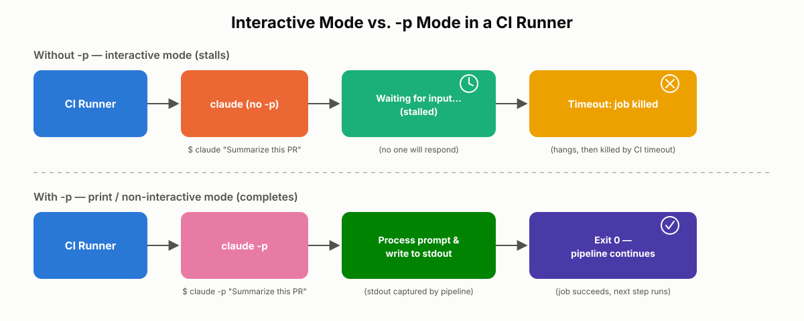
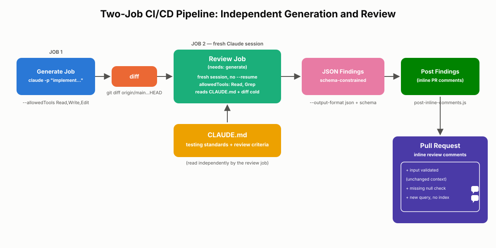

# CLI Flags and CI/CD

Claude Code is built for a developer sitting at a terminal, but a large share of its real-world value comes from running it where no developer is watching: inside a continuous integration pipeline. This chapter covers the `-p` flag that makes non-interactive execution possible, the companion flags that turn a single command into a reliable automation building block, and the three additional pieces — structured JSON output, CLAUDE.md-driven project context, and session context isolation — that the exam guide expects you to understand for CI/CD integration. By the end, you should be able to look at a stalled pipeline or a noisy automated review and diagnose exactly which piece is missing.

## The `-p` Flag: Running Claude Code Non-Interactively

### The Problem It Solves

Claude Code's default mode is interactive. It opens a session, expects you to type prompts, waits for your responses to tool-permission requests, and keeps the terminal open until you end the conversation. That behavior is correct for a developer working at a keyboard. It is exactly wrong for a CI runner.

Picture a pipeline step that runs `claude "Review this PR for security issues"` with no other flags. The job starts, Claude Code launches in its default interactive mode, and it sits there — waiting for a human to type something into a terminal that no human will ever see. There's no one at the keyboard, so the process idles until the CI platform's timeout kills it, often after burning through a large chunk of your build minutes for nothing. The job doesn't fail with a clear error; it simply hangs, which makes the root cause harder to spot the first time you hit it.

The `-p` flag (short for **print**, and referred to as **print mode** or **non-interactive mode**) exists specifically to prevent this. When you pass `-p`, Claude Code:

1. Reads the prompt you provide (as a command-line argument or piped in via stdin).
2. Processes it fully, including any tool calls it decides to make.
3. Writes the final result to standard output.
4. Exits — with no prompt for further input, no open session, no hanging terminal.

```bash
claude -p "Summarize the changes in this diff and flag any obvious bugs" < changes.diff
```

That single flag is the difference between "Claude Code can run in CI" and "Claude Code will stall your build."

### Step-by-Step: Recognizing and Fixing a Hanging Pipeline

1. **Symptom:** A CI job that invokes Claude Code never completes — it runs until the platform-level timeout kills it, with no error message pointing at the real cause.
2. **Diagnosis:** Check the exact command being run. If it's `claude "some prompt"` with no `-p`, the job is waiting for interactive input that a CI runner can never provide.
3. **Fix:** Add `-p` to the invocation. Test the exact command locally in a non-interactive shell before trusting it in CI — running `claude -p "..." < input` on your laptop should print output and return control to your terminal immediately, with no dangling prompt.
4. **Verify:** Confirm the pipeline step now exits with a result printed to stdout, and that the job's exit code reflects success or failure so downstream steps can branch on it.

> ⚠️ **Important:** If an exam scenario or a real pipeline describes a Claude Code step that hangs indefinitely with no clear error, check for a missing `-p` flag first. It is the single most common root cause of this exact symptom, and the exam guide tests it directly with a hanging-pipeline scenario whose answer is simply "add `-p`."

**Real-world use case:** A team wires up a GitHub Actions workflow that triggers on every pull request and asks Claude Code to analyze the diff for security issues. The first version of the step omits `-p`. The job appears to run forever; engineers assume Claude Code itself is broken and file a support ticket. The actual fix is one flag: `claude -p "Analyze this PR for security issues" < pr.diff`. The job completes in seconds and the findings print to the job log.

**Common mistakes:**
- Assuming `-p` is only a formatting option ("prints instead of showing a UI") rather than understanding it changes Claude Code's entire execution mode from interactive to non-interactive.
- Testing a pipeline command only inside an interactive terminal locally, where a missing `-p` might not be as obvious because you're available to answer prompts yourself.
- Forgetting that `-p` still respects tool-permission logic — without appropriately scoped `allowedTools` (covered below), Claude Code can still stop and wait if it hits a tool call that requires approval it can't get non-interactively.

> ✅ **Best Practice:** Treat `-p` as non-negotiable for any Claude Code invocation inside a script, cron job, webhook handler, or CI/CD pipeline. If a human isn't going to be watching the terminal, `-p` belongs in the command.

## Companion Flags That Make `-p` Useful in Automation

`-p` alone gets you a process that exits cleanly. It does not, by itself, make the output easy to consume programmatically, or give you fine control over what Claude Code is allowed to do while unattended. A handful of companion flags turn `-p` from "doesn't hang" into "production-ready automation building block."

### `--output-format json`

By default, `-p` prints plain text — readable by a human, but awkward for a script to parse reliably. Pairing `-p` with `--output-format json` instead returns a structured JSON payload that your pipeline script can parse directly, rather than scraping free-form prose.

```bash
claude -p "Review this diff for security issues" \
  --output-format json \
  < pr.diff > review.json
```

This is the difference between writing a fragile regular expression against Claude's prose and writing a few lines of JSON parsing code that reliably extracts findings, file paths, and severities. It's essential the moment you want to programmatically post results — for example, as inline PR comments — rather than just dumping text into a build log for a human to read later.

### JSON Schema for Enforced Output Structure

`--output-format json` guarantees the output is valid JSON, but not that it has a specific shape. If your downstream tooling expects every finding to include a `file`, a `line`, a `severity`, and a `message`, you need to go further and constrain Claude's output to a JSON Schema you define.

```json
{
  "type": "object",
  "properties": {
    "findings": {
      "type": "array",
      "items": {
        "type": "object",
        "properties": {
          "file": { "type": "string" },
          "line": { "type": "integer" },
          "severity": { "type": "string", "enum": ["low", "medium", "high"] },
          "message": { "type": "string" }
        },
        "required": ["file", "line", "severity", "message"]
      }
    }
  },
  "required": ["findings"]
}
```

Constraining the response to this shape means your PR-comment-posting script never has to guard against a missing field or an unexpected structure — every response conforms to the contract you defined. (Later chapters go deeper into JSON Schema mechanics and the fabrication risks that come with strict required fields; for CI/CD purposes, the takeaway is narrower: define the schema your pipeline needs, and pass it alongside `--output-format json` so Claude's structured output and your parser agree on the same contract.)

### Piping Content Into Claude Code

`-p` accepts input via stdin, which means you can feed Claude Code exactly the content it needs to reason about without manually pasting it into a prompt string.

```bash
git diff origin/main...HEAD | claude -p "Review this diff for security issues" --output-format json
```

This pattern — pipe the diff, the log file, the test output, or the file contents in, and let the prompt describe what to do with it — is how most CI integrations actually deliver context to Claude Code. It keeps your CI script simple: generate the content with a normal shell command, and hand it off with a pipe.

### `--resume` for Continuing a Session Non-Interactively

Sometimes a single invocation isn't the right shape — you want to pick up an existing session and continue it without a human present. `--resume` combined with `-p` lets you do that: point at a prior session and continue it non-interactively, rather than restating all its context from scratch.

```bash
claude -p --resume <session-id> "Given the review feedback above, regenerate the failing test cases" --output-format json
```

This is useful for legitimate multi-step non-interactive workflows — for instance, re-running a follow-up step against a session that already has relevant context loaded. It is not a substitute for session context isolation between generation and review (covered later in this chapter); resuming a session deliberately keeps its accumulated context, which is the opposite of what an independent review needs.

### `allowedTools` for Controlled, Repeatable Automation

An unattended Claude Code invocation should never have implicit permission to do anything it wants. `allowedTools` lets you declare exactly which tools Claude Code may use in this invocation, so the pipeline is both safe and repeatable.

```bash
claude -p "Review this diff for security issues" \
  --output-format json \
  --allowedTools "Read,Grep" \
  < pr.diff
```

A review job, for example, typically only needs to read files and search the codebase — it has no legitimate reason to write files or run arbitrary shell commands. Scoping `allowedTools` tightly here isn't just tidy configuration; it's the security boundary that keeps an automated pipeline from taking actions nobody explicitly approved.

> 💡 **Tip:** Combine `--allowedTools` with the tool-scoping principles from earlier chapters — an automated CI role should get the smallest toolset that still lets it do its job, not the full set available in an interactive developer session.

**Real-world use case:** A nightly pipeline job pulls the last day's merged commits, pipes the combined diff into `claude -p`, and asks for a structured JSON summary of any commits that touched authentication or payment code, using `--allowedTools "Read,Grep"` so the job can only inspect the codebase, never modify it. The output is parsed and posted to a Slack channel for the security team automatically — no human had to babysit the run, and no tool the job wasn't supposed to use could have executed even if the prompt had drifted.

**Common mistakes:**
- Passing `--output-format json` but never validating the parsed result before acting on it — Claude's output should still be treated as untrusted input to your script, with defensive parsing and clear failure handling if it doesn't match expectations.
- Granting broad `allowedTools` (or omitting the flag entirely, which defaults to a much wider set) "just to be safe" — this inverts the actual safety goal; broader tool access in an unattended job is strictly riskier, not safer.
- Using `--resume` to chain a code-review invocation onto a code-generation session's history, which defeats the point of an independent review (more on this below).

## Building CI/CD Integration with Claude Code

Running Claude Code in CI is not just a matter of adding `-p` and calling it done. A working integration needs three additional pieces beyond non-interactive execution: structured output your pipeline can act on, project context that shapes what "good" looks like, and a deliberate separation between the session that wrote code and the session that reviews it.

### Structured JSON Output for Automated PR Comments

The first piece is the one already introduced above: `--output-format json`, optionally constrained by a JSON Schema, so findings come back in a shape your pipeline script can iterate over and post as individual inline comments on the pull request, rather than one large text blob.

```bash
claude -p "Review this diff against the standards in CLAUDE.md. Return findings as JSON matching the provided schema." \
  --output-format json \
  --allowedTools "Read,Grep" \
  < pr.diff > review.json

node scripts/post-inline-comments.js review.json
```

Without structured output, a reviewer bot degrades into "post one giant comment with Claude's raw prose" — which is far less useful to a developer scanning a PR than seeing each issue attached to the exact line it concerns.

### CLAUDE.md as CI Project Context

The second piece reuses something already familiar: CLAUDE.md. When Claude Code runs inside a CI job, it still reads the project's CLAUDE.md exactly as it would in an interactive session. That means CLAUDE.md is your mechanism for telling a CI-invoked instance what "good" looks like for this specific codebase — testing standards, fixture conventions, and review criteria — without having to restate any of it in the pipeline script or the prompt itself.

```markdown
## Testing Standards (read by CI review and test-generation jobs)
- Every new public function needs at least one happy-path test and one edge-case test.
- Use factory functions from `tests/fixtures/` instead of hand-built mock objects.
- Test behavior through the public API — do not assert on private methods or internal state.

## Code Review Criteria
- Flag any raw SQL string concatenation as a potential injection risk.
- Flag `eval()` or deserialization of untrusted input (e.g., `pickle.loads`) as high severity.
- Flag public API endpoints that accept user input without validation.
```

This is exactly what the exam guide calls out: documenting testing standards and review criteria in CLAUDE.md measurably improves output quality — you get fewer low-value, boilerplate tests and fewer generic, low-signal review comments, because the CI-invoked instance has the same project-specific context a senior engineer would bring to the same task.

**Real-world use case:** A team's early test-generation pipeline produced tests that technically passed but asserted almost nothing meaningful — checking that a function "didn't throw" rather than checking its actual output. After adding a "Testing Standards" section to CLAUDE.md specifying what a valuable test looks like and pointing at existing fixture factories, the same pipeline (same prompt, same flags) started generating tests that matched the team's actual conventions, because the CI-invoked Claude Code instance was reading the same project context an interactive session would.

### Session Context Isolation Between Generation and Review

The third piece is more conceptual than a flag, and the exam treats it as a distinct requirement: **the same Claude session that wrote the code should not be the one reviewing it.**

A session that just generated a change carries forward all the reasoning that led to that change — the assumptions it made, the trade-offs it decided were acceptable, the edge cases it considered and dismissed. That accumulated context makes it *less* likely to challenge its own decisions; it already talked itself into them once. An independent review instance, invoked fresh with no memory of the generation session's reasoning, has no such attachment to the original decisions. It evaluates the diff on its own merits, which makes it measurably better at catching subtle issues the generating session rationalized away.

Practically, this means your pipeline should run code generation and code review as two separate Claude Code invocations — two separate processes, each starting a new session — rather than one long-lived session asked to "now review what you just wrote."

```yaml
jobs:
  generate:
    runs-on: ubuntu-latest
    steps:
      - uses: actions/checkout@v4
      - name: Generate implementation
        run: |
          claude -p "Implement the feature described in issue.md" \
            --allowedTools "Read,Write,Edit" \
            < issue.md > generation-log.json

  review:
    needs: generate
    runs-on: ubuntu-latest
    steps:
      - uses: actions/checkout@v4
      - name: Independent review (fresh session, no generator context)
        run: |
          git diff origin/main...HEAD | claude -p \
            "Review this diff against CLAUDE.md's review criteria. Return JSON findings." \
            --output-format json \
            --allowedTools "Read,Grep" \
            > review.json
      - name: Post findings
        run: node scripts/post-inline-comments.js review.json
```

Notice the `review` job never passes `--resume` against the `generate` job's session, and its `allowedTools` is deliberately narrower (`Read,Grep` only — no `Write` or `Edit`). Both choices reinforce the same goal: the reviewer sees the diff on its own terms, with no inherited reasoning and no ability to quietly "fix" what it should instead be flagging.

> 🚀 **Pro Tip:** Running generation and review as separate CI jobs (not just separate steps in the same job) gives you session isolation almost for free — most CI platforms start each job in a fresh runner, so there's no shared process state to accidentally leak between them. If you do combine steps in one job, make sure each `claude -p` invocation is a fresh, unresumed call.

**Real-world use case:** A team initially had one CI step ask Claude Code to "implement the requested change, then review your own diff for issues" in a single invocation. The self-review consistently came back clean, because the same reasoning that produced the implementation was still active when evaluating it. Splitting generation and review into separate jobs — with the review job starting a brand-new session and reading the diff cold — immediately started surfacing real issues (an unhandled null case, a missing index on a new query) that the self-review had waved through every time.


*Figure 12.1: Contrasts what happens when a CI job invokes Claude Code without `-p` (it stalls, waiting on input no one will provide) versus with `-p` (it processes the prompt, writes to stdout, and exits cleanly so the pipeline can continue).*


*Figure 12.2: Shows the full pattern described in this section — a generation job producing a diff, a separate review job starting a new session that reads CLAUDE.md and the diff independently, structured JSON findings coming out the other end, and a final step posting those findings as inline PR comments.*

**Best practices for CI/CD integration:**
- Always pair `-p` with `--output-format json` (and a schema, when your pipeline needs guaranteed structure) for anything a script will parse — reserve plain text for logs a human will read directly.
- Keep CLAUDE.md's testing standards and review criteria under the same version control as the code they describe, so they evolve together and CI behavior doesn't silently drift out of sync with team conventions.
- Enforce session context isolation structurally — separate jobs, separate invocations, no `--resume` bridging generation into review — rather than relying on a prompt instruction to "review objectively."
- Scope `allowedTools` per job to the minimum needed for that job's actual task.

**Common mistakes:**
- Treating `-p` as sufficient on its own and shipping a CI integration with no structured output, no CLAUDE.md context, and a single self-reviewing session — it will run without hanging, but the output quality will be poor and the review will be unreliable.
- Writing review criteria only in the prompt string instead of CLAUDE.md, which means every pipeline script has to restate them and they drift out of sync over time.
- Assuming JSON output from `-p --output-format json` is automatically schema-conformant without actually supplying a schema — plain JSON mode guarantees valid JSON, not a specific shape.

## Chapter Summary

Claude Code defaults to an interactive mode built for a human at a terminal, which stalls indefinitely in a CI runner where no human exists to respond. The `-p` flag switches Claude Code into non-interactive "print mode": it processes the prompt, writes the result to standard output, and exits — the foundational fix for hanging pipelines, and the single answer the exam expects for that exact symptom. `-p` unlocks companion flags that make automation practical: `--output-format json` for machine-parsable output, JSON Schema to enforce a specific structure, piped stdin to feed diffs and files in, `--resume` to continue a prior session non-interactively, and `allowedTools` to scope what an unattended run is permitted to do. A complete CI/CD integration (Task Statement 3.6) needs three things beyond `-p` itself: structured JSON output for posting automated findings as inline PR comments, CLAUDE.md providing the same project-specific testing standards and review criteria a human reviewer would use, and session context isolation — running code generation and code review as separate Claude invocations so the reviewer isn't carrying forward the generator's own reasoning and blind spots.

## Key Takeaways

- The `-p` flag runs Claude Code in non-interactive "print mode": process the prompt, write to stdout, exit — no waiting for human input.
- Without `-p`, a CI job invoking Claude Code hangs until the platform's timeout kills it; this is the exam's most directly tested CLI-flag scenario.
- `--output-format json` turns Claude's response into machine-parsable structured data instead of free-form text.
- A JSON Schema constrains that structured output to a specific, guaranteed shape your pipeline script can rely on without defensive guesswork.
- Piping content into `claude -p` via stdin (e.g., `git diff | claude -p ...`) is the standard way to hand Claude Code the exact context it needs.
- `--resume` continues a prior session non-interactively; it should never be used to bridge a code-review invocation onto a generation session's own reasoning.
- `allowedTools` scopes exactly which tools an unattended invocation may use — narrower is safer, and a review job typically needs far less than a generation job.
- CLAUDE.md is read identically whether Claude Code is invoked interactively or from CI; documenting testing standards and review criteria there directly improves CI output quality.
- Session context isolation — running generation and review as separate Claude Code invocations — exists because a session that already produced an answer is less likely to challenge it than a fresh, independent session evaluating the same diff cold.

## Interview Questions

1. Why does Claude Code default to interactive mode, and what specifically breaks when that default is used inside a CI/CD pipeline?
2. Walk through the sequence of flags you'd combine with `-p` to build a pipeline step that posts structured security findings as inline PR comments.
3. What is session context isolation, and why does it matter enough for the exam guide to treat it as a separate requirement from output formatting or project context?
4. How does CLAUDE.md's role change (or not change) when Claude Code is invoked from a CI job instead of an interactive developer session?
5. What risks does an overly broad `allowedTools` configuration introduce in an unattended pipeline, and how would you scope it correctly for a code-review job versus a code-generation job?
6. A teammate wants to use `--resume` so the same session that generated a change can also review its own diff, to "save context and be more efficient." How would you respond, and what would you propose instead?
7. Describe a real pipeline design (jobs, flags, and CLAUDE.md content) for automatically generating tests for new pull requests, including how you'd avoid producing low-value, boilerplate tests.
8. What's the practical difference between `--output-format json` on its own and `--output-format json` paired with a JSON Schema, and when would a pipeline need the stricter option?

## Practice Questions & Answers

**Practice Question (unofficial):** A CI job runs `claude "Summarize this PR"` and the build has been stuck for 40 minutes with no error output. What is almost certainly wrong, and what's the fix?

*Answer:* The command is missing the `-p` flag, so Claude Code launched in its default interactive mode and is waiting for input that will never arrive in a CI runner. The fix is `claude -p "Summarize this PR" < pr-description.txt` (or equivalent piped input) — adding `-p` makes Claude Code process the prompt, print the result, and exit instead of stalling.

**Practice Question (unofficial):** Your pipeline uses `claude -p "Review this diff" --output-format json` and occasionally the downstream script crashes because a finding is missing an expected `severity` field. What's the underlying gap, and how do you close it?

*Answer:* `--output-format json` only guarantees the response is valid JSON — it does not guarantee any particular shape. The gap is the absence of a JSON Schema constraining the output. Defining a schema that marks `severity` (and any other required field) as required, and passing it alongside `--output-format json`, ensures every finding conforms to the exact structure the downstream script expects.

**Practice Question (unofficial):** Explain why running code generation and code review in the same Claude Code session is a weaker design than running them as two separate invocations, even if both approaches technically produce a "review" as output.

*Answer:* A session that just generated a change carries forward the reasoning, assumptions, and trade-offs behind that change, which makes it less likely to challenge its own prior decisions when asked to review them — it already reasoned itself into the choices once. A fresh, independent session invoked separately for review has no such attachment; it evaluates the diff on its own merits and is measurably better at catching issues the generating session rationalized away. This is why session context isolation calls for two separate Claude Code invocations, not one session doing both jobs back to back.

**Practice Question (unofficial):** A security-conscious engineer proposes granting the CI review job full `allowedTools` access "in case Claude needs it for a more thorough review." Is this a good idea? Why or why not?

*Answer:* No. A code-review job's legitimate needs are almost always limited to reading files and searching the codebase (e.g., `Read`, `Grep`). Granting broader access, such as `Write`, `Edit`, or unrestricted shell execution, doesn't make the review more thorough — reviewing doesn't require modifying anything — but it does expand the blast radius if the job behaves unexpectedly. `allowedTools` should be scoped to the minimum a given job's task actually requires, which for a review job is narrow by design.

## Multiple Choice Questions

**Q1.** A CI pipeline invokes Claude Code and the job never completes, eventually failing on a platform timeout with no clear error. What is the most likely cause?

A. The prompt is too long for the context window
B. The `-p` flag was omitted, so Claude Code is running in interactive mode and waiting for input
C. The CLAUDE.md file is missing from the repository
D. The `--output-format json` flag is malformed

**Correct Answer: B**

*Explanation:* Claude Code defaults to interactive mode, which waits for a human at the terminal. In a CI runner, no human is present, so the process hangs until the platform kills it on timeout. A is wrong because an oversized prompt would typically produce an explicit token-limit error, not a silent hang. C is wrong because a missing CLAUDE.md affects the quality of Claude's output and project awareness, not whether the process waits for input. D is wrong because a malformed output-format flag would typically produce an immediate CLI error, not an indefinite hang.

**Q2.** What does the `-p` flag stand for, and what does it do?

A. "Parallel" — runs multiple Claude Code sessions concurrently
B. "Print" — runs Claude Code in non-interactive mode, printing the result to stdout and exiting
C. "Persist" — keeps a session alive across multiple CI jobs
D. "Permission" — grants Claude Code elevated tool access automatically

**Correct Answer: B**

*Explanation:* `-p` stands for print and switches Claude Code to non-interactive/print mode: process the prompt, write the result to standard output, exit. A is wrong because `-p` has nothing to do with concurrency or parallel sessions. C is wrong because persisting a session across jobs is closer to what `--resume` addresses, not `-p` itself. D is wrong because `-p` does not change tool-permission scope — that's the role of `allowedTools`.

**Q3.** Which flag pairs with `-p` to produce machine-parsable output instead of plain text?

A. `--allowedTools`
B. `--resume`
C. `--output-format json`
D. `--verbose`

**Correct Answer: C**

*Explanation:* `--output-format json` returns a structured JSON payload that a pipeline script can parse programmatically, rather than free-form prose. A is wrong because `allowedTools` controls which tools Claude Code may use, not the output format. B is wrong because `--resume` continues a prior session; it doesn't change output structure. D is wrong because a verbose flag would affect logging detail, not the parseable structure of the final result.

**Q4.** Why would a CI pipeline additionally define a JSON Schema alongside `--output-format json`?

A. To make Claude Code run faster
B. To guarantee the JSON output conforms to a specific, predictable structure the pipeline script depends on
C. To allow Claude Code to skip reading CLAUDE.md
D. To enable non-interactive mode

**Correct Answer: B**

*Explanation:* `--output-format json` guarantees valid JSON, but not any particular shape; a JSON Schema constrains the response to the exact fields and types the downstream script expects, eliminating guesswork. A is wrong because schema enforcement is about structure, not execution speed. C is wrong because CLAUDE.md is read regardless of output format settings. D is wrong because non-interactive mode is controlled by `-p`, not by schema enforcement.

**Q5.** What is the standard way to hand Claude Code a git diff for review inside a CI script?

A. Paste the entire diff manually into the Claude Code web interface
B. Store the diff in CLAUDE.md before each run
C. Pipe the diff into `claude -p` via stdin, e.g. `git diff | claude -p "Review this diff"`
D. Use the `--resume` flag with the diff as an argument

**Correct Answer: C**

*Explanation:* Piping content into `claude -p` via stdin is the standard pattern for feeding files, diffs, or logs into a non-interactive invocation. A is wrong because a CI script has no interactive web interface to paste into. B is wrong because CLAUDE.md holds standing project context, not per-run transient content like a specific diff. D is wrong because `--resume` continues a prior session; it isn't a mechanism for passing diff content as an argument.

**Q6.** What does the `--resume` flag do when combined with `-p`?

A. It restarts Claude Code with default settings, discarding all prior context
B. It continues a previously started session non-interactively, rather than starting fresh
C. It automatically re-runs failed CI jobs
D. It grants additional tool permissions for the current run

**Correct Answer: B**

*Explanation:* `--resume` lets you continue an existing session non-interactively, useful for legitimate multi-step follow-ups without restating context. A is wrong because this is the opposite of what `--resume` does — it preserves rather than discards prior session context. C is wrong because `--resume` operates on Claude Code sessions, not CI job retry logic. D is wrong because tool permissions are controlled by `allowedTools`, not `--resume`.

**Q7.** Why should `--resume` generally not be used to have a code-review invocation continue a code-generation session?

A. `--resume` is not compatible with `--output-format json`
B. It would violate session context isolation, since the reviewer would inherit the generator's own reasoning and be less likely to challenge it
C. `--resume` only works for sessions older than 24 hours
D. It causes the CI job to hang

**Correct Answer: B**

*Explanation:* The point of an independent review is to evaluate a diff without the accumulated reasoning that produced it. Resuming the generation session for review defeats that purpose, since the reviewer would share the generator's assumptions and be less likely to catch its own blind spots. A is wrong because there's no such incompatibility described or implied. C is wrong because there's no such age restriction on `--resume`. D is wrong because `--resume` combined with `-p` still exits non-interactively; it doesn't cause hangs on its own.

**Q8.** A pipeline's review job is configured with `--allowedTools "Read,Grep"`. Why is this an appropriate scope for a code-review task?

A. Review tasks require write access to fix issues automatically, so this configuration is actually incomplete
B. Reviewing a diff only requires reading and searching the codebase, so broader tools like `Write` or `Edit` aren't needed and would only add risk
C. `Read` and `Grep` are the only tools Claude Code supports in non-interactive mode
D. This configuration disables `--output-format json`

**Correct Answer: B**

*Explanation:* A review job's job is to evaluate a diff, which only requires reading files and searching the codebase — narrower tool access reduces risk without limiting the task. A is wrong because automatically "fixing" issues isn't the review job's purpose; flagging them for a human (or a separate generation step) is. C is wrong because Claude Code supports many tools in non-interactive mode — `Read`/`Grep` here reflects a deliberate scoping choice, not a technical limitation. D is wrong because `allowedTools` and `--output-format` are independent flags.

**Q9.** Under which exam guide task statement is running Claude Code in CI/CD covered?

A. Task Statement 1.1
B. Task Statement 3.6
C. Task Statement 5.2
D. Task Statement 2.4

**Correct Answer: B**

*Explanation:* CI/CD integration with Claude Code is covered under Task Statement 3.6, tying together non-interactive execution, structured output, CLAUDE.md context, and session isolation. A, C, and D are each wrong because they refer to other areas of the exam guide not tied to this specific integration topic.

**Q10.** How does CLAUDE.md's behavior change when Claude Code is invoked from a CI pipeline instead of an interactive terminal session?

A. CLAUDE.md is ignored entirely in CI to save token budget
B. CLAUDE.md is read identically — the CI-invoked instance loads the same project context an interactive session would
C. CLAUDE.md must be re-specified as a CLI flag for CI runs
D. Only the user-level CLAUDE.md is read in CI; project-level CLAUDE.md is skipped

**Correct Answer: B**

*Explanation:* Claude Code reads the project's CLAUDE.md the same way whether invoked interactively or from CI — it's the mechanism for supplying testing standards, fixture conventions, and review criteria to an automated run. A is wrong because CLAUDE.md isn't skipped for token-saving purposes; it's a deliberate context source. C is wrong because there's no CLI flag needed to "re-enable" CLAUDE.md for CI — it loads automatically per its normal hierarchy. D is wrong because project-level CLAUDE.md is exactly what CI runs rely on for project-specific standards; it isn't skipped.

**Q11.** According to the exam guide, what direct benefit comes from documenting testing standards and review criteria in CLAUDE.md for CI-invoked instances?

A. It reduces the CI job's runtime by half
B. It improves test generation quality and reduces low-value test output
C. It removes the need for the `-p` flag
D. It automatically fixes all failing tests

**Correct Answer: B**

*Explanation:* The exam guide specifically calls out that documenting standards like fixture conventions and what makes a valuable test in CLAUDE.md improves the quality of generated tests and cuts down on low-value output. A is wrong because there's no established runtime-reduction effect from this practice. C is wrong because `-p` remains necessary regardless of CLAUDE.md content — they solve different problems. D is wrong because CLAUDE.md shapes generation and review quality; it does not automatically fix failing tests.

**Q12.** What is "session context isolation" in the context of CI/CD integration with Claude Code?

A. Encrypting session data so other CI jobs cannot read it
B. The principle that the same session that generated code should not be the one reviewing it, since it retains its own reasoning and is less likely to challenge it
C. Running each CI job in a separate Docker container
D. Preventing CLAUDE.md from being loaded during code review

**Correct Answer: B**

*Explanation:* Session context isolation is specifically about generation and review being separate Claude Code invocations, so the reviewer isn't carrying forward the generator's own reasoning and assumptions. A is wrong because this is a security/infrastructure concept, not what session context isolation refers to here. C is wrong because container isolation is an infrastructure detail that may support this pattern but isn't itself the definition. D is wrong because CLAUDE.md should still be loaded during review — it's the source of review criteria.

**Q13.** A pipeline script needs to check whether a Claude Code CI step succeeded or failed before deciding whether to proceed to the next stage. What should it rely on?

A. Whether the output contains more than 100 words
B. The process exit status and/or the structured JSON output, rather than parsing free-form text
C. Whether the job took longer than 10 seconds
D. Manually reading the CI log after the fact

**Correct Answer: B**

*Explanation:* A well-built pipeline checks the invocation's exit status and/or fields in its structured JSON output to programmatically decide how to proceed — this is exactly why `--output-format json` matters for automation. A is wrong because output length has no bearing on success or failure. C is wrong because duration is not a reliable success signal. D is wrong because manual log review defeats the purpose of an automated pipeline decision point.

**Q14.** Which of the following is a common mistake when integrating Claude Code into a CI/CD pipeline?

A. Scoping `allowedTools` narrowly for a review job
B. Using `--output-format json` for machine-parsed output
C. Running code generation and code review as the same, single Claude Code session
D. Documenting review criteria in CLAUDE.md

**Correct Answer: C**

*Explanation:* Combining generation and review into a single session violates session context isolation — the reviewing pass inherits the generator's reasoning and is less likely to flag its own decisions. A, B, and D are each wrong because they are all recommended practices described in this chapter, not mistakes.

**Q15.** A team wants Claude Code to post individual, line-specific comments on a pull request based on its review. Which combination of flags/pieces best supports this?

A. `-p` alone, with plain text output parsed by a fragile regular expression
B. `-p` with `--output-format json` (optionally with a JSON Schema) so findings can be parsed and mapped to specific files/lines programmatically
C. Interactive mode, so a human can manually copy each finding into a PR comment
D. `--resume` on the original generation session, since it already has the file paths in context

**Correct Answer: B**

*Explanation:* Structured, schema-conformant JSON output is exactly what lets a pipeline script reliably iterate over findings and post each one as an inline comment at the right file and line. A is wrong because parsing plain text with regex is fragile and exactly what structured output is meant to replace. C is wrong because interactive mode defeats the purpose of an automated pipeline. D is wrong because resuming the generation session doesn't provide structured output and reintroduces the session-isolation problem this pattern is designed to avoid.

## Evaluate Yourself

1. **Scenario:** Your team's nightly pipeline runs `claude "Generate a changelog entry for today's merged PRs"` with no other flags, and the job has failed to complete for the last three nights. Diagnose the likely cause and rewrite the command with the flags you'd add, explaining why each one is necessary.

2. **Architecture design:** Design a two-job CI/CD pipeline (naming each job, its trigger, and its Claude Code invocation) that generates a new API endpoint's implementation and then independently reviews it for security issues, posting findings as inline PR comments. Specify the flags and `allowedTools` scope for each job, and explain how your design enforces session context isolation.

3. **Short answer:** Your organization's CLAUDE.md currently has no testing or review guidance. What specific sections would you add to improve a CI test-generation pipeline's output, and what change in behavior would you expect to see?

4. **Scenario:** A reviewer bot posts a comment that says only "No significant issues found" on every single pull request, including ones with clear bugs later caught by human reviewers. Working from this chapter's concepts, list at least three possible root causes and how you'd investigate each one.

5. **Reflection:** Compare the role `-p` plays in this chapter to the role of `allowedTools` from earlier in the book. Why is it insufficient to add `-p` to a CI pipeline without also thinking carefully about tool scoping?

6. **Architecture design:** A security team wants Claude Code to automatically block a pull request from merging if it finds a "high" severity finding, but only warn (not block) on "medium" or "low" findings. Describe how you would use `--output-format json` with a JSON Schema, and what pipeline logic you'd add downstream to implement this policy.
