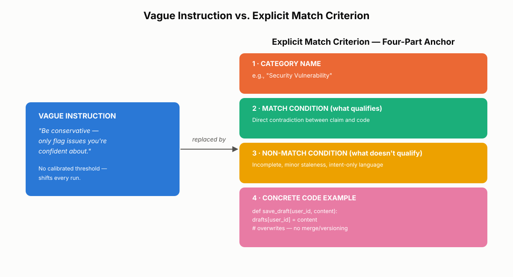
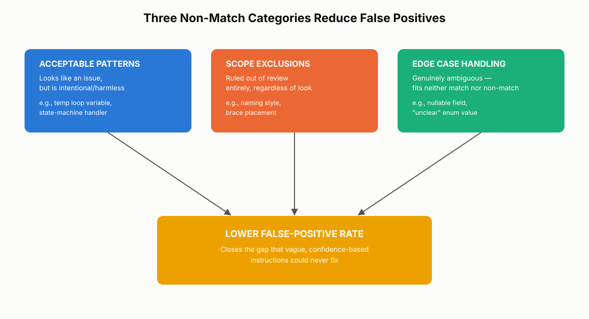
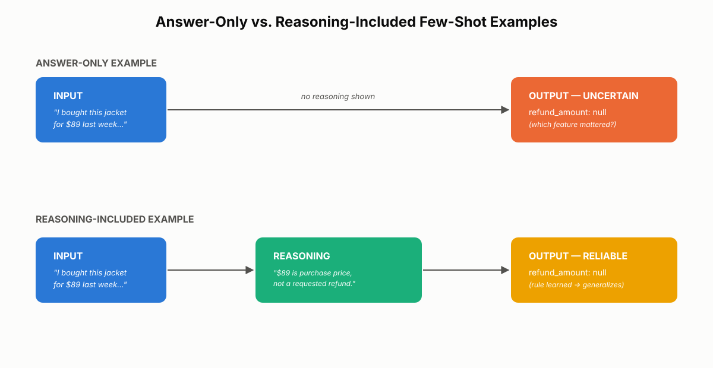

# Match Criteria and Few-Shot Examples

A Claude-powered code review system that floods pull requests with false positives is worse than no review system at all — developers stop reading the findings, and the real bugs slip through with the noise. This chapter opens Domain 4 of the CCA-F exam, prompt engineering and structured output, and tackles the two techniques that fix that failure mode: writing explicit match criteria instead of vague confidence instructions, and using few-shot examples to make output consistent. Both are foundational to every other topic in the domain, and both are tested directly on the exam.

## Domain 4 at a Glance: Prompt Engineering and Structured Output

Domain 4 accounts for 20% of scored exam content, tied with Domain 3 for the heaviest weighting on the exam. It is not a domain about general prompt-writing advice. It is specifically about engineering prompts that produce reliable, structured, actionable output when Claude is embedded in a production system rather than a chat window.

The domain breaks into six task statements:

| Task Statement | Focus | Covered in |
|---|---|---|
| 4.1 | Designing prompts with explicit criteria to reduce false positives | This chapter |
| 4.2 | Few-shot prompting for output consistency | This chapter |
| 4.3 | Enforcing structured output with `tool_use` and JSON Schema | Chapter 14 |
| 4.4 | Validation, retry, and feedback loops | Chapter 14 |
| 4.5 | Batch processing strategies | Chapter 15 |
| 4.6 | Multi-instance and multi-pass review architectures | Chapters 14-15 |

This chapter builds the foundation the rest of the domain depends on. Explicit match criteria and few-shot examples are the input-side fix: they shape what Claude decides to report and how consistently it reports it. Chapters 14 and 15 pick up the output-side and throughput-side problems — enforcing that Claude's decisions arrive in a machine-readable shape, validating that shape before you trust it, and deciding whether to process work synchronously or in batch. None of that matters if the underlying judgment is unreliable, which is why the domain starts here.

> 💡 **Tip:** If you remember one framing for the whole domain, use this one: *criteria → examples → schema → validation → batching → multi-pass*. If output is noisy, tighten the criteria first. If it's still inconsistent, add targeted examples. Only reach for schema enforcement and validation once the underlying judgment is sound.

## Why Vague Instructions Like "Be Conservative" Fail

### The Confidence Dial That Doesn't Exist

Imagine a code review prompt that tells Claude: "Only report issues you're confident about" or "Be conservative — avoid false positives." Developers still see a flood of noise. The instinct is to strengthen the wording — "be *very* conservative," "only flag issues you're *highly* confident* about" — but tightening the adjective changes nothing measurable.

The reason is structural, not motivational. Claude does not have a calibrated confidence dial that a word like "conservative" can turn down. When a prompt gives no concrete criteria, Claude has to invent its own threshold for every single review, and that threshold shifts from run to run and from category to category. Task Statement 4.1 tests this directly: instructions expressed as a confidence level, rather than a concrete test, do not improve precision. They just relocate the guessing from the reviewer's mind (where at least it was consistent) to Claude's, where it is not.

### The Trust Cost of False Positives

The exam also expects you to reason about the downstream effect of getting this wrong, not just the immediate one. A high false-positive rate in one finding category — say, style nitpicks flagged as bugs — does not stay contained to that category. It teaches developers to distrust the entire tool. Once a reviewer learns that half of the "security" findings are noise, they stop reading the "security" findings closely, including the ones that catch a real vulnerability. Vague instructions do not fail quietly; they fail in a way that erodes trust in output that was actually correct.

**Real-world use case:** A platform team ships an automated Claude reviewer that flags "potential logic errors" with no further definition. In the first week, 60% of flagged items are intentional patterns (defensive null checks, early returns) rather than bugs. Developers stop opening the review comments at all — including the one week later that correctly caught a race condition in a payment handler. The fix wasn't a smarter model; it was replacing "flag potential logic errors" with the explicit criteria described in the next section.

Task Statement 4.1 gives you two concrete strategies for this situation, and the exam expects you to recognize both:

1. **Write specific review criteria** that separate what to report (bugs, security vulnerabilities) from what to skip (minor style issues, local naming conventions).
2. **Temporarily disable high-false-positive categories** entirely, to restore developer trust while you rebuild the prompt for just those categories.

Both strategies replace a vague confidence threshold with a concrete categorical decision. Neither asks Claude to "try harder" — both change what Claude is actually being asked to evaluate.

> ✅ **Best Practice:** If a specific finding category is producing more noise than signal, turn it off rather than tolerating it while you iterate. A narrower reviewer that developers trust beats a comprehensive one they ignore.

> ⚠️ **Common Mistake:** Tightening the adjective ("be more careful," "only report if you're very sure") instead of replacing it with a concrete test. This produces the same output distribution, because the model still has no fixed threshold to apply — just a stronger-sounding version of the same absent one.

## Writing Explicit Match Criteria (Task Statement 4.1)

### The Three-Part Structure of a Match Criterion

An explicit match criterion has three required parts:

1. **The category name** — the label for the type of finding (e.g., "Security Vulnerability").
2. **What qualifies as a match** — a concrete, testable condition.
3. **What does not qualify** — the boundary that keeps Claude from stretching the category to fit borderline cases.

Skipping the third part is the single most common mistake. Without an explicit non-match, Claude will overmatch, because a criterion phrased only in the positive ("flag comments that are inaccurate") invites every borderline case in.

Compare a vague instruction to an explicit criterion for the same finding type:

```
Vague:     "Check that comments are accurate."

Explicit:  "Flag a comment only when the claimed behavior directly
            contradicts what the code actually does.
            Do not flag comments that are merely incomplete,
            outdated in minor ways, or that describe intent
            without asserting a specific behavior."
```

The explicit version defines the match condition (a direct contradiction between claim and code) and simultaneously defines the non-match (incompleteness, minor staleness, intent-only language). That single sentence does the work that "be conservative" could never do, because it gives Claude a test it can apply the same way every time.

### Anchoring Categories with Concrete Examples

A category definition alone is still abstract enough to drift. The exam expects you to pair each category with a concrete code example showing what a real finding looks like. The example anchors the definition to something specific and prevents Claude from generalizing the category to cover cases that merely resemble it.

```
Category: Data Loss Bug
Definition: Code that discards, overwrites, or fails to persist
            data the user reasonably expects to be saved.
Example:
    def save_draft(user_id, content):
        drafts[user_id] = content   # overwrites prior draft with no merge
                                     # or versioning — matches this category
```

Without the code example, Claude has only the sentence to work from, and sentences are more elastic than code. With it, Claude has a reference point to compare new code against.

### Assigning Severity Levels

Explicit criteria extend beyond match/non-match into severity. Each severity level needs its own definition and its own concrete example, so Claude can calibrate consistently:

- **Critical** — a bug that causes data loss, or a security vulnerability that allows unauthorized access.
- **Medium** — a logic error that produces incorrect results only under specific, less common conditions.
- **Low** — a defect that is real but has negligible user-facing impact.

**Real-world use case:** A fintech company builds a Claude-based reviewer for its payments codebase. Early versions used categories alone ("Bugs," "Security," "Style") and produced wildly inconsistent severity labels — the same class of null-pointer risk was tagged Critical in one file and Low in another. Adding a one-sentence definition plus a concrete code example per severity level eliminated the inconsistency within the next review cycle, because reviewers (and Claude) now had the same anchor to compare against.

This structure — categories with definitions, concrete examples, and severity levels with their own examples — is what the exam means by "explicit criteria." It replaces the subjective judgment that "be conservative" asks for with a framework Claude applies mechanically, review after review.


*Figure 13.1: The three-part structure of an explicit match criterion, contrasted with the vague confidence-based instruction it replaces.*

## Defining Non-Matches and Edge Cases

### Acceptable Patterns

Even a well-formed match criterion doesn't eliminate false positives on its own, because most false positives come from code that *resembles* a finding without actually being one. A variable named `temp` inside a loop can trip a "poor naming" rule even though it's a completely legitimate, scoped temporary. A function with high cyclomatic complexity can trip a "too complex" rule even though it's a deliberately exhaustive state machine handler.

Acceptable patterns are the first of three non-match categories you need to define explicitly: things that look like issues on the surface but are intentional or harmless in context. If your prompt never states that a well-commented state machine handler is an acceptable exception to a complexity rule, Claude has to guess — and guessing tends to overflag, because reporting a possible issue feels safer to the model than staying silent about one.

### Scope Exclusions

The second category is scope exclusions: things you have decided the reviewer will never comment on, regardless of how they look. Minor style preferences, local naming conventions, and subjective formatting choices belong here. Listing these explicitly — "do not flag: naming style, brace placement, import ordering" — prevents Claude from inventing findings in territory you've already ruled out of scope.

### Edge Case Handling

The third category is edge case handling: what Claude should do when an input doesn't fit cleanly into either match or non-match. This is where Task Statement 4.3 (covered in full in Chapter 14) starts to matter, because the fix is often a schema decision rather than a wording decision — adding an enum value like `"unclear"` for genuinely ambiguous findings, or making a field nullable when the information needed to decide either way simply isn't present in the code under review. Making a field optional rather than required prevents Claude from fabricating a value just to satisfy a schema that demands one.

**Real-world use case:** A documentation-QA prompt flags "inconsistent terminology" across a technical manual. Without scope exclusions, it also flags every deliberate brand-name variant ("Claude" vs. "Claude Code") as an inconsistency. Adding a scope exclusion — "product name variants used correctly per their documented meaning are not terminology inconsistencies" — removed an entire class of false positives in one prompt revision.

> ⚠️ **Important:** A prompt that defines only what counts as a finding is an incomplete prompt, even if every match condition in it is airtight. Every finding category needs a matching non-match definition, or Claude will fill that gap with its own guess — and its guess skews toward overreporting.


*Figure 13.2: The three types of non-matches that close the gap left by match criteria alone, reducing the false positives that "be conservative" could never fix.*

Every production-grade prompt needs both sides of the ledger: what to flag, and what to deliberately leave alone. Define acceptable patterns, scope exclusions, and edge case handling together, and you close most of the surface area that generates false positives.

## When to Reach for Few-Shot Examples (Task Statement 4.2)

### Three Situations That Signal You Need Examples

Explicit criteria fix *what* Claude decides. They don't always fix *how consistently* Claude expresses that decision. A prompt with airtight match criteria can still produce a bulleted list with severity labels on one run and a paragraph of prose on the next, because the criteria define the judgment, not the output shape or the reasoning path Claude takes to get there.

That's the signal for few-shot examples. Task Statement 4.2 positions few-shot examples as the most effective technique for achieving consistently formatted, actionable output *once instructions are already explicit and the output is still inconsistent*. Few-shot examples are a second resort, not a first one — reach for them after you've tightened the criteria, not instead of tightening them.

The exam expects you to recognize three specific situations that call for few-shot examples:

1. **Output format is inconsistent** despite clear formatting instructions — bullets one run, prose the next, inconsistent field ordering, or inconsistent severity phrasing.
2. **Ambiguous cases are handled differently each time** — for example, a system choosing between two tools for a borderline request, picking a different one on functionally identical inputs.
3. **Extraction tasks produce empty or null values** for fields that genuinely exist in the source but appear in varied formats — an inline citation instead of a bibliography entry, a narrative description instead of a structured table.

All three share a root cause: the instructions tell Claude *what* to do, but not *what the result should look like* when the input is messy or ambiguous.

**Real-world use case:** A support-automation system must route incoming tickets to either a "billing" tool or an "account access" tool. A ticket that says "I can't see my last invoice" is genuinely ambiguous — it could be a billing display issue or an access permissions issue. Without examples, the system alternates between tools on nearly identical tickets. A single few-shot example showing the ambiguous ticket, the reasoning for picking one tool over the other, and the final tool call stabilizes the routing decision across future tickets that share the same shape of ambiguity — even ones with completely different wording.

The deeper reason few-shot examples work is that they demonstrate judgment, not just format. Task Statement 4.2 draws this distinction explicitly: well-built few-shot examples let Claude generalize judgment to novel patterns, rather than only matching the exact cases you happened to specify. That distinction is the entire subject of the next section.

> ✅ **Best Practice:** Treat inconsistent output as diagnostic information. If the *content* of Claude's decisions is right but the *shape* keeps varying, that's a few-shot problem, not a criteria problem — don't respond by rewriting the criteria yet again.

## How Many Few-Shot Examples to Include

### The 2-4 Rule and What "Targeted" Means

Too few examples and Claude can't generalize a pattern from them. Too many and you're spending context-window budget on illustration instead of the actual task — a real cost in a production system processing thousands of items. For CCA-F exam purposes, the number to hold in mind is **2-4 targeted few-shot examples**, the range given in the Skills section of Task Statement 4.2.

General best-practice guidance on few-shot prompting sometimes cites a slightly wider range (3-5 examples). Reconcile the two by treating the wider figure as a general starting point and the exam's 2-4 figure as the number to apply once you've narrowed examples down to only the ones that are *targeted* — a distinction the exam tests as heavily as the count itself.

A targeted few-shot example is not a random sample of correct output. It's a deliberately chosen case that demonstrates how to resolve one specific type of ambiguity, edge case, or format variation that your instructions alone couldn't settle. Two competing pressures explain why the range sits at 2-4 rather than 1 or 10:

- You need enough examples for Claude to extract a *generalizable* pattern rather than memorize one instance — which usually requires at least two.
- Every example consumes tokens in the context window on every single call, which is a real, recurring cost at production volume.

### Choosing Which Edge Cases Deserve an Example

The selection process is straightforward: identify the 2-4 types of ambiguity or format variation causing the most inconsistency in your current output, then write one targeted example for each. Each example should target a *different* failure mode — if all your examples illustrate the same kind of ambiguity, Claude learns to handle that one case well and still fails on the others.

Task Statement 4.2 lists representative scenarios worth targeting: tool selection for ambiguous requests, coverage gaps at the branch level rather than the line level, handling informal or non-standard measurements, and varied document structures such as inline citations versus bibliography entries.

**Real-world use case:** A legal-document extraction system pulls a "governing law" field from contracts. Some contracts state it in a dedicated clause ("This Agreement shall be governed by the laws of Delaware"), others bury it in a definitions section, and others state it only implicitly through a forum-selection clause. Rather than writing ten examples covering every contract template the company has seen, the team writes three: one for the dedicated-clause case, one for the buried-definitions case, and one for the implicit-forum case where the field should be marked `"unclear"` rather than guessed. Three targeted examples, each hitting a distinct failure mode, outperformed a longer list of near-duplicate examples.

Prioritize edge cases over standard cases for your few-shot budget. Standard cases are already handled well by your explicit criteria; few-shot examples exist specifically to cover the gap that explicit instructions leave behind.

> 🚀 **Pro Tip:** Before writing a new few-shot example, check whether it targets a failure mode your existing examples already cover. If it does, you're spending context budget without buying additional generalization — pick a different failure mode instead.

## Why Examples Must Show Reasoning, Not Just Answers

### Answer-Only vs. Reasoning-Included Examples

You can hit the 2-4 target, cover the right edge cases, and still get inconsistent output — if the examples show only the answer and not the thinking that produced it. An input-output pair teaches Claude *what* the correct output was for that one case. It does not teach Claude *which features of the input actually mattered*, which is exactly what's needed to handle the next input that looks a little different.

Two forms of a few-shot example, side by side:

```
Answer-only:
  Input:  "I bought this jacket for $89 last week and want to return it."
  Output: refund_amount: null

Reasoning-included:
  Input:  "I bought this jacket for $89 last week and want to return it."
  Reasoning: "$89 is mentioned, but it's the original purchase price,
              not a stated refund amount. The customer is requesting
              a return, but no specific refund figure has been agreed
              to or requested. This field should be null."
  Output: refund_amount: null
```

Both examples produce the same correct output. But ask what the model actually learns from the first one. Maybe it learns to null the field when the word "bought" appears. Maybe it learns to null it when the amount is under $100. Maybe it learns to null it whenever clothing is mentioned. It's not possible to know which — and neither does the model, which means the next email that varies along any of those surface dimensions has a real chance of being handled wrong.

### The Refund Extraction Case Study

The reasoning-included version teaches something different: it demonstrates the actual rule being applied — a mentioned price is not the same thing as a requested refund amount — rather than just the outcome of applying it. That distinction generalizes. When a later email says "I paid $300 for this last month," the model recognizes it as the same purchase-price pattern even though none of the specific words match the original example.

This is the mechanism behind why reasoning matters: language models pick up whatever pattern is most salient in an example. When the only signal available is the final answer, surface-level features — specific words, specific numbers, specific phrasing — get disproportionate weight, because they're the only thing correlated with the outcome the model can see. Including the reasoning explicitly points at which features matter and which ones are incidental.

This is also why reasoning-included examples matter most for genuinely ambiguous cases — the ones where two reasonable people might disagree on the right answer. Reasoning is how you communicate the tiebreaker. Without it, Claude has to guess which interpretation you intended, and on ambiguous inputs it will guess inconsistently, run after run.


*Figure 13.3: Answer-only examples teach the mapping between one input and one output; reasoning-included examples teach the decision rule, which is what allows Claude to generalize to inputs it has never seen.*

> ✅ **Best Practice:** Write the reasoning step first, then the output. If you can't articulate *why* a given output is correct in one or two sentences, the example probably won't teach Claude anything more durable than the specific input it's attached to.

> ⚠️ **Common Mistake:** Writing a few-shot example that just restates the match criteria in different words without showing an actual decision being made between plausible alternatives. A reasoning step that doesn't confront a real tradeoff ("could be X, but it's actually Y because...") teaches nothing that the criteria didn't already say.

## Looking Ahead in Domain 4

This chapter covered the input side of Domain 4: making sure Claude's underlying judgment is well-specified (explicit match criteria) and consistently expressed (few-shot examples with reasoning). Two problems remain even with both of those solved. First, "consistently expressed" prose is still prose — a downstream system parsing it has to guess where one field ends and another begins. Second, nothing so far stops Claude from inventing a plausible-looking value when the real one is missing.

Chapter 14 addresses both: enforcing structured output with `tool_use` and JSON Schema (Task Statement 4.3), why schema validation alone doesn't stop a model from fabricating a value that satisfies the schema without being true, and the validation-and-retry loops needed to catch it (Task Statement 4.4). Chapter 15 addresses throughput: when to route work through the Synchronous API versus the Batch API, and the cost/latency tradeoff that decision represents (Task Statement 4.5), along with how multi-instance and multi-pass review architectures (Task Statement 4.6) let you split "find candidate issues" and "confirm real ones" into separate, more reliable passes.

## Chapter Summary

Domain 4 tests whether you can make Claude's output reliable and structured in a production system, not just conversationally good. Vague, confidence-based instructions like "be conservative" fail because Claude has no calibrated confidence threshold to tune — the fix is explicit match criteria: a category name, a concrete match condition, and an explicit non-match condition, each anchored with a real code example, with severity levels defined and exemplified the same way. Most remaining false positives come from undefined non-matches, so every prompt needs acceptable patterns, scope exclusions, and edge case handling defined as explicitly as the match conditions themselves. Once criteria are explicit and output is still inconsistent — in format, in ambiguous-case handling, or in extraction completeness — few-shot examples are the next lever, held to 2-4 targeted examples, each addressing a distinct failure mode. The single highest-leverage detail in any few-shot example is including the reasoning behind the decision, not just the answer, because reasoning is what lets Claude generalize a judgment to inputs it has never seen rather than pattern-matching on surface features of the examples you happened to write.

## Key Takeaways

- Domain 4 (prompt engineering and structured output) is 20% of the exam, tied with Domain 3 for the heaviest weighting, and covers six task statements (4.1-4.6).
- Confidence-based instructions ("be conservative," "only if certain") don't work because Claude has no tunable confidence dial — replace them with explicit match criteria.
- An explicit match criterion has three parts: category name, what qualifies (match), and what doesn't qualify (non-match) — the non-match is the part most often skipped, and its absence is the most common cause of overmatching.
- Anchor every category and every severity level with a concrete, real example; definitions alone are too elastic to prevent Claude from stretching a category to fit borderline cases.
- Define three types of non-matches explicitly: acceptable patterns (looks like an issue, isn't), scope exclusions (out of scope entirely), and edge case handling (genuinely ambiguous — often solved with an `"unclear"` enum or a nullable field).
- Reach for few-shot examples only after criteria are explicit and output is still inconsistent — in format, in ambiguous-case handling, or in extraction completeness.
- Use 2-4 targeted few-shot examples, each addressing a different failure mode; more examples cost context-window budget without adding generalization once failure modes start repeating.
- Every few-shot example should show the reasoning behind the decision, not just the input-output pair — reasoning is what teaches Claude which features of an input actually mattered, so it can generalize instead of pattern-matching.
- High false-positive rates in one finding category erode trust in every category, including the ones where Claude is accurate — this downstream effect, not just the immediate noise, is what the exam expects you to reason about.

## Interview Questions

1. A stakeholder asks you to fix a noisy Claude-based reviewer by adding the instruction "only flag issues you're highly confident about." Explain why this won't work and what you'd propose instead.
2. Walk through the three parts of an explicit match criterion using a finding category of your choosing (e.g., "race condition," "PII exposure").
3. Why does a code example anchoring a category definition matter more than a well-written sentence defining that category?
4. Describe the three types of non-matches you'd define for a document classification system, with one concrete example of each.
5. Why does Claude tend to overflag when a prompt only specifies what counts as a finding, without specifying what doesn't?
6. Under what three situations does the exam expect you to add few-shot examples, and why are they a second resort rather than a first one?
7. Justify the 2-4 targeted few-shot example guideline: why not one example, and why not ten?
8. Explain, using a concrete example, why an answer-only few-shot example teaches a narrower lesson than a reasoning-included one.

## Practice Questions & Answers

**Practice Question (unofficial):** You're building a Claude-based reviewer for pull requests that currently uses the instruction: "Flag any code that looks risky." It produces a 70% false-positive rate. Rewrite this as an explicit match criterion for one category of your choosing, including the non-match condition and a concrete example.

*Answer:* Pick a concrete category, e.g., "Unhandled External Failure."
- **Category:** Unhandled External Failure
- **Match condition:** "Flag a call to an external service (API, database, file system) only when its failure path has no handling at all — no try/catch, no error branch, and no fallback — and the surrounding function assumes the call always succeeds."
- **Non-match condition:** "Do not flag calls where failures are handled by a wrapper or middleware upstream of this function (e.g., a global HTTP client interceptor), or where the call is wrapped in a broader try/catch that covers this line even if not adjacent to it."
- **Example (match):** `response = requests.get(url); data = response.json()` with no try/except anywhere in the function and no upstream interceptor.
- **Example (non-match):** The same call inside a function decorated with `@retry_on_failure`, where the retry decorator already handles the failure path.

This structure gives Claude a concrete test (is there any failure handling, anywhere in scope?) instead of an open-ended judgment call ("does this look risky?"), which is what drives the false-positive rate down.

**Practice Question (unofficial):** A document-extraction system pulls a "contract effective date" field. It returns `null` correctly for contracts stating only a signature date, but inconsistently for contracts where the effective date is described narratively ("This Agreement takes effect upon execution by both parties"). Would you fix this with tighter match criteria, few-shot examples, or both? Justify your answer.

*Answer:* Both, but in sequence. First, check whether the match criteria explicitly address the narrative case — if the current instructions only describe a dedicated "Effective Date:" field pattern, add an explicit rule stating that a narrative clause tying effectiveness to execution counts as an implicit effective date (or explicitly counts as `"unclear"` if no date is derivable). If the criteria already cover this case in writing and the output is still inconsistent, that's the signal for few-shot examples: add one targeted, reasoning-included example showing a narrative-clause contract, the reasoning that ties "effective upon execution" to the signature date found elsewhere in the document (or the reasoning for marking it unclear if no signature date is present), and the correct output. Do not skip straight to few-shot examples without first checking the criteria — few-shot examples compensate for interpretive inconsistency, not for missing rules.

**Practice Question (unofficial):** Explain, with a worked example, why the following few-shot example is weaker than it could be, and rewrite it to fix the weakness:

```
Input: "The button color should probably be blue instead of green."
Output: category: style_preference, should_report: false
```

*Answer:* This is an answer-only example — it shows the correct classification but not why. Claude can only infer a possible rule (maybe color mentions are always style preferences; maybe the word "probably" signals low priority), and either guess could be wrong on a superficially different input, such as "The button color must be blue for accessibility contrast requirements," which is not a style preference despite also mentioning color. The rewrite adds reasoning that identifies the actual distinguishing feature:

```
Input: "The button color should probably be blue instead of green."
Reasoning: "This is a subjective visual preference with no functional,
            accessibility, or brand-guideline justification stated.
            It falls under scope-excluded style preferences."
Output: category: style_preference, should_report: false
```

This version teaches Claude to check for a *stated functional justification* rather than for the mere presence of a color reference — a distinction that correctly separates it from the accessibility-contrast example above.

## Multiple Choice Questions

**Q1.** Why does an instruction like "be conservative" fail to reduce false positives in a Claude-based review prompt?
A. Claude ignores adjectives in system prompts
B. Claude has no calibrated confidence threshold that an adjective can tune, so it applies its own inconsistent judgment
C. Conservative instructions increase the token cost of every request
D. The instruction conflicts with Claude's default temperature setting

**Correct Answer: B**

*Explanation:* Task Statement 4.1 tests this directly — confidence-based language gives Claude nothing concrete to apply, so its internal threshold shifts run to run. A is wrong: Claude does process the adjective, it just can't act on it consistently. C is wrong: token cost is unrelated to this failure mode. D is wrong: temperature is a decoding parameter unrelated to whether instructions are concrete.

**Q2.** According to Task Statement 4.1, what are the two strategies for handling a finding category with a high false-positive rate?
A. Increase the model's temperature and add more instructions
B. Write specific review criteria separating what to report from what to skip, and temporarily disable high-false-positive categories
C. Switch to a larger model and re-run the same prompt
D. Ask Claude to rate its own confidence and filter by that score

**Correct Answer: B**

*Explanation:* The exam names these two strategies explicitly: write concrete criteria, and disable a noisy category temporarily while you fix its prompt. A is wrong — temperature changes don't address the underlying lack of criteria. C is wrong — a larger model doesn't compensate for an underspecified prompt. D is wrong — a self-reported confidence score has the same "no calibrated dial" problem as an instruction to "be conservative."

**Q3.** What are the three required parts of an explicit match criterion?
A. Category name, priority level, and owner
B. Input format, output format, and validation rule
C. Category name, what qualifies as a match, and what does not qualify
D. Severity, likelihood, and business impact

**Correct Answer: C**

*Explanation:* This is the core three-part structure from Task Statement 4.1. A describes a ticketing field, not a match criterion. B describes structured-output concerns (Task Statement 4.3, Chapter 14), not the criterion itself. D describes severity-level content, which is a separate layer added on top of the three-part structure.

**Q4.** Why does the exam emphasize including a concrete code example with each finding category, not just a written definition?
A. Examples are required by the JSON Schema specification
B. Examples reduce the number of tokens needed for the prompt
C. Examples anchor the definition to something specific, preventing Claude from stretching the category to cover borderline cases
D. Examples let Claude skip categories that don't have one

**Correct Answer: C**

*Explanation:* A written definition alone is elastic enough to be stretched to fit ambiguous cases; a concrete example gives Claude a fixed reference point. A is incorrect — JSON Schema (Chapter 14) is a separate structured-output mechanism, not the reason for including examples in criteria. B is incorrect — examples add tokens, they don't save them. D is incorrect and would defeat the purpose of defining the category at all.

**Q5.** A prompt tells Claude to flag "poor variable naming" but never states that a short-lived loop variable like `temp` is acceptable. What is the most likely outcome?
A. Claude will never flag naming issues at all
B. Claude will ask a clarifying question before proceeding
C. Claude will overflag, because reporting a possible issue feels safer to the model than omitting one when no non-match is defined
D. Claude will apply the same threshold a senior engineer would use by default

**Correct Answer: C**

*Explanation:* This is the core mechanism behind why non-matches matter — an undefined boundary pushes the model toward overreporting. A is incorrect, since the match condition is intact and will still fire. B is incorrect for most one-shot API-driven review flows, which don't have a clarification turn. D is incorrect — there's no such default; that's exactly the gap explicit non-matches are meant to close.

**Q6.** Which of the following is an example of a "scope exclusion" rather than an "acceptable pattern"?
A. A deliberately complex function that implements a state machine handler
B. A naming convention preference that the team has decided never to review
C. A finding where the source code lacks enough context to decide either way
D. A retry-decorated function that already handles the failure path being evaluated

**Correct Answer: B**

*Explanation:* A scope exclusion is a category ruled out of review entirely regardless of how it looks — naming style is a classic example. A and D describe acceptable patterns: things that look like issues but are intentional/harmless in a specific instance. C describes edge case handling, the third non-match category, tied to Task Statement 4.3's schema-design approach (nullable fields, "unclear" enums).

**Q7.** In schema-based edge case handling, why does making a field nullable (rather than required) matter?
A. It reduces the total size of the JSON Schema definition
B. It prevents Claude from fabricating a value to satisfy a field the schema demands, when the true value can't be determined
C. It allows the API to skip validation entirely for that field
D. It is required by the Batch API for asynchronous requests

**Correct Answer: B**

*Explanation:* When a field is required, a model forced to produce a value for information that isn't present in the source will tend to invent one; making it optional/nullable removes that pressure. A is a non-sequitur — schema size isn't the concern. C is incorrect — nullable fields are still validated, just against a wider set of acceptable values. D is unrelated to the Batch API, a separate topic covered in Chapter 15.

**Q8.** After a code review prompt already has explicit, well-anchored match criteria, its output still alternates between a bulleted list and a paragraph of prose across runs. What should you add next?
A. A larger temperature setting to increase determinism
B. Additional match criteria for formatting
C. Few-shot examples showing the desired output format
D. A stricter confidence-based instruction

**Correct Answer: C**

*Explanation:* Inconsistent formatting despite explicit criteria is one of the three canonical triggers for few-shot examples under Task Statement 4.2. A is backwards — lower temperature, not higher, reduces variance, and even that doesn't fix a missing format demonstration. B addresses judgment, not format, and format inconsistency isn't a criteria problem. D repeats the exact anti-pattern this chapter opens by rejecting.

**Q9.** Which of the following is NOT one of the three situations the exam identifies as a trigger for adding few-shot examples?
A. Output format is inconsistent despite clear instructions
B. Ambiguous cases (e.g., tool selection) are handled differently each time
C. Extraction tasks return empty or null values for fields present in varied formats
D. The prompt has grown longer than the recommended token budget

**Correct Answer: D**

*Explanation:* Prompt length isn't one of the three named triggers — A, B, and C are the exact three situations Task Statement 4.2 identifies. D describes a real engineering concern (context budget) but is not, on its own, a signal to add examples; in fact it cuts the other way, since examples consume budget.

**Q10.** What is the key difference between few-shot examples that teach "format matching" and ones that teach "judgment generalization," according to the exam's framing?
A. Format-matching examples use JSON, judgment examples use plain text
B. Judgment-generalizing examples show the reasoning behind a decision between plausible alternatives, not just the correct output
C. Format-matching examples are always shorter
D. There is no meaningful difference; both terms describe the same technique

**Correct Answer: B**

*Explanation:* The exam explicitly distinguishes examples that just demonstrate the correct answer from ones that demonstrate the reasoning process, which is what lets Claude generalize to novel inputs. A and C describe surface characteristics unrelated to the actual distinction. D is incorrect — the distinction is central to Task Statement 4.2.

**Q11.** How many targeted few-shot examples does the exam recommend for CCA-F purposes?
A. Exactly 1
B. 2-4
C. 8-10
D. As many as fit in the context window

**Correct Answer: B**

*Explanation:* This is the specific number given in the Skills section of Task Statement 4.2. A is too few to establish a generalizable pattern. C and D ignore the real context-budget cost of examples at production scale, which is the exact pressure that caps the range at 4.

**Q12.** What does it mean for a few-shot example to be "targeted," as distinct from simply being correct?
A. It uses the exact wording the production system will see
B. It is drawn at random from a large set of historical correct outputs
C. It is deliberately chosen to demonstrate a specific type of ambiguity or format variation that instructions alone couldn't resolve
D. It includes a numeric confidence score alongside the output

**Correct Answer: C**

*Explanation:* "Targeted" specifically excludes random sampling — the exam tests this distinction directly. A describes an unrelated property (exact wording isn't necessary or expected). B is the opposite of targeted, and is explicitly called out as insufficient. D reintroduces the confidence-score anti-pattern rejected earlier in the chapter.

**Q13.** A team writes four few-shot examples for a review prompt, but all four illustrate the same type of ambiguity (informal measurement values). What is the most likely consequence?
A. Claude will handle informal measurements perfectly and generalize equally well to unrelated ambiguity types
B. Claude will handle that one ambiguity type well but continue to fail on other, undemonstrated failure modes
C. The prompt will exceed the context window regardless of content
D. The four examples will cancel each other out and produce worse results than one example

**Correct Answer: B**

*Explanation:* Each example should target a distinct failure mode; four examples of the same type spend the full few-shot budget without covering other known problem areas. A is incorrect because generalization is scoped to what was actually demonstrated. C is a separate, unrelated concern about token count. D has no basis — redundant examples don't actively harm output, they just waste budget that could have covered another failure mode.

**Q14.** A refund-extraction example shows the input "I bought this jacket for $89 last week and want to return it" mapping to `refund_amount: null`, with no reasoning included. What is the primary risk of this example as written?
A. It will cause Claude to reject all future refund requests
B. Claude cannot tell whether the relevant distinguishing feature was the word "bought," the amount being under $100, or the mention of clothing, and may generalize incorrectly on a new email
C. It violates JSON Schema validation rules
D. It will cause the API to return a `stop_reason` of `max_tokens`

**Correct Answer: B**

*Explanation:* This is the exact failure mode the chapter's case study illustrates — without reasoning, several surface features are equally plausible explanations, and the model has no way to know which one to generalize from. A overstates the effect wildly. C is unrelated — this is a prompting concern, not a schema-validation concern (covered in Chapter 14). D describes an unrelated API response field with no connection to example quality.

**Q15.** What does including reasoning in a few-shot example primarily help Claude do on a later, differently-worded input?
A. Match the exact wording of the example more precisely
B. Apply the same underlying decision rule (e.g., distinguishing a mentioned price from a requested refund amount) even though the wording differs entirely
C. Increase its confidence score for the output field
D. Skip validation of the output against the schema

**Correct Answer: B**

*Explanation:* Reasoning teaches the decision rule rather than the surface mapping, so it survives changes in wording, which is precisely what happened with the "I paid $300 for this last month" example in the chapter. A is backwards — the goal is to generalize beyond exact wording, not match it. C invents a mechanism ("confidence score") the model doesn't expose this way. D is unrelated to reasoning quality; schema validation is a separate, downstream concern.

**Q16.** Domain 4 of the CCA-F exam is best described as testing which of the following?
A. General best practices for writing any prompt to any language model
B. Engineering prompts and output pipelines that are reliable, structured, and actionable specifically in production systems
C. How to reduce Claude's API latency through prompt compression
D. How to select the correct Claude model size for a given task

**Correct Answer: B**

*Explanation:* The domain overview is explicit that this is not general prompt-writing advice but production-reliability engineering: explicit criteria, few-shot examples, structured output, validation, batching, and multi-pass review. A is too broad and explicitly disclaimed. C and D describe topics outside this domain's scope entirely.

## Evaluate Yourself

1. **Scenario:** You inherit a Claude-based invoice-processing prompt that extracts `vendor_name`, `invoice_total`, and `due_date`. It returns `null` for `due_date` roughly 30% of the time, even on invoices where a due date is clearly stated but phrased as "Net 30 from invoice date" rather than an explicit calendar date. Diagnose whether this is a match-criteria problem, a few-shot problem, or both, and describe the specific fix you'd implement first.

2. **Architecture design:** You're designing a Claude-based content moderation system for a community forum with three finding categories: harassment, spam, and off-topic posts. For each category, sketch the three-part match criterion structure (category, match, non-match), one severity example, and identify which category is most likely to need few-shot examples versus which is likely well-served by explicit criteria alone. Justify the difference.

3. **Short-answer reflection:** In your own words, explain why "write explicit criteria" is not itself a sufficiently explicit instruction — what makes the difference between a criterion that Claude can apply mechanically and one that still requires guesswork?

4. **Scenario:** A teammate proposes writing ten few-shot examples for a document-classification prompt "to be thorough," covering every document template the company has on file. Explain, using the token-budget and generalization arguments from this chapter, why you'd push back on this approach, and describe how you'd narrow the ten down to a smaller, more effective set.

5. **Architecture design:** Design a few-shot example (input, reasoning, output) for a customer-support ticket router that must decide between escalating a ticket to a human versus resolving it automatically, for a case where the ticket text expresses frustration but does not contain any of the three valid escalation triggers. Explain why the reasoning step is essential to this particular example even though the correct output (do not escalate) might seem obvious in isolation.
