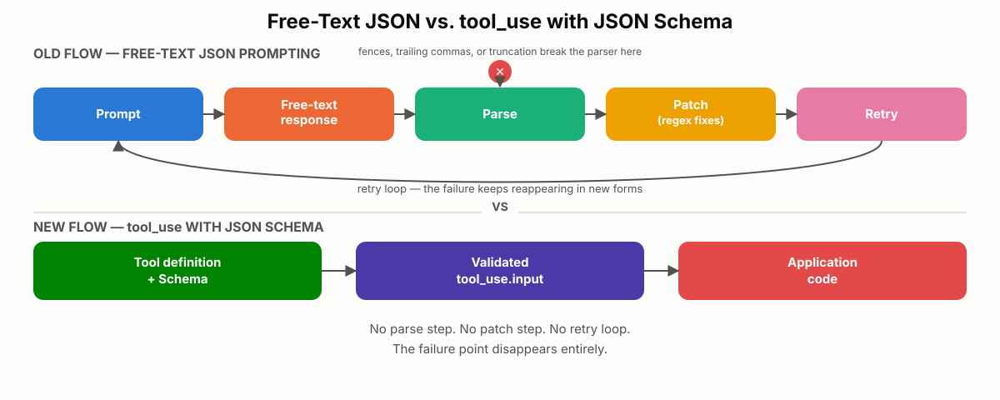
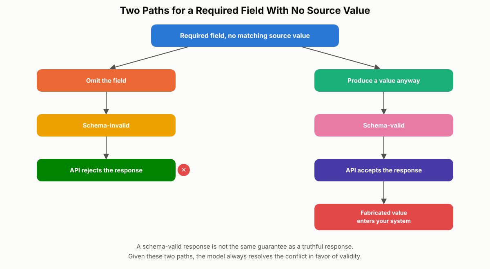
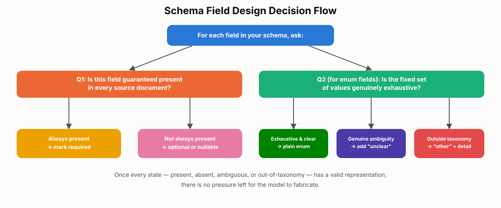

# JSON Schema and Structured Output

Chapter 13 covered how to write explicit instructions and few-shot examples so Claude makes the right *decision*. This chapter covers how to make Claude return that decision in a *shape* your application can trust — reliably, every time, without a cleanup script standing between the model and your database. You'll learn why `tool_use` with JSON Schema is the standard fix for malformed output, and why it solves exactly one class of problem while leaving a more dangerous one — fabricated data hiding inside perfectly valid JSON — for you to solve through schema design. This is the structured-output task statement in Domain 4 of the CCA-F exam guide, and it reuses the `tool_use` mechanism from Chapter 1 as its enforcement point.

## Why JSON-as-Text Breaks in Production

The most common way teams try to get structured data out of Claude is also the least reliable: ask for it in plain language. A prompt like "extract the line items and return them as JSON" works most of the time. The problem is "most of the time" isn't a production guarantee — it's a slow-motion incident.

When you ask a model to produce JSON as free-form text, you're asking it to *type* JSON into a text response, character by character, the same way it types prose. Nothing structurally stops it from wrapping the object in markdown code fences, adding a trailing comma, inserting an explanatory comment, or getting cut off mid-object before the closing brace. Any one of those breaks a standard JSON parser.

In a low-volume prototype, you might never see this. In a high-volume pipeline processing thousands of documents a day, even a 1% failure rate means dozens of broken records daily — parser exceptions, retries, and engineers getting paged to patch a problem that keeps reappearing in new forms.

### The Downstream Patching Trap

Most teams respond to this by fixing symptoms instead of the cause. The typical progression looks like this:

1. Strip markdown code fences with a regex.
2. Strip trailing commas with another regex.
3. Add retry logic for outright parse failures.
4. Bring in a "JSON repair" library as a catch-all.

Each patch narrows the failure rate but never closes it, because the underlying assumption — that the model is a free-text generator you can coax into valid syntax — is the actual bug. Free-form text generation has an unbounded number of ways to deviate from strict JSON, and no stack of downstream fixes can enumerate all of them in advance.

> ⚠️ **Important:** If your team is maintaining a growing pile of regex fixes and retry loops around JSON parsing, that is a signal you're solving the problem at the wrong layer. The fix belongs in the request, not in the response-handling code.

## `tool_use` with JSON Schema: The Fix at the Source

The fix is to stop asking Claude to write JSON as prose and instead give it a **structured target to fill in** — a tool definition backed by a JSON Schema. This is the same `tool_use` mechanism from Chapter 1's agentic loop, just applied here for a different purpose: not calling an external function, but constraining the *shape* of Claude's output.

### How the Contract Works

Instead of a plain-text instruction, you send a tool definition alongside your request. That definition has three parts:

- **`name`** — a short, descriptive identifier for the tool (for example, `record_invoice`).
- **`description`** — a plain-language explanation of what the tool does, following the same five-element description discipline from Chapter 5.
- **`input_schema`** — a JSON Schema object that defines exactly which fields the output must contain, their types, and which fields are required.

You include this tool definition in your API request. When Claude decides to produce the structured result, it doesn't return a text block — it returns a `tool_use` content block whose `input` field is an object that already conforms to your schema. The Claude API validates that input against the schema before it's returned to you. There is no intermediate text to parse and no cleanup step afterward — you branch on `stop_reason` equal to `tool_use`, exactly as in Chapter 1's agentic loop, and read `input` directly as a Python or JavaScript object.

### Defining a Tool with an Input Schema

Here's what a tool definition looks like for an invoice-extraction use case:

```python
import anthropic

client = anthropic.Anthropic()

invoice_tool = {
    "name": "record_invoice",
    "description": (
        "Record structured fields extracted from an invoice document. "
        "Use this tool once per document to report the vendor, date, "
        "total amount, invoice number, and customer email found in the text."
    ),
    "input_schema": {
        "type": "object",
        "properties": {
            "vendor": {"type": "string"},
            "date": {"type": "string", "format": "date"},
            "total": {"type": "number"},
            "invoice_number": {"type": "string"},
            "customer_email": {"type": "string"}
        },
        "required": ["vendor", "date", "total", "invoice_number", "customer_email"]
    }
}

response = client.messages.create(
    model="claude-sonnet-4-5",
    max_tokens=1024,
    tools=[invoice_tool],
    tool_choice={"type": "tool", "name": "record_invoice"},
    messages=[
        {"role": "user", "content": f"Extract the invoice fields from this document:\n\n{document_text}"}
    ]
)

for block in response.content:
    if block.type == "tool_use":
        extracted = block.input   # already a validated dict — no parsing needed
```

Setting `tool_choice` to force the `record_invoice` tool guarantees Claude calls it rather than replying conversationally. The finer-grained `tool_choice` options — `auto`, `any`, and forcing a specific tool — matter more once an agent has several tools to choose between, which is outside this chapter's scope.

Notice the schema above marks all five fields as `required`. That looks like the responsible choice — you want every field, every time. Hold that thought; it's the exact decision that causes the failure mode covered later in this chapter.

### What `tool_use` Guarantees — and What It Doesn't

The schema is not a suggestion embedded in a prompt that the model might ignore. It's a contract the API enforces before the response ever reaches your code. That's why `tool_use` with JSON Schema is the standard, exam-tested answer for guaranteeing schema-compliant output: no markdown fences, no trailing commas, no truncated objects, no manual parsing step.

But read that guarantee precisely. It guarantees **structure** — that the object parses, that required keys are present, and that field types match. It does not guarantee **truth**. If your schema has a `total` field and a `line_items` array, the API will happily accept a response where the line items don't sum to the total. That's a semantic error, not a formatting one, and no amount of schema validation catches it.

**Real-world use case:** An accounts-payable team processing several hundred vendor invoices a day switches from "return the fields as JSON" prompting to a `record_invoice` tool definition. Parser-related failures — the leading cause of pipeline retries — drop to zero in the same week, because every response is now schema-validated before it reaches their ingestion code. The team is relieved, and reasonably so. But as you'll see in the next section, this is also the exact moment a more dangerous, invisible failure mode starts building up in their data.

> ✅ **Best Practice:** Treat `tool_use` with a JSON Schema as your default for any Claude output your code will parse programmatically — extraction, classification, form-filling, structured summaries. Reserve free-text prompting for output a human will read directly.


*Figure 14.1: Contrasts the old flow (prompt → free text → parse → patch → retry) with the `tool_use` flow (tool definition + schema → validated `tool_use.input` → application code), showing where the failure point disappears.*

## The Fabrication Problem: When Valid JSON Is Still Wrong

Here is the failure mode that makes structured output genuinely hard to get right: your JSON can parse perfectly, pass schema validation with no errors, and still contain data that was never in the source document at all. Anthropic's exam materials and most production teams call this **fabrication** — a value the schema accepts as valid but that the model invented rather than extracted.

### Anatomy of a Fabricated Value

Take the `record_invoice` tool defined above, with `invoice_number` marked required. Feed Claude a document that is actually a receipt, not an invoice — it never contained an invoice number to begin with. The response still comes back with one: `INV-2024-001`, or some similarly plausible string. The JSON parses. The schema validates. Your pipeline stores the value, and nothing anywhere signals a problem.

This isn't the model "hallucinating" in the sense of losing track of the document. It is following your instructions with total fidelity. You told it, via the schema, that every valid response must include an invoice number. Leaving the field out would make the output schema-invalid, and schema-invalid output is rejected. Producing *something* is the only path that satisfies the contract you wrote. The model chose correctly, given the rules you gave it — the rules themselves were wrong.

### Why Fabrication Is More Dangerous Than a Syntax Error

A syntax error is loud. The parser throws, an exception surfaces, an alert fires, and a human looks at the record before it goes anywhere. Fabrication is silent by construction: it produces a well-formed object that passes every structural check you have.

Once a fabricated value enters your system, it doesn't stay contained. It gets written to a database row, it triggers a downstream payment or reconciliation workflow, it shows up in a customer-facing confirmation email, it syncs into a CRM. By the time anyone notices — usually because a customer disputes a charge, an audit fails, or a reconciliation report doesn't tie out — the fabricated value has already propagated across several systems, and untangling which records are real and which were invented becomes its own investigation.

> ⚠️ **Important:** A fake invoice number is not distinguishable from a real one by looking at it. Fabrication cannot be caught by inspecting the output — it can only be prevented by the schema design decisions covered later in this chapter, or caught by independent verification against a source of truth.

### Two Common Mistakes

**Mistake 1: Treating `tool_use` as a complete solution.** Teams see clean JSON and passing schema validation and conclude the data must be correct. Schema validation checks shape, not truth. It cannot tell you whether `total` matches the sum of `line_items`, or whether `invoice_number` was actually printed on the page.

**Mistake 2: Making every field required.** The instinct is reasonable — "I want to guarantee I always get this field" — but the mechanism backfires. Required fields don't guarantee the value is real; they guarantee the model will manufacture something when the real value is absent. You don't get "I always get the value." You get "I always get a value, and sometimes it's invented."

**Real-world use case:** A logistics company auto-extracts shipment reference numbers from carrier documents to reconcile freight invoices. Several carriers send delivery confirmations that never include a reference number. Because the field was required, the model filled in plausible-looking reference numbers on those documents for months. The team only discovered it when a quarterly reconciliation showed reference numbers that didn't match any record in the carrier's own system — by then, the fabricated values had already been used to auto-approve payments.

## Required Fields and the Mechanics of Empty-Field Fabrication

Fabrication isn't random model behavior — it's a predictable consequence of one specific schema decision. Understanding the mechanism lets you read a schema and predict exactly where fabrication will happen before you run a single document through it.

### What "Required" Actually Means

Marking a field `required` in JSON Schema is a stronger statement than "I want this field." It means: *an output missing this key is invalid, full stop.* If a field genuinely appears in every source document your system will ever see, `required` is the correct choice — there's no tension. The failure mode appears specifically when a field is marked required despite being **inconsistently present** in the source.

### The Model's Two Paths

When Claude fills in a required field and the source document contains no matching value, it faces exactly two options:

1. **Omit the field.** The output becomes schema-invalid. The API rejects it.
2. **Produce a value anyway.** The output becomes schema-valid. The API accepts it.

Given those two paths, the model takes the second one every time — not from confusion, but because it's the only path that satisfies the contract you defined. Worse, the schema gives the model no vocabulary for representing absence: no `unclear` option, no `null`, no way to say "this wasn't in the source." So it generates the closest plausible-looking value: something shaped like an invoice number, something shaped like an email address. Structurally, that fabricated value is indistinguishable from a real one.

### Predicting Fabrication Before You Run the Model

For every field you're tempted to mark required, ask one question: **is this field guaranteed to be present in every source document you'll extract from?**

- **Always** → `required` is correct.
- **Usually, but not always** → it should not be required.
- **Sometimes** → marking it required is actively wrong and will generate fabricated data.

Counterintuitively, the fields most likely to trigger this are the fields engineers consider most important — customer email, invoice number, account ID, reference number. Those fields matter, but "important" and "guaranteed present" are different properties, and conflating them is exactly what produces fabrication.

### Fabrication at Scale — a 100-Document Case Study

Consider an extraction schema with five required fields: `vendor`, `date`, `total`, `invoice_number`, `customer_email`. Now run it across a realistic mixed batch of 100 incoming documents:

| Document type | Count | Missing required fields |
|---|---|---|
| Clean invoices | 60 | None |
| Receipts (no invoice number, no email) | 20 | `invoice_number`, `customer_email` |
| Damaged scans (invoice number cut off) | 10 | `invoice_number` |
| Quotes, not invoices | 10 | Several fields |

Across the 40 problematic documents, the schema forces a fabricated value into every missing required field. All 100 documents still parse. Schema validation passes on all 100. Your pipeline raises zero alerts. Yet 40% of the resulting dataset contains at least one invented value sitting quietly alongside 60% that's fully accurate — and nothing in your monitoring distinguishes the two.

**Real-world use case:** A managed-services provider building an invoice-ingestion product for multiple client accounts discovers this exact 40% pattern during a client audit. The fix wasn't a better prompt or a bigger model — it was going through the schema field by field and applying the "is this guaranteed?" test, which is the subject of the next section.


*Figure 14.2: This decision tree shows why a schema-valid response and a truthful response are not the same guarantee, and why the model always resolves that conflict in favor of validity.*

## Fixing Fabrication: Optional and Nullable Fields

The fix for the required-field problem is not a smarter model or a more forceful prompt — it's giving the model a schema-legal way to represent "this value isn't in the source." Two mechanisms do that: optional fields and nullable fields. Both solve the same underlying problem; they differ in how the resulting shape looks to your downstream code.

### Optional Fields

An optional field is simply removed from the schema's `required` array. If the source contains the value, the model includes the key. If it doesn't, the key is absent from the output entirely — and the response is still schema-valid either way.

```python
"properties": {
    "vendor": {"type": "string"},
    "date": {"type": "string", "format": "date"},
    "total": {"type": "number"},
    "invoice_number": {"type": "string"},
    "customer_email": {"type": "string"}
},
"required": ["vendor", "date", "total"]
```

The trade-off: your application code now has to handle a field that might not exist at all, not just one that might be empty. Code that assumes `result["invoice_number"]` is always present will throw a `KeyError` on documents where it's legitimately missing.

### Nullable Fields

A nullable field takes the opposite approach: the key always stays present in the output, and its value is allowed to be `null`. In JSON Schema, this means expressing the field's type as an array that includes `"null"`, while keeping the field in `required` (required here means "the key must exist," not "the value must be non-null"):

```python
"properties": {
    "vendor": {"type": "string"},
    "date": {"type": "string", "format": "date"},
    "total": {"type": "number"},
    "invoice_number": {"type": ["string", "null"]},
    "customer_email": {"type": ["string", "null"]}
},
"required": ["vendor", "date", "total", "invoice_number", "customer_email"]
```

Downstream, the shape never changes — every response has exactly the same five keys — and your code does a simple presence-of-value check: `if result["invoice_number"] is not None`.

### Choosing Between Them

| | Optional fields | Nullable fields |
|---|---|---|
| Key present in output? | Only when value exists | Always |
| Downstream handling | Must check key existence | Must check for `null` |
| Best fit | Loosely-typed languages, business logic where the field is genuinely optional | Databases, UI binding, strongly-typed systems that expect a consistent shape |
| Verbosity | Slightly less | Slightly more |

If you're unsure which to pick, default to nullable. The extra verbosity is cheap, and a consistently-shaped response eliminates an entire class of "missing key" bugs in code that expects every field to exist.

### Applying the Fix to a Real Schema

Return to the invoice schema. `vendor`, `date`, and `total` are present on essentially every invoice — keeping them required is correct. `invoice_number` and `customer_email` are inconsistent across document types, so they move to nullable:

```python
invoice_tool_v2 = {
    "name": "record_invoice",
    "description": (
        "Record structured fields extracted from an invoice document. "
        "If invoice_number or customer_email do not appear in the document, "
        "return null for that field rather than inventing a value."
    ),
    "input_schema": {
        "type": "object",
        "properties": {
            "vendor": {"type": "string"},
            "date": {"type": "string", "format": "date"},
            "total": {"type": "number"},
            "invoice_number": {"type": ["string", "null"]},
            "customer_email": {"type": ["string", "null"]}
        },
        "required": ["vendor", "date", "total", "invoice_number", "customer_email"]
    }
}
```

Now a receipt with no customer email validates cleanly and returns `customer_email: null` instead of an invented address. You've kept validation exactly where it earns its keep — a genuinely missing `total` still fails the pipeline — and removed the pressure that was forcing fabrication on the fields that were never guaranteed in the first place.

**Real-world use case:** An insurance company's claims-intake system extracts structured fields from uploaded claim forms, which vary by policy type and state. Fields like `policy_holder_name` and `date_of_loss` are always present and stay required; fields like `witness_email` and `secondary_contact_phone` are only sometimes collected and were made nullable. Fabrication on those two fields — previously showing up as clearly fake emails like `unknown@claim.com` — disappeared the same week the schema changed.

> ✅ **Best Practice:** Audit an existing extraction schema by listing every required field and asking the "guaranteed present?" question from the previous section. Any field that isn't a clear "always" is a fabrication risk waiting to happen.

## Handling Ambiguity: Enum "unclear" and "other + detail" Patterns

Optional and nullable fields solve the *missing-value* problem. A second, more subtle version of fabrication happens when the source **does** contain a value, but that value doesn't map cleanly onto the fixed set of choices your schema allows. Two patterns close this gap: an `unclear` enum value, and an `other` option paired with a free-text detail field.

### The Problem with Fixed Enums

An `enum` constrains a field to a closed list of options. That's exactly what you want for consistent categorization — until the source hands you a case that doesn't fit any option, or a case that genuinely fits more than one. Faced with that, the model still has to return something from the list. It picks the closest match, and the response looks just as confident as a correct classification. The ambiguity that was present in the source data quietly disappears from your output.

### Pattern 1: The `unclear` Enum Value

Imagine a support-ticket triage schema classifying tickets into `billing`, `technical`, `shipping`, or `account`. A customer writes: "My package never arrived and I was charged twice." That ticket is legitimately both a shipping issue and a billing issue — there's no confident single answer.

```python
"category": {
    "type": "string",
    "enum": ["billing", "technical", "shipping", "account", "unclear"]
}
```

Adding `unclear` gives the model a truthful way out. Instead of forcing a guess between `billing` and `shipping` that looks like a confident classification, the response honestly flags the case, and your downstream logic can route `unclear` tickets to a human reviewer instead of auto-processing them as if the category were certain.

### Pattern 2: `other` + a Detail Field

The second case is different: the value in the source is perfectly clear, it just doesn't match any option you defined. A product catalog enum with `electronics`, `clothing`, `home_goods`, and `food` has no slot for a fitness tracker. Without an escape hatch, the model forces it into the closest category — probably `home_goods` — and that misclassification looks completely valid in your data.

The fix adds two things: an `other` option in the enum, and a companion free-text field to capture what the value actually is.

```python
"category": {
    "type": "string",
    "enum": ["electronics", "clothing", "home_goods", "food", "other"]
},
"category_detail": {
    "type": ["string", "null"]
}
```

Now a fitness tracker comes back as `category: "other"`, `category_detail: "fitness tracker"` — data you can review, aggregate, and use to decide whether `wearables` deserves to become a first-class enum value in a future schema revision.

### Combining Patterns in a Single Field

These patterns aren't mutually exclusive — production schemas typically combine all four techniques on the same field. Take a support-ticket `priority` field:

```python
"priority": {
    "type": ["string", "null"],
    "enum": ["low", "medium", "high", "unclear", "other", None]
},
"priority_detail": {
    "type": ["string", "null"]
}
```

This single field now has a safe representation for every state the source document could actually be in: `null` when priority is never mentioned, `unclear` when the signals conflict, `other` plus `priority_detail` for a priority scheme the schema didn't anticipate, and a clean enum value when the signal is unambiguous. Once every state has a legitimate, schema-valid output, the pressure that drives fabrication has nowhere left to apply.

**Real-world use case:** An e-commerce marketplace ingesting product feeds from thousands of third-party sellers uses exactly this combination — nullable fields for attributes some sellers never populate, an `unclear` value for ambiguous size/fit descriptions, and `other` plus a detail field for new product types that don't fit the marketplace's fixed taxonomy yet. New product categories get flagged through `other` + `category_detail` instead of silently misfiled, giving the catalog team a queue of real candidates for taxonomy expansion instead of a spreadsheet full of quietly wrong labels.

> 🚀 **Pro Tip:** When you find yourself adding an `other` option to an enum, also add its detail field in the same schema revision. An `other` value with nowhere to record *what* it actually was is only marginally better than a forced misclassification — you can see something didn't fit, but not what to do about it.


*Figure 14.3: Walks a schema author through the sequence of questions covered in this chapter — is the field always present, is a fixed set of values genuinely exhaustive, and what representation the model should use when the answer to either is no.*

## Chapter Summary

`tool_use` with a JSON Schema solves a real and costly problem: it stops Claude from generating JSON as free-form text that markdown fences, trailing commas, or truncation can silently corrupt. The API validates the tool's structured input against your schema before your code ever sees it, which is why it's the standard exam answer for guaranteeing parseable, schema-compliant output.

What it does not solve is truth. A schema validates shape — required keys present, correct types — never whether a value is real. The most damaging version of this gap comes from required fields: when a field must always be present but the source document doesn't always contain it, the model manufactures a plausible value rather than producing invalid output, and that fabricated value passes every check you have in place. The fix isn't a better prompt — it's better schema design: make inconsistently-present fields optional or nullable, and give ambiguous or out-of-taxonomy values a legitimate home through `unclear` enum values and `other` plus a detail field. Combined, these patterns give the model a truthful way to represent every state a source document can actually be in, which removes the pressure that produces fabrication in the first place.

## Key Takeaways

- `tool_use` with JSON Schema eliminates JSON syntax errors by making the API validate structure before your code receives it — no markdown fences, trailing commas, or truncated objects.
- Schema validation only checks shape and type. It never checks whether a value is true, which is why perfectly valid JSON can still contain fabricated data.
- Fabrication is dangerous specifically because it's silent: no exception, no alert, and a fabricated value is structurally indistinguishable from a real one.
- A `required` field forces exactly two paths when the source lacks a value: omit it (schema-invalid, rejected) or fabricate something (schema-valid, accepted). The model always takes the second path.
- Predict fabrication risk by asking, for every required field, "is this guaranteed to be in every source document?" Anything short of "always" is a fabrication risk.
- Optional fields let a key disappear entirely when no value exists; nullable fields keep the key present with a `null` value. Nullable is the safer default when downstream code expects a consistent shape.
- An `unclear` enum value represents genuine ambiguity in the source; an `other` value plus a free-text detail field represents a clear value that doesn't fit your predefined categories. Production schemas often combine both with nullable fields on the same field.

## Interview Questions

1. Explain why asking Claude to "return the answer as JSON" in plain text is unreliable in a high-volume production pipeline, and what specifically changes when you switch to `tool_use` with a JSON Schema.
2. What exactly does JSON Schema validation guarantee about a `tool_use` response, and what does it explicitly not guarantee? Give a concrete example of a response that would pass validation and still be wrong.
3. Walk through why marking a field `required` can cause a model to fabricate a value. What are the model's only two options when a required field has no matching value in the source?
4. You inherit an extraction schema where every field is marked required. How would you audit it to find fields that are likely causing fabrication, without running a single test document?
5. Describe the difference between an optional field and a nullable field in JSON Schema, and explain a scenario where you'd deliberately choose one over the other.
6. When would you add an `unclear` value to an enum versus adding an `other` option with a detail field? What different problem does each one solve?
7. Why is fabrication considered more dangerous in production systems than a JSON syntax error, even though a syntax error is the more visible failure?
8. Design a schema for a single field that could plausibly be missing, genuinely ambiguous, or fall outside a predefined set of categories. Explain how each part of your design addresses one of those three states.

## Practice Questions & Answers

**Practice Question (unofficial):** You built a `record_invoice` tool with `invoice_number` marked as a required string field. After a month in production, an audit finds hundreds of invoice numbers that don't match any real document. The JSON has never failed to parse, and schema validation has never once failed. What's happening, and what's your fix?

*Answer:* The pipeline is experiencing fabrication, not a formatting bug. Because `invoice_number` is required, any document that doesn't actually contain an invoice number — receipts, quotes, damaged scans — still forces the model to produce a schema-valid response, and the only way to do that is to invent a plausible-looking value. Schema validation passes because it only checks structure and type, never truth, so nothing in the pipeline ever flags the problem. The fix is to change `invoice_number` to a nullable field (`"type": ["string", "null"]`, kept in `required` so the key always exists) so the model can honestly return `null` when no invoice number is present in the source. Downstream code should then check for `null` before using the value, and any workflow that depends on having a real invoice number (like auto-approving a payment) should treat `null` as a case requiring human review rather than silently proceeding.

**Practice Question (unofficial):** Your team argues that switching `invoice_number` from required to optional/nullable will make the schema "less strict" and reduce data quality. How do you respond?

*Answer:* The concern has the mechanism backwards. Marking the field required never guaranteed data quality — it guaranteed the *presence of some value*, real or fabricated. Actual data quality was never enforced by the required flag; it was assumed. Making the field nullable doesn't lower your standards, it makes the schema honestly reflect what the model can and cannot know: when the source has a value, the field is populated exactly as before; when it doesn't, you now get an explicit `null` instead of an invented string that looks identical to a real value. That's a strictly more accurate, more auditable system — you can now run a query for `invoice_number IS NULL` and know precisely how many documents lacked the field, something the required-and-fabricated version made impossible to detect at all.

**Practice Question (unofficial):** You're designing a `ticket_category` enum for a support system with values `billing`, `technical`, `shipping`, and `account`. During testing, you notice the model sometimes classifies genuinely two-issue tickets (like "damaged item, need refund") into just one category with high apparent confidence. Separately, a small number of tickets are about a new subscription-cancellation flow that doesn't map to any existing category. Design the fix.

*Answer:* Two different problems need two different patterns. The two-issue-ticket problem is ambiguity — add an `unclear` value to the enum so tickets that genuinely straddle two categories get flagged for human review instead of being forced into one category with false confidence. The subscription-cancellation problem is an out-of-taxonomy value — add an `other` option to the enum plus a `category_detail` free-text field, so those tickets come back as `category: "other"`, `category_detail: "subscription cancellation"` instead of being misfiled into the closest existing category. The resulting schema: `"enum": ["billing", "technical", "shipping", "account", "unclear", "other"]` with a companion nullable `category_detail` field. Over time, a recurring `category_detail` value (like repeated "subscription cancellation" entries) is a strong signal that it deserves to become its own first-class enum value in the next schema revision.

**Practice Question (unofficial):** A colleague says, "We use `tool_use` with a JSON Schema, so our extraction pipeline can't return bad data." Is this statement accurate? Explain your reasoning in a way you could use to correct the claim without dismissing the value of what they built.

*Answer:* The statement conflates two different guarantees. `tool_use` with a JSON Schema does eliminate an entire class of bad data — malformed JSON, missing required keys, wrong field types — and that's a real, valuable guarantee worth keeping. What it does not do is guarantee the *values* inside that valid structure are true. A response can satisfy every rule in the schema and still contain a fabricated invoice number, an invented email address, or line items that don't sum to the stated total. The correction isn't "your pipeline is broken," it's "you've solved the syntax problem completely — now the remaining risk is semantic, and it's addressed through schema design choices like optional/nullable fields and enum escape hatches, not through the tool_use mechanism itself."

## Multiple Choice Questions

**Q1.** What is the primary problem that `tool_use` with a JSON Schema solves?
A. It makes Claude choose more accurate values for extracted fields
B. It prevents JSON syntax errors like markdown fences, trailing commas, and truncated output
C. It eliminates the need to define required fields in a schema
D. It automatically retries failed extractions until the data is correct

**Correct Answer: B**

*Explanation:* `tool_use` with a schema constrains the model to emit a structurally valid object that the API validates before it reaches your code, closing off markdown fences, trailing commas, stray comments, and truncation. A is wrong — accuracy of values is a semantic concern the schema cannot enforce. C is wrong — required fields are still a schema feature you define and reason about carefully. D is wrong — nothing about `tool_use` implies automatic retries; that's separate application logic.

**Q2.** In an Anthropic API tool definition, which field contains the JSON Schema that constrains the model's structured output?
A. `description`
B. `tool_choice`
C. `input_schema`
D. `stop_reason`

**Correct Answer: C**

*Explanation:* `input_schema` is the tool-definition field that holds the JSON Schema describing the expected structure of the tool's arguments. A, `description`, is plain-language text describing the tool's purpose, not a schema. B, `tool_choice`, controls whether/which tool the model is forced to call, not the shape of its input. D, `stop_reason`, is a response-level field indicating why generation stopped (e.g., `tool_use`), unrelated to schema definition.

**Q3.** A schema validates a `tool_use` response successfully. What does that guarantee?
A. Every value in the response is factually accurate
B. The response's structure and field types match the schema
C. The source document definitely contained every required field
D. No downstream system will ever misuse the data

**Correct Answer: B**

*Explanation:* Schema validation checks shape: presence of required keys and correct types. A is wrong — this is exactly the fabrication trap; valid structure says nothing about truth. C is wrong — a required field can pass validation with a fabricated value even when the source never contained it. D is an unrelated, overly broad claim schema validation makes no promise about.

**Q4.** Why does fabrication typically go undetected longer than a JSON syntax error?
A. Fabricated values are usually much larger than real values
B. The API rejects fabricated values, so teams have time to catch them
C. Fabrication produces schema-valid output with no exception or alert
D. Fabrication only happens with numeric fields, which are easy to sanity-check

**Correct Answer: C**

*Explanation:* Fabrication produces a structurally valid response, so no parser exception or validation failure ever fires — there's no natural alerting point. A is a fabricated (no pun intended) claim with no basis. B is wrong — the API accepts fabricated-but-valid output; it doesn't reject it. D is wrong — fabrication can affect any field type (strings, emails, identifiers), not just numbers.

**Q5.** A required field has no matching value in 15% of source documents. What happens when the model processes those documents?
A. The API automatically converts the field to null
B. The response fails schema validation and is rejected
C. The model fabricates a plausible-looking value to satisfy the schema
D. Claude returns a text response instead of a tool_use block

**Correct Answer: C**

*Explanation:* Faced with a required field and no source value, the model's only path to a valid response is to generate something — so it does, every time. A is wrong — the API doesn't auto-convert anything; the schema you defined is enforced as written. B is wrong — this is precisely what doesn't happen, and that's the danger: the response passes, it just contains an invented value. D is wrong — nothing about a missing source value causes Claude to abandon the tool_use format.

**Q6.** Which question best predicts whether a required field will cause fabrication?
A. Is this field important to the business?
B. Is this field guaranteed to be present in every source document?
C. Is this field a string type or a numeric type?
D. Does this field have a short or long name?

**Correct Answer: B**

*Explanation:* Guaranteed presence in the source, not perceived importance, is what determines whether `required` is safe. A is a trap answer — important fields (invoice number, customer email) are often exactly the ones that aren't guaranteed present, which is why they cause the most fabrication. C and D are irrelevant to the required-field mechanism.

**Q7.** What is the mechanical difference between an optional field and a nullable field in JSON Schema?
A. Optional fields can hold any data type; nullable fields are restricted to strings
B. Optional fields are removed from the required list, so the key may be absent entirely; nullable fields stay required but their type includes null
C. Nullable fields are only supported in newer versions of JSON Schema
D. There is no meaningful difference; the terms are interchangeable

**Correct Answer: B**

*Explanation:* Optional means the key can be missing from the output; nullable means the key is always present but its value may be `null`. A is incorrect — type restriction has nothing to do with optional vs. nullable. C is incorrect — nullable-via-type-array is standard JSON Schema, not a version-gated feature. D is incorrect — the two produce meaningfully different output shapes and require different downstream handling.

**Q8.** Which scenario is the best fit for a nullable field rather than an optional field?
A. A prototype script where field presence doesn't matter
B. A strongly-typed downstream system (e.g., a database schema or UI component) that expects a consistent set of fields every time
C. A field you're certain will never be missing from any source document
D. A field that should never appear in the output under any circumstances

**Correct Answer: B**

*Explanation:* Nullable fields keep the output shape consistent, which matters most when downstream code or storage expects the same fields on every record. A doesn't specifically benefit from nullable over optional. C describes a field that should simply be required, not nullable. D describes a field that shouldn't exist in the schema at all.

**Q9.** In JSON Schema, which type declaration correctly marks a string field as nullable?
A. `"type": "string", "nullable": true`
B. `"type": ["string", "null"]`
C. `"required": false`
D. `"type": "null-string"`

**Correct Answer: B**

*Explanation:* Standard JSON Schema expresses a nullable type as an array including `"null"`. A describes an OpenAPI-style `nullable` flag, not standard JSON Schema syntax used in Anthropic's `input_schema`. C controls whether the key must be present, not whether its value may be null. D is not a valid JSON Schema type.

**Q10.** A support-ticket schema has a `category` enum with four fixed options. A ticket genuinely fits two of those categories equally well. What's the correct fix?
A. Remove the enum and let the model return free text instead
B. Add an `unclear` value to the enum so genuine ambiguity can be represented honestly
C. Force the model to always choose the alphabetically first matching category
D. Mark the category field as optional so it can be left out entirely

**Correct Answer: B**

*Explanation:* `unclear` gives the model a truthful way to flag genuine ambiguity instead of forcing a falsely confident single choice. A discards the benefits of a closed classification scheme entirely. C is arbitrary and doesn't reflect anything true about the ticket. D doesn't address ambiguity — it addresses absence, a different problem with a different fix.

**Q11.** A product-category enum doesn't include a category for a new type of product. What is the recommended two-part fix?
A. Add the new category directly to the enum without any other change
B. Add an `other` enum value plus a separate free-text detail field
C. Reject the document and skip extraction entirely
D. Mark the entire schema as invalid until it's redesigned

**Correct Answer: B**

*Explanation:* `other` plus a detail field captures the value honestly and gives you real data to decide whether the new category deserves to become a first-class enum option later. A is a valid long-term fix for a confirmed pattern, but doesn't handle unanticipated one-off cases without a schema change each time. C discards otherwise-usable extracted data unnecessarily. D is an overreaction — the schema doesn't need a full redesign to add one escape-hatch pattern.

**Q12.** Why does combining nullable fields, `unclear`, and `other` + detail on a single field reduce fabrication most effectively?
A. It makes the field's enum list shorter, which is easier for the model to parse
B. It gives the model a legitimate, schema-valid representation for every state the source document could actually be in
C. It removes the need for a JSON Schema entirely
D. It forces the model to always pick a specific default value

**Correct Answer: B**

*Explanation:* When missing, ambiguous, and out-of-taxonomy values all have a truthful home in the schema, there's no state left where the model is forced to invent something to stay valid. A is not the underlying mechanism — the point isn't list length. C is false — these patterns are all still expressed within a JSON Schema. D contradicts the pattern; there's deliberately no forced default that overrides real information.

**Q13.** What does marking a field `required` actually enforce in JSON Schema terms?
A. The value must be non-empty and truthful
B. The key must be present in every valid response, regardless of the value's truthfulness
C. The field must be a string type
D. The API will retry the request until the field is populated correctly

**Correct Answer: B**

*Explanation:* `required` only enforces key presence — nothing about the schema checks whether the value is accurate. A overstates what `required` checks; truthfulness is never validated. C is unrelated — required and type are independent schema properties. D is incorrect — there is no automatic retry behavior tied to the required keyword.

**Q14.** A team removes `invoice_number` from the required list entirely (making it optional) rather than making it nullable. What trade-off should their downstream code account for?
A. Nothing changes; optional and nullable behave identically downstream
B. The field may be entirely absent from the response object, so code must check for key existence, not just for a null value
C. The field will always default to an empty string instead of being absent
D. The schema will silently reject any document missing that field

**Correct Answer: B**

*Explanation:* With an optional field, the key itself may not exist in the output, so downstream code needs an existence check (e.g., `.get()` or `"invoice_number" in result`), not just a null check. A is incorrect — this is precisely the behavioral difference between the two approaches. C describes neither optional nor nullable behavior. D is incorrect — optional fields are designed specifically so the response is *not* rejected when the field is missing.

**Q15.** Which statement best summarizes the relationship between `tool_use`/JSON Schema and fabrication?
A. JSON Schema prevents fabrication automatically because it validates every value against the source document
B. Fabrication is a model bug unrelated to schema design and can only be fixed with a better prompt
C. JSON Schema guarantees structural validity; preventing fabrication requires deliberate schema design choices like optional/nullable fields and enum escape hatches
D. Fabrication only occurs when JSON Schema is not used at all

**Correct Answer: C**

*Explanation:* This is the core relationship covered in this chapter: structure and truth are separate guarantees, and only the second requires deliberate schema design. A is false — schemas never check values against source documents; that's outside what schema validation does. B is false — fabrication is a direct, predictable consequence of schema design (specifically required fields), not an unrelated model defect. D is false — fabrication is actually more likely to slip through unnoticed *with* schema validation in place, precisely because the validation passes.

## Evaluate Yourself

1. **Scenario:** You're handed a production schema for extracting data from employment contracts. It has eight required fields, including `signing_bonus_amount` and `non_compete_clause_text`. Extraction has been running for three months. Walk through how you'd investigate whether fabrication is occurring, without access to the original source documents for comparison.
2. **Architecture design:** Design a JSON Schema for a customer-intake form used across three different product lines, where roughly 40% of fields vary by which product line the customer selected. Decide, field by field, which should be required, nullable, or optional, and justify each choice.
3. **Short answer:** A teammate proposes adding `"unclear"` as an enum value everywhere, "just to be safe," across a schema with 12 enum fields. What would you push back on, and under what condition is an `unclear` value actually justified for a given field?
4. **Scenario:** Your extraction pipeline has been running for six months with a schema that marks `customer_email` as required. A downstream marketing team has been sending campaigns to every extracted email address without validation. What immediate and long-term steps would you take once you learn the field has likely been causing fabrication?
5. **Architecture design:** You need to classify support tickets not just by category but also by urgency, and you anticipate that ticket volume from a new product line will introduce urgency signals your current enum doesn't cover. Design the `urgency` field's schema, including how it should evolve once real `other`/`unclear` data starts accumulating.
6. **Short answer:** Explain, in terms you could use to brief a non-technical stakeholder, why "the JSON always parses correctly" is not the same claim as "the data is always correct."
