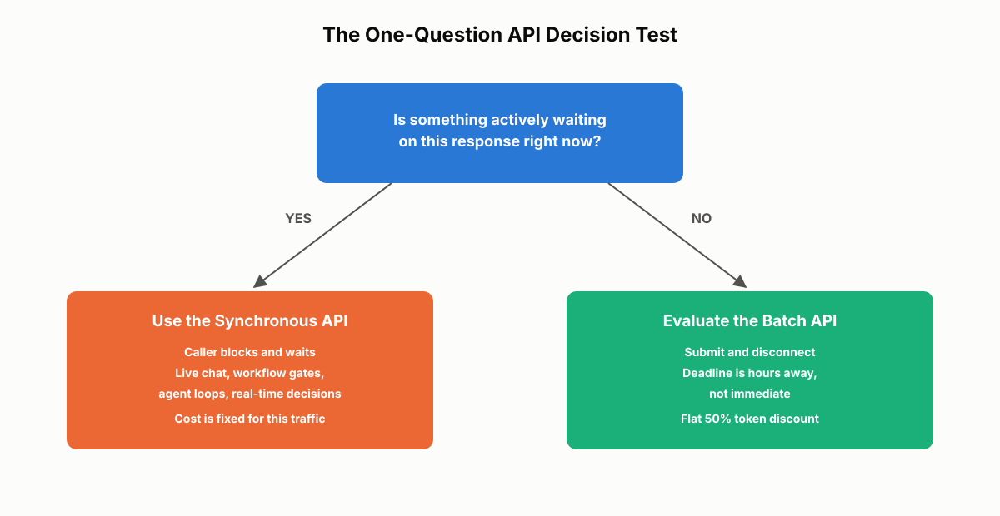
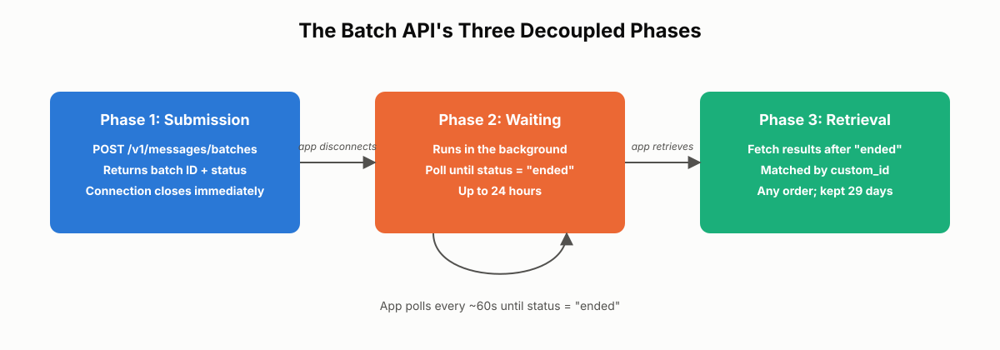
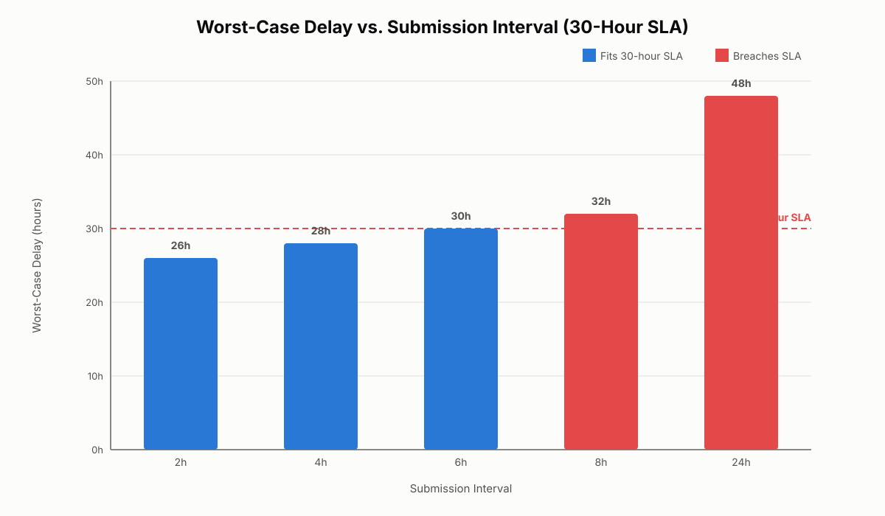
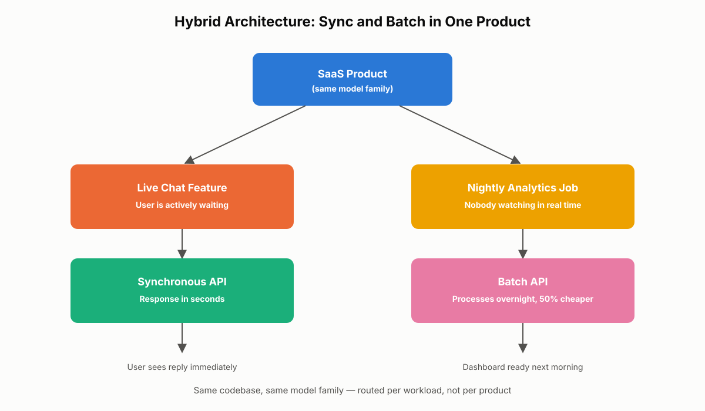

# API Selection: Cost vs. Latency

Every production system built on Claude eventually hits the same architectural fork: should this request block until Claude responds, or can it run in the background and be picked up later? This chapter covers Task Statement 4.5 of the CCA-F exam guide — choosing between the Synchronous API and the Batch API, and reasoning correctly about the cost-versus-latency tradeoff between them. You will learn the one-question test for picking an API pattern, the mechanics and constraints of batch processing, the SLA math the exam expects you to work through under time pressure, and the governing rule that latency is a hard constraint while cost is the optimization layer you apply afterward.

## The Synchronous API: When Something Is Waiting

### What a Synchronous Call Actually Does

A Synchronous API call is a blocking request. Your application sends a request to the model, holds the connection open, and waits until Claude finishes generating before it does anything else. For a short prompt the round trip might take a few seconds; for a long generation it can take longer. What defines the pattern isn't the exact latency — it's that the caller is actively suspended, waiting for the result before it can proceed. This is the same request/response shape your application already uses for any other HTTP-based API call: send, wait, continue.

```python
import anthropic

client = anthropic.Anthropic()

response = client.messages.create(
    model="claude-sonnet-4-5",
    max_tokens=1024,
    messages=[{"role": "user", "content": "What is the capital of France?"}],
)

for block in response.content:
    if block.type == "text":
        print(block.text)
```

The code above is unremarkable on purpose. There is no batch ID, no polling loop, no asynchronous retrieval step — the response is either in `response.content` when the call returns, or the call raised an error. That simplicity is exactly why Sync is the default mental model for API usage, and why it's the right choice for the majority of production traffic.

### The One-Question Test for Choosing Sync

The rule of thumb for choosing Sync is a single question: **is something actively waiting on this response right now?**

- If a user is sitting in front of a screen waiting for the answer, that's Sync.
- If your application is mid-workflow and cannot proceed until the model responds, that's Sync.
- If a downstream system needs the output immediately to make a decision or take the next step, that's Sync too.

Notice what is deliberately absent from that question. The deciding factor is not request volume, not total cost, and not even raw latency in isolation. The only thing that matters is whether the response sits on the **critical path** of something else. If another process is blocked on the model's output, Sync is correct — regardless of how many requests per day you're sending or how expensive they are.

### Common Synchronous Workload Patterns

Four categories of workload are naturally synchronous:

1. **Live user interactions** — chat applications, search assistants, autocomplete, interactive copilots. The user is watching the screen, so latency directly shapes the experience.
2. **Pre-merge workflow gates** — a CI pipeline runs a model-based check on a pull request, and the merge can't proceed until the check reports back. A developer is waiting in real time.
3. **Agent workflows** — in a multi-step agentic loop, each response determines the next tool call. The workflow physically cannot advance until the current step completes, so every step in the loop belongs on the synchronous path.
4. **Real-time decision systems** — fraud detection during a transaction, support-ticket routing, message classification, and moderation checks that gate whether content is allowed to publish. In each case, another system is paused, waiting for the model's decision before it can act.

**Real-world use case:** A payments platform runs fraud scoring on every checkout transaction before authorizing the charge. The checkout flow cannot complete until Claude returns a risk score — this is unambiguously synchronous, even though the platform processes millions of transactions a day and the aggregate cost is significant. Volume never overrides "something is waiting."

### The Batch Temptation: A Common Mistake

The most common architectural mistake in this space is straightforward to describe and easy to fall into: a team looks at the Batch API's 50% cost savings, gets excited, and starts routing everything through Batch — including workloads that users are actively waiting on. The reasoning sounds sensible on the surface ("if it's cheaper, why not use it everywhere?"), but it ignores the actual tradeoff. Batch doesn't just lower cost — it trades cost for latency, and some workloads simply cannot absorb that delay.

Concretely, moving a synchronous workload into Batch produces predictable damage:

- A live chat assistant that used to respond in three seconds now responds twenty minutes later, long after the user has closed the tab.
- A pre-merge code review check that used to finish in eight seconds now takes hours, and developers sit idle waiting for feedback before they can continue working.
- An agent workflow breaks outright, because each step depends on the previous response — introducing minutes-to-hours of delay between steps makes the loop unusable.

The 50% savings are real. They just don't apply to a workload that can't tolerate the delay.

> ⚠️ **Important:** Never route a workload to Batch on cost alone. If a human, a workflow, or a downstream system is actively waiting on the result, Sync is the correct interface regardless of price.

> ✅ **Best Practice:** Reserve Sync exclusively for critical-path traffic, and treat its cost as fixed for that traffic. Cost optimization on synchronous workloads happens through model choice, prompt size, and caching — never by moving the workload off the synchronous path.


*Figure 15.1: The one-question decision test: if something is actively waiting on the response, use the Synchronous API; otherwise, evaluate Batch.*

## The Batch API: Trading Latency for Cost

### Three-Phase Lifecycle: Submission, Waiting, Retrieval

The Batch API (`POST /v1/messages/batches`) is built for workloads that don't need an immediate response. You submit a collection of requests, they process in the background, and you retrieve the results later. Mechanically, it operates in three decoupled phases.

**Phase 1 — Submission.** You send a batch containing anywhere from a single request up to the batch's limits (up to 100,000 requests or 256 MB per batch). The connection closes as soon as the submission is accepted, and the API returns a batch object with an ID and a `processing_status`. Your application is not holding a connection open while the work happens.

```python
import anthropic
from anthropic.types.message_create_params import MessageCreateParamsNonStreaming
from anthropic.types.messages.batch_create_params import Request

client = anthropic.Anthropic()

message_batch = client.messages.batches.create(
    requests=[
        Request(
            custom_id="ticket-10432",
            params=MessageCreateParamsNonStreaming(
                model="claude-sonnet-4-5",
                max_tokens=512,
                messages=[{"role": "user", "content": "Summarize this support ticket: ..."}],
            ),
        ),
        Request(
            custom_id="ticket-10433",
            params=MessageCreateParamsNonStreaming(
                model="claude-sonnet-4-5",
                max_tokens=512,
                messages=[{"role": "user", "content": "Summarize this support ticket: ..."}],
            ),
        ),
    ]
)

print(message_batch.id, message_batch.processing_status)
```

**Phase 2 — Waiting.** The batch runs asynchronously on Anthropic's infrastructure. Most batches finish within an hour, but processing can take up to 24 hours depending on system load and scheduling. You don't hold an open connection or wait on responses one at a time — you simply poll the batch's status until it moves from `in_progress` to `ended`.

```python
import time

while True:
    batch = client.messages.batches.retrieve(message_batch.id)
    if batch.processing_status == "ended":
        break
    print(f"status: {batch.processing_status}, processing: {batch.request_counts.processing}")
    time.sleep(60)
```

**Phase 3 — Retrieval.** Once the batch has ended, you fetch results. Each result carries the `custom_id` you assigned at submission, which is how you reconnect an output to its original input. Results are available for 29 days after the batch completes, and — critically — **they can arrive in any order**, so correlate by `custom_id`, never by position.

```python
for result in client.messages.batches.results(message_batch.id):
    if result.result.type == "succeeded":
        msg = result.result.message
        text = next((b.text for b in msg.content if b.type == "text"), "")
        print(f"[{result.custom_id}] {text[:100]}")
    elif result.result.type == "errored":
        print(f"[{result.custom_id}] error: {result.result.error.type}")
    elif result.result.type == "expired":
        print(f"[{result.custom_id}] expired — resubmit")
```

Raw HTTP works the same way if you're not using an SDK:

```bash
curl https://api.anthropic.com/v1/messages/batches \
  -H "x-api-key: $ANTHROPIC_API_KEY" \
  -H "anthropic-version: 2023-06-01" \
  -H "content-type: application/json" \
  -d '{
    "requests": [
      {
        "custom_id": "ticket-10432",
        "params": {
          "model": "claude-sonnet-4-5",
          "max_tokens": 512,
          "messages": [{"role": "user", "content": "Summarize this support ticket."}]
        }
      }
    ]
  }'
```

The architectural point underneath all three phases: submission, waiting, and retrieval are fully decoupled. Your application submits the work and moves on — it is never blocked holding a connection while the batch runs.


*Figure 15.2: The Batch API's three decoupled phases. The application submits work and disconnects; it later polls for status and retrieves results keyed by custom_id.*

### The Economics: 50% Savings Across the Board

The Batch API's discount isn't a small optimization — it's a flat 50% reduction on input tokens, output tokens, and cached reads, applied uniformly across everything you send. You're using the same models and the same prompts as Sync; nothing about the model's behavior changes. The only difference is operational: you trade a firm response-time guarantee for a processing window that can stretch up to 24 hours.

That framing matters for the exam and for real architecture decisions: if a workload can tolerate delayed responses, continuing to run it synchronously means paying roughly double for no benefit the workload actually needs.

### Common Batch Workload Patterns

Batch fits work that has a deadline — just not an immediate one:

1. **Overnight reporting** — daily summaries, executive briefings, digest emails that need to be ready by the next morning, with nobody watching in real time.
2. **Periodic audits** — compliance reviews, moderation passes over archived content, large-scale security scans, and policy checks across a dataset. These run on deadlines measured in hours or days, not seconds.
3. **Bulk dataset enrichment** — classification, tagging, summarization, or metadata extraction across large document collections, whether as a one-time migration or a recurring nightly pipeline.
4. **Nightly test generation** — synthetic test cases generated overnight so they're ready for the next morning's CI run. The CI system doesn't care whether generation took five seconds or five hours; it only cares that the tests exist before execution starts.

> 🚀 **Pro Tip:** Every pattern above shares a structure — there's still a deadline, it's just hours away rather than immediate. That's the signal to look for when classifying a new workload as Batch: a deadline that tolerates delay, not the absence of a deadline.

**Real-world use case:** A document-management platform runs a nightly compliance pass over every file uploaded that day — flagging policy violations, extracting metadata, and tagging sensitive content categories. Nobody is waiting on any individual result; the only requirement is that the pass finishes before the next business day's compliance dashboard refreshes. This is squarely a Batch workload, at half the token cost of running the same classification synchronously as each file was uploaded.

### Two Constraints You Must Design Around

Before you design a batch pipeline, understand two hard constraints.

**1. No multi-turn tool-calling chains within a single request.** Each request inside a batch executes as one independent, isolated Messages API call. Batch requests can absolutely include `tools` in their parameters — but if Claude's response contains a `tool_use` block, nothing in the batch pipeline executes that tool and automatically resubmits the follow-up. You would have to collect the tool-use result yourself and submit a brand-new request (batch or synchronous) with the tool result appended — and each round of that exchange can cost up to another 24-hour processing window. That makes interactive, multi-step agent loops impractical inside Batch. Keep agentic loops and other interactive tool-calling workflows on the synchronous path, where the next request is only as far away as the current one's response.

**2. Request correlation is entirely your responsibility.** Every request you submit gets a `custom_id` you assign; every result comes back carrying that same ID — in arbitrary order, alongside potentially thousands of other results. Without a deliberate ID scheme, you can end up with a pile of responses and no reliable way to map them back to their originating input. Plan your `custom_id` structure — e.g., embedding a stable business key like a ticket number or document ID — before your first submission, not after.

> ⚠️ **Important:** Batch results are not guaranteed to arrive in submission order. Always key your result-processing logic off `custom_id`, never off list position.

> ✅ **Best Practice:** Design your `custom_id` scheme so it's independently useful for debugging — e.g. `f"{workflow_name}-{record_id}"` — rather than an opaque counter. When a batch partially fails, you want to be able to look at a bare `custom_id` and immediately know what it refers to.

## SLA Planning: The Math Behind Batch Submission Frequency

### The Core Formula

Batch processing can take up to 24 hours, but the systems downstream of your pipeline usually have their own delivery deadlines — a service level agreement (SLA) that doesn't care that the underlying API is asynchronous. The practical question this creates: **how often should you submit batches** so that the worst-case delay still fits inside your SLA?

The formula is simple, and it's the one the exam expects you to apply under time pressure:

```
worst-case delay = submission interval + maximum batch processing time
```

With a 24-hour batch processing ceiling, that becomes:

```
submission interval ≤ SLA window − 24 hours
```

Any submission interval that satisfies this inequality keeps you inside your SLA even in the worst case — a document arriving the instant after a submission window closes, followed by a batch that takes the full 24 hours to process.

### Worked Example: A 30-Hour SLA

Suppose customer documents arrive continuously throughout the day, and generated reports must be delivered by the next morning — call that a 30-hour SLA measured from document arrival. Since batch processing can take up to 24 hours, that leaves 6 hours of scheduling margin (`30 − 24 = 6`).

The table below applies the formula across a range of candidate submission intervals:

| Submission interval | Worst-case delay (interval + 24h) | Fits 30-hour SLA? | Margin |
|---|---|---|---|
| 2 hours | 26 hours | Yes | 4 hours |
| 4 hours | 28 hours | Yes | 2 hours |
| 6 hours | 30 hours | Exactly at the limit | 0 hours |
| 8 hours | 32 hours | **No** | −2 hours |
| 24 hours | 48 hours | **No** | −18 hours |

A document that arrives immediately after a 4-hour submission window closes waits up to 4 hours to enter the next batch, then up to 24 hours for that batch to complete — a worst-case total of 28 hours, which fits inside the 30-hour SLA with a 2-hour safety margin. Submitting once every 24 hours, by contrast, means a document arriving right after submission waits 24 hours for the next cycle plus another 24 hours to process — a worst-case delay of 48 hours, which blows through the SLA by 18 hours.


*Figure 15.3: Worst-case delay for different submission intervals against a 30-hour SLA. Intervals of 6 hours or less stay inside the SLA; anything longer breaks it.*

### Common Mistake: Reasoning About Averages Instead of Worst-Case

In practice, most batches finish well before the 24-hour ceiling — often within an hour. It's tempting to plan submission frequency around that typical case. Don't. SLA commitments are promises about the worst case, and the API's documented processing window is up to 24 hours, not "usually under an hour." If you size your submission interval against average completion time and a batch happens to take the full window during a high-load period, you'll silently miss the SLA with no warning until a customer notices.

This exact reasoning — given an SLA window and a 24-hour batch ceiling, find the maximum safe submission interval — shows up frequently in architecture and certification scenarios. Always solve for worst-case timing, never average timing.

> 🚀 **Pro Tip:** Memorize the inequality `submission interval ≤ SLA − 24 hours` (assuming the standard 24-hour batch ceiling). Most exam SLA-math questions reduce to plugging numbers into this one line.

## Choosing Between Cost and Latency: The Decision Hierarchy

### Latency Is a Constraint; Cost Is a Variable

It's tempting to frame the API decision as "how do I balance cost and latency?" — but that framing assumes the two are equal, tunable quantities you weigh against each other. They aren't.

Latency is determined by the workload itself, not by preference. A live chat needs a response in seconds; a daily report just needs to exist by morning. Those aren't stylistic choices you get to negotiate — they're constraints set by the people and systems using the result.

Cost, by contrast, is flexible. You have many independent levers to pull: model choice, prompt size, prompt caching, and batching strategy, among others. But every one of those levers operates *inside* the API pattern you've already chosen. The real question isn't "cost versus latency" — it's **"given my latency constraint, what's the cheapest way to meet it?"** Latency determines the API choice first; cost optimization happens afterward, inside that choice.

### The Decision Tree: One Question, Two Outcomes

The full decision collapses to one question, with two clean branches:

- **Is something waiting on this response in real time?**
  - **Yes** → use Sync. The cost of that traffic is simply the cost; don't try to move it to Batch to save money.
  - **No** → use Batch. Plan your submission frequency around your SLA (see the math above), take the 50% savings, and move on.

Most real workloads sort into one branch or the other in well under a minute of analysis. If a decision is taking longer than that, you're usually missing a piece of context about who — or what — is actually waiting on the result.

### The Hybrid Pattern: Real Production Systems Run Both

Mature products don't pick one API pattern for the whole system — they run both side by side. A typical SaaS platform routes live customer chat through Sync, where every message needs a response in seconds, while routing overnight usage analytics through Batch, where a dashboard loads the next morning built from the previous day's activity. Same codebase, same model family — just different API endpoints selected per workload.

This hybrid pattern isn't exotic or advanced; it's the default architecture for any product mature enough to have more than one Claude-powered feature. If a team is trying to force every Claude-powered feature through a single API, one of two things is usually true: either the product is still early enough to have only one workload, or the team is making the wrong call for at least one of its features.


*Figure 15.4: A hybrid production architecture. The same product routes live chat traffic through Sync and overnight analytics through Batch, using the same underlying model family for both.*

### Applying Cost Optimizations After the API Is Chosen

Once latency has determined the API pattern, that's where cost optimization actually begins:

- **For Sync workloads:** use smaller models for simpler tasks, enable prompt caching for repeated context, and tighten prompts to reduce token usage.
- **For Batch workloads:** apply all of the same optimizations, but start from a 50% lower per-token baseline simply by virtue of using Batch.

None of these optimizations change the API choice itself. The API pattern is fixed by the latency constraint; every cost lever operates inside that choice. That's how real inference savings happen — not by endlessly re-litigating the sync-versus-batch decision, but by tuning cost within whichever pattern the workload's latency requirement already dictated.

### Two Mistakes to Avoid

1. **Treating cost and latency as symmetric.** They are not — latency is a constraint, cost is a variable. Trying to "balance" them as equals is exactly how a team ends up moving a live chat feature to Batch and breaking the product to save a fraction of a cent per request.
2. **Assuming one API must serve the whole product.** Real systems route different workloads to different APIs. If a team is debating "sync or batch" as one global architectural choice, the question itself is malformed — it needs to be asked per workload, not per product.

> ✅ **Best Practice:** Decide the API pattern per workload, not per product. A single application can — and typically should — use both Sync and Batch simultaneously.

## Chapter Summary

The choice between the Synchronous API and the Batch API comes down to one question: is something actively waiting on this response right now? If yes, use Sync — the connection stays open, the caller blocks, and the cost of that traffic is simply the cost of doing business on the critical path. If no, use Batch — submit the work, let it process asynchronously for up to 24 hours, retrieve results by `custom_id`, and collect a flat 50% discount on every token. Batch's two hard constraints are that each request runs as an isolated single-turn call (no in-batch multi-turn tool loops) and that correlation is entirely your responsibility via `custom_id`. When batch pipelines feed systems with their own delivery deadlines, size the submission interval so that `submission interval + 24 hours` never exceeds the SLA — always planning for the worst case, not the average. Above all, remember the hierarchy: latency is a hard constraint set by the workload, and cost is the optimization layer you apply afterward, inside whichever API the latency requirement already selected. Production systems mature enough to matter almost always run Sync and Batch side by side, routed per workload rather than chosen once for the whole product.

## Key Takeaways

- The deciding question for API selection is "is something actively waiting on this response?" — not request volume, not overall cost, not raw latency in isolation.
- The Synchronous API is a blocking request/response call; it's the right fit for live user interactions, workflow gates, agent loops, and real-time decision systems.
- The Batch API runs in three decoupled phases — submission, waiting (up to 24 hours), and retrieval — and delivers a flat 50% discount on input tokens, output tokens, and cached reads.
- Batch requests are single, isolated Messages API calls: they cannot chain multi-turn tool-use interactions within one request, and results return in arbitrary order keyed by `custom_id`.
- SLA planning for batch pipelines uses the formula `submission interval ≤ SLA window − maximum batch processing time (24h)`, always evaluated against worst-case timing.
- Latency is a hard constraint set by the workload; cost is a flexible variable optimized (via model choice, prompt size, caching, and batching) only after the API pattern is chosen.
- Mature production systems route different workloads to different APIs — the hybrid Sync-plus-Batch pattern is the default, not an exception.
- Never move a live, critical-path workload to Batch purely to chase cost savings; the latency cost of doing so usually outweighs the money saved.

## Interview Questions

1. Explain the single question you'd ask to decide between the Synchronous API and the Batch API, and why request volume or raw cost isn't the deciding factor.
2. Describe the three phases of the Batch API's lifecycle and explain what it means architecturally for those phases to be "decoupled."
3. A team wants to move their live chat assistant to the Batch API to cut inference costs. What's wrong with that reasoning, and how would you explain the tradeoff to them?
4. Walk through the SLA math for a batch pipeline: given a specific SLA window and a candidate submission frequency, how do you compute the worst-case delivery time, and why must you use worst-case rather than average-case timing?
5. Why can't a multi-step agent workflow run entirely inside a single Batch API request? What would happen if you tried?
6. Describe a production architecture that uses both the Synchronous API and the Batch API. Why is this hybrid pattern the norm rather than an exception?
7. Why is latency described as a "hard constraint" while cost is described as an "optimization layer applied afterward"? How does that reframing change the way you approach an API selection decision compared to thinking of cost and latency as a tradeoff you balance?
8. What role does `custom_id` play in the Batch API, and what goes wrong for a team that submits a large batch without a deliberate ID correlation strategy?

## Practice Questions & Answers

**Practice Question (unofficial):** Your platform has a 36-hour SLA for delivering a batch-processed report to customers, measured from the moment the underlying data arrives. The Batch API has its standard 24-hour maximum processing window. What is the maximum submission interval you can safely use, and what interval would you actually recommend?

**Answer:** Apply the formula `submission interval ≤ SLA window − maximum batch processing time`. Here that's `36 − 24 = 12 hours`. Submitting exactly every 12 hours gives a worst-case delay of `12 + 24 = 36 hours` — precisely at the SLA boundary, with zero safety margin. In practice, you should not run at zero margin: a small scheduling hiccup or an unusually loaded batch would breach the SLA outright. A more defensible choice is submitting every 8 hours, giving a worst-case delay of `8 + 24 = 32 hours` and a 4-hour safety margin to absorb variance.

---

**Practice Question (unofficial):** A platform scans user-uploaded images for policy violations before allowing them to go live on the site. Is this a Synchronous or Batch workload? Does it matter that "content moderation" was listed earlier as a typical Batch use case (periodic moderation passes over archived content)?

**Answer:** This is a Synchronous workload. The deciding factor is never the task category — it's whether something is actively waiting on the result. Here, the publish action is blocked until the moderation check returns, which puts the request squarely on the critical path. The earlier reference to moderation as a Batch pattern was specifically about *periodic* moderation passes over *already-published, archived* content — a deadline-driven audit with nobody waiting in real time. The same underlying task (content moderation) can be Sync or Batch depending entirely on whether it gates a live, blocking action or runs as a scheduled review with hours of slack.

---

**Practice Question (unofficial):** A CI pipeline generates synthetic test cases every night so they're ready for the next morning's test run — a clear Batch workload. One afternoon, a developer needs a small set of test cases immediately to validate an urgent hotfix before it ships. Should that request also go through Batch, since the pipeline is "a batch workload"?

**Answer:** No. API pattern selection is per-request (or per-workload), not a fixed label applied to an entire pipeline. The nightly generation job has a deadline hours away and nobody waiting in real time, so it correctly uses Batch. The urgent hotfix request has a developer actively blocked, waiting on the result before they can ship — that's the definition of a synchronous need, regardless of the fact that it's conceptually "the same kind of task" as the nightly job. A well-designed system exposes both a batch endpoint for scheduled generation and a synchronous endpoint (or code path) for urgent on-demand requests, and routes each request to the correct one based on whether something is waiting.

## Multiple Choice Questions

**Q1.** What is the single deciding question for choosing between the Synchronous API and the Batch API?

A. How many requests per day does the workload generate?
B. Is something actively waiting on this response right now?
C. Which model produces the response most cheaply?
D. How large is the average prompt for this workload?

**Correct Answer: B**

*Explanation:* The chapter's central rule of thumb is that the deciding factor is whether a human, workflow, or downstream system is blocked waiting for the result — not volume, cost, or prompt size. A is wrong: request volume doesn't determine the API pattern; a high-volume workload can still be entirely synchronous (e.g., fraud scoring on every transaction). C is wrong: cost is the optimization layer applied after the API pattern is chosen, not the criterion used to choose it. D is wrong: prompt size affects cost and latency magnitude, but it doesn't determine whether the caller is blocked waiting for the response.

---

**Q2.** Which of the following is the maximum processing window for the Batch API under normal operation?

A. 1 hour
B. 6 hours
C. 24 hours
D. 72 hours

**Correct Answer: C**

*Explanation:* Batch processing can take anywhere from a few minutes up to a documented maximum of 24 hours, depending on system load and scheduling. A is wrong: most batches do complete within about an hour, but that's the typical case, not the guaranteed ceiling — SLA planning must use the ceiling, not the typical case. B is wrong: 6 hours is not the documented maximum; it's the kind of margin figure that shows up in an SLA-math example, not the processing ceiling itself. D is wrong: 72 hours overstates the documented ceiling; using it would produce SLA calculations that are too conservative and could cause you to reject a safe submission interval.

---

**Q3.** What cost discount does the Batch API provide relative to the Synchronous API for equivalent token usage?

A. 10%
B. 25%
C. 50%
D. 90%

**Correct Answer: C**

*Explanation:* Batch processing provides a flat 50% reduction across input tokens, output tokens, and cached reads compared to synchronous pricing for the same model and prompt. A and B are wrong: both understate the actual discount; 50% is the figure specified for Batch pricing. D is wrong: 90% overstates the Batch discount; a reduction in that range is closer to the savings prompt caching can provide on cached reads, which is a separate mechanism from batching.

---

**Q4.** Which of the following is a hard constraint of the Batch API that you must design around?

A. Batch requests cannot include tool definitions at all.
B. Each batch request is processed as an independent, single-turn interaction, so multi-turn tool-calling chains cannot complete within one request.
C. Batch requests cannot use prompt caching.
D. Batch requests are limited to a single model per organization.

**Correct Answer: B**

*Explanation:* Each request inside a batch is isolated; if Claude returns a `tool_use` block, nothing in the pipeline automatically executes the tool and resubmits the follow-up within the same request, which makes interactive multi-turn tool loops impractical inside Batch. A is wrong: batch requests can include `tools` in their parameters; the limitation is about completing a multi-turn tool exchange within one request, not about tool definitions being disallowed. C is wrong: prompt caching is supported within batch requests, including shared system prompts cached across many requests in the same batch. D is wrong: there is no such per-organization single-model restriction; different requests within a batch (or across batches) can use different models.

---

**Q5.** Why is `custom_id` important when designing a Batch API pipeline?

A. It determines which model processes each request.
B. It sets the priority order in which requests are processed.
C. It is the only reliable way to match a result back to its originating request, since results can arrive in any order.
D. It controls the maximum processing time for that specific request.

**Correct Answer: C**

*Explanation:* Batch results are not guaranteed to return in submission order; each result carries the `custom_id` assigned at submission, which is the mechanism for reconnecting outputs to inputs. A is wrong: the model is specified inside each request's own parameters, independent of `custom_id`. B is wrong: `custom_id` is a correlation identifier, not a scheduling or priority mechanism. D is wrong: processing time is governed by overall batch scheduling and system load, not by any per-request identifier.

---

**Q6.** A team submits a batch every 4 hours against an SLA of 30 hours from data arrival, with the standard 24-hour maximum batch processing window. What is the worst-case delivery delay, and does it fit the SLA?

A. 4 hours; yes, comfortably
B. 24 hours; yes, exactly at the limit
C. 28 hours; yes, with a 2-hour margin
D. 32 hours; no, it breaches the SLA

**Correct Answer: C**

*Explanation:* Worst-case delay is submission interval plus maximum processing time: `4 + 24 = 28 hours`, which fits inside the 30-hour SLA with a 2-hour safety margin. A is wrong: 4 hours only accounts for the wait to enter the next batch; it ignores the up-to-24-hour processing time entirely. B is wrong: 24 hours is only the processing ceiling; it ignores the submission-interval wait, and it isn't "exactly at the limit" for a 30-hour SLA regardless. D is wrong: 32 hours would be the correct worst case for an 8-hour submission interval, not a 4-hour one, and it does not match the numbers given in this scenario.

---

**Q7.** Using the same 30-hour SLA and 24-hour maximum processing window, what is the maximum submission interval that still guarantees the SLA is met in the worst case?

A. 2 hours
B. 6 hours
C. 12 hours
D. 24 hours

**Correct Answer: B**

*Explanation:* Solve `submission interval ≤ SLA − maximum processing time` → `30 − 24 = 6 hours`. At exactly 6 hours, worst-case delay is `6 + 24 = 30`, which just meets the SLA. A is wrong: 2 hours is safe but overly conservative — it isn't the *maximum* safe interval the question asks for. C is wrong: at 12 hours, worst-case delay is `12 + 24 = 36 hours`, which breaches the 30-hour SLA. D is wrong: at 24 hours, worst-case delay is `24 + 24 = 48 hours`, badly breaching the SLA — this is the scenario the chapter uses to illustrate the failure case.

---

**Q8.** Why does correct SLA planning require reasoning about worst-case batch processing time rather than the typical (average) completion time?

A. Because average completion time is never disclosed by the API.
B. Because an SLA is a commitment about the worst case the system can produce, and sizing around the average leaves no protection against a batch that takes the full processing window.
C. Because worst-case timing is always faster than average timing for batch jobs.
D. Because the Batch API guarantees every batch takes exactly 24 hours.

**Correct Answer: B**

*Explanation:* An SLA is a promise that holds even under adverse conditions; if you size your submission interval around typical (often much shorter) completion times, a batch that happens to take the full 24-hour window during a high-load period can silently breach the SLA. A is wrong: average completion behavior is observable in practice (most batches finish well under the 24-hour ceiling); the issue isn't disclosure, it's that averages don't bound worst-case risk. C is wrong: this reverses the relationship — worst-case timing is by definition the slowest plausible outcome, not the fastest. D is wrong: the API does not guarantee a fixed 24-hour duration; 24 hours is a documented ceiling, and most batches complete well before it.

---

**Q9.** Which workload is the best fit for the Synchronous API?

A. Generating nightly synthetic test cases for the next morning's CI run
B. A pre-merge CI check that must return a result before a pull request can be merged
C. Tagging and classifying a multi-year archive of support tickets for a compliance audit
D. Producing an executive summary digest email that goes out once every morning

**Correct Answer: B**

*Explanation:* A pre-merge check blocks the merge, and a developer is waiting in real time for the result — this is squarely on the critical path, making it synchronous. A is wrong: nightly test generation has a deadline hours away (the next morning's CI run) with nobody waiting in real time — a textbook Batch workload. C is wrong: a multi-year archival audit runs on a deadline measured in hours or days, with no live request blocked on any individual result — this belongs in Batch. D is wrong: a once-daily digest email has no real-time recipient waiting on the exact moment of generation — this is a Batch workload.

---

**Q10.** Which statement best captures the relationship between cost and latency when selecting an API pattern?

A. Cost and latency should be balanced as equally weighted factors in every API decision.
B. Latency is a hard constraint set by the workload; cost is a variable optimized only after the API pattern is chosen.
C. Cost always takes priority over latency, since inference spend is the primary business risk.
D. Latency and cost are unrelated and can be optimized completely independently of the API pattern.

**Correct Answer: B**

*Explanation:* This is the chapter's central reframing — latency is dictated by the workload and isn't negotiable, while cost has many independent levers (model choice, caching, batching) that all operate inside whichever API pattern the latency requirement selected. A is wrong: treating them as equally weighted is explicitly called out as the mistake that leads teams to move live workloads into Batch and break the user experience. C is wrong: prioritizing cost over latency is exactly the error the chapter warns against — it's the reasoning that breaks live chat, PR review, and agent workflows. D is wrong: cost optimizations are not independent of the API pattern; they operate inside the pattern that latency already determined, so the two are directly related, not unrelated.

---

**Q11.** A product currently routes 100% of its Claude-powered features through the Synchronous API. What does the chapter suggest this most likely indicates?

A. The product is following API selection best practices without exception.
B. The product either has only one real workload today, or is making the wrong call for at least one feature that could safely move to Batch.
C. The product should immediately migrate every feature to the Batch API to reduce cost.
D. The product cannot support multiple API patterns simultaneously.

**Correct Answer: B**

*Explanation:* The chapter states that if a team is forcing everything through a single API, either the product is too early to have multiple workload types, or it's making the wrong decision for at least one of them — mature products typically run both Sync and Batch. A is wrong: using only Sync for every feature is presented as a signal to investigate, not as a best practice in itself. C is wrong: migrating everything to Batch is the opposite mistake — some of those features likely have users or systems waiting in real time and would break under Batch's latency. D is wrong: nothing prevents a single product from using both API patterns; the hybrid pattern is described as the default architecture for mature products.

---

**Q12.** In the three-phase Batch API lifecycle, what happens immediately after a batch is submitted?

A. The API blocks the connection until all requests in the batch complete.
B. The connection closes immediately, and the API returns a batch ID you use to track the job.
C. Each request in the batch is processed synchronously in submission order before the call returns.
D. The API requires you to poll a queue endpoint before the batch is accepted.

**Correct Answer: B**

*Explanation:* Submission is decoupled from processing — once accepted, the connection closes right away and you receive a batch object (with an ID and status) to track asynchronously. A is wrong: this describes synchronous blocking behavior, which is precisely what Batch is designed to avoid. C is wrong: requests inside the batch are processed asynchronously in the background, not synchronously within the submission call. D is wrong: no pre-acceptance polling step exists; the batch is either accepted (returning an ID) or rejected at submission time.

---

**Q13.** A team wants to build an interactive multi-step agent that calls a tool, reads the result, and decides the next tool call — all within Claude's response loop. Which API pattern should this workflow use, and why?

A. Batch, because tool use is fully supported in batch requests.
B. Batch, because agent loops always run overnight regardless of user interaction.
C. Sync, because each step in the loop depends on the previous response and the workflow cannot proceed until the model responds.
D. Either pattern works equally well, since the constraint only applies to chat applications.

**Correct Answer: C**

*Explanation:* Agent workflows are explicitly listed as a naturally synchronous pattern — each step's tool call depends on the prior response, so the loop is blocked at every step waiting for the model, which is the definition of a critical-path, synchronous need. A is wrong: while batch requests can include tool definitions, each request is still an isolated single-turn call — the pipeline won't execute the tool and resubmit the follow-up automatically, so the loop can't run entirely within Batch. B is wrong: nothing about agent loops implies overnight execution; many agent loops run in seconds as part of an interactive session. D is wrong: the critical-path constraint applies to any workflow where a step is blocked on the model's response, not only to chat applications — agent loops are a separate, explicitly cited example.

---

**Q14.** Why does the chapter caution against reflexively adopting the Batch API whenever it becomes available for a new workload?

A. Because the Batch API has stricter rate limits than the Synchronous API in every case.
B. Because the 50% cost savings only make sense for workloads that can tolerate delayed responses, and applying Batch to a workload that can't will degrade or break the user or system experience.
C. Because the Batch API cannot be used with prompt caching or vision inputs.
D. Because Batch requests are always more expensive than equivalent Sync requests once overhead is included.

**Correct Answer: B**

*Explanation:* This is the chapter's explicit warning — the discount is real, but it only pays off for workloads that can absorb the latency; applying it elsewhere breaks live chat, PR review, or agent workflows. A is wrong: Batch and Sync have their own respective limits, but the chapter's caution is about latency tolerance, not comparative rate-limit strictness. C is wrong: Batch requests support the same Messages API feature set as Sync, including prompt caching and vision — this isn't the source of the caution. D is wrong: Batch is priced at half the standard rate, not more expensive — the caution is about latency impact, not about Batch being costlier.

---

**Q15.** How long are Batch API results available for retrieval after a batch completes?

A. 24 hours
B. 7 days
C. 29 days
D. Indefinitely, with no expiration

**Correct Answer: C**

*Explanation:* Batch results remain retrievable for 29 days after the batch completes, giving downstream pipelines a wide window to consume them even if processing lags. A is wrong: 24 hours is the maximum *processing* window for a batch to complete, not the retention window for results afterward — conflating the two is a common mistake. B is wrong: 7 days understates the actual retention window documented for batch results. D is wrong: results do expire; treating retrieval as indefinite risks losing data from a batch you don't consume promptly.

## Evaluate Yourself

1. **Scenario:** Your company runs a customer support platform with three Claude-powered features: a live chat widget, a nightly ticket-summarization job, and a real-time abuse-detection filter that runs on every incoming message before it reaches an agent. For each feature, decide whether it belongs on the Synchronous API or the Batch API, and justify each choice using the one-question test.

2. **Architecture design:** You're asked to design the API strategy for a new SaaS product that will eventually need live chat, a weekly analytics digest, and an agentic code-review bot triggered on every pull request. Sketch which API pattern each component uses, and explain how you'd structure the codebase so that adding a fourth workload later doesn't require re-litigating the sync-versus-batch decision from scratch.

3. **Short answer:** A colleague says, "We should just pick one API and standardize on it across the whole company — mixing Sync and Batch adds operational complexity." How would you respond, using the concepts from this chapter?

4. **Scenario:** Your batch pipeline processes uploaded documents and must deliver extracted metadata within a 20-hour SLA measured from upload time. Using the formula from this chapter, determine whether a 4-hour submission interval is safe. If it isn't, what's the largest safe interval, and what interval would you actually deploy in production, accounting for a safety margin?

5. **Short answer:** Explain, in your own words, why "cost versus latency" is a misleading way to frame the API selection decision, and what the correct framing is instead.

6. **Architecture design:** Design a `custom_id` naming scheme for a batch pipeline that nightly re-scores every open support ticket for churn risk, where ticket IDs are UUIDs and each ticket might be scored against two different prompt versions during an A/B test. What information would your `custom_id` need to encode so that result retrieval is unambiguous and debuggable?

7. **Reflection:** Think of a workload you've built (or seen built) that runs today entirely on a synchronous, request/response pattern. Would it qualify as a Batch candidate under the criteria in this chapter? What would have to change about its latency requirements — or about the systems downstream of it — before moving it to Batch would be safe?
