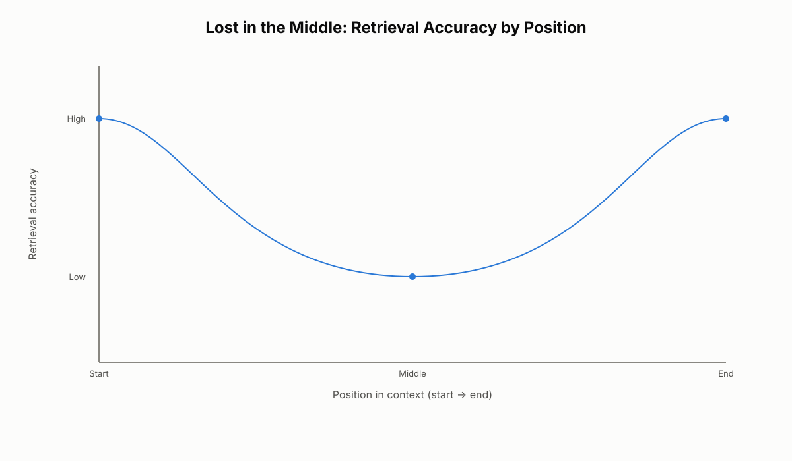
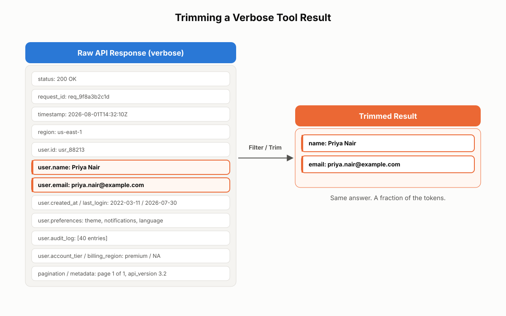

# Context Window Management

A well-designed, well-tested AI system can still fall apart on a long conversation, a messy multi-step task, or anything that pushes against the limits of its context window — and that failure has nothing to do with the model being weak. It happens because context, like any finite resource, degrades in specific, predictable ways as it fills up. This chapter opens Domain 5 of the CCA-F exam blueprint, context management and reliability, and gives you the tools to keep an AI system accurate and trustworthy even as its conversation history grows and its tool outputs pile up. You will learn why summarization quietly erodes precision, how to protect the facts that cannot afford to drift, why position inside a prompt is not neutral, and how to keep tool results from drowning out the data that actually matters.

## Progressive Summarization and the Quiet Loss of Precision

### How Progressive Summarization Works

Every model has a hard limit on how much text it can hold in a single request — the context window. As a conversation grows past that limit, something has to give. Rather than dropping older messages outright, most systems compress them: turning long exchanges into shorter, more general restatements. This is progressive summarization — "progressive" because it is not a one-time event. Each time the conversation grows further, more of the older history gets compressed again, and details that were merely rounded the first time can be paraphrased away entirely by the second or third pass.

This is not a defect. It is a survival mechanism. A system that kept every message in full would eventually run out of room and stop functioning altogether. Summarization trades precision for space so the conversation can keep going. The problem is that the trade is invisible to the user and, often, to the engineer who built the system — the conversation still flows, the assistant still sounds confident, and nothing about the interaction signals that anything was lost.

### What Gets Lost First: Numbers, Percentages, and Dates

Three categories of detail are consistently the first casualties of summarization, precisely because they are the hardest things to paraphrase without changing their meaning:

- **Numeric values.** An exact amount like $89.99 becomes "about $90." A count of 47 becomes "a few dozen." A specific quantity becomes "some."
- **Percentages.** A figure like 42% becomes "roughly 40%." A value like 23% becomes "around a quarter." The exact number is replaced with an approximation that sounds precise but is not.
- **Dates.** January 15, 2025 becomes "last month." A precise timestamp becomes "earlier today." The further back in the conversation a date sits, the fuzzier it gets.

These three categories share a common thread: they are exactly the details that production systems — billing, compliance, scheduling, identity verification — need to be exact about. A model that generalizes "the customer's tone was frustrated" into "the customer was unhappy" has lost almost nothing. A model that generalizes "$89.99 paid via Visa ending in 4242" into "a small order" has lost everything that made the record useful.

### Before and After: Watching Precision Disappear

Consider a support message logged early in a long-running conversation:

> On January 15, 2025, the customer placed an order for $89.99, paid using a Visa card ending in 4242, requesting two-day shipping.

After a few rounds of progressive summarization, the same event may be stored as:

> In mid-January, the customer placed a small order with expedited shipping.

Read side by side, the summary captures the gist and nothing else. The exact date is gone. The exact amount is gone. The payment method is gone. "Two-day shipping" — a specific, contractually meaningful term — has become the vaguer "expedited." None of this shows up as an error message. The system simply starts answering questions about that order with slightly wrong numbers, stated with the same confidence as before.

**Real-world use case:** A customer support agent handles a 60-turn conversation about a delayed refund. Thirty turns in, the customer asks the agent to confirm "the exact amount you're refunding me." If the refund amount was only preserved inside the conversation history — subject to summarization — the agent may confidently state a rounded figure that doesn't match the original transaction, creating a discrepancy the finance team has to manually reconcile later.

> ⚠️ **Important:** Progressive summarization fails quietly, not loudly. There is no error, no warning, no dropped connection — just a gradually degrading record that still reads as fluent, confident memory. Treat any exact number, date, ID, or percentage that has passed through a summarization step as unverified until you confirm it against a source that was never compressed.

## The Case-Facts Block: Keeping Critical Details Sharp

### What a Case-Facts Block Is

A case-facts block is a short, explicit list of the details in a task that must never be paraphrased, rounded, or dropped — kept separate from the conversation history and re-sent, unmodified, with every single request. Think of it as a sticky note attached to the monitor during a long phone call: the call itself might blur in memory, but the numbers written on the note stay exact because they were never trusted to memory in the first place.

The mechanism is simple and that simplicity is the point. Instead of hoping the model's compressed conversation history retains the order ID, refund amount, and case status accurately, you extract those facts once, store them outside the conversation, and attach them fresh to every turn. The conversation can be summarized as aggressively as the system needs; the case-facts block never is.

### What Belongs Inside It

Four categories of information are worth checking against on every task:

1. **Identifiers** — the unique values needed to look something up: customer ID, order ID, ticket number.
2. **Dates and amounts** — the exact values that cannot be rounded without changing their meaning: order dates, refund amounts, transaction timestamps.
3. **Issue and request** — a short, factual statement of what the user actually asked for, not an interpretation or paraphrase of it.
4. **Status and decisions** — where things currently stand: is the case open or closed, has it been escalated, has a commitment already been made to the customer.

If a detail fits one of these four categories, it belongs in the block. If it doesn't — general sentiment, conversational tone, background chatter — it can stay in the ordinary conversation history and summarize normally.

### When to Use a Case-Facts Block

Three situations call for one:

- **Long conversations.** Anything running more than a handful of turns — customer support threads, multi-step research, extended troubleshooting — accumulates enough history that summarization becomes inevitable.
- **High-consequence contexts.** Financial transactions, legal matters, medical information, and compliance workflows are exactly where a rounded number or a fuzzy date turns into real cost.
- **Multi-step workflows.** Any task where the AI needs to recall an earlier decision to make a later one correctly cannot rely on the AI happening to remember what it already did.

### Implementing a Case-Facts Block

In practice, a case-facts block is just a structured object maintained by your application layer and injected into every request, independent of the summarized conversation history:

```json
{
  "case_facts": {
    "identifiers": {
      "customer_id": "CUST-48213",
      "order_id": "ORD-990214",
      "ticket_number": "TCK-55021"
    },
    "dates_and_amounts": {
      "order_date": "2025-01-15",
      "refund_amount": "$89.99",
      "payment_method": "Visa ending in 4242"
    },
    "issue_and_request": "Customer requests a refund on ORD-990214 due to late delivery.",
    "status_and_decisions": {
      "case_status": "open",
      "escalated": false,
      "commitment_made": "Agreed to refund if delivery exceeds 5 business days."
    }
  }
}
```

This block is generated or updated by application code — not by asking the model to "remember" the facts — and is placed in the prompt on every turn, typically near the top of context alongside other structured material (see the sections below on placement and structured tags). The conversation history around it can compress freely without threatening the values that matter.

**Real-world use case:** An insurance-claims assistant processes claims over a multi-day, multi-session conversation as documents come in piecemeal. The claim number, incident date, and policy limit are stored in a case-facts block from the first message. Even after dozens of turns and multiple rounds of summarization applied to the surrounding conversation, the assistant still cites the original incident date correctly when it drafts the final claim summary — because that date was never subject to summarization in the first place.

> ✅ **Best Practice:** Populate the case-facts block from the source system (the order database, the ticketing system) rather than by asking the model to extract it from the conversation. Extraction re-introduces exactly the fabrication and rounding risk the block is meant to eliminate.

A common mistake is treating the case-facts block as a one-time snapshot. If the refund amount changes mid-conversation, the block must be updated and re-sent — an outdated case-facts block is more dangerous than no block at all, because it carries false authority.

## The Lost in the Middle Problem

### The U-Shaped Attention Curve

Give a model a long document and ask a question whose answer sits on the first page or the last page, and it usually answers well. Bury that same answer in the middle of the document, and retrieval accuracy drops — sometimes sharply. This is a well-documented pattern in large language model research known as Lost in the Middle: models pay disproportionate attention to the beginning and end of a long context and give weaker treatment to whatever sits between them.

Researchers who measured this systematically found that plotting retrieval accuracy against the position of the relevant fact in the context produces a clear U-shape: high performance near the start, high performance near the end, and a measurable dip in the middle. The longer the total context, the deeper that middle dip becomes. In a short prompt the effect is barely noticeable; across tens of thousands of tokens, the middle of the context can become close to a blind spot.

### Why It Happens

The behavior traces back to how models are trained. In most long-form training text, the most load-bearing information tends to sit at the edges — an opening sets up the topic, a conclusion delivers the takeaway, and the middle often carries supporting detail rather than the core fact. Over enormous volumes of training data, models learn a general habit of weighting the edges of a text more heavily than the interior. That learned habit does not switch off just because a particular prompt happens to bury something important in the middle.

### Where It Hurts Most

Three kinds of workloads are especially exposed to this problem:

- **Retrieval tasks.** When a model is asked to locate a specific fact inside a long document, facts placed in the middle are the ones most often missed entirely.
- **Multi-step reasoning.** When a conclusion depends on combining facts from different parts of a long context, whichever fact happens to land in the middle becomes the weak link in the chain.
- **Tool-result aggregation.** When several tool outputs are concatenated into one long context — a common pattern in multi-step agentic workflows — the results stacked in the middle of that sequence are the ones most likely to be underweighted when the model composes its final answer.

This matters because, in production, you rarely control exactly where information lands. Conversations grow, tool outputs accumulate, and documents get pasted in at unpredictable points — and whatever ends up in the middle is quietly at higher risk of being missed, independent of how important it actually is.


*Figure 16.1: Illustrates why position inside the context window functions almost like a second signal of importance — two identical facts can be retrieved with very different reliability depending on where they happen to sit.*

**Real-world use case:** A legal-research assistant retrieves twelve case excerpts for a query and concatenates them into one prompt before asking for a summary of the strongest precedent. If the single most relevant excerpt happens to be retrieval result number six or seven — squarely in the middle of the stack — the assistant is statistically more likely to omit it from its summary than if that same excerpt had been ranked first or last, even though nothing about its content changed.

## Placing Key Findings at the Top of Context

### The Principle: Data First, Questions Last

The fix for part of the Lost in the Middle problem is not a smarter model — it's a different prompt layout. The rule, drawn directly from Anthropic's documented long-context guidance, is straightforward: place long reference material — documents, transcripts, reports, retrieved chunks — at the top of the prompt, and place the question, instructions, and any examples at the bottom, after the data.

This is not a stylistic preference. In testing, reordering a prompt to place long content above the query rather than below it improved response quality by up to 30% on complex, multi-document tasks. The mechanism behind this is how the model processes a sequence: it weighs recently read tokens more heavily as it begins generating a response. A question read last is fresh in the model's attention at exactly the moment it needs to be answered. A question read first, followed by twenty thousand tokens of data, risks getting diluted by the time the model reaches the end of that data and starts composing an answer.

### Anthropic's Recommended Prompt Structure

The recommended layout has three parts, top to bottom:

1. **Long-form data at the top** — documents, transcripts, reports, retrieved passages.
2. **That data wrapped in clear structured tags** (covered in depth in the next section) so the model can tell one source from another.
3. **Instructions and the question at the bottom** — and, for stronger recall, an explicit instruction to quote the most relevant passage before answering.

Compare the two layouts directly:

```text
# Wrong: question first, data buried below it
What are the termination clauses in this contract?

<document>
[30 pages of contract text]
</document>
```

```text
# Right: data first, question last
<document>
[30 pages of contract text]
</document>

What are the termination clauses in this contract?
Quote the relevant sections before answering.
```

Same model, same content, same question — reordering it is the entire difference.

### Applying This to RAG Systems

The same principle extends past single prompts into retrieval-augmented generation. In a RAG pipeline, the order in which retrieved chunks are assembled into the final prompt matters as much as which chunks were retrieved. The most relevant chunk should sit closest to the query at the bottom of the prompt, not buried in the middle of a long list of retrieved passages ranked by an unrelated scoring order.

**Real-world use case:** A contract-review tool ingests a 40-page vendor agreement and is asked to flag any auto-renewal clauses. Placing the full contract at the top, wrapped in a `<document>` tag, with the instruction "Identify and quote any auto-renewal clauses" at the bottom consistently surfaces the correct clause — even when that clause sits on page 22 — because the model reads the instruction with the entire document already fresh in its recently processed context.

> 🚀 **Pro Tip:** This is one of the cheapest wins in context management: it costs no extra tokens and requires no new tooling, only a different arrangement of the same prompt. Reordering an existing prompt is worth trying before reaching for a more expensive fix like chunking or a smaller retrieval window.

## Structured Tags for Reliable Context Parsing

### Why Structure Breaks Down at Scale

A prompt that starts as a few lines of instructions can grow into pages of policies, examples, tool definitions, retrieved documents, and conversation history. Once a prompt reaches that size, structure stops being a nicety — an unorganized wall of text makes it genuinely harder for Claude to tell which parts are instructions, which are examples, and which are reference material to consult rather than instructions to follow. Without clear boundaries, an example can be mistaken for an instruction, or a constraint stated in the middle of a paragraph can get overlooked entirely.

Chapter 5 covered how a vague tool description causes Claude to select the wrong tool. Structured tags solve a related problem one level up: once a tool result or a reference document is inside the context, tags help Claude correctly interpret what kind of information it is looking at and how it relates to everything else in the prompt.

### Common XML Tag Patterns

Anthropic recommends XML-style tags specifically for Claude, because Claude was trained extensively on data that uses XML-style markup to delimit sections — making tags a reliably learned signal rather than an arbitrary convention. The general category — labeled, bounded regions of a prompt — can be called section headers or structured tags; the concrete implementation for Claude is XML tags. The specific tag names carry no special magic; what matters is that boundaries are clear, names are descriptive, and usage is consistent across a codebase. A production system commonly settles on a small, repeated set:

```xml
<instructions>
You are a support assistant. Follow the constraints below exactly.
</instructions>

<constraints>
- Never issue a refund above $500 without human approval.
- Always confirm the order ID before taking any action.
</constraints>

<examples>
<example>
<input>Customer wants to cancel order ORD-1001.</input>
<output>Confirm the order ID, then cancel it and send a confirmation email.</output>
</example>
</examples>

<documents>
<document index="1">
<source>refund_policy.pdf</source>
<content>
... full policy text ...
</content>
</document>
</documents>

<output_format>
Respond in JSON with fields: action, reason, confirmation_needed.
</output_format>
```

Each tag gives one category of information a clear identity and a clear boundary, so Claude can apply system rules as rules, treat examples as demonstrations rather than instructions to copy verbatim, and read retrieved documents as reference material rather than commands.

### Structured Tags in Practice

The payoff is measurable: more consistent instruction following, fewer cases where Claude imitates an example instead of completing the actual task, and more predictable behavior as the prompt grows. This becomes especially important in long-context applications, RAG pipelines, MCP integrations, and multi-step agent workflows — anywhere a prompt grows large enough that ambiguity becomes a realistic failure mode. A long context alone does not guarantee reliable behavior; a long, disorganized context is often worse than a shorter, well-structured one.

**Real-world use case:** An internal knowledge-base assistant combines a system prompt, three few-shot examples, and five retrieved articles into a single request. Before adding structured tags, the assistant occasionally answered a user's question with the content of one of the few-shot examples verbatim. Wrapping the examples in `<examples>` and the retrieved articles in separate `<document>` tags eliminated that failure mode almost entirely, because the boundary between "here is how to respond" and "here is what actually happened this time" became explicit instead of implied.

> ✅ **Best Practice:** Pick one tag vocabulary for a project — `<instructions>`, `<constraints>`, `<examples>`, `<documents>`, `<output_format>` is a reasonable default — and use it identically across every prompt in the system. Consistency, not cleverness, is what makes tags reliable over time.

## Trimming Verbose Tool Results

### The Three Costs of Verbose Tool Results

Chapter 1 covered appending tool results into conversation history as part of the agentic loop. This section asks the natural follow-up question: how much of that result should actually be there? Most APIs, search tools, and database queries return far more than a downstream task needs — full objects when only one field matters, ten search results when only the top two are relevant, pagination metadata and status codes wrapped around the actual answer. All of it lands inside the context window whether it is useful or not, and verbose tool results create three compounding problems:

1. **They fill the context window faster.** Every token spent on an unused field is a token unavailable for conversation history, system instructions, or the model's own reasoning.
2. **They bury the relevant data.** When the answer is surrounded by dozens of irrelevant fields, Claude has to work harder to locate what matters — and in complex pipelines, that extra noise increases the odds of a reasoning error, compounded further by the Lost in the Middle effect covered earlier in this chapter.
3. **They slow the system down and raise its cost.** More tokens to process means slower responses and higher spend, and the effect compounds sharply in pipelines where a tool is called dozens of times across a single task.

### Three Techniques for Trimming

Three practical approaches address this, roughly in order of preference:

1. **Filter at the source.** Many APIs accept a `fields` parameter or a `select` clause that lets the caller request only the data actually needed. Use it — don't pull the full object and discard most of it afterward.
2. **Post-process before injection.** When the source API cannot be filtered, add a thin processing layer that extracts only the relevant fields from the raw response before it ever reaches Claude's context. Claude never sees the noise because the noise never gets passed along.
3. **Summarize long results.** For tool results that are inherently long — a full search-results page, a large document, a lengthy log file — summarize or truncate before passing them along, keeping the key points rather than the raw dump.

Consider what a raw user-lookup response often looks like compared to what a downstream task actually needs:

```json
// Raw API response — everything the server returned
{
  "status": "200 OK",
  "request_id": "req_9f8a3b2c1d",
  "timestamp": "2026-08-01T14:32:10Z",
  "region": "us-east-1",
  "user": {
    "id": "usr_88213",
    "name": "Priya Nair",
    "email": "priya.nair@example.com",
    "created_at": "2022-03-11T09:00:00Z",
    "last_login": "2026-07-30T18:12:44Z",
    "preferences": { "theme": "dark", "notifications": true, "language": "en-US" },
    "audit_log": [ /* 40 entries */ ],
    "account_tier": "premium",
    "billing_region": "NA"
  },
  "pagination": { "page": 1, "total_pages": 1 },
  "metadata": { "api_version": "3.2", "cache_hit": false }
}
```

```json
// Trimmed result — exactly what the next step needs
{
  "name": "Priya Nair",
  "email": "priya.nair@example.com"
}
```

Same answer, a fraction of the tokens. Multiply that reduction across a pipeline where this tool gets called dozens of times, and the compounding savings translate directly into a smaller, faster, and more reliable system.

### Where Trimming Applies

The same discipline applies everywhere a tool result flows into context:

- **API responses** — extract only the fields the next step actually consumes; don't pass an entire profile object when a name is all that's needed.
- **Search results** — pass titles and short snippets rather than full page content; let Claude request more detail on a specific result in a follow-up step if it needs it.
- **Database queries** — write intentional `SELECT` statements instead of `SELECT *`, and cap row counts when the full result set isn't required.
- **Document retrieval** — retrieve and pass only the section relevant to the current query through chunking, rather than the entire document on every call.

**Real-world use case:** An order-tracking agent calls a shipping-carrier API at every step of a multi-turn conversation. The raw response includes full carrier metadata, scan-event history, and warehouse routing codes — none of which the customer-facing agent ever uses. Adding a post-processing layer that extracts only `status`, `estimated_delivery`, and `last_scan_location` cuts the tokens spent on that single tool call by more than 90%, and the agent's answers about delivery status become both faster and more consistently correct, because the two facts that matter are no longer competing with forty irrelevant ones for the model's attention.


*Figure 16.2: Makes the token cost of an unfiltered tool result visible — most of what a typical API returns by default is irrelevant to any single downstream step.*

> 💡 **Tip:** Trimming verbose tool results is one of the highest-leverage, lowest-risk optimizations available in a tool-enabled system. Unlike summarization of conversation history, trimming a tool result before it enters context loses nothing the task actually needed — it only removes what was never going to be used.

## Looking Ahead: The Rest of Domain 5

This chapter covers the first of three areas inside Domain 5: preserving context quality as conversations and tool use scale up. The other two areas extend the same underlying goal — a reliable system, not just a capable one — into different failure surfaces.

The next chapter covers human escalation: the discipline of knowing when to hand a task off to a person rather than continuing to push through it. Three triggers justify escalation on their own — a direct human request, an authority gap, and a verification flag — while two feelings that seem like they should justify escalation, frustration and complexity, do not, on their own, warrant it. The chapter after that covers error handling in multi-agent systems: how to structure a failure so a downstream agent can act on it intelligently, why offering an alternative approach matters as much as reporting the failure cleanly, and two of the most common production mistakes — waiting until every retry is exhausted before surfacing a problem, and quietly treating an empty result as a successful one.

Context quality, escalation discipline, and structured error handling are three faces of the same requirement: a system that stays trustworthy under the exact conditions — long histories, ambiguous situations, partial failures — where it is tempting to let quality slip quietly.

## Chapter Summary

A capable model can still produce unreliable output if the context feeding it is bloated, disorganized, or has degraded over time. Progressive summarization compresses older conversation history to fit inside a finite context window, and the compression silently strips out exactly the details — numbers, percentages, dates — that production systems most need to keep exact. A case-facts block fixes this by keeping the facts that cannot be lost in a separate structure that is sent unmodified on every turn, immune to the summarization applied to the surrounding conversation.

Position inside the context window is not neutral either. The Lost in the Middle problem shows that models pay more attention to the start and end of a long context than to its interior, which means retrieval tasks, multi-step reasoning, and tool-result aggregation are all more fragile in the middle of a long prompt. The practical fix is to place long reference material at the top of a prompt and the question or instructions at the bottom — a reordering, backed by Anthropic's own testing, that has improved response quality by up to 30% on complex multi-document tasks with no added token cost.

Structured tags — XML tags for Claude specifically — turn a long, undifferentiated prompt into clearly bounded sections, so instructions, constraints, examples, and reference documents don't blur into each other as a prompt grows. Finally, trimming verbose tool results before they enter context removes noise that was never going to be used in the first place, shrinking token spend, reducing the odds a reasoning error hides in the clutter, and speeding up every step of a multi-step pipeline. Together, these five practices form the foundation of Domain 5: keeping context lean, ordered, and precise, so that the rest of the system — escalation logic and error handling, covered in the chapters that follow — has something reliable to work with.

## Key Takeaways

- Progressive summarization is a survival mechanism for a finite context window, not a bug — but it silently rounds away exact numbers, dates, and percentages as older conversation history gets compressed.
- A case-facts block keeps identifiers, dates and amounts, the issue/request, and status/decisions in a structure sent fresh every turn, immune to the lossy compression applied to the rest of the conversation.
- The Lost in the Middle problem means models retrieve information at the start and end of a long context more reliably than information buried in its interior, forming a measurable U-shaped accuracy curve.
- Placing long reference material at the top of a prompt and the question/instructions at the bottom directly counters the Lost in the Middle effect and has improved response quality by up to 30% in testing.
- Structured tags — XML tags for Claude — give each part of a large prompt a clear boundary and identity, reducing the odds Claude confuses an example for an instruction or misses a buried constraint.
- Verbose tool results should be trimmed at the source, post-processed before injection, or summarized — Claude should only ever see the fields a downstream step actually needs.
- Escalation and structured error handling, previewed here, are the remaining two pillars of Domain 5 and are covered in full in the chapters that follow.

## Interview Questions

1. Explain how progressive summarization works and why context windows make it necessary. What categories of detail are most at risk, and why those specifically?
2. Design a case-facts block for a healthcare appointment-scheduling assistant. Which fields would you include, and how would you ensure the block itself never becomes another lossy summary?
3. Describe the Lost in the Middle problem in your own words. How would you restructure a retrieval-augmented generation pipeline to reduce its impact on a long list of retrieved chunks?
4. Walk through Anthropic's recommended structure for a long-document question-answering prompt. Why does the order of the document relative to the question matter, given that the model reads the entire prompt either way?
5. A teammate proposes wrapping every section of a prompt in inconsistent, ad hoc XML tag names across different parts of a codebase. What would you tell them, and why does tag consistency matter more than tag naming?
6. You inherit an agent that calls a weather API and injects the full JSON response into context on every turn. The agent is slow, and it occasionally answers with data from the wrong city. Diagnose the likely cause and describe how you would apply the three tool-result trimming techniques to fix it.
7. How does maintaining context quality — the focus of this chapter — relate to escalation discipline and structured error handling, the other two areas of Domain 5 covered in later chapters?
8. A production support system has been running for six months. A customer disputes a refund amount that the system confirmed weeks earlier in conversation. What would you check first, and what change would you recommend going forward?

## Practice Questions & Answers

**Practice Question (unofficial):** A customer support conversation has run for 80 turns. The customer asks the AI to restate the exact refund amount agreed to on turn 12. Without a case-facts block, what is likely to happen, and why?

**Answer:** By turn 80, the message from turn 12 has almost certainly been compressed multiple times by progressive summarization. The exact figure — say, $89.99 — is likely to have been rounded to something like "about $90" in an earlier summarization pass, and further generalized in subsequent passes. The AI will answer confidently, because from its perspective the summarized value is the only value it has access to, but the figure it states may not match the original transaction. The fix is a case-facts block populated from the order system at the start of the case, containing the exact refund amount, resent unmodified on every turn regardless of how aggressively the surrounding conversation is compressed.

**Practice Question (unofficial):** You are building a RAG system that answers questions from a 40-document knowledge base. Users report that answers are strong when the relevant document is retrieved first or last, but weak when it's retrieved third or fourth out of six. What is happening, and what two changes would you make?

**Answer:** This is the Lost in the Middle problem manifesting in a retrieval pipeline: the model reliably attends to content at the start and end of the assembled context but underweights content in the interior, so a relevant chunk retrieved into a middle position is more likely to be missed even though its content hasn't changed. Two effective changes: first, re-rank retrieved chunks so the most relevant one sits closest to the query at the bottom of the prompt rather than in the middle of an arbitrarily ordered list; second, wrap each retrieved chunk in a structured tag (for example, a `<document>` tag with a source attribute) so the model can clearly distinguish and navigate between sources instead of reading them as one undifferentiated block.

**Practice Question (unofficial):** An agent calls a product-search API that returns 10 results per query, each with a full product object (description, dozens of attribute fields, inventory counts by warehouse, internal SKUs). The agent only ever needs the product name, price, and a two-sentence summary for the top 3 results. Propose a fix and justify it using the three costs of verbose tool results.

**Answer:** Check first whether the API supports a `fields` parameter to filter at the source; if it does, request only name, price, and description and limit to the top 3 results directly in the API call. If the API cannot be filtered, add a post-processing layer that strips the response down to those fields before it is injected into context. This addresses all three costs described in the chapter: it stops the context window from filling with unused warehouse and SKU data, it removes the noise that could bury the actual product details the agent needs to reason about, and it reduces the token volume processed on every search call, which lowers both latency and cost across a pipeline where this search may run many times per task.

## Multiple Choice Questions

**Q1. What is progressive summarization?**
A. A manual process where a human periodically edits the conversation log
B. The automatic, ongoing compression of older conversation history into shorter, more general text as a conversation grows
C. A caching layer that stores full conversation history on disk
D. A technique for trimming verbose tool results before they enter context

**Correct Answer: B**

*Explanation:* Progressive summarization is the automatic background process by which older parts of a conversation are compressed as the context window fills up, and it repeats — becoming more aggressive — as the conversation continues to grow. A is wrong because the process is automatic and system-driven, not a manual editing step. C is wrong because summarization compresses content rather than storing it in full; it is the opposite of a full-fidelity cache. D is wrong because trimming tool results is a separate technique covered later in the chapter, addressing verbose tool output rather than conversation history.

**Q2. Which three categories of detail are described as especially vulnerable to progressive summarization?**
A. Tool names, function signatures, and API endpoints
B. Numeric values, percentages, and dates
C. User sentiment, tone, and conversational style
D. System prompts, few-shot examples, and output formats

**Correct Answer: B**

*Explanation:* Numeric values, percentages, and dates get rounded or generalized first because they are precise by nature and easy to paraphrase into vaguer language without an obvious loss of fluency. A is wrong because tool names and API details are typically part of system configuration, not conversational content subject to summarization. C is wrong because sentiment and tone survive generalization well; losing precision there rarely causes production problems. D is wrong because system prompts and output formats are usually held outside the summarized conversation history entirely.

**Q3. What is a case-facts block?**
A. A cache of the AI's previous responses used to speed up future replies
B. A compressed version of the conversation history optimized for storage
C. A short list of critical facts kept separate from the conversation and resent, unmodified, with every request
D. A database schema used to store customer records

**Correct Answer: C**

*Explanation:* A case-facts block is an application-level structure holding the facts a task cannot afford to lose, sent fresh every turn so it is never subject to the lossy compression applied to the rest of the conversation. A is wrong because it is not a response cache; it holds facts about the current case, not prior AI outputs. B is wrong because it is explicitly not compressed or summarized — that is the entire point of keeping it separate. D is wrong because it is a runtime prompt structure, not a persistent storage schema, even though its contents may originate from a database.

**Q4. Which of the following belongs in the "identifiers" category of a case-facts block?**
A. The customer's general sentiment during the conversation
B. Customer ID, order ID, and ticket number
C. The AI's confidence score for its last response
D. The total number of turns in the conversation so far

**Correct Answer: B**

*Explanation:* Identifiers are the unique values needed to look a case up in a source system — customer ID, order ID, and ticket number are the canonical examples given. A is wrong because sentiment is not an identifier and does not need protection from summarization. C is wrong because a confidence score is a model-internal signal, not a case fact. D is wrong because turn count is conversational metadata, unrelated to identifying a specific case or record.

**Q5. What is the Lost in the Middle problem?**
A. Models cannot process documents longer than a fixed token limit
B. Models forget the entire conversation once the context window fills up
C. Models pay more attention to content at the beginning and end of a long context and are more likely to miss or underweight information placed in the middle
D. Models cannot distinguish between instructions and examples in a prompt

**Correct Answer: C**

*Explanation:* The Lost in the Middle problem is specifically about attention bias toward the edges of a long context, leaving content in the interior more likely to be overlooked even when it is fully present in the input. A is wrong because the phenomenon is about position within a context the model can process, not a hard length limit. B is wrong because this describes a context window overflow, not a positional attention bias within content that fits. D is wrong because that describes a structural/parsing failure addressed by structured tags, not a positional attention effect.

**Q6. Plotting retrieval accuracy against the position of a relevant fact in a long context typically produces what shape?**
A. A straight downward slope from start to end
B. A U-shape, with high accuracy at the start and end and a dip in the middle
C. A flat line, since position has no measurable effect
D. A bell curve peaking in the middle of the context

**Correct Answer: B**

*Explanation:* Research on this phenomenon consistently shows a U-shaped curve: performance is strongest when the relevant fact sits near the start or end of the context and weakest when it sits in the middle. A is wrong because accuracy does not decline steadily; it recovers again near the end of the context. C is wrong because position measurably affects accuracy — that is the core finding. D is wrong because it describes the opposite pattern from what was actually observed.

**Q7. According to Anthropic's long-context guidance, where should long reference documents be placed relative to the question in a prompt?**
A. Below the question, so the question is read first
B. Interspersed randomly throughout the prompt
C. Above the question, at the top of the prompt, with the question and instructions at the bottom
D. Position does not matter as long as XML tags are used

**Correct Answer: C**

*Explanation:* The recommended structure places long-form data at the top and the question/instructions at the bottom, so the model reads the question last, right before generating its answer, with the full document already processed. A is wrong because it is the reverse of the recommended order and the layout shown to underperform. B is wrong because random placement offers no structural benefit and increases the risk of the Lost in the Middle effect. D is wrong because tags help organize the document but do not replace the benefit of correct ordering — both matter together.

**Q8. In testing, reordering a prompt to place long content above the query instead of below it improved response quality by up to what figure?**
A. 5%
B. 30%
C. 50%
D. 90%

**Correct Answer: B**

*Explanation:* Anthropic's documented testing found up to a 30% improvement in response quality on complex, multi-document tasks simply from reordering the prompt, with no additional tokens or tooling required. A understates the documented improvement. C and D overstate the documented figure; while large, the improvement cited is up to 30%, not higher.

**Q9. Why does Anthropic recommend XML tags specifically for structuring prompts sent to Claude?**
A. XML is a strict requirement of the Claude API and prompts fail validation without it
B. XML tags reduce the total token count of a prompt
C. Claude was trained extensively on data using XML-style markup, making tags a reliable, learned way to mark section boundaries
D. XML is the only markup format Claude is capable of parsing correctly

**Correct Answer: C**

*Explanation:* XML tags are recommended because Claude's training data made heavy use of XML-style markup, so tags function as a strong, learned signal for section boundaries — not because of any technical requirement of the API. A is wrong because XML tags are a prompting convention, not an API-level requirement or validation rule. B is wrong because tags add tokens rather than remove them; their value is organizational, not related to token savings. D is wrong because Claude can parse plain text and other formats; XML tags are a best practice for reliability, not a parsing limitation.

**Q10. Which of the following is NOT one of the three practical approaches described for trimming verbose tool results?**
A. Filtering at the source using API parameters like `fields` or `select`
B. Post-processing the raw result to extract relevant fields before injecting it into context
C. Summarizing or truncating inherently long results before they reach Claude
D. Increasing the size of the context window to accommodate the full raw response

**Correct Answer: D**

*Explanation:* Increasing context window size does not address the underlying problems of wasted tokens, buried data, and slower processing — it only postpones them; it was never one of the three recommended techniques. A, B, and C are each explicitly described as one of the three practical trimming approaches and are therefore incorrect choices for "NOT" in this question.

**Q11. What are the three compounding problems caused by verbose tool results, as described in this chapter?**
A. They violate API rate limits, trigger authentication errors, and cause timeouts
B. They fill the context window faster, bury relevant data among noise, and slow down processing while raising cost
C. They cause the model to refuse to respond, produce shorter answers, and skip tool calls entirely
D. They increase hallucination rates, reduce creativity, and lower response temperature

**Correct Answer: B**

*Explanation:* The chapter identifies three compounding costs of verbose tool results: faster context-window consumption, obscured relevant data increasing the chance of reasoning errors, and slower/more expensive processing at scale. A describes infrastructure/networking failures unrelated to verbosity itself. C and D describe effects not attributed to verbose tool results in the chapter; verbosity is a token-budget and clarity problem, not a cause of refusals or altered creativity/temperature.

**Q12. Which of the following is a valid escalation trigger, as previewed in this chapter and covered in full in a later chapter?**
A. The user expresses frustration
B. The task is unusually complex
C. An authority gap exists
D. The conversation has run for many turns

**Correct Answer: C**

*Explanation:* An authority gap — a situation where the AI lacks the standing or permission to make a call on its own — is one of the three valid escalation triggers, alongside a direct human request and a verification flag. A and B are explicitly called out as not valid triggers on their own; frustration and complexity alone do not justify escalation. D is not one of the defined triggers; conversation length is a context-management concern, not an escalation criterion.

**Q13. What is the main risk of relying purely on progressive summarization in a multi-step financial workflow?**
A. The AI will refuse to process financial data
B. Rounded or generalized values can silently replace exact figures, causing errors that surface later
C. The API will return an error once summarization occurs
D. The conversation will terminate automatically after a fixed number of turns

**Correct Answer: B**

*Explanation:* The core risk described in the chapter is silent, invisible precision loss — exact amounts and dates get generalized during summarization, and the resulting errors typically aren't discovered until they cause a downstream problem. A is incorrect; summarization does not cause refusal behavior. C is incorrect; summarization is a normal background process, not an error condition. D is incorrect; summarization manages context size, it does not impose a hard turn limit on the conversation.

**Q14. Why does placing the question after a long document improve response quality, given that the model processes the entire prompt regardless of order?**
A. Because tokens placed later in a prompt cost less to process
B. Because models weigh recently read tokens more heavily when generating a response, so a question read last stays freshest at the moment of answering
C. Because the API truncates anything after the first 10,000 tokens
D. Because placing the question last hides it from being summarized

**Correct Answer: B**

*Explanation:* The behavior stems from how models attend to recent tokens: a question read immediately before generation begins remains most salient, whereas a question read first can be diluted by everything that follows it before an answer is produced. A is incorrect; token position does not affect processing cost. C is incorrect; there is no such truncation behavior at play here, and the concern is about attention weighting, not token limits. D is incorrect; this placement principle addresses attention and retrieval, not summarization, which applies to conversation history rather than single-turn document placement.

**Q15. What is the best approach when Claude only needs a user's name and email from a large profile API response?**
A. Pass the full response and instruct Claude to ignore the irrelevant fields
B. Post-process the response to extract just the name and email before passing it to Claude
C. Summarize the entire object with a separate LLM call on every request
D. Increase the model's max output tokens to compensate for the larger input

**Correct Answer: B**

*Explanation:* Post-processing before injection is one of the three recommended trimming techniques — extracting exactly the fields needed keeps the noise out of context entirely rather than asking the model to filter it out itself. A is a common but weak approach: the irrelevant fields still consume tokens and still risk burying the relevant data or contributing to reasoning errors. C adds unnecessary latency and cost for a task that a simple, deterministic field-extraction step handles more reliably and cheaply. D addresses output length, not input bloat, and does nothing to fix the underlying problem of an oversized tool result.

## Evaluate Yourself

1. **Scenario-based:** A 100-turn customer service conversation is handed off between three different support agents (human and AI) over two days. On turn 95, a customer disputes the refund amount they were quoted on turn 8. Walk through what likely happened to that number by turn 95, and describe the fix you would put in place before this recurs.

2. **Architecture-design:** Design the context structure for a multi-step research agent that reads five long reports, maintains a case-facts block of key figures extracted from each report, and answers follow-up questions across a 30-turn session. Specify what goes at the top of context, what goes in structured tags, what stays in the case-facts block, and what goes at the bottom of each prompt.

3. **Short-answer reflection:** In your own words, explain why the Lost in the Middle problem and the "trim verbose tool results" practice are related, even though one is about model attention and the other is about token budget.

4. **Scenario-based:** An agent aggregates outputs from four tool calls (a weather API, a calendar lookup, a traffic API, and a flight-status API) into one prompt before generating a travel recommendation. Users report the recommendation sometimes ignores the traffic data specifically, which is always injected third. Diagnose the likely cause and propose two independent fixes.

5. **Architecture-design:** You are asked to add XML tags to an existing production prompt that currently mixes system rules, three few-shot examples, and a 15,000-token retrieved document into one undifferentiated block. Propose a tag scheme and explain, section by section, what problem each tag boundary is meant to prevent.

6. **Short-answer reflection:** A colleague argues that increasing the model's context window size makes trimming verbose tool results unnecessary, since "there's room for it now." Explain why this reasoning is incomplete, referencing at least two of the three costs of verbose tool results described in this chapter.
