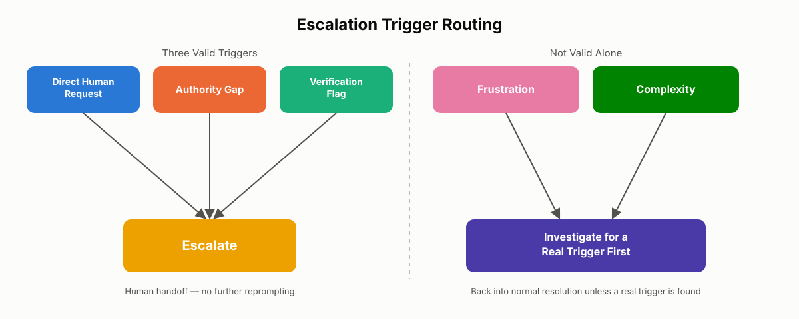
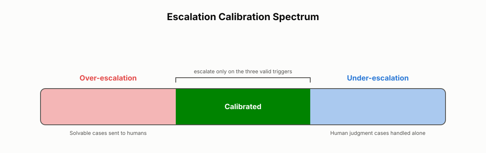

# Escalation Triggers

Every agentic system eventually meets a moment it should not resolve alone. The skill being tested here is not humility — it's calibration: knowing precisely which signals justify handing control to a human, and refusing to be fooled by signals that merely look like they should. This chapter defines the three valid escalation triggers, shows why the two most tempting shortcuts — reacting to tone and reacting to difficulty — are not triggers at all, and walks through the worked examples the CCA-F exam uses to test whether you can tell the difference under pressure.

## What Is an Escalation Trigger?

An **escalation trigger** is a condition under which an agent should stop attempting to resolve a task on its own and hand it to a human or a higher-authority system. Escalation is not a failure state — it's a designed feature of a reliable agentic system, on the same footing as a programmatic gate or a PostToolUse hook. Done well, it protects users and the business in situations that genuinely require human judgment, authority, or accountability.

But escalation is not free. Every handoff interrupts a human's workflow, slows resolution time, and adds operational cost. A system that escalates too readily defeats the purpose of building an agent in the first place; a system that escalates too rarely makes unauthorized decisions that cost real money and erode trust. Getting this calibration right is one of the harder judgment calls the exam tests, precisely because the wrong instincts — "the customer sounds upset, better hand this off" or "this task looks hard, I should ask for help" — feel reasonable in the moment.

There are exactly three **valid escalation triggers**:

1. **Direct human request** — the user explicitly asks for a human.
2. **Authority gap** — the policy the agent operates under is silent, ambiguous, or doesn't authorize the requested action.
3. **Verification flag** — a signal (an error, a denial, a contradiction, a risky side effect) means the next step should be checked before the agent proceeds.

Two conditions that look like they should qualify — but don't, on their own — are **frustration** and **complexity**. Both show up constantly in real interactions, and both are explicitly called out because they are the distractors the exam relies on to separate candidates who understand escalation from candidates who are pattern-matching on emotional tone or task size.

> 💡 **Tip:** If you can't name which of the three valid triggers applies, you don't have a real escalation case yet — you have a feeling. Keep working until you find the trigger or confirm there isn't one.

## Valid Trigger 1 — Direct Human Request

### The Principle of User Autonomy

A direct human request is exactly what it sounds like: the person interacting with your system explicitly says they want a human. "I want to speak to a real person," "can I talk to your support team," "please escalate this to someone" — there's no ambiguity and no interpretation required. The user made a decision about how their issue should be handled, and they communicated it clearly.

The principle behind this trigger is **user autonomy**: the person has the right to decide how their issue gets handled, and that decision is not something your system should override, second-guess, or work around. This holds regardless of whether the agent could technically resolve the issue. The relevant question is never "can the agent solve this?" It's "did the user ask for a human?" Even if your system could resolve a billing dispute automatically, if the user says "I want to talk to someone," you escalate. Capability does not override preference.

This is what separates a direct human request from the other two valid triggers. An authority gap or a verification flag requires the system to make a judgment call about the situation. A direct human request requires no judgment at all — the user already made the call, and the agent's job is to honor it.

> ⚠️ **Important:** Ignoring a direct human request is not just a bad user experience — it's a design failure. It tells the user that your system prioritizes its own automation loop over their explicit preference, and users notice.

### Implementing Detection, Acknowledgment, and Handoff

Building this trigger correctly comes down to three implementation steps:

1. **Detection.** Your system must reliably recognize escalation intent beyond exact keyword matching. "Get me a human," "talk to a real person," "connect me to support," and "I want an agent" are all the same intent phrased differently. Classification logic needs to catch the pattern, not just specific words.
2. **Acknowledgment.** The moment the request is detected, confirm it immediately — "Got it, connecting you to a team member now." This closes the loop and prevents the user from wondering whether they were heard, or having to repeat themselves.
3. **No reprompting.** Once escalation is triggered, the automated flow ends. Don't send one more clarifying question, don't surface one more self-service option. Complete the handoff.

```python
def handle_turn(user_message, conversation_state):
    if detects_human_request(user_message):
        # Trigger 1: no investigation, no reprompt — escalate now
        acknowledge("Got it — connecting you to a team member now.")
        return escalate(conversation_state, reason="direct_human_request")

    # otherwise continue normal resolution logic
    return attempt_resolution(user_message, conversation_state)
```

`detects_human_request` should be an intent classifier, not a string-equality check — it needs to catch paraphrases, not just an exact phrase list.

### Qualifying Questions vs. Deflection

Some teams add a step before handoff — "before I connect you to an agent, can you tell me more about your issue?" This is not automatically a violation of user autonomy. The test is simple: **is your system trying to serve the user, or trying to avoid the handoff?**

- If the qualifying step exists to route the request to the right team faster, it's reasonable.
- If it exists to talk the user out of escalating and keep them in the automated flow, it's a trust violation.

**Real-world use case:** A telecom support bot receives "I want to speak to a real person about my bill." A well-designed system responds, "Got it — connecting you to billing support now," and hands off immediately. A poorly designed system responds with "I can help with billing! Would you like to see your recent charges, dispute a charge, or set up autopay?" — three automated options offered in place of the human the customer explicitly asked for. The second system will generate complaints about being "stuck talking to a bot" even though its self-service options are technically capable of resolving the issue.

> ✅ **Best Practice:** Treat "human requested" as a terminal state in your escalation state machine — no transition out of it except to the human handoff itself.

> ⚠️ **Common Mistake:** Building a confidence threshold that lets the agent override an explicit human request if its own confidence score is high enough. Confidence in the agent's ability to solve the issue is irrelevant once the user has explicitly asked for a person.

## Valid Trigger 2 — Authority Gap

### Policy Silence vs. Policy Denial

An **authority gap** exists when the agent encounters a request that its policy is ambiguous about or completely silent on. This is a fundamentally different situation from a request the policy explicitly denies. A denial is a clear "no" — the agent has the authority to say no and should. An authority gap is neither a "yes" nor a "no" — the policy simply never addressed the scenario, so the agent has no authorization to act on it in either direction.

The canonical example: a customer asks for competitor price matching, but the company's policy only addresses price adjustments tied to its own website. The agent has no rule that says yes, and no rule that says no — the policy doesn't cover the situation. That gap between what the customer is asking for and what the agent has been authorized to do is the authority gap, and it is always a valid trigger.

> ⚠️ **Important:** An authority gap is about permission, not difficulty. The agent may be perfectly capable of computing what a price match would look like — that's irrelevant. It lacks the authorization to make that call, and inventing an answer where policy is silent is a judgment the agent isn't entitled to make.

### The Three Categories of Appropriate Escalation

Authority gaps are one of three categories of valid escalation conditions used throughout exam scenarios:

1. The customer explicitly requests a human — honored immediately, without first attempting investigation (Trigger 1, above).
2. Policy exceptions or gaps — the policy is ambiguous or silent on the customer's specific request (this trigger).
3. A verification flag — a concrete signal such as an error, a denial, or a contradicted expectation means the next step needs to be checked before the agent proceeds (Trigger 3, covered later in this chapter).

Notice the wording of the second category carefully: it's **policy exceptions or gaps**, not "complex cases." A case can be complex and still fall squarely within the agent's policy boundaries — complexity and authority are independent dimensions, and conflating them is exactly the mistake the exam is built to catch (see the dedicated section on complexity below).

### Multiple Customer Matches: A Second Form of Authority Gap

Authority gaps aren't limited to pricing and policy exceptions. When a tool call returns multiple possible customer matches — for example, a lookup by name and zip code returns three accounts — the correct behavior is to ask for additional identifying information, not to select one based on a heuristic like "most recent activity" or "closest match." This is an authority gap in a different shape: the agent doesn't have sufficient information to make the right call, and guessing could result in actions taken against the wrong account. The agent isn't authorized to act on an unconfirmed identity, full stop.

### Encoding Authority Gaps with Few-Shot Examples

The most effective way to build this trigger into an agent is to add explicit escalation criteria to the system prompt, paired with few-shot examples that demonstrate the reasoning, not just the outcome:

```
## Escalation Rule: Authority Gap

If a customer request is not explicitly covered by policy below, do not
infer, extrapolate, or apply a similar-but-different rule. Escalate to a
human with a summary of the request and the policy section that is silent
on it.

Example 1 (within policy — resolve):
Customer: "My order arrived damaged, here's a photo."
Policy: damage claims with photo evidence are auto-approved for replacement.
-> Resolve directly. This is within defined policy.

Example 2 (authority gap — escalate):
Customer: "Competitor X is selling this for $40 less, will you match it?"
Policy: price adjustments only cover this site's own price drops.
-> Escalate. Policy is silent on competitor price matching.

Example 3 (ambiguous identity — escalate):
Tool result: 3 accounts match "J. Smith, 90210."
-> Do not guess. Ask the customer for an order number or email to confirm
identity, and escalate if it cannot be resolved.
```

Each example should show the agent reasoning through whether the request falls **within** defined policy, **outside** defined policy (a denial), or in a **gap** where policy is silent — because the exam explicitly rewards candidates who can distinguish those three states rather than collapsing them into "the agent should just try."

**Real-world use case:** An airline's rebooking agent is authorized to rebook passengers on the same route within 24 hours of a cancellation at no fee. A customer whose flight was cancelled asks to be rebooked on a *different route entirely*, citing an emergency. Nothing in policy addresses cross-route rebooking. Rather than approximating a decision, the agent escalates with a structured summary: what the customer asked for, and which policy section is silent on it. A human agent, with the authority to make an exception, resolves it in under a minute — faster than the agent would have taken second-guessing itself.

> ✅ **Best Practice:** When escalating for an authority gap, hand the human a structured summary — the request, the relevant policy section (or the fact that none exists), and what was already confirmed — so the human isn't starting from zero.

> ⚠️ **Common Mistake:** Treating "the agent is technically capable of computing an answer" as equivalent to "the agent is authorized to act on it." Capability and authority are different axes; an authority gap is about the second one only.

## Valid Trigger 3 — Verification Flag

### The Agentic Loop and Verification

A **verification flag** is a signal that the workflow should pause, check, or confirm something before continuing. This does not mean the task has failed — it means the next step depends on whether the current state is safe, correct, or allowed.

This trigger matters most in tool-using workflows, including Claude Code, where the agentic loop moves through three phases: gathering context to understand what needs to be done, taking action by using tools to make changes, and verifying results to check whether the action worked as expected. Each `tool_use` returns a result that feeds back into the loop and informs the next decision — that's the same feedback mechanism introduced for the core agentic loop, now applied specifically to deciding whether to continue, retry, request approval, or stop.

A verification flag becomes a valid trigger whenever the workflow has a meaningful reason to check before proceeding, and it can occur at two distinct points:

- **Before an action runs** — pre-execution checks and permission boundaries can block or require approval for a command. The workflow asks, *is this action allowed?*
- **After an action completes** — tool results are evaluated for correctness. The workflow asks, *did this actually succeed?*

Both directions serve the same purpose: preventing the workflow from continuing on an uncertain or unsafe assumption.

### Signals That Qualify as Verification Flags

Not every tool result is a verification flag. The distinction is between **meaningful signals** and ordinary output that happens to look unusual. Valid verification flags include:

- A command returns a non-zero exit code (an actual failure, not merely a warning).
- A test suite reports failures, not just one flaky assertion.
- A file edit touches a critical area — configuration, build systems, security-sensitive code.
- A tool call is denied because of a permission restriction.
- A result is ambiguous or directly contradicts what the agent expected.
- An unintended side effect is detected — for example, an edit that breaks something unrelated to the task.

In each case, the signal indicates something concrete: an actual failure, a concrete problem, a security boundary, a detected side effect, or an outcome contradicting the intended goal — not vague unease about the situation.

> 💡 **Tip:** A useful test for whether something is a real verification flag: can you name the specific question it answers — "did the command succeed?", "was this action allowed?", "does this result match expectations?" If you can't phrase it as one of those questions, it's probably noise, not a signal.

### Worked Examples

| Scenario | Result | Valid Trigger? | Why |
|---|---|---|---|
| Agent runs `npm test` | Exit code 1, 3 test failures | Yes | The command failed; verify which tests failed and why before continuing. |
| Agent edits a config file to add a feature | Build system can no longer parse the config | Yes | The edit introduced a breaking side effect; verify the syntax and fix before moving on. |
| Agent attempts `sudo rm -rf /tmp/cache` | Permission denied | Yes | The action was blocked by a security boundary; verify permissions or request approval before retrying. |
| Agent runs a search expected to return results | Zero matches | Yes | The outcome contradicts expectations; verify the search parameters or try a different approach. |
| Agent completes a five-file refactor | All tests pass | No | No signal that anything went wrong — the task was complex, not unsafe. |

The pattern across the "yes" rows is the same: the workflow reached a point where continuing without checking could produce an incorrect, unsafe, or unauthorized action. The "no" row shows a large, multi-step task completing cleanly — no verification flag exists just because the task was substantial.

**Real-world use case:** A Claude Code session is asked to refactor an authentication module. Partway through, an edit to a shared config file causes the build to fail with a parse error. That's a verification flag — a detected side effect in a critical area — and the correct response is to inspect and fix the configuration before continuing the refactor, not to proceed as though the edit succeeded. Contrast this with a session where the same refactor touches ten files, and every edit compiles and every test passes: no verification flag exists, regardless of how many files were touched.

> ✅ **Best Practice:** Wire verification checks to concrete, testable conditions (exit codes, test results, permission responses) rather than to a model's self-assessment of whether something "feels risky." Self-assessed risk is unreliable in exactly the way self-assessed confidence is (see below).

> ⚠️ **Common Mistake:** Treating every warning-level message or unfamiliar output as a verification flag. This produces a system that pauses constantly on noise and trains its operators to ignore verification prompts altogether — which defeats the purpose when a real flag eventually appears.

## Why Frustration Alone Is Not a Valid Trigger

### What Frustration Actually Signals

Frustration tells you that someone is unhappy. It does not tell you *why* — and the reason matters enormously for deciding what to do next. A user might be frustrated because:

- the agent gave a wrong answer (an accuracy problem),
- they've repeated themselves three times (a context-management problem), or
- the process is slow or confusing (a UX problem).

None of these automatically require a human. Escalating on frustration alone treats the symptom instead of the cause, and it often hands a human agent a ticket they can't resolve any faster than the AI could have — which compounds the frustration rather than relieving it.

Sentiment and self-reported confidence are both unreliable proxies for whether a case genuinely needs escalation. Angry customers aren't necessarily complex cases, and language models are notoriously poor judges of their own confidence — they tend to feel certain on hard cases and uncertain on easy ones. Any exam answer that routes escalation through a sentiment score or a self-rated confidence threshold is a distractor.

> ⚠️ **Important:** Frustration is real and deserves a response — but that response is empathy and accuracy, not a reflexive handoff. Escalating on tone alone trains the system to avoid difficult interactions instead of resolving them, which over time makes the agent less capable and the human support team more overwhelmed with tickets that should have been handled automatically.

### The Three-Step Response: Acknowledge, Refocus, Check for a Blocker

When a system detects strong negative emotion, it should do three things, in order:

1. **Acknowledge it — briefly and genuinely.** Not a scripted "I understand your frustration" that nobody believes, but a direct, specific recognition that the interaction hasn't gone well.
2. **Restate the goal.** Bring the conversation back to what the user is actually trying to accomplish.
3. **Check for a real blocker.** Is there an authority gap? Has the user explicitly asked for a human? Is this a high-stakes action that needs verification? If yes to any of these, escalate — but because of the blocker, not the tone. If no, solve the problem.

```python
def handle_frustrated_user(user_message, conversation_state):
    if is_frustrated(user_message):
        acknowledge_briefly(user_message)          # step 1
        restate_goal(conversation_state)            # step 2

    # step 3: check for one of the three REAL triggers, tone aside
    if detects_human_request(user_message):
        return escalate(conversation_state, reason="direct_human_request")
    if has_authority_gap(conversation_state):
        return escalate(conversation_state, reason="authority_gap")
    if has_verification_flag(conversation_state):
        return escalate(conversation_state, reason="verification_flag")

    return attempt_resolution(user_message, conversation_state)
```

Notice that `is_frustrated` never appears as a condition for `escalate()` — it only ever triggers acknowledgment and a refocus, never a handoff by itself.

### Worked Example: Frustrated Customer with a Simple Issue

A customer types in all caps: "THIS IS UNACCEPTABLE. I want to speak to someone right now." Imagine two systems handling this.

- **System A** detects frustration and escalates immediately, without checking anything else. A human agent picks up the ticket, looks at it, and finds the answer sitting in the FAQ — a two-sentence, thirty-second fix that never needed a human.
- **System B** acknowledges the frustration ("I can see this has been frustrating — let's get it sorted"), checks whether the customer explicitly asked for a human (they did, in this example — "I want to speak to someone"), and since that's a direct human request, escalates on that basis, with an acknowledgment already delivered.

Both systems escalate in this specific case, but for different reasons — and the difference matters for the *next* customer, who is equally frustrated but hasn't asked for a human and has a fully resolvable issue. System A escalates that customer too, purely on tone, and overloads the human queue with cases the agent was fully capable of closing. System B resolves it, because tone was never the trigger.

**Real-world use case:** An e-commerce support agent handles a customer who is upset about a late delivery. Rather than escalating on the detected frustration, it responds: "I understand the delay has been frustrating — I can help resolve this right now," and proceeds to issue a refund or reship, both actions squarely within its policy authority. The customer's emotional state doesn't change what the agent is authorized and able to do; it only changes how the response should be framed.

> ✅ **Best Practice:** Separate sentiment detection from escalation logic entirely. Sentiment can inform *tone* of response (more empathetic phrasing) but should never independently trigger a handoff.

> ⚠️ **Common Mistake:** Building a "frustration escalates after N angry messages" rule. This still escalates on tone, just with a delay — it doesn't check for an actual blocker, so it still misfires in both directions (escalating solvable cases, failing to escalate calm-but-genuinely-blocked cases).

## Why Complexity Alone Is Not a Valid Trigger

### Signal vs. Noise

A large refactor across ten files, a subtle bug in an unfamiliar system, an unfamiliar third-party API — the instinct when facing any of these is to treat difficulty itself as a reason to stop and ask for help. It isn't. In workflow terms, this is the distinction between a **real signal** (something has actually gone wrong or needs approval — an error code, a failed assertion, a permission denial, a contradicted expectation) and **noise** (the task is difficult, but the workflow is progressing exactly as expected).

The agentic loop that underlies Claude Code and similar systems is designed for exactly this kind of difficulty: each turn, the agent evaluates the current state, decides what to do next, takes an action with tools, receives the result, and repeats — a cycle that can run dozens of times within a single session. A task like "refactor the auth module and update the tests" can chain twenty or thirty tool calls across many turns, with the agent adjusting its approach at each step based on the previous result. Complexity is not a failure mode here — it's the exact condition the loop exists to handle.

### How the Agentic Loop Absorbs Complexity

Three mechanisms let the loop work through difficulty without escalating:

- **Learning from results.** Each tool result feeds back into the next decision. If an edit breaks a test, the agent sees the failure and tries a different approach.
- **Reasoning across turns.** Conversation history accumulates, so the agent remembers what it already tried, what worked, and what didn't — improving its decisions as the task progresses.
- **Handling ambiguity by exploring, not stopping.** When something is unclear, the agent can search for more information, ask a targeted clarifying question, or try an alternative approach, rather than halting the workflow.

A complex task only becomes a trigger when it's paired with a real signal:

| Situation alone (noise) | Paired with a real signal (trigger) |
|---|---|
| Large, five-file refactor completes; all tests pass | Same refactor, but two tests fail after the edits |
| Unfamiliar API, but documentation is clear and calls work | Unfamiliar API, and a call is rejected with a permission error |
| Multi-step debugging finds and fixes the bug; tests pass | Three different fix attempts, tests still fail, error message stays unclear |

Complexity describes the *scope* of the work — many files, an unfamiliar domain, a problem that requires extended reasoning. A signal describes something *going wrong* — a non-zero exit code, a failed assertion, a denied permission, output that contradicts the expected result. These are different axes, and conflating them is the mistake the exam is testing for.

> 🚀 **Pro Tip:** When you're unsure whether a difficult moment warrants escalation, ask one question: "Is there a real signal that something went wrong?" If the answer is no, the workflow should continue — that's what it was built to do.

### Managing Complexity at Scale

Long, complex workflows accumulate conversation history, which raises a legitimate concern about context size — but that's a context-management problem, not an escalation trigger. It's addressed through mechanisms covered elsewhere in reliability design: automatic context compaction, delegating sub-tasks to subagents, adjustable effort levels, and selective tool access that keeps each step focused. These systems exist so that a task's length or difficulty never becomes a reason to hand it to a human — the system is engineered to absorb that complexity on its own.

**Real-world use case:** An agent tasked with migrating a service from one logging library to another touches twenty-three files across a codebase it has never seen before. Every edit compiles, every test passes, and the migration completes in thirty-one tool calls over several turns. Despite the scope, there is no escalation — no signal ever appeared. Compare this to a much smaller task — renaming a single environment variable — where the rename breaks a downstream deployment script. That's a two-line change, trivially low in complexity, but it produces a genuine verification flag (a detected side effect) that a large, clean refactor never did. Scope and risk are independent.

> ✅ **Best Practice:** If your system has a "task taking too long" or "too many tool calls" escalation rule with no reference to an actual error, denial, or contradiction, replace it with context-management tooling (compaction, subagents) instead — the length of the workflow is not a safety or authority problem.

> ⚠️ **Common Mistake:** Treating "the agent asked itself whether it's stuck" as a reliable signal. Self-assessed difficulty is exactly as unreliable as self-assessed confidence — the fix is to check for a concrete, external signal (exit code, test result, permission response), not the model's internal sense of how hard the task feels.


*Figure 17.1: The three valid escalation triggers route directly to a handoff, while frustration and complexity route back into normal resolution unless a real trigger is also present.*

## Calibrating Escalation: Two Failure Modes

Most escalation logic goes wrong in one of two directions, and both carry a real cost.

- **Over-escalation.** Routing straightforward cases to a human when the agent could have resolved them. This tanks first-contact resolution rates, overloads human queues with solvable tickets, and defeats the purpose of building the agent at all. This is the failure mode produced by escalating on frustration or on task size alone.
- **Under-escalation.** Attempting to autonomously handle situations that genuinely require human judgment — policy gaps, explicit customer requests, or an unresolved verification flag. This is the failure mode produced by ignoring authority gaps, explicit requests, or a concrete error/denial signal in the hope that "one more attempt" will resolve things.

The fix for miscalibration in either direction is the same, and it is *not* a sentiment detector or a confidence threshold layered on top of the existing logic. It's adding explicit escalation criteria to the system prompt, paired with concrete few-shot examples that show the agent reasoning through *when to escalate versus when to resolve autonomously* — the same pattern introduced for authority gaps, applied to the full decision.

Putting the three chapters' worth of triggers together into a single operating model:

```
1. Customer explicitly requests a human          -> escalate immediately, no investigation
2. Policy is ambiguous or silent (authority gap)  -> escalate, do not guess
3. A concrete verification flag is raised          -> escalate, do not proceed unchecked
4. Everything else                                 -> the agent resolves it
```

Trigger 1 is unconditional — no investigation precedes it. Triggers 2 and 3 both require the agent to have actually checked its policy boundaries or hit a real, externally verifiable condition (an error, a denial, a contradicted expectation) before concluding escalation is warranted — never merely a sense that a task is taking a long time or feels difficult. Frustration and complexity never appear as inputs to this model at all; they can change the *tone* of a response, but never the *routing* decision on their own.

**Real-world use case:** A subscription-billing agent receives a message from a customer who has already been going back and forth for several turns and finally says, "I just want to talk to a real person." A miscalibrated system checks its own confidence score, decides it's still likely to resolve the issue, and keeps trying — the customer repeats the request, the agent offers another automated option, and by the time a human finally takes over, the customer is done not just with the issue but with the brand. The failure here wasn't a wrong answer; it was escalation logic that treated an unconditional trigger as one input among several to be weighed against a confidence score.

> ✅ **Best Practice:** Log every escalation with the trigger that caused it (`direct_human_request`, `authority_gap`, `verification_flag`) as a required field. If you can't classify a historical escalation into one of the three, your production logic likely has a tone- or complexity-based leak that needs to be found and removed.


*Figure 17.2: Both extremes carry a cost; explicit criteria and few-shot examples in the system prompt are what keep escalation logic centered between them.*

## Chapter Summary

Escalation in a reliable agentic system is driven by three well-defined triggers and nothing else: a direct human request, which must be honored immediately out of respect for user autonomy; an authority gap, where the operating policy is silent or ambiguous about the exact request in front of the agent; and a verification flag, a concrete signal — an error, a denial, a contradiction, a risky side effect — that means the next step must be checked before the agent proceeds. Frustration and complexity are not triggers. Frustration signals that a user is unhappy but says nothing about the underlying cause, and the correct response is acknowledgment, refocusing on the goal, and a check for one of the three real triggers — never a reflexive handoff. Complexity describes the scope of a task, not its safety or authorization, and the agentic loop is specifically engineered to absorb difficulty across many turns without needing to stop. Calibration failures run in two directions — over-escalation, which overloads human queues with solvable cases, and under-escalation, which lets an agent make decisions it isn't authorized to make — and both are fixed the same way: explicit escalation criteria and few-shot examples in the system prompt, not sentiment scores or confidence thresholds.

## Key Takeaways

- The three valid escalation triggers are direct human request, authority gap, and verification flag — nothing else qualifies on its own.
- A direct human request is honored immediately, with no prior investigation and no reprompting, because it reflects user autonomy rather than a judgment call.
- Qualifying questions before a handoff are acceptable only if they route the request more efficiently — not if they exist to talk the user out of escalating.
- An authority gap exists when policy is silent or ambiguous about a specific request — not when a request is merely complex or explicitly denied.
- Multiple ambiguous customer matches are a form of authority gap: ask for identifying information rather than guessing.
- A verification flag is a concrete signal — a non-zero exit code, a failed test, a permission denial, a contradicted expectation, or a detected side effect — checked either before an action runs (pre-execution) or after it completes (post-execution).
- Frustration alone is not a trigger: acknowledge it, restate the user's goal, then check for a real blocker before deciding whether to escalate.
- Complexity alone is not a trigger: the agentic loop is built to absorb multi-step, multi-turn difficulty; escalation only applies when complexity is paired with a real signal.
- Sentiment scores and self-reported confidence are both unreliable proxies for whether escalation is warranted and should never drive escalation logic directly.
- Miscalibration runs in two directions — over-escalation and under-escalation — and both are corrected with explicit escalation criteria and few-shot examples in the system prompt.

## Interview Questions

1. What are the three valid escalation triggers, and why does a direct human request require no judgment call while the other two do?
2. Explain the difference between an authority gap and a policy denial. Why does the exam treat these as distinct concepts?
3. A customer's request returns multiple matching accounts from a lookup tool. Why is this treated as an authority gap rather than a data-quality issue to be resolved with a heuristic?
4. Describe the two points in a workflow — before and after an action — where a verification flag can occur, and give one example of each.
5. Why is frustration considered an unreliable proxy for whether a case needs human intervention? What are the underlying causes frustration might actually indicate?
6. Explain why complexity alone does not justify escalation, and describe the mechanisms an agentic system uses to absorb complex, multi-step tasks without stopping.
7. What are the two failure modes in escalation calibration, and what single design change addresses both of them?
8. Design a system-prompt rule (in plain language, not code) that would prevent an agent from both over-escalating on tone and under-escalating on a genuine authority gap.

## Practice Questions & Answers

**Practice Question (unofficial):** A customer says, "This is ridiculous, I've asked twice already — can someone please just help me?" The account issue itself is a standard password reset, fully within the agent's authority. Should the agent escalate? Walk through the reasoning.

*Answer:* Start by separating tone from trigger. The customer sounds frustrated, but frustration alone is not a valid escalation trigger — the correct first move is to acknowledge the frustration briefly ("I can see this has taken longer than it should") and restate the goal (getting the password reset done). Next, check for one of the three real triggers. Has a human been explicitly requested? Not directly — "can someone please just help me" is closer to a plea for resolution than a specific request for a human agent, though a system with sensitive detection might treat it as borderline. Is there an authority gap? No — password resets are within the agent's policy scope. Is there a verification flag? No — nothing about this action is a security- or safety-sensitive edge case. Given the issue is fully within authority and no explicit human request was made, the agent should resolve the password reset immediately, framing the response with visible acknowledgment of the delay. Escalating here would be over-escalation: handing a human a ticket that adds no value beyond what the agent could already do, and delaying the resolution the user actually wants.

**Practice Question (unofficial):** An agent is asked to refactor a 15-file service layer to use a new dependency-injection pattern. Twenty-six tool calls in, everything compiles and all tests still pass. Is this a case for escalation or verification?

*Answer:* No. This is complexity without a signal. The scope is large — fifteen files, many tool calls — but nothing has gone wrong: no error code, no failed test, no permission denial, no contradicted expectation, no unintended side effect. The agentic loop is specifically designed to work through tasks like this across many turns, using accumulated conversation history to keep track of what has been tried. Escalating here would be a clear over-escalation failure, treating task size as if it were a safety concern. The only thing that would change this answer is if, at some point in those twenty-six calls, a test started failing or a build broke — at that point complexity would combine with a real signal and verification would become appropriate.

**Practice Question (unofficial):** A customer asks a retail support agent to price-match a competitor's listing. The agent's policy document only mentions matching the company's own past pricing, with no reference to competitors at all. What should the agent do, and why is this different from a request the policy explicitly denies?

*Answer:* The agent should escalate, because this is a textbook authority gap — the policy is silent on competitor price matching, neither authorizing nor forbidding it. This differs from a denial in a meaningful way: if the policy explicitly said "we do not match competitor pricing," the agent would have the authority to say no directly, and that would not require escalation — a denial is itself a resolution the agent is authorized to deliver. Because the policy never addresses the scenario at all, the agent has no basis to say yes or no, and inventing an answer (in either direction) would mean acting outside its authorized scope. The correct move is to escalate with a structured summary: what was requested, and the specific fact that policy doesn't cover it, so a human with the authority to grant exceptions can decide.

**Practice Question (unofficial):** A Claude Code session is editing a shared configuration file as part of a larger feature. After the edit, the build fails to parse the configuration. The task overall is still mid-flight and complex. What should happen next?

*Answer:* This is a verification flag, specifically the "unintended side effect" category — the edit broke something outside the immediate scope of the change, in a critical area (build configuration). The correct response is to pause and verify: inspect the configuration syntax, determine what the edit changed, and fix the parse error before resuming the larger feature work. The complexity of the surrounding task is irrelevant to this decision — even a small, low-complexity edit that broke the build would trigger the same verification step. The presence of the concrete signal (build failure) is what matters, not how large the overall task is.

## Multiple Choice Questions

**Q1.** Which of the following is one of the three valid escalation triggers?
A. The customer sounds upset
B. The task requires many tool calls
C. An authority gap
D. The agent's confidence score is low

**Correct Answer: C**

*Explanation:* An authority gap — policy that is silent or ambiguous on the specific request — is one of the three valid triggers, alongside a direct human request and a verification flag. A is frustration, explicitly called out as not a valid trigger on its own. B is complexity, also explicitly not a valid trigger on its own. D is a self-reported confidence score, which the exam treats as an unreliable proxy that should never drive escalation.

**Q2.** A customer says, "Can I talk to your support team?" What is the correct system behavior?
A. Ask a qualifying question to see if the issue can be resolved automatically first
B. Acknowledge the request and complete the handoff immediately, without reprompting
C. Offer three self-service options before transferring
D. Escalate only if the agent's confidence in resolving the issue is low

**Correct Answer: B**

*Explanation:* A direct human request reflects user autonomy and must be honored immediately — acknowledge it and complete the handoff with no further reprompting. A is acceptable only if the qualifying step exists purely to route the request faster, not to talk the user out of escalating, and the question as posed presents it as a precondition to escalating, which is a deflection pattern. C offers automated alternatives in place of the explicit request, which is exactly the failure mode described for ignoring user autonomy. D is wrong because capability and confidence are irrelevant once a human has been explicitly requested.

**Q3.** Why does a direct human request require no judgment call from the system, unlike an authority gap or verification flag?
A. Because it is always the easiest case to resolve technically
B. Because the user has already made the decision; the system's job is only to honor it
C. Because it always occurs early in a conversation
D. Because it requires no detection logic at all

**Correct Answer: B**

*Explanation:* The user has explicitly stated their preference, so there's no situational judgment left for the system to make — it only needs to detect the intent and act on it. A is false; ease of technical resolution is irrelevant to this trigger. C is false; the request is valid whenever it occurs in a conversation. D is false; reliable detection of paraphrased intent is still required — the point is that no judgment about the *situation* is needed, not that no engineering is needed.

**Q4.** A company's price-adjustment policy covers only price drops on its own website. A customer asks for a competitor price match. What should the agent do?
A. Deny the request, since price matching isn't mentioned in policy
B. Approve the match, since a competitor's price is a form of price drop
C. Escalate, because the policy is silent on competitor price matching, not opposed to it
D. Ask the customer to lower their expectations and offer a discount code instead

**Correct Answer: C**

*Explanation:* This is the canonical authority-gap example — the policy neither authorizes nor forbids competitor price matching, so the agent lacks the authority to decide either way and must escalate. A incorrectly treats silence as a denial the agent is authorized to issue. B incorrectly treats silence as an approval the agent is authorized to issue — both A and B invent policy where none exists. D improvises a workaround the agent has no authority to offer either.

**Q5.** A lookup tool returns three possible customer accounts matching the details provided. What is the correct next step?
A. Select the account with the most recent activity
B. Select the account alphabetically first for consistency
C. Ask the customer for an additional identifier to confirm the correct account
D. Proceed with all three accounts and let the customer sort it out afterward

**Correct Answer: C**

*Explanation:* Ambiguous identity is a form of authority gap — the agent doesn't have enough information to act correctly, and guessing risks acting on the wrong account, so it should ask for another identifier. A and B are heuristic guesses that risk taking action against the wrong customer's account. D defers the problem instead of resolving the ambiguity and could still result in incorrect actions being taken.

**Q6.** Which of the following is an example of a genuine verification flag?
A. A multi-file refactor that takes 25 tool calls to complete
B. A test suite that reports 3 failing tests after a code change
C. An unfamiliar third-party API that the agent hasn't used before
D. A task that requires reasoning across many conversation turns

**Correct Answer: B**

*Explanation:* Failing tests are a concrete signal that something has actually gone wrong and need to be verified before the workflow continues. A, C, and D all describe complexity or scope — none of them indicate that anything has failed, been denied, or produced an unexpected result, so none qualify as verification flags on their own.

**Q7.** At which points in a workflow can a verification flag meaningfully apply?
A. Only after an action completes
B. Only before an action begins
C. Both before an action runs (permission/pre-execution checks) and after it completes (result evaluation)
D. Only during error recovery, never during normal execution

**Correct Answer: C**

*Explanation:* Verification can happen pre-execution (checking whether an action is allowed before it runs) and post-execution (evaluating whether the result was correct) — both serve the same purpose of preventing the workflow from continuing on an unsafe or uncertain assumption. A and B each capture only one of the two valid points. D incorrectly implies verification is exclusive to error-recovery flows rather than a standard part of the agentic loop.

**Q8.** A customer is visibly angry but the underlying issue — a late package — is fully within the agent's policy authority to resolve (issue a partial refund). What is the best response?
A. Escalate immediately because of the tone
B. Ignore the tone entirely and respond with a purely procedural message
C. Acknowledge the frustration, then resolve the issue directly since it's within authority
D. Ask the customer to calm down before proceeding

**Correct Answer: C**

*Explanation:* Frustration is not a valid trigger by itself; the correct response is to acknowledge the emotion and then solve the actual problem, since it's within the agent's authority and no other trigger applies. A escalates on tone alone, which is the exact failure mode the chapter warns against. B ignores a legitimate opportunity to build trust through acknowledgment. D is dismissive and does not address the substance of the request.

**Q9.** Why are sentiment scores and self-reported confidence both considered unreliable signals for escalation decisions?
A. They are too expensive to compute in real time
B. They correlate poorly with actual case difficulty or need for human judgment, and confidence tends to be inverted on hard vs. easy cases
C. They require a separate model to calculate
D. They are only available in text-based interactions, not voice

**Correct Answer: B**

*Explanation:* Angry customers aren't necessarily complex cases, and models tend to feel confident on genuinely hard cases and unsure on easy ones — making both sentiment and self-reported confidence poor proxies for whether escalation is actually warranted. A, C, and D describe implementation or availability constraints, not the actual reasoning for why these signals are unreliable.

**Q10.** A refactor spans 20 files, and every edit compiles cleanly with all tests passing throughout. According to escalation design principles, this task should:
A. Escalate, because it exceeds a reasonable file-count threshold
B. Escalate, because the agent has been running many tool calls in sequence
C. Continue without escalation, because complexity alone is not a trigger and no real signal has occurred
D. Pause for human confirmation every 10 tool calls as a safety measure

**Correct Answer: C**

*Explanation:* No error, denial, contradiction, or side effect has occurred — the task is large but progressing exactly as expected, and the agentic loop is built to handle exactly this kind of multi-step work. A and B both escalate purely on scope, which is the over-escalation failure mode. D imposes an arbitrary checkpoint unrelated to any actual signal, adding cost without addressing a real risk.

**Q11.** What turns complexity into a valid reason to pause and verify?
A. The number of files touched exceeds a fixed limit
B. The task takes more than a set number of turns
C. Complexity is combined with a concrete signal, such as a failed test or permission denial
D. The customer expresses frustration about how long the task is taking

**Correct Answer: C**

*Explanation:* Complexity only becomes relevant to escalation when it's paired with an actual signal — a failure, denial, or contradiction — at which point verification is warranted. A and B are arbitrary scope-based thresholds disconnected from whether anything actually went wrong. D reintroduces frustration as a trigger, which the chapter explicitly rules out.

**Q12.** Which mechanisms allow an agentic system to handle long, complex workflows without needing to escalate purely due to length?
A. Sentiment analysis and confidence thresholds
B. Automatic context compaction, subagents for sub-tasks, adjustable effort levels, and selective tool access
C. A hard cap on the number of tool calls per session
D. Mandatory human review after every tool call

**Correct Answer: B**

*Explanation:* These are the context- and complexity-management mechanisms that let a workflow absorb long, multi-step tasks without treating length itself as a problem. A addresses tone and self-assessment, not workflow length. C and D both convert scope directly into unnecessary escalation or friction rather than managing it.

**Q13.** What is the recommended fix when an agent's escalation behavior is miscalibrated — either escalating too often or too rarely?
A. Add a sentiment-detection layer to catch emotional tone earlier
B. Lower the agent's confidence threshold for escalation
C. Add explicit escalation criteria to the system prompt, paired with few-shot examples showing when to escalate versus resolve autonomously
D. Require human approval for every action regardless of trigger

**Correct Answer: C**

*Explanation:* The consistent fix across both over- and under-escalation is explicit criteria plus few-shot examples that demonstrate the reasoning boundary, not an additional emotional or confidence-based heuristic. A and B both reintroduce the exact proxies (tone, confidence) the chapter identifies as unreliable. D eliminates the agent's ability to resolve anything autonomously, which is the extreme end of over-escalation.

**Q14.** A customer hasn't asked for a human, and the issue (a password reset) is within the agent's authority, but the customer sounds impatient. What escalation trigger applies?
A. Direct human request
B. Authority gap
C. Verification flag
D. None — this is not a valid escalation case

**Correct Answer: D**

*Explanation:* None of the three valid triggers apply here — no human was explicitly requested, the issue is within policy authority, and there's no error, denial, or contradiction requiring verification. Impatience alone (frustration) does not qualify. A, B, and C each name a real trigger, but none of them actually describes this scenario — which is precisely why this is a trick option testing whether "the customer seems unhappy" gets misclassified as one of the real triggers.

**Q15.** An agent attempts a command that is blocked with a "permission denied" response. What should happen next?
A. Retry the exact same command immediately in case it was a transient glitch
B. Treat this as a verification flag: verify permissions or request approval before proceeding
C. Escalate only if the customer explicitly complains about the delay
D. Ignore the denial and attempt an alternate command that bypasses the restriction

**Correct Answer: B**

*Explanation:* A permission denial is an explicit example of a verification flag — it represents a security boundary, and the correct response is to verify permissions or seek approval rather than pushing forward. A ignores that the denial is a boundary, not noise, and blind retries don't address the underlying restriction. C makes escalation contingent on customer sentiment, which is unrelated to the actual signal. D actively attempts to work around a security boundary, which is the opposite of the correct verification response.

## Evaluate Yourself

**Scenario-based:**
1. A customer support agent handles a customer who says, "This has been going on for 20 minutes, just give me your manager." Identify which trigger(s), if any, apply, and describe the exact sequence of actions the agent should take, in order.
2. During a Claude Code session, an agent modifies a CI pipeline YAML file to add a new step. The pipeline subsequently fails with a syntax error. The overall task the agent was performing was a routine, low-complexity change. Explain why file complexity is irrelevant to whether this triggers verification, and describe what "verifying" should concretely involve here.

**Architecture-design:**
3. Design the escalation-decision logic (as a flowchart or ordered pseudocode) for a customer support coordinator that must handle direct human requests, authority gaps, verification flags, frustration, and complexity as inputs. Be explicit about which inputs can independently trigger escalation and which can only influence tone or trigger further checks.
4. You're asked to add a new automated workflow that processes refund requests. Draft the system-prompt section that defines the authority boundaries for this workflow (what's within policy, what's an authority gap, and one few-shot example of each) so that engineers implementing it can encode explicit escalation criteria rather than relying on the model's judgment alone.

**Short-answer reflection:**
5. Explain, in your own words, why "the agent's confidence is low" is a worse escalation signal than "the agent encountered a permission denial," even though both might feel like reasons to be cautious.
6. Describe a real or hypothetical situation where over-escalation and under-escalation could both result from the same underlying design mistake. What is that mistake, and how would explicit escalation criteria fix both failure modes at once?
