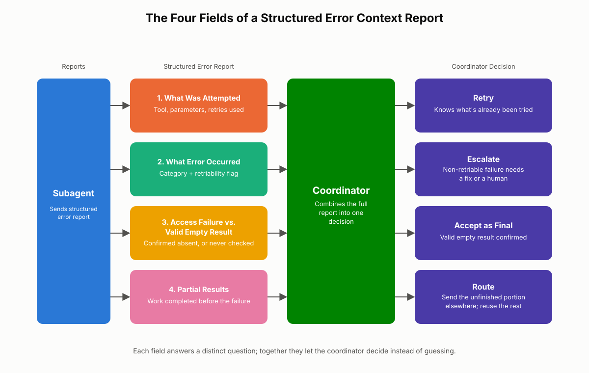
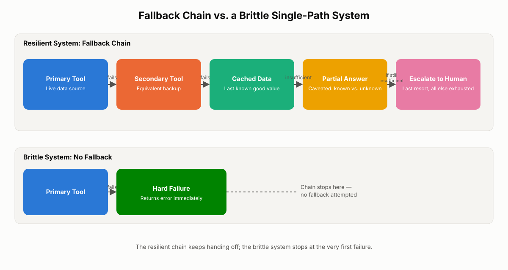
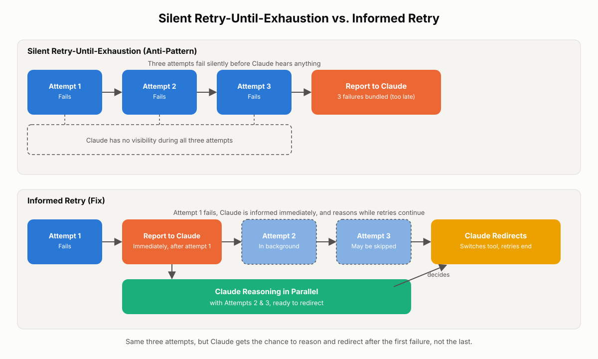
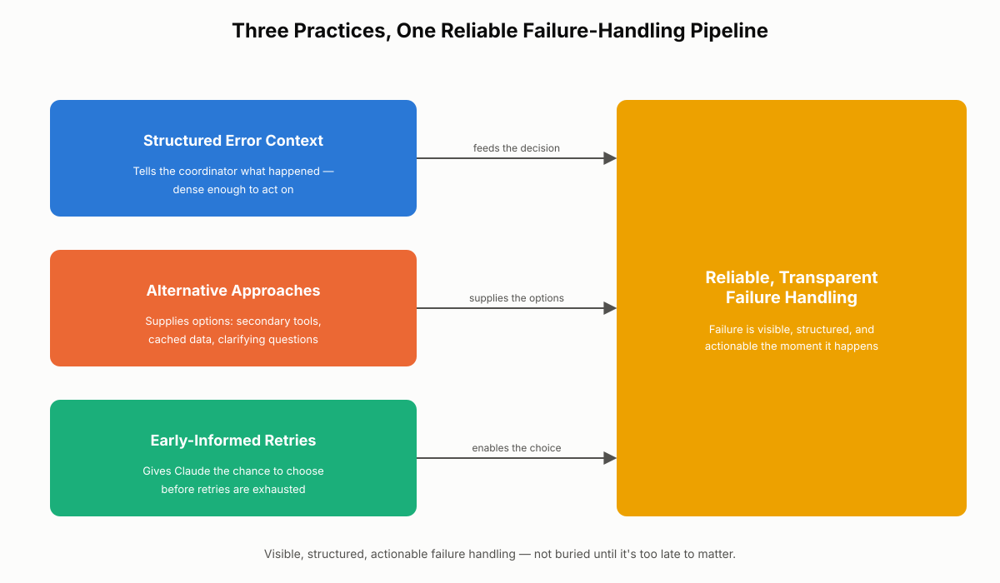

# Error Context and Common Mistakes

Every multi-agent system fails eventually — a database times out, an API rejects a request, a retrieval step comes back empty. What separates a reliable architecture from a brittle one is not the absence of failure but the quality of the information that failure produces. This chapter covers how to build structured error context that a coordinator can act on, why alternative approaches and fallback paths keep a workflow moving when the primary path breaks, and the single most common mistake teams make with retry logic: hiding failures from Claude until every attempt has already been burned. Expect exam questions that ask you to identify missing fields in an error report, distinguish an access failure from a valid empty result, and spot the retry anti-pattern in a scenario description.

## Structured Error Context in Multi-Agent Systems

In the hub-and-spoke model, a coordinator delegates work to subagents and has no visibility into what happened during execution beyond what the subagent reports back. If a subagent's failure report is a single word — `"error"` or `"timeout"` — the coordinator is left guessing. It doesn't know which tool failed, whether the failure is worth retrying, or whether any useful work survived the failure. Guessing at this layer is how small failures turn into confidently wrong answers two or three steps downstream.

Structured error context is the fix. It is a deliberate report format a subagent uses when something goes wrong, built so the coordinator can decide — not guess — what to do next: retry, route to a different subagent, fall back to partial data, or escalate to a human.

### The Four Elements of Structured Error Context

A complete structured error context report answers four questions. Miss any one of them and the coordinator is forced back into guessing.

**1. What was attempted.** A short record of the action the subagent already took: which tool was called, with what parameters, and how many retries were already used. This prevents the coordinator from blindly repeating a step that has already failed twice.

**2. What error occurred.** The concrete failure detail, tagged with an error category and a retriability flag. The category should map onto the same four-part failure taxonomy used for classifying tool and MCP failures elsewhere in this book: transient failure, validation failure, business logic failure, or permission failure. The retriability flag answers a question the category alone doesn't: can this specific failure be retried, or is it permanently blocked (for example, a permission failure that will not resolve itself no matter how many times the call is repeated)?

**3. Access failure or valid empty result.** This is the distinction that matters most and is also the one most often skipped. Did the subagent successfully reach the source and confirm there was nothing there? Or did it never manage to check at all? An empty result and an access failure can look identical from the outside — both come back with "no data" — but they demand opposite responses. A valid empty result means the system can move on with confidence: the record genuinely doesn't exist. An access failure means the system has learned nothing, and treating it as a confirmed absence is how a coordinator ends up confidently reporting a false negative to a user or to the next stage of a pipeline.

**4. Partial results.** Anything the subagent completed before the failure occurred — a partial list of records, a draft summary, three of five lookups. Partial results should never be discarded just because the overall operation didn't finish cleanly. They are often the majority of the useful work already done, and losing them forces expensive re-work.

> ⚠️ **Important:** Access failure vs. valid empty result is the single distinction most often left out of error reports, and it is also the one exam questions and production incidents most often hinge on. If your error schema has no field for this, it is incomplete regardless of how much other detail it includes.

### A Worked Example

Consider a subagent asked to pull order history for ten customers. The database tool fails partway through, on customer six. A vague report would say something like `"query failed"`. A structured report looks like this:

```json
{
  "attempted": {
    "tool": "query_order_history",
    "parameters": { "customer_ids": [1, 2, 3, 4, 5, 6, 7, 8, 9, 10] },
    "retries_used": 1
  },
  "error": {
    "category": "transient",
    "detail": "Database connection timeout on customer_id 6",
    "retriable": true
  },
  "outcome": "access_failure",
  "outcome_detail": "Customers 6-10 were never successfully queried",
  "partial_results": {
    "completed": [1, 2, 3, 4, 5],
    "data": "orders_customers_1_to_5.json"
  }
}
```

With this report, the coordinator can act immediately: retry only customers 6 through 10, reuse the data already collected for customers 1 through 5, and avoid re-querying work that already succeeded. No wasted tool calls, no wasted tokens re-deriving what already happened.

**Real-world use case:** A financial-services support agent aggregates account statements across multiple regional banking systems before answering a customer question. One regional system times out mid-batch. Because the subagent reports which accounts were retrieved, which were never reached, and that the failure was a transient connection timeout, the coordinator retries only the missing region instead of re-pulling every account — cutting both latency and cost, and avoiding a partial answer being presented as complete.

### Why This Matters for Context Management

Every token the coordinator reads either helps it decide what to do next or is wasted. A structured error report is dense by design: four short fields carrying everything the next layer needs, with no noise and no re-derivation required. Compare that to a coordinator that has to infer failure details from a wall of stack-trace text or, worse, from silence. Structured error context is context-window economy applied to the failure path specifically — it keeps the signal-to-noise ratio high exactly where systems are most tempted to dump raw, unstructured output.

The alternative is worse than inefficient — it's dangerous. Without structure, a failure doesn't just stop; it gets misclassified. A subagent's silent failure gets read as an empty result, and two steps later the system confidently delivers a wrong answer built on a gap nobody flagged. The failure never disappeared — it went underground and resurfaced as a fabricated conclusion. Structured error context catches the problem at the layer where it happened, before it becomes someone else's silent bug.

> 💡 **Tip:** When designing a subagent's return schema, add the error fields at the same time you define the success fields. Treating error reporting as an afterthought is exactly how teams end up with a bare `"error"` string bolted on after the fact.


*Figure 18.1: The four required fields of a structured error context report, and how each one maps to a specific coordinator decision (retry, route, accept-as-final, or escalate).*

### Best Practices and Common Mistakes

> ✅ **Best Practice:** Standardize a single error-report schema across every subagent in a coordinator's fleet. If each subagent invents its own failure format, the coordinator ends up writing bespoke parsing logic per subagent — which defeats the purpose of structuring anything.

> ⚠️ **Important:** Do not conflate "retriable" with "transient." A permission failure can technically be retried (the call will execute again), but retrying it will never succeed until the underlying access is fixed. The retriability flag should reflect whether retrying is *useful*, not merely whether it is *possible*.

A common mistake worth naming explicitly: reporting only the error category without the access-failure-vs-empty-result flag. Two subagents can both report "transient database error, category: transient" and still leave the coordinator unable to tell whether any data came back at all. The category explains *why* something failed; the access-failure flag explains *what the failure means for the data*. Both are required.

## Why Alternative Approaches and Fallback Paths Matter

A workflow built around exactly one prompt, one tool, and one retrieval strategy works — right up until that single approach fails. Reliable Claude systems are not designed around a single path to success; they are designed with alternatives, because in production, tools go down, retrieval misses documents, prompts behave inconsistently on edge cases, and workflows break in ways no one anticipated at design time.

An alternative approach is any backup path a system can take when the primary method fails or produces a poor result. These generally fall into three categories.

### Infrastructure-Level Alternatives

- Retrying with a different retrieval source instead of the one that just failed.
- Switching to a backup tool that performs an equivalent function.
- Falling back to cached data when a live source is unreachable.

### Prompt-Level Alternatives

- Using a simpler prompt structure when the primary, more elaborate one produces unreliable output.
- Relaxing formatting constraints to return a partial but genuinely useful response, rather than failing outright because a strict schema couldn't be satisfied.

### Interaction-Level Alternatives

- Asking the user a clarifying question instead of guessing when context is ambiguous. This is often cheaper and more reliable than any automated fallback, and it keeps the human in the loop exactly where ambiguity — not mere inconvenience — warrants it.

A system that depends on a single method is fragile by construction. One retrieval pipeline can miss a critical document. One API can go down. One prompt structure can break on an edge case the original developer never tested. In agentic workflows this fragility compounds: each additional step in an agentic loop multiplies the failure rate of the weakest link in the chain, so a single brittle step early on can cascade into a much larger failure several steps downstream. Reliable systems reduce that risk with flexibility and redundancy — not by duplicating entire pipelines, but often by nothing more than a fallback prompt, a secondary retrieval method, or a documented degradation path.

### Letting Claude Participate in Recovery

Alternative approaches are especially powerful in Claude-based systems because Claude itself can be part of the recovery, not just a passive executor waiting for the system to hand it a pre-selected fallback. When a tool returns a clear, well-written error, Claude can often choose a different strategy on its own — try a different query shape, ask a clarifying question, or proceed carefully with the partial information it has. Simply telling the model that a tool is failing, and giving it room to adapt, is frequently enough; it does not require the system to hardcode every possible recovery branch in advance.

In practice, this takes a few familiar shapes:

- If retrieved context is incomplete, Claude can ask a follow-up question or proceed carefully while flagging what's missing.
- If a tool call fails, the workflow can try a secondary tool, fall back to cached data, or simply surface the error to Claude so it can pick a different path itself.
- If an output doesn't meet formatting constraints, the system can return a simplified version rather than failing the whole request.

This pattern matters most in long-context workflows, tool-heavy MCP integrations, and multi-step reasoning pipelines — anywhere a small failure has room to cascade before anyone notices.

```python
def summarize_customer_activity(customer_id):
    try:
        data = primary_activity_api.fetch(customer_id)
    except ToolTimeoutError as e:
        report_to_claude(tool="primary_activity_api", error=e, retriable=True)
        try:
            data = secondary_activity_endpoint.fetch(customer_id)
        except ToolError as e2:
            report_to_claude(tool="secondary_activity_endpoint", error=e2, retriable=False)
            data = cache.get_last_known(customer_id)
            if data is None:
                return ask_claude_to_respond_with_partial_context(
                    known="none",
                    explanation="Both live sources and cache are unavailable"
                )
            return build_partial_summary(data, note="Using cached data; live sources unavailable")
    return build_summary(data)
```

**Real-world use case:** An agent is asked to summarize a customer's recent activity. The primary tool times out. A brittle implementation stops there and returns a bare error to the user. A resilient implementation tries a secondary endpoint, falls back to cached data if that also fails, and only then surfaces a clear, partial answer — explicitly explaining what it could and couldn't retrieve. Same underlying failure, very different outcome for the person waiting on the answer.

> 🚀 **Pro Tip:** You don't need to build a fallback for every conceivable failure mode on day one. Start with the two or three failures your logs already show happening most often, and add fallback paths incrementally as new failure patterns emerge in production.

If a coordinator exhausts every fallback — the primary tool, the secondary tool, and cached data — and still cannot make progress, that is a legitimate point to escalate to a human using a valid escalation trigger, rather than continuing to invent further automated fallbacks indefinitely.


*Figure 18.2: A fallback chain: each failed approach hands off to the next rather than terminating the workflow, with a partial, caveated answer as the last resort before escalation.*

### Best Practices and Common Mistakes

> ✅ **Best Practice:** Give Claude the error, not just a fallback instruction. Telling Claude *why* the primary approach failed lets it choose an appropriate alternative; simply routing it to "try tool B" without context removes the reasoning step that makes the fallback intelligent rather than mechanical.

A common mistake is treating "no fallback exists" as equivalent to "the request cannot be completed." Often a degraded but honest partial answer — clearly labeled as partial — is far more useful to the end user than a hard failure, and far more honest than silently guessing.

> ⚠️ **Important:** Fallback paths are not free. A secondary retrieval source or cached-data path can itself become stale or wrong. Alternative approaches reduce fragility, but they still need their own validity checks — a fallback that silently returns bad data is arguably worse than a fallback that fails loudly.

## The Common Mistake: Withholding Failures Until Retries Are Exhausted

Retry logic is a standard, sensible part of building resilient systems: a tool call fails, the system waits briefly, and tries again, because many failures are transient and a second attempt succeeds. The mistake is not using retry logic. The mistake is what happens — or doesn't happen — with Claude during those retries.

### How the Anti-Pattern Plays Out

The common but flawed pattern looks like this: a tool call fails. The retry system kicks in and tries again, silently. It fails again, silently. It tries once more, and only after all attempts have failed does the system finally pass any information to Claude — as a summary of three failures bundled together. During the entire retry sequence, Claude has no visibility into what's happening. It waits with no context, and by the time it's informed, it's too late to influence any of the attempts that already happened.

### Three Compounding Problems

**Wasted time.** Every retry cycle adds latency. If Claude had known about the failure after the very first attempt, it might have suggested a different tool, a different query, or a different approach entirely — avoiding the remaining retry cycles rather than waiting them out.

**Lost reasoning opportunity.** Claude is not merely an executor of tool calls; it is a reasoning system. After a single failure, Claude can evaluate what likely went wrong and decide intelligently what to do next. Keeping it uninformed during the retry window removes that capability for the entire duration of the retries, not just the first one.

**Cascading pipeline failures.** In a multi-step workflow, a silent retry loop in one step blocks every step that depends on it. The whole pipeline stalls while retries play out — retries Claude was never asked to reason about and had no opportunity to influence.

> ⚠️ **Important:** This is one of the most exam-relevant mistakes in this domain. A scenario that describes a system logging three retries and only then informing Claude of "three failures" is describing this exact anti-pattern, even if the retry logic itself is technically sound.

### The Fix: Inform Claude After the First Failure, Not the Last

The correct pattern is straightforward: when a tool call fails, pass that information to Claude immediately — not after every attempt has already been used up. Claude can then reason about whether retrying makes sense, whether a better tool is available, whether more information is needed before trying again, or whether the failure should be surfaced to the user right now rather than after further failed attempts.

When informing Claude of a failure, include three things:

1. **What failed** — which tool was called, what it was asked to do, and what the input was.
2. **How it failed** — a timeout, a permission error, an empty result, a malformed response. The specific failure type matters because different failures call for different responses.
3. **What comes next** — whether a retry is planned, how many attempts remain, and how long the system intends to wait before trying again.

With that context, Claude makes a real decision rather than receiving a summary of failures after the fact.

```python
# Anti-pattern: silent retries, Claude informed only after exhaustion
def call_tool_bad(tool, params, max_retries=3):
    last_error = None
    for attempt in range(max_retries):
        try:
            return tool.call(params)
        except ToolError as e:
            last_error = e
            time.sleep(backoff(attempt))
    # Claude only hears about this now -- after 3 silent failures
    return report_to_claude(f"Tool failed after {max_retries} attempts: {last_error}")


# Better pattern: Claude is informed after the first failure and can steer
def call_tool_good(tool, params, max_retries=3):
    for attempt in range(max_retries):
        try:
            return tool.call(params)
        except ToolError as e:
            decision = report_to_claude_and_get_decision(
                what_failed={"tool": tool.name, "params": params},
                how_it_failed={"type": e.category, "detail": str(e)},
                whats_next={"retry_planned": attempt < max_retries - 1,
                            "attempts_remaining": max_retries - attempt - 1}
            )
            if decision == "stop_and_switch":
                return None  # Claude chooses an alternative path instead
            if decision == "escalate":
                return escalate_to_human(tool, params, e)
            # otherwise, proceed to the next retry attempt
    return report_to_claude(f"Tool failed after {max_retries} attempts")
```

**Real-world use case:** A document-processing pipeline calls an OCR service that intermittently times out under load. In the silent-retry version, the pipeline burns 45 seconds across three retries before Claude ever hears there's a problem, and by then the user-facing request has already missed its latency budget. In the informed version, Claude is told about the timeout after the first failed attempt, recognizes from the error detail that the file is unusually large, and immediately switches to a chunked-processing tool instead of waiting through two more doomed retries of the same request — cutting total latency by more than half.

> 💡 **Tip:** "Inform Claude early" doesn't mean abandoning retry logic — it means running the retry logic and the informing step concurrently rather than sequentially. The system can still retry automatically in the background while Claude reasons about whether that's the right move.

The mistake here is never the retry logic itself. It's the information flow around it. Claude needs to know when something goes wrong, not only once it has gone wrong permanently.


*Figure 18.3: Silent retry-until-exhaustion versus informed retry: the same three attempts, but with Claude given the opportunity to reason and redirect after the first failure instead of after the last.*

### Best Practices and Common Mistakes

> ✅ **Best Practice:** Design retry logic and error-reporting logic as two separate, cooperating mechanisms — never bundle "report to Claude" as the very last line of a retry loop that only executes after the loop exits.

A common mistake is assuming that informing Claude earlier will make the system "chattier" or slower. In practice, the opposite is usually true: early information lets Claude cut a doomed retry sequence short, which reduces total latency compared to waiting out every scheduled attempt.

## Putting It All Together: The Core Principle

Structured error context, alternative approaches, and early failure visibility are three expressions of the same underlying principle: failure must be visible, structured, and actionable at the moment it happens, not buried until it's too late to matter.

- Structured error context tells the coordinator *what happened*, in a form dense enough to act on without further investigation.
- Alternative approaches keep the system moving by giving it more than one way to make progress after a failure.
- Informing Claude immediately — rather than after retries are exhausted — is what makes both of the above possible in real time, instead of only in a postmortem.

A system doesn't become reliable by avoiding failure. It becomes reliable by continuing to operate safely, and transparently, when failure happens.

## Chapter Summary

Reliable multi-agent systems treat failure as information to be engineered, not noise to be minimized. A structured error context report carries four fields — what was attempted, what error occurred (with category and retriability), whether the outcome was an access failure or a valid empty result, and any partial results already completed — giving the coordinator everything it needs to retry, route, or escalate without guessing. Alternative approaches, at the infrastructure, prompt, and interaction levels, keep a workflow moving when a single primary path fails, and Claude itself can participate in choosing the recovery path when it is given a clear, well-written error. The most common mistake in retry design is withholding failure information from Claude until every retry attempt has already been exhausted; this wastes time, discards a reasoning opportunity Claude could have used after the very first failure, and lets silent retry loops stall entire downstream pipelines. The fix is to inform Claude of what failed, how it failed, and what happens next immediately after the first failure, so it can reason about the best path forward in real time.

## Key Takeaways

- Structured error context requires four fields: what was attempted, what error occurred (category plus retriability), access failure vs. valid empty result, and partial results.
- Access failure and valid empty result look identical from the outside but demand opposite responses — conflating them is the single most damaging omission in an error report.
- Partial results should always be preserved and reused; never discard completed work just because the overall operation didn't finish.
- Alternative approaches exist at three levels: infrastructure (backup tools, cached data), prompt (simplified structure, relaxed formatting), and interaction (clarifying questions).
- Each additional step in an agentic loop multiplies the failure rate of the weakest link, so unaddressed fragility in one early step compounds downstream.
- Claude can actively participate in recovery when given a clear, well-written error — it doesn't need every fallback branch hardcoded in advance.
- The most common retry mistake is silently exhausting all attempts before informing Claude; the fix is informing Claude after the first failure with what failed, how it failed, and what happens next.
- Informed retries typically reduce total latency compared to silent ones, because Claude can cut a doomed retry sequence short instead of waiting it out.


*Figure 18.4: The three practices from this chapter working together: structured reporting feeds the coordinator's decision, alternative approaches supply the options, and early informing gives Claude the chance to choose between them before retries are exhausted.*

## Interview Questions

1. Explain the four elements of structured error context and describe what decision each one enables for a coordinator.
2. Why is distinguishing an access failure from a valid empty result critical in multi-agent systems? Describe a scenario where conflating the two causes real harm.
3. Describe the three levels at which alternative approaches typically operate (infrastructure, prompt, interaction), with one concrete example of each.
4. Why does an agentic loop multiply the failure rate of its weakest link, and what does that imply for how you'd design a five-step pipeline?
5. Walk through the "silent retry until exhaustion" anti-pattern step by step and explain the three distinct problems it causes.
6. What three pieces of information should be communicated to Claude immediately after a tool failure, and why does the timing of that communication matter as much as its content?
7. How does structured error context connect to the broader discipline of context window management — why is a dense, four-field report preferable to a verbose stack trace?
8. Design a structured error schema for a subagent that queries three different external APIs in sequence. What fields would you include, and how would you represent partial success across the three calls?

## Practice Questions & Answers

**Practice Question (unofficial):** A subagent is asked to check inventory levels for 20 SKUs. It successfully checks 14 before an API rate limit kicks in. Write the structured error context this subagent should return to its coordinator.

*Answer:* The report should include all four required elements: (1) What was attempted — `check_inventory` called for 20 SKUs, 0 prior retries; (2) What error occurred — category: transient (rate limiting typically clears), retriable: true, with detail such as "API rate limit reached after 14 requests"; (3) Access failure or valid empty result — access failure for the remaining 6 SKUs, since they were never checked (not confirmed as zero-stock); (4) Partial results — the 14 successfully retrieved inventory levels, included directly in the response so the coordinator doesn't need to re-fetch them. The coordinator can then wait out the rate limit or retry only the remaining 6 SKUs, reusing the 14 already retrieved.

**Practice Question (unofficial):** A teammate argues that since retry logic already handles transient failures automatically, there's no need to tell Claude about a failure until the retries are done — otherwise you're just adding noise. How would you respond?

*Answer:* This conflates two separate concerns: whether to retry automatically, and whether to inform Claude while retries are happening. They aren't mutually exclusive — a system can retry in the background while simultaneously informing Claude of the first failure, its category, and the retry plan. Informing Claude early isn't noise; it gives Claude the chance to reason about whether the retry is even worth waiting for, or whether a better path exists (a different tool, a clarifying question, an early escalation). Waiting until all retries are exhausted removes that reasoning opportunity for the entire retry window and, counterintuitively, often increases total latency rather than reducing noise.

**Practice Question (unofficial):** A retrieval-augmented workflow's primary vector search times out. List two infrastructure-level and one interaction-level alternative approach the system could take, and explain when the interaction-level option is the better choice.

*Answer:* Infrastructure-level options: (1) retry against a secondary or cached index if one exists; (2) fall back to a keyword-based search as a degraded but functional substitute for semantic retrieval. Interaction-level option: ask the user a clarifying question about what they're looking for, or tell them plainly that retrieval is degraded and offer a partial answer with that caveat attached. The interaction-level option is the better choice when the ambiguity or gap is significant enough that guessing risks a materially wrong answer — in that case, transparency and a quick clarifying question cost less than confidently returning something incorrect.

**Practice Question (unofficial):** A coordinator receives this report from a subagent: `"error: database issue"`. What's missing, and what four fields should the subagent have included instead?

*Answer:* Nearly everything structurally useful is missing. The report should have included: (1) what was attempted — which query, which parameters, how many retries; (2) what error occurred — the specific failure detail and category (e.g., transient connection timeout) plus whether it's retriable; (3) whether this is an access failure or a valid empty result — critical, since "database issue" doesn't tell the coordinator whether any data was actually confirmed absent or simply never checked; (4) any partial results completed before the failure. Without these, the coordinator cannot decide between retrying, routing elsewhere, or escalating — it can only guess.

## Multiple Choice Questions

**Q1.** Which of the following is NOT one of the four required elements of structured error context?
A. What was attempted
B. What error occurred
C. The subagent's total token usage for the session
D. Partial results

**Correct Answer: C**

*Explanation:* The four required elements are what was attempted, what error occurred, access failure vs. valid empty result, and partial results. Token usage for the session is unrelated to describing a specific failure and isn't one of the four elements. A is incorrect because "what was attempted" is explicitly one of the four required fields. B is incorrect for the same reason — the error detail, category, and retriability are required. D is incorrect because partial results are explicitly required so no completed work is discarded.

**Q2.** A subagent queries a database for a customer record and gets back zero rows. The database connection was confirmed healthy throughout the query. This outcome should be reported as:
A. An access failure
B. A valid empty result
C. A transient failure
D. A permission failure

**Correct Answer: B**

*Explanation:* The source was successfully reached and confirmed to have no matching record — this is a valid empty result, not a failure of any kind. A is incorrect because an access failure means the source was never successfully checked; here it was checked successfully. C is incorrect because nothing failed — the query completed normally with a legitimate zero-row result. D is incorrect because there's no indication of a permissions problem; the query executed and returned a result.

**Q3.** Why is distinguishing access failure from valid empty result described as the most critical element of structured error context?
A. Because it is the only element required by JSON Schema validation
B. Because the two outcomes look identical from the outside but require opposite responses
C. Because it determines the subagent's retry count automatically
D. Because it is the only element coordinators are legally required to log

**Correct Answer: B**

*Explanation:* An access failure and a valid empty result both surface as "no data," but one means the system learned nothing and should retry or investigate, while the other means the system can confidently proceed. Conflating them causes exactly the kind of downstream confident-wrong-answer failure this chapter warns against. A is incorrect — JSON Schema validation has no bearing on this distinction. C is incorrect because retry counts are tracked separately, under "what was attempted." D is incorrect — there's no such legal requirement in this context; the criticality is about correct decision-making, not compliance.

**Q4.** A subagent fails on customer 6 out of 10 while retrieving order histories. According to the structured error context pattern, what should happen to the data already retrieved for customers 1-5?
A. It should be discarded, since the overall operation did not complete successfully
B. It should be preserved and returned as partial results so the coordinator can reuse it
C. It should be re-fetched during the retry to ensure consistency
D. It should be cached only if the retry ultimately succeeds

**Correct Answer: B**

*Explanation:* Partial results are one of the four required elements precisely so completed work is never thrown away. The coordinator can retry only the failed portion (customers 6-10) and reuse the already-retrieved data for 1-5. A is incorrect because discarding completed work is the exact mistake structured error context is designed to prevent. C is incorrect and wasteful — re-fetching already-successful data duplicates work unnecessarily. D is incorrect because the value of partial results doesn't depend on whether the retry eventually succeeds.

**Q5.** Which of the following best describes an "alternative approach" in a reliable Claude system?
A. A completely duplicated pipeline that runs in parallel with the primary pipeline at all times
B. Any backup path the system can take when the primary method fails or produces a poor result
C. A hardcoded list of every possible failure and its exact resolution, defined before deployment
D. A retry of the exact same tool call with the exact same parameters

**Correct Answer: B**

*Explanation:* An alternative approach is any backup path — a secondary tool, cached data, a simplified prompt, or a clarifying question — used when the primary approach fails or underperforms. A is incorrect because resilience rarely requires full pipeline duplication; often a single fallback prompt or secondary source is sufficient. C is incorrect because the chapter emphasizes that Claude can adapt dynamically when given a clear error, rather than requiring every branch to be predefined. D is incorrect because retrying the identical call with identical parameters is standard retry logic, not an alternative approach.

**Q6.** At which level would "asking the user a clarifying question instead of guessing" be classified as an alternative approach?
A. Infrastructure level
B. Prompt level
C. Interaction level
D. Retry level

**Correct Answer: C**

*Explanation:* Asking a clarifying question is an interaction-level alternative — it involves the relationship between the system and the user rather than backend infrastructure or prompt construction. A is incorrect because infrastructure-level alternatives involve things like backup tools or cached data. B is incorrect because prompt-level alternatives involve simplifying structure or relaxing formatting constraints, not user interaction. D is incorrect because "retry level" is not one of the three categories described in this chapter.

**Q7.** Why does Anthropic's guidance suggest that each additional step in an agentic loop multiplies the failure rate of the weakest link?
A. Because Claude's context window shrinks with each additional step
B. Because a single brittle step early in a chain can cascade into much larger failures downstream
C. Because retries automatically double at each subsequent step
D. Because tool descriptions become less accurate the further into a workflow they are read

**Correct Answer: B**

*Explanation:* In a multi-step chain, an unresolved weakness in one early step doesn't stay contained — it propagates and compounds through every subsequent step that depends on its output. A is incorrect; this is unrelated to context window size. C is incorrect — there's no automatic doubling of retries per step. D is incorrect and unrelated to the failure-compounding concept described here.

**Q8.** In the silent-retry anti-pattern, when does Claude typically first learn that a tool call failed?
A. Immediately after the first failed attempt
B. Only after all retry attempts have been exhausted
C. Before the tool call is even made
D. Claude is never informed under any retry pattern

**Correct Answer: B**

*Explanation:* The defining feature of the anti-pattern is that Claude is kept uninformed through every retry attempt and only learns about the failure — usually as a bundled summary — once every attempt has already failed. A describes the corrected pattern, not the anti-pattern. C is incorrect and not part of either pattern described. D is incorrect because Claude is eventually informed under the anti-pattern, just too late to act on it.

**Q9.** Which of the following is NOT one of the three problems caused by withholding failure information until retries are exhausted?
A. Wasted time from unnecessary retry cycles
B. Lost reasoning opportunity for Claude
C. Cascading failures across a multi-step pipeline
D. Permanent corruption of the underlying database

**Correct Answer: D**

*Explanation:* The three problems described are wasted time, lost reasoning opportunity, and cascading pipeline failures. Database corruption is not a consequence of this information-flow mistake. A, B, and C are each explicitly identified as consequences of the anti-pattern.

**Q10.** When informing Claude of a tool failure early, which three pieces of information should be included?
A. The subagent's full source code, the server's IP address, and the customer's account balance
B. What failed, how it failed, and what comes next
C. Only the HTTP status code
D. The total number of subagents currently running in the system

**Correct Answer: B**

*Explanation:* The recommended pattern is to communicate what failed (tool, task, input), how it failed (the specific error type), and what comes next (whether a retry is planned and how many attempts remain). A is irrelevant and inappropriate detail to hand to a reasoning model. C is insufficient on its own — a status code alone doesn't convey what was attempted or what happens next. D is unrelated to reporting a specific failure.

**Q11.** A pipeline retries a failing tool call three times silently, then reports all three failures to Claude at once. Compared to informing Claude after the first failure, this approach typically results in:
A. Lower total latency, since Claude is not interrupted during retries
B. Equal or higher total latency, since Claude cannot cut short a doomed retry sequence
C. No difference in latency, since retries take the same amount of time regardless of when Claude is informed
D. Guaranteed success on the second retry attempt

**Correct Answer: B**

*Explanation:* Because Claude has no chance to redirect the workflow until all three attempts have already run, the system pays the full latency cost of every retry even in cases where an earlier intervention (switching tools, asking a clarifying question) could have avoided the later attempts entirely. A is incorrect — being uninterrupted doesn't reduce latency; it removes the chance to shortcut it. C is incorrect because informing Claude early specifically creates the option to skip remaining retries. D is incorrect and unsupported — there's no guarantee tied to retry count.

**Q12.** Which statement best reflects this chapter's view of retry logic itself?
A. Retry logic is inherently flawed and should be replaced with immediate escalation to a human
B. Retry logic is sound engineering practice; the mistake is the information flow around it, not the retries themselves
C. Retry logic should never be combined with informing Claude, to avoid excessive complexity
D. Retry logic should only be used for permission failures

**Correct Answer: B**

*Explanation:* The chapter is explicit that retry logic itself is standard and sensible; the failure mode is withholding information from Claude during the retry window, not the existence of retries. A is incorrect — retries are described as a legitimate, standard practice. C is incorrect and contradicts the chapter's recommended fix, which combines retries with early informing. D is incorrect — permission failures are typically not worth retrying at all, since they will not resolve without an access change.

**Q13.** A subagent reports: "attempted `fetch_records` with retries: 2; error category: permission; retriable: false; outcome: access_failure; no partial results." What should the coordinator most likely do next?
A. Retry the same call a third time immediately
B. Treat the missing records as a confirmed empty result and proceed
C. Avoid further retries of this specific call and instead route to a fix for the permission issue or escalate
D. Ignore the report and re-run the entire subagent from scratch

**Correct Answer: C**

*Explanation:* A non-retriable permission failure means repeating the same call will not help; the correct response is to address the underlying access problem or escalate, not to keep retrying. A is incorrect because the report explicitly flags the error as not retriable. B is incorrect and dangerous — this was an access failure, not a valid empty result, so treating the records as confirmed absent would be a fabricated conclusion. D is inefficient and unnecessary — only the failed call needs addressing, not the entire subagent's prior work.

**Q14.** Why can Claude often participate directly in choosing a recovery path after a tool failure, according to this chapter?
A. Because Claude has direct write access to every tool's underlying infrastructure
B. Because a clear, well-written error lets Claude reason about and select an appropriate alternative without every fallback being hardcoded in advance
C. Because Claude automatically retries any failed tool call without being asked
D. Because fallback paths are only ever chosen randomly

**Correct Answer: B**

*Explanation:* The chapter emphasizes that Claude, given a clear error description, can adapt and choose a sensible alternative strategy on its own — reducing the need to pre-script every possible failure branch. A is incorrect and describes infrastructure access, not reasoning capability. C is incorrect — automatic retries are a separate mechanism from Claude's own reasoning about alternatives. D is incorrect; fallback selection in this chapter is reasoned, not random.

**Q15.** A workflow's primary summarization prompt fails to produce output matching a strict output format on an edge case. Which alternative approach best fits the "prompt level" category described in this chapter?
A. Switching to an entirely different LLM provider
B. Returning a simplified, less strictly formatted response rather than failing outright
C. Asking the user to rephrase their original request
D. Retrying the identical prompt with identical parameters five more times

**Correct Answer: B**

*Explanation:* Relaxing formatting constraints to return a partial but useful response is a canonical prompt-level alternative described in this chapter. A is an infrastructure-level change of a different kind (and not discussed as a described alternative in this chapter). C is an interaction-level alternative, not a prompt-level one. D is not an alternative approach at all — it's a repetition of the same failing method, which the chapter explicitly warns against relying on alone.

## Evaluate Yourself

1. **Scenario-based:** You're debugging a coordinator that keeps producing a confident final answer even though a subagent silently failed to check half its data sources. Walk through how you'd identify where in the error-reporting chain the access-failure/valid-empty-result distinction was lost, and describe the fix.
2. **Architecture-design:** Design the structured error schema and fallback chain for a multi-agent research assistant that queries three data sources (an internal knowledge base, a live web search tool, and a cached document store) to answer a single user question. Specify what happens if all three fail, and where escalation should occur if it does.
3. **Short-answer reflection:** Think of a system you've built or used where a failure was reported only after retries were exhausted. What information would have changed the outcome if it had been surfaced after the first failure instead?
4. **Scenario-based:** A subagent's tool call fails validation because a required field was missing from its own request. Should this failure be treated as retriable? Justify your answer using the failure taxonomy and the retriability flag concept from this chapter.
5. **Architecture-design:** You're asked to reduce average end-to-end latency in a pipeline that currently retries silently three times per tool before reporting to Claude. Propose a redesign that keeps the same retry budget but changes when and how Claude is informed, and estimate qualitatively where the latency savings would come from.
