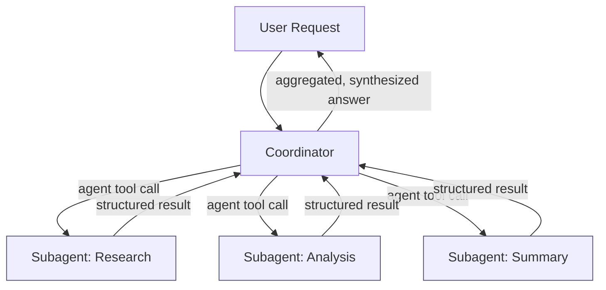
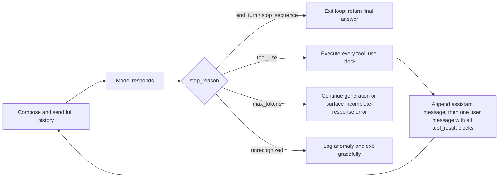
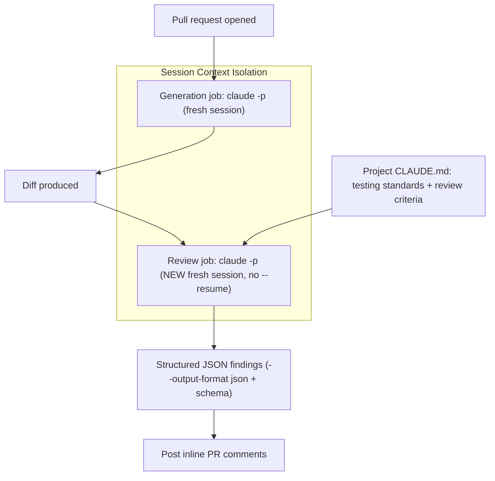

# Exam Prep & Reference Appendix

This appendix is built to be used in three ways: read the Revision Notes end to end as a fast refresher of all eighteen chapters, use the Glossary and Cheat Sheets as lookup references while you drill weak spots, and treat the Final Mock Exam as a timed dress rehearsal rather than a first read. Work the mock exam under exam conditions — no notes, one pass through all fifty questions before checking the answer key — then return to whichever chapter each miss traces back to. Everything below is grounded in the eighteen chapters that precede it; nothing here introduces a new concept the book hasn't already taught.

## Revision Notes by Chapter

### Chapter 1: The Agentic Loop

A single call to Claude is stateless and one-shot, so anything requiring more than one step needs a loop your code manages: compose and send the full history, receive the model's response, inspect `stop_reason`, and act on any tool request before feeding the result back in. `stop_reason` is the pivot of the whole system — `end_turn` and `stop_sequence` mean stop and return the answer, `tool_use` means the model is waiting on your code to execute something, and `max_tokens` means the response is incomplete and needs an explicit decision, not a silent pass-through. Branching on `tool_use` is a precise five-step sequence: extract every `tool_use` block, execute each one, append the assistant's message, append a single user message containing every `tool_result` (matched by `tool_use_id`), then loop back. The two failure modes that break the most first-attempt agents are structural opposites — skipping the history append (causing infinite repeated tool calls) and treating a tool result as the final answer (returning raw, unsynthesized output) — and both are prevented by the same discipline: the message history is the model's entire memory, and the only valid exit is a response with no pending tool calls. A hard iteration cap is mandatory, not optional, because nothing else stops a stuck tool or a confused model from looping until the budget runs out.

See [Chapter 1: The Agentic Loop](./chapter-01-the-agentic-loop.md) for the full treatment.

### Chapter 2: The Hub-and-Spoke Model

A single agent overloaded with unrelated responsibilities degrades in three predictable ways — competing instructions, bleeding reasoning threads, and one stuck step stalling the whole task — which is why multi-agent systems centralize control in a coordinator instead. The golden rule is that subagents never communicate directly; every instruction, piece of context, and result passes through the coordinator, trading a small amount of theoretical efficiency for predictability and debuggability. Task decomposition follows five steps — understand the objective, identify independent subtasks, assign specialization, define expected outputs, and plan aggregation before any subagent runs — and because subagents share no memory with the coordinator or each other, every invocation must explicitly carry the task objective, relevant context, constraints, and expected output. Aggregation is synthesis, not concatenation: contradictory-looking findings from different subagents are often both true and need to be reconciled, not discarded. When a coordinator's failure handling and a subagent's failure handling are confused, remember the subagent can only report what it observed — the coordinator decides the recovery strategy — and when final output looks incomplete, a four-point checklist (decomposition, context passing, aggregation, premature termination) almost always finds the cause before subagent intelligence should ever be blamed.

See [Chapter 2: The Hub-and-Spoke Model](./chapter-02-the-hub-and-spoke-model.md) for the full treatment.

### Chapter 3: The Agent Tool, Parallel Execution, and the Stakes-Proportionate Rule

The agent tool is the concrete mechanism behind hub-and-spoke delegation — one Claude instance invoking another, each with its own context window and tool access — and it was renamed from "task" to "agent" in Claude version 2.1.63, though the older name can still surface in system-level tooling. Delegation only works when `agent` is explicitly present in the coordinator's `allowedTools`; four misconfigurations account for nearly every broken multi-agent setup: missing `agent` on the coordinator, an unset `tools` list on a subagent (causing unsafe inheritance), `agent` mistakenly included in a subagent's own tools (enabling runaway recursive delegation), and lingering use of the deprecated `task` keyword. When Claude emits multiple agent tool calls in a single turn, those subagents run in parallel — but this requires prompt language that explicitly instructs simultaneous invocation, not just a task description that sounds parallelizable. The single deciding question for parallel versus sequential is whether one task depends on another's output; most real workflows combine both across fan-out/fan-in layers. The Stakes-Proportionate Rule governs how much scrutiny Claude applies to any instruction, scaling caution to reversibility and consequence, and it applies identically whether the instruction came from a human or a coordinator — a subagent cannot verify what actually produced the instructions it receives.

See [Chapter 3: The Agent Tool, Parallel Execution, and the Stakes-Proportionate Rule](./chapter-03-the-agent-tool-parallel-execution-and-the-stakes-proportionate-rule.md) for the full treatment.

### Chapter 4: Programmatic Control and Hooks

A system prompt shapes Claude's judgment but does not enforce anything; a programmatic gate is code inserted between a `tool_use` request and its execution that inspects the pending action and returns allow, block, or route-to-approval — a preventive check independent of whatever Claude decides. A `PreToolUse` tool call interception hook handles a different failure mode: rather than blocking a near-miss mistake and forcing a retry, it silently rewrites the call's input via `updatedInput` and lets execution proceed corrected, with no visible interruption to Claude. `PostToolUse` hooks run after execution and cannot prevent an action, but they can log it, enrich it, or mask sensitive values via `updatedToolOutput` before Claude ever reasons about the result; malformed JSON from either hook type causes Claude Code to fall back to the original, unmodified behavior. No amount of prompt engineering fixes three failure modes — knowledge cutoffs, fabrication, and missing context — because a prompt cannot add a third source of knowledge beyond training data and whatever is in the current context window; the fix is grounding through retrieval, tool use, and this same enforcement layer. Gates, hooks, and grounding are three independent layers, and a mature system needs all three, since none of them substitutes for the others.

See [Chapter 4: Programmatic Control and Hooks](./chapter-04-programmatic-control-and-hooks.md) for the full treatment.

### Chapter 5: Tool Descriptions

Tool descriptions are the primary mechanism Claude uses to select a tool — not routing logic, not architecture, not few-shot examples — so when a tool call is misrouted, the call typically succeeds and returns the wrong data with no error, making the defect hard to trace. Four warning signs mark a vague description: no input details, no output information, no example queries, and no do-not-use clause; the four-step diagnostic framework for a misselection is reproduce the exact request, compare competing descriptions side by side, identify the one missing signal, and add exactly that signal — checking afterward whether a system prompt is silently overriding the boundary just written. A production-grade description reliably contains five elements (what it does, inputs, example queries, edge cases and limitations, and explicit boundaries), and of these the do-not-use clause does the most disambiguating work, especially when it appears in both directions between two similar tools. When a tool is fundamentally overbroad — handling several unrelated jobs through an internal mode parameter — no amount of rewording fixes it; the fix is splitting it into narrower, single-purpose tools, and renaming is a near-zero-cost complement that pre-signals scope before the model even reads the full description.

See [Chapter 5: Tool Descriptions](./chapter-05-tool-descriptions.md) for the full treatment.

### Chapter 6: Error Handling Patterns

Tool and MCP failures fall into four categories, each demanding a different first response: transient failures are temporary and should be retried with exponential backoff, jitter, and a cap; validation failures are permanent and structural, so they should be rejected immediately with a field-specific explanation, never retried; business logic failures mean a well-formed request was blocked by an application rule, so the correct response explains the rule (and whether it might change) rather than treating it as a technical error; and permission failures are authorization problems, not authentication problems, and should be denied securely with the attempt logged internally. Layered on top of this taxonomy is the access-failure-vs-valid-empty-result distinction: an access failure means the operation never completed, while a valid empty result means it completed and genuinely found nothing, and both can look identical on the wire unless an explicit status flag (such as `is_error`) makes the difference clear. Good error responses follow three design principles — specificity (what failed and what to do next), categorization (a structured, machine-readable label), and containment (full diagnostics in logs, clean and safe messages everywhere else) — and a second, complementary lens (input/tool/policy errors) helps a downstream orchestrator route the outcome without re-deriving the root cause from a message string.

See [Chapter 6: Error Handling Patterns](./chapter-06-error-handling-patterns.md) for the full treatment.

### Chapter 7: MCP Configuration

MCP configuration lives in two coexisting layers: project-level, which is committed to version control and defines what a project connects to (server definitions, tool permissions, environment variable references, and an approved server list), and user-level, which is private, uncommitted, and follows a developer across every project. Both layers are active simultaneously, and project-level configuration wins only when the two directly conflict, typically on a shared server name. Credentials are handled identically at both layers — the config file holds an environment variable's name, never its value — and a credential accidentally committed must be rotated, not merely deleted, since the value persists in commit history regardless. When a configured server doesn't show up, a fixed four-step diagnostic order finds the cause fastest: verify the config file, verify the transport (stdio for local processes, SSE for remote servers), verify runtime status and approval (check `/mcp`, since a server can be perfectly configured and still sit unusably "pending"), and verify the environment (variables are read at Claude Code startup, not continuously, so a restart is required after setting one).

See [Chapter 7: MCP Configuration](./chapter-07-mcp-configuration.md) for the full treatment.

### Chapter 8: Tool Scoping and Agent Roles

More tools do not make an agent more capable past a certain point; every additional tool adds a candidate the model must reason across, consumes context window space on every turn, and raises the odds of semantic interference when names or descriptions overlap — often from combining multiple MCP servers without an overlap audit. Empirically, accuracy holds up well through roughly 10-20 tools per agent and degrades noticeably beyond that, so right-sizing a toolset means applying four diagnostic questions (what's the job, what's required versus merely convenient, what duplicates, and what belongs to a different part of the system) rather than guessing at a number. When an agent's toolset exceeds the effective range, the fix is splitting responsibilities across multiple focused agents, not writing longer descriptions or trimming existing ones. Deliberate scoping delivers three distinct benefits — reliability (fewer selection errors), security (least privilege bounding the blast radius of a compromised or misbehaving agent), and ownership (clear accountability during failure investigation) — and the resulting scope becomes a structural guarantee, not just a convention, once it's enforced through project-level MCP configuration that a reviewer can check in a pull request.

See [Chapter 8: Tool Scoping and Agent Roles](./chapter-08-tool-scoping-and-agent-roles.md) for the full treatment.

### Chapter 9: The CLAUDE.md Hierarchy

CLAUDE.md is Claude Code's persistent memory system, organized into four scope levels: managed (org-wide, distributed by administrators and never overridden by anything below it), project-level (committed, shared, loaded at the start of every session), directory-level (optional, loads on demand only when Claude works inside that folder), and user-level (personal, local, never committed). Below the managed tier, the more specific instruction wins on conflict — a directory-level rule overrides a conflicting project-level one for work inside that folder — while user-level preferences shape an individual's own sessions without overriding shared team conventions. Project-level content should stay under roughly 200 lines of stable, actionable guidance, splitting out anything folder-specific into a directory-level file or importing detail with `@path/to/file.md` rather than letting the root file bloat. When a documented team convention appears to be ignored, the cause is almost always a scoping problem rather than model unreliability, and a four-question diagnostic — is it actually shared, is it actually committed, is there a scope mismatch, does onboarding produce consistent behavior — finds it reliably.

See [Chapter 9: The CLAUDE.md Hierarchy](./chapter-09-the-claude-md-hierarchy.md) for the full treatment.

### Chapter 10: Agent Skills

CLAUDE.md and agent skills solve different problems through opposite loading mechanisms: CLAUDE.md loads fully and automatically at session start, while a skill loads only its `name` and `description` up front and pulls in its full body only once Claude judges the request semantically relevant to that description. This makes CLAUDE.md the right home for universal standards that must apply to every task, and skills the right home for task-specific workflows — security audits, code review procedures, database optimization — that would otherwise clutter every session if folded into CLAUDE.md. A skill is a folder containing at minimum a `SKILL.md` file with YAML front matter (`name` and `description`, the latter driving activation and needing to state both what the skill does and when to use it) followed by an instruction body; skills can be personal (home directory) or project-based (checked into a repository), and on a name collision, managed skills beat personal skills, which beat project skills, which beat plugin skills. Advanced skills add `allowedTools` to fence off sensitive or exploratory workflows and use progressive disclosure — a lean `SKILL.md` under roughly 500 lines linking out to `scripts/`, `references/`, and `assets/` — to scale without bloating every activation. CLAUDE.md, skills, hooks, subagents, and MCP servers are five complementary mechanisms, distinguished by what triggers each: always-on, event-driven, request-matched, explicitly delegated, or externally connected.

See [Chapter 10: Agent Skills](./chapter-10-agent-skills.md) for the full treatment.

### Chapter 11: Path-Specific Rules and Context Fork

Context Fork runs a skill's execution inside an isolated subagent rather than the main conversation, so exploratory noise — file reads, dead ends, intermediate reasoning — never floods the primary thread; it's enabled with `context: fork` and an `agent` field choosing Explore (read-only, skips CLAUDE.md/git status), Plan (structured reasoning, also skips CLAUDE.md/git status), or the general-purpose default (full toolset, loads CLAUDE.md/git status, the only correct choice when the skill must actually modify the project). The forked subagent receives only the skill's own content as its prompt — no conversation history — so a skill that depends on something discussed earlier will fail silently if forked. Path-specific rules solve a different problem: applying instructions to files identified by a glob pattern rather than a folder location, living in `.claude/rules/` with a `paths` front-matter field, which is the only clean fix when a convention (like testing standards) applies to files scattered across dozens of directories rather than grouped in one. A rule file with no `paths` field behaves like an unconditional root CLAUDE.md, loading every session regardless of relevance, while a scoped rule loads only when a matching file is actually touched — directly reducing both token consumption and the competing-instruction noise that degrades adherence to whatever else is in context.

See [Chapter 11: Path-Specific Rules and Context Fork](./chapter-11-path-specific-rules-and-context-fork.md) for the full treatment.

### Chapter 12: CLI Flags and CI/CD

Claude Code's default interactive mode waits for a human at a terminal, which stalls indefinitely inside a CI runner; the `-p` flag switches to non-interactive "print mode" — process the prompt, write the result to stdout, exit — and is the single fix the exam expects for a hanging-pipeline scenario. Companion flags turn `-p` into a production-ready building block: `--output-format json` (optionally constrained by a JSON Schema) for machine-parsable findings, piped stdin for feeding in diffs and files, `--resume` for legitimately continuing a prior session non-interactively, and `allowedTools` for scoping exactly what an unattended run may do (narrower for review jobs than for generation jobs). A complete CI/CD integration needs three things beyond `-p` itself: structured JSON output for posting findings as inline PR comments, CLAUDE.md providing the same testing standards and review criteria a human reviewer would apply, and session context isolation — running code generation and code review as separate, unresumed Claude Code invocations, because a session that just wrote a change is less likely to challenge its own reasoning than a fresh session evaluating the diff cold.

See [Chapter 12: CLI Flags and CI/CD](./chapter-12-cli-flags-and-ci-cd.md) for the full treatment.

### Chapter 13: Match Criteria and Few-Shot Examples

Opening Domain 4 (20% of the exam, tied with Domain 3 for the heaviest weighting), this chapter establishes why confidence-based instructions like "be conservative" fail: Claude has no calibrated confidence dial an adjective can tune, so it improvises its own inconsistent threshold every time. An explicit match criterion needs three parts — a category name, a concrete match condition, and an explicit non-match condition — and skipping the non-match is the single most common mistake, since an undefined boundary gets filled by the model's own guess, which skews toward overreporting. Every category and severity level should be anchored with a real code example, and every prompt needs three types of non-match defined explicitly: acceptable patterns (looks like an issue, isn't), scope exclusions (ruled out of review regardless of appearance), and edge case handling (genuinely ambiguous, often solved with an `"unclear"` enum value or a nullable field). Few-shot examples are a second resort, reached for only once criteria are already explicit and output is still inconsistent in format, ambiguous-case handling, or extraction completeness — held to 2-4 targeted examples, each addressing a distinct failure mode, and each showing the reasoning behind the decision rather than just the answer, since reasoning is what lets the model generalize a judgment instead of pattern-matching on surface wording.

See [Chapter 13: Match Criteria and Few-Shot Examples](./chapter-13-match-criteria-and-few-shot-examples.md) for the full treatment.

### Chapter 14: JSON Schema and Structured Output

Asking Claude to type JSON as free-form prose is unreliable at production volume because nothing structurally prevents markdown fences, trailing commas, or truncation; `tool_use` with a JSON Schema fixes this at the source by giving Claude a structured target to fill rather than text to type, with the API validating the result before your code ever sees it. That guarantee covers structure — required keys present, correct types — but never truth, and the most damaging gap this creates is fabrication: when a field is marked `required` but a source document doesn't always contain it, the model's only path to a schema-valid response is to invent a plausible value, and the result passes every check silently. The fix is schema design, not a smarter model: ask, for every required field, whether it is guaranteed present in every source document, and make anything short of "always" optional (the key can be absent) or nullable (the key stays present with a `null` value, the safer default for strongly-typed downstream systems). Genuine ambiguity gets an `"unclear"` enum value, and a clear value that simply doesn't fit a predefined taxonomy gets an `"other"` option paired with a free-text detail field — together giving the model a truthful, schema-valid representation for every state a source document could actually be in.

See [Chapter 14: JSON Schema and Structured Output](./chapter-14-json-schema-and-structured-output.md) for the full treatment.

### Chapter 15: API Selection: Cost vs. Latency

The choice between the Synchronous API and the Batch API reduces to one question — is something actively waiting on this response right now — and the answer is never determined by request volume or raw cost; a fraud-scoring call on millions of daily transactions is still synchronous if the checkout flow is blocked on it. The Batch API runs in three decoupled phases (submission, waiting up to 24 hours, retrieval keyed by `custom_id`, with results available for 29 days) and delivers a flat 50% discount on tokens, but it carries two hard constraints: each request is an isolated single-turn call, so multi-turn tool-calling chains cannot complete inside one batch request, and result ordering is never guaranteed, so correlation must be handled entirely through `custom_id`. SLA planning for a batch pipeline reduces to one formula — submission interval must be less than or equal to the SLA window minus the maximum processing time — always solved against worst-case timing, never the average. Underneath all of this sits the chapter's governing reframe: latency is a hard constraint set by the workload, while cost is a flexible variable optimized only after the API pattern is chosen, which is why mature production systems route different workloads to Sync and Batch side by side rather than standardizing on one for an entire product.

See [Chapter 15: API Selection: Cost vs. Latency](./chapter-15-api-selection-cost-vs-latency.md) for the full treatment.

### Chapter 16: Context Window Management

Opening Domain 5, this chapter shows that a capable model can still produce unreliable output if its context has quietly degraded: progressive summarization compresses older conversation history to fit a finite window, and that compression strips out exactly the details — numeric values, percentages, and dates — that production systems most need to keep exact, with no error or warning marking the loss. A case-facts block fixes this by keeping identifiers, dates and amounts, the issue/request, and status/decisions in a structure populated from the source system and resent unmodified on every turn, immune to whatever summarization happens around it. Position inside a long context is not neutral either: the Lost in the Middle problem produces a U-shaped retrieval-accuracy curve, with content in the interior of a long prompt reliably underweighted relative to content at the start or end, which is why Anthropic's tested fix — long reference material at the top, question and instructions at the bottom — improved response quality by up to 30% at no added token cost. Structured XML tags give a growing prompt clear, consistently named boundaries between instructions, constraints, examples, and documents, and trimming verbose tool results (filtering at the source, post-processing, or summarizing before injection) removes noise that was never going to be used, shrinking cost while reducing the odds a reasoning error hides in the clutter.

See [Chapter 16: Context Window Management](./chapter-16-context-window-management.md) for the full treatment.

### Chapter 17: Escalation Triggers

Exactly three conditions justify escalating a task to a human: a direct human request (honored immediately out of respect for user autonomy, with no investigation or reprompting first), an authority gap (the operating policy is silent or ambiguous about the specific request, as distinct from a policy that explicitly denies it), and a verification flag (a concrete signal — a failed test, a denied permission, a contradicted expectation, a detected side effect — checked either before an action runs or after it completes). Frustration and complexity are explicitly not valid triggers on their own: frustration signals someone is unhappy but says nothing about the underlying cause, so the correct response is to acknowledge it, restate the goal, and only then check for one of the three real triggers; complexity describes the scope of a task, not its safety or authorization, and the agentic loop is specifically engineered to absorb multi-step, multi-turn difficulty without stopping. Multiple ambiguous customer matches from a lookup tool are a form of authority gap — ask for another identifier rather than guessing with a heuristic. Miscalibration runs in two directions, over-escalation (overloading human queues with solvable cases) and under-escalation (letting an agent act without real authorization), and both are corrected the same way: explicit escalation criteria and few-shot examples in the system prompt, never a sentiment score or a self-reported confidence threshold.

See [Chapter 17: Escalation Triggers](./chapter-17-escalation-triggers.md) for the full treatment.

### Chapter 18: Error Context and Common Mistakes

In a hub-and-spoke system, a coordinator can only act on what a subagent reports, so a complete structured error context needs four fields: what was attempted (tool, parameters, retries already used), what error occurred (category from the same four-part taxonomy, plus a retriability flag), whether the outcome was an access failure or a valid empty result (the distinction most often skipped and most consequential when it is), and any partial results already completed, which should never be discarded just because the overall operation didn't finish cleanly. Reliable systems also build in alternative approaches at three levels — infrastructure (a backup tool, cached data), prompt (a simplified structure, relaxed formatting), and interaction (a clarifying question) — and Claude itself can often choose among these when simply given a clear, well-written error rather than every fallback branch hardcoded in advance. The most common production mistake covered in this chapter is withholding failure information from Claude until every retry attempt has already been exhausted: this wastes time, removes a reasoning opportunity Claude could have used after the very first failure, and lets a silent retry loop stall an entire downstream pipeline. The fix keeps the retry logic exactly as it is and changes only the information flow around it — inform Claude of what failed, how it failed, and what happens next immediately after the first attempt, not after the last.

See [Chapter 18: Error Context and Common Mistakes](./chapter-18-error-context-and-common-mistakes.md) for the full treatment.

---

## Glossary

**Access failure vs. valid empty result** — the distinction between an operation that never successfully completed (an access failure, which should be flagged as an error) and one that completed and genuinely found nothing (a valid empty result), which look identical unless an explicit status signal separates them.

**Acceptable pattern** — a non-match category describing code or content that superficially resembles a flagged issue but is intentional or harmless in context, and must be defined explicitly or the model will overflag it.

**Agent skill (skill)** — a folder of on-demand instructions, indexed by a `name` and `description` at session start and loaded in full only when a request is judged semantically relevant to it.

**Agent tool** — the mechanism by which a coordinator Claude instance delegates a self-contained task to a subagent Claude instance, invoked as a `tool_use` block and requiring `agent` in the caller's `allowedTools`.

**Agentic loop** — the code-level control structure that repeatedly sends the model the full conversation, inspects `stop_reason`, executes any requested tool, and feeds the result back, until the model signals genuine completion.

**allowedTools** — the configuration array that explicitly registers which tools (including the agent tool) a given Claude instance is permitted to call; nothing not listed is visible to the model.

**Answer-only example** — a few-shot example that shows only the correct output for a given input without the reasoning behind it, teaching a narrower, less generalizable lesson than a reasoning-included example.

**Authority gap** — a valid escalation trigger that occurs when an operating policy is silent or ambiguous about a specific request, as distinct from a policy that explicitly denies it.

**Batch API** — the Anthropic endpoint for asynchronous, non-blocking request processing that trades a firm response-time guarantee (up to 24 hours) for a flat 50% cost discount.

**Business logic failure** — a failure category where a structurally valid, well-formed request is blocked by an application rule (insufficient funds, out of stock, over capacity) rather than by anything wrong with the request itself.

**Case-facts block** — a short, structured set of critical details (identifiers, dates and amounts, the issue/request, status and decisions) kept outside the conversation history and resent unmodified on every turn, immune to summarization.

**CCA-F** — the certification this book prepares readers for; see Acronym List.

**Claude** — the underlying model/API, as distinct from Claude Code, the CLI product built on top of it.

**Claude Code** — Anthropic's CLI product for agentic coding and automation, the primary subject of Domains 3 through 5 of this book.

**CLAUDE.md** — Claude Code's persistent-memory markdown file, recognized at managed, project, directory, and user scope levels and loaded automatically (project/user/managed) or on demand (directory).

**Confirmation checkpoint** — a point at which Claude, under the Stakes-Proportionate Rule, pauses a high-stakes, low-reversibility action to check in with a human rather than proceeding autonomously.

**Containment** — one of three error-response design principles: keep full diagnostic detail in logs and only clean, safe, audience-appropriate detail in anything shown to a user or fed back to Claude.

**Context Fork** — a skill front-matter option (`context: fork`) that runs the skill's execution inside an isolated subagent, returning only a summarized result to the main conversation.

**Context window** — the finite span of tokens a model can process in a single request, which conversation history, tool results, and instructions must all share.

**Coordinator** — the central agent in a hub-and-spoke system responsible for decomposing a request, invoking subagents, passing context explicitly, and aggregating results; it rarely performs domain work itself.

**Custom_id** — a caller-assigned identifier attached to every Batch API request, used to correlate an out-of-order result back to its originating input.

**Direct human request** — a valid escalation trigger in which a user explicitly asks for a human, honored immediately and unconditionally out of respect for user autonomy.

**Do-not-use clause** — the sentence in a tool description stating what the tool is explicitly not for and which alternative tool to use instead; the single highest-leverage element for disambiguating similar tools.

**Domain (1-5)** — one of the five scored content areas of the CCA-F exam blueprint, each opened by a dedicated chapter (1, 5, 9, 13, 16).

**Edge case handling** — a non-match category covering genuinely ambiguous input that fits neither a clean match nor a clean non-match, typically resolved with an `"unclear"` enum value or a nullable field.

**Escalation trigger** — a condition under which an agent should stop attempting a task autonomously and hand it to a human or higher-authority system.

**Explicit match criteria** — a category definition with three required parts (name, match condition, non-match condition), anchored with concrete examples, that replaces vague confidence-based instructions.

**Explore agent** — a built-in subagent type with read-only tools (file reading, search) and no CLAUDE.md/git status loading, used under Context Fork for investigative, non-modifying work.

**Fabrication** — the failure mode in which a schema-valid, well-formed response contains a value the model invented rather than extracted, most often caused by a required field the source document doesn't always contain.

**Failure taxonomy** — the four-category classification of tool/MCP failures (transient, validation, business logic, permission), each with a distinct correct first response.

**Fan-out/fan-in** — a workflow pattern combining a sequential step, a parallel layer of independent subtasks, and a sequential synthesis step, matching the dependency structure of the underlying work.

**Few-shot examples** — worked input/output demonstrations added to a prompt, most effective when limited to 2-4 targeted cases and when each includes the reasoning behind its answer.

**General-purpose agent** — the default built-in subagent type under Context Fork, with the full Claude Code toolset and CLAUDE.md/git status loaded, used when a forked skill must actually modify the project.

**Grounding** — connecting a model to real, current, verifiable information via retrieval, tool use, or structured pipelines, as the actual fix for knowledge cutoffs, fabrication, and missing context that no prompt alone can solve.

**Hub-and-spoke model** — the multi-agent architecture in which a central coordinator manages all communication with a set of specialized subagents that never talk to each other directly.

**JSON Schema** — the structured specification used inside a tool's `input_schema` to constrain the shape, types, and required fields of a `tool_use` response.

**Least privilege** — the security principle that any identity, credential, or agent should be granted only the minimum access its role requires, bounding the damage of a single compromised or misbehaving component.

**Lost in the Middle** — the documented phenomenon in which models retrieve information at the start and end of a long context more reliably than information placed in its interior, producing a U-shaped accuracy curve.

**Managed CLAUDE.md (org-wide)** — the highest-precedence CLAUDE.md tier, distributed by organization administrators and never overridden by project, directory, or user-level configuration.

**MCP (Model Context Protocol)** — the open standard by which Claude connects to external tools, APIs, and data sources through configured MCP servers rather than hard-coded integrations.

**MCP server** — a running process or remote endpoint, declared in project- or user-level configuration, that exposes a set of tools Claude can call over stdio or SSE.

**Minimal footprint** — a behavior produced by the Stakes-Proportionate Rule in which Claude requests only the permissions a task actually needs and prefers reversible actions over irreversible ones.

**Non-match condition** — the part of an explicit match criterion stating what does not qualify as a finding, the piece most often omitted and the most common cause of overreporting when it is.

**Nullable field** — a JSON Schema field that remains present in every response (satisfying `required`) but whose value may be `null`, giving the model a truthful way to represent an absent value without fabricating one.

**Optional field** — a JSON Schema field removed from the `required` array, so its key may be entirely absent from a response when no value exists in the source.

**-p flag** — the CLI flag (short for print/non-interactive mode) that makes Claude Code process a prompt, print the result to stdout, and exit, without which a CI job invoking Claude Code hangs waiting for input.

**Path-specific rules (path-scoped rules)** — instruction files in `.claude/rules/` scoped by a `paths` glob pattern rather than by folder location, applying to matching files wherever they live in a project.

**Permission failure** — a failure category in which an authenticated caller's identity is valid but the specific action requested isn't authorized for that identity; an authorization problem, not an authentication one.

**Plan agent** — a built-in subagent type under Context Fork focused on structuring steps and reasoning, with no file-modification tools and no CLAUDE.md/git status loading.

**PostToolUse hook** — code invoked after a tool has already executed, unable to prevent the action but able to log it, enrich it, or mask sensitive values in the result via `updatedToolOutput` before Claude reasons about it.

**PreToolUse hook** — code invoked before a tool executes, capable of returning a permission decision (allow/deny) or, as a tool call interception hook, silently rewriting the tool's input via `updatedInput`.

**Print mode** — a synonym for the `-p` flag's non-interactive execution mode.

**Programmatic gate** — code inserted between a proposed `tool_use` call and its execution that inspects the action and returns allow, block, or route-to-approval, independent of Claude's own judgment.

**Progressive disclosure** — the practice of keeping a `SKILL.md` file lean and moving detailed reference material, scripts, and templates into separate files loaded only when actually needed.

**Progressive summarization** — the automatic, repeated compression of older conversation history to fit a finite context window, which silently rounds away exact numbers, dates, and percentages as it repeats.

**Reasoning-included example** — a few-shot example that shows the decision process behind an output, not just the output itself, letting a model generalize the underlying rule to inputs it has never seen.

**Required field** — a JSON Schema field whose key must always be present in a valid response; marking a field required when the source doesn't always contain a value is the direct cause of fabrication.

**Scope exclusion** — a non-match category naming things a reviewer will never comment on regardless of appearance (style preferences, naming conventions), ruled out of scope entirely.

**Semantic interference** — the degradation in tool-selection accuracy that occurs when two or more tools have overlapping names or descriptions, forcing the model to fall back on weak cues like list order.

**SKILL.md** — the required file inside an agent skill's folder, containing YAML front matter (`name`, `description`, and optional fields like `allowedTools`, `context`, `paths`) followed by the instruction body.

**SLA (Service Level Agreement)** — a delivery-time commitment that a batch pipeline's submission frequency must be sized against using worst-case, not average-case, processing time.

**Stakes-Proportionate Rule** — the principle that Claude's scrutiny, verification, and caution toward an instruction should scale with the potential consequences and reversibility of the action it requests.

**stop_reason** — the top-level API response field indicating why the model stopped generating (`end_turn`, `tool_use`, `max_tokens`, `stop_sequence`), the single field an agentic loop's post-response logic should branch on first.

**Structured error context** — a deliberate, four-field failure report format (what was attempted, what error occurred, access failure vs. valid empty result, partial results) that lets a coordinator decide rather than guess.

**Subagent** — a Claude instance invoked by a coordinator through the agent tool to perform a narrowly scoped task independently, with no visibility into the coordinator's broader context or other subagents.

**Synchronous API** — the blocking request/response Anthropic API pattern, correct whenever a human, workflow, or downstream system is actively waiting on the result.

**Task Statement** — the exam-guide numbering (e.g., Task Statement 4.1) used to map specific, testable skills to chapters, primarily in Domain 4.

**Task tool** — the pre-2.1.63 name for the agent tool, still occasionally visible in older code samples and certain system-level messaging.

**Tool call interception hook** — a synonym for a `PreToolUse` hook that silently rewrites a tool's input rather than blocking the call outright.

**Tool description** — the plain-language label attached to a tool that Claude reads to decide, at inference time, which tool best matches an incoming request.

**Tool scoping** — the discipline of deliberately assigning each agent exactly the tools its role requires (and no others), enforced through `allowedTools`/MCP tool-permission configuration.

**tool_use** — the API content-block type representing the model's request that specific code execute a specific tool with specific inputs; the model never executes a tool itself.

**tool_use_id** — the unique identifier on a `tool_use` block that must be matched exactly by the corresponding `tool_result` block, linking a result back to the request that produced it.

**Transient failure** — a temporary, recoverable failure (a timeout, a rate limit, a brief outage) that should trigger a controlled, capped retry with exponential backoff, unlike a permanent failure.

**Unclear (enum value)** — an added enum option that gives a model a truthful way to flag genuine ambiguity in a classification task rather than forcing a falsely confident single choice.

**Validation failure** — a permanent, structural failure caused by malformed, incomplete, or schema-violating input, which should be rejected immediately with a field-specific explanation and never retried unmodified.

**Verification flag** — a valid escalation trigger consisting of a concrete signal (a failed test, a denied permission, a contradicted expectation, an unintended side effect) indicating a workflow should pause and check before proceeding.

**XML tags** — the structured markup convention Anthropic recommends for delimiting sections of a Claude prompt (instructions, constraints, examples, documents), because Claude was trained extensively on XML-structured data.

---

## Acronym List

| Acronym | Expansion |
|---|---|
| API | Application Programming Interface |
| CCA-F | Claude Certified Architect Foundations |
| CI/CD | Continuous Integration / Continuous Delivery (or Deployment) |
| CLI | Command-Line Interface |
| CRM | Customer Relationship Management |
| CSS | Cascading Style Sheets |
| CSV | Comma-Separated Values |
| DevOps | Development and Operations |
| FAQ | Frequently Asked Questions |
| HTTP | Hypertext Transfer Protocol |
| IDE | Integrated Development Environment |
| JSON | JavaScript Object Notation |
| LLM | Large Language Model |
| MCP | Model Context Protocol |
| OCR | Optical Character Recognition |
| OWASP | Open Web Application Security Project |
| PII | Personally Identifiable Information |
| PR | Pull Request |
| QA | Quality Assurance |
| RAG | Retrieval-Augmented Generation |
| REST | Representational State Transfer |
| SaaS | Software as a Service |
| SDK | Software Development Kit |
| SKU | Stock Keeping Unit |
| SLA | Service Level Agreement |
| SOC 2 | Service Organization Control 2 |
| SQL | Structured Query Language |
| SSE | Server-Sent Events |
| stdio | Standard Input/Output |
| UI | User Interface |
| URL | Uniform Resource Locator |
| UUID | Universally Unique Identifier |
| XML | Extensible Markup Language |
| YAML | YAML Ain't Markup Language |

---

## Architecture Diagrams

### The Hub-and-Spoke Coordinator/Subagent Architecture

Every arrow into and out of a subagent passes through the coordinator; subagents never connect directly to one another, and each invocation carries explicit task, context, constraints, and expected output because subagents share no memory with the coordinator or with each other.

### The Agentic Loop

The loop has exactly one valid exit — a response with no pending `tool_use` blocks and a terminal `stop_reason` — and every other branch feeds back into Stage 1 with the history fully updated.

### CI/CD Generation-Review Pipeline

Generation and review run as two separate, unresumed Claude Code invocations — session context isolation — so the reviewing session evaluates the diff on its own merits instead of inheriting the generating session's assumptions.

---

## Cheat Sheets

### `stop_reason` Values and Required Actions

| `stop_reason` | Meaning | Required Action |
|---|---|---|
| `end_turn` | Model finished naturally | Exit the loop; return the final answer |
| `tool_use` | Model requested one or more tools | Execute every tool, append results, call the model again |
| `max_tokens` | Response cut off at the token limit | Continue generation or surface an explicit incomplete-response error |
| `stop_sequence` | Model hit a configured stop string | Extract content before the sentinel; typically treat like `end_turn` |
| (anything else) | Unrecognized value | Log the anomaly and exit gracefully — never propagate silently |

### The Four-Category Failure Taxonomy

| Category | Trigger | Retry? | Correct First Response |
|---|---|---|---|
| Transient | Timeout, rate limit, brief outage | Yes, with backoff + jitter + cap | Retry, then a structured error if retries are exhausted |
| Validation | Malformed/incomplete/schema-violating request | No | Reject immediately; name the field and the rule |
| Business logic | Valid request blocked by an application rule | No, unless the underlying condition changes | Explain the rule; offer an alternative if one exists |
| Permission | Authenticated but not authorized | No | Deny securely, log internally, never expose internal structure |

### Access Failure vs. Valid Empty Result

| | Access Failure | Valid Empty Result |
|---|---|---|
| What happened | Operation never completed (permission, auth, network) | Operation completed; genuinely nothing matched |
| Correct signal | `is_error: true` with a message naming the blocker | `is_error: false` with the empty payload |
| Wrong treatment | Silently treated as "nothing found" | Triggers unnecessary retries or alerts |

### The Four-Step MCP Diagnostic

| Step | Question | Common Failure |
|---|---|---|
| 1. Config | Is the server declared, spelled correctly, with the right transport field? | Typo or never-saved entry |
| 2. Transport | Is stdio used for local processes and SSE for remote servers? | Mismatched transport, silent failure |
| 3. Runtime/Approval | Is the process running, and has it cleared `/mcp` approval? | "Pending" status never approved |
| 4. Environment | Is the required variable set in the exact shell launching Claude Code? | Set in the wrong shell, or set after startup with no restart |

### The Five-Element Tool Description Framework (P-I-O-U-D)

| Element | Answers | Most Common Omission |
|---|---|---|
| **P**urpose | What does it do? | Vague verb with no scope |
| **I**nput | What formats/identifiers does it accept? | No format specified |
| Output/examples | What comes back, and sample queries | No concrete example phrase |
| **U**nusual cases | Edge cases, `null` vs. error behavior | Undocumented empty-result meaning |
| **D**on't-use | Explicit boundary + correct alternative | Missing entirely, or one-directional only |

### Valid vs. Invalid Escalation Triggers

| Valid (escalate) | Invalid alone (investigate first) |
|---|---|
| Direct human request — honor immediately, no reprompting | Frustration — acknowledge, refocus, then check for a real trigger |
| Authority gap — policy silent/ambiguous, not merely denied | Complexity — the agentic loop is built to absorb multi-step difficulty |
| Verification flag — a concrete error, denial, or contradicted expectation | — |

### Synchronous vs. Batch API Decision Test

| Question | Answer | API |
|---|---|---|
| Is something actively waiting on this response right now? | Yes | Synchronous API |
| Is something actively waiting on this response right now? | No (deadline is hours away) | Batch API |
| SLA math | `submission interval ≤ SLA window − max batch processing time (24h)`, solved worst-case | Batch API |

### JSON Schema Fabrication-Prevention Patterns

| Field state in source | Schema pattern | Behavior |
|---|---|---|
| Always present | `required` | No fabrication risk |
| Sometimes present | Optional (drop from `required`) | Key absent when no value exists |
| Sometimes present, need consistent shape | Nullable (`type: [X, "null"]`, kept in `required`) | Key always present, value `null` when absent |
| Ambiguous between valid categories | Add `"unclear"` enum value | Flags genuine ambiguity instead of forcing a guess |
| Doesn't fit any category | Add `"other"` + free-text detail field | Captures real value for later taxonomy review |

### Structured Error Context — Four Required Fields

| Field | Answers | Enables |
|---|---|---|
| What was attempted | Tool, parameters, retries already used | Avoids blindly repeating a failed step |
| What error occurred | Category (four-part taxonomy) + retriability flag | Retry vs. reroute vs. escalate decision |
| Access failure vs. valid empty result | Did the operation ever complete? | Prevents a false "confirmed absence" |
| Partial results | What already succeeded before the failure | Reuse instead of expensive re-work |

### CLI Flags for CI/CD

| Flag | Purpose |
|---|---|
| `-p` | Non-interactive "print mode" — process, print to stdout, exit |
| `--output-format json` | Machine-parsable structured output |
| JSON Schema (with `--output-format json`) | Guarantees a specific, predictable output shape |
| `--resume` | Continues a prior session non-interactively (never for bridging generation into review) |
| `--allowedTools` | Scopes exactly which tools an unattended run may use |

---

## Consolidated Best Practices and Common Pitfalls

### Domain 1 — Agentic Architecture and Orchestration (Chapters 1-4)

**Best practices:** Give every `stop_reason` value its own explicit branch plus a default handler for anything unrecognized, and resend the entire conversation history on every call since the model retains nothing between requests. Append the assistant's `tool_use` message before the `tool_result` message, bundle every result from one turn into a single user message keyed by `tool_use_id`, and enforce a hard iteration ceiling with per-iteration logging. Decompose coordinator work into genuinely independent subtasks before any subagent runs, plan the aggregation approach in advance, register `agent` explicitly in the coordinator's `allowedTools`, and scope every subagent's own tools explicitly rather than letting it inherit its parent's full set. Trigger parallel execution with explicit "invoke simultaneously" language, and back the Stakes-Proportionate Rule's judgment with code-level programmatic gates and hooks rather than trusting prompt wording alone.

**Common pitfalls:** Dropping a `tool_result`, mismatching a `tool_use_id`, or splitting multiple results across separate user messages, all of which degrade reasoning without throwing a visible error. Treating a returned tool result as the finished answer and exiting the loop before the model synthesizes it. Letting subagents infer context they were never explicitly given, or letting them communicate directly instead of through the coordinator. Parallelizing tasks with a genuine dependency (producing a fabricated answer) or running independent tasks sequentially (needless latency). Assuming an instruction from a coordinator is inherently safer than one from a human, since a subagent can never verify what actually produced the instructions it receives.

### Domain 2 — Tool Design and MCP Integration (Chapters 5-8)

**Best practices:** Write every tool description with all five elements — what it does, accepted inputs, example queries, edge cases and limitations, and a bidirectional do-not-use clause — and diagnose misselection by reproducing the exact request and comparing descriptions before reaching for a routing classifier or tool consolidation. Classify every failure into transient, validation, business logic, or permission and match the response accordingly, and always signal explicitly whether a result is an access failure or a valid empty result rather than letting an empty payload alone carry that meaning. Store credentials as environment-variable references in MCP config, never inline, and diagnose missing MCP access in the fixed order of config, transport, runtime/approval, then environment. Right-size a toolset to roughly 10-20 tools per agent, scope each agent to a single stated job, and enforce that scope through project-level MCP configuration that a reviewer can check in a diff.

**Common pitfalls:** Assuming a professionally worded description is automatically unambiguous, or reaching for few-shot examples before checking the descriptions themselves. Forgetting to check whether a system prompt is silently overriding a carefully written tool boundary. Auto-retrying validation or permission failures, or applying one retry policy to every failure category regardless of cause. Treating an empty result and a blocked operation as interchangeable. Adding tools "just in case," combining multiple MCP servers without an overlap audit, and assuming that individually well-written tool descriptions guarantee a well-designed toolset as a whole.

### Domain 3 — Configuration and Workflow Organization (Chapters 9-12)

**Best practices:** Keep project-level CLAUDE.md under roughly 200 lines of stable, actionable, repository-wide guidance, pushing folder-specific content to a directory-level file and file-pattern-specific content to a path-specific rule. Diagnose an "ignored convention" by checking whether it's actually shared and committed before ever suspecting the model. Reserve agent skills for task-specific expertise that should load only when relevant, write descriptions using the trigger phrasing a user would actually type, and use `allowedTools` and progressive disclosure on any skill touching sensitive or exploratory work. Use Context Fork's Explore or Plan agent for read-only research or planning and the general-purpose agent only when a task must modify the project. Pair `-p` with `--output-format json` (and a schema where structure must be guaranteed), scope `allowedTools` tightly per CI job, and run generation and review as separate, unresumed sessions.

**Common pitfalls:** Storing a team-wide convention in a personal user-level CLAUDE.md, where it silently never reaches teammates. Treating CLAUDE.md as general documentation ("write good code") instead of specific, checkable instructions. Forking a skill that depends on earlier conversation context, or choosing Explore/Plan for a task that actually needs CLAUDE.md or file-write access. Omitting `-p` on a CI invocation — the single most common cause of a silently hanging pipeline — or letting one session both generate and review its own diff.

### Domain 4 — Prompt Engineering and Structured Output (Chapters 13-15)

**Best practices:** Replace confidence-based instructions with explicit, three-part match criteria anchored by real examples, and define acceptable patterns, scope exclusions, and edge-case handling as deliberately as the match conditions themselves. Reach for 2-4 targeted, reasoning-included few-shot examples only after criteria are explicit and output is still inconsistent. Enforce structure with `tool_use` and JSON Schema, then separately audit every required field by asking whether it's guaranteed present in every source document, making anything short of "always" nullable and giving ambiguous or out-of-taxonomy values a home via `"unclear"` and `"other"` + detail. Choose the Synchronous API whenever something is actively waiting and the Batch API whenever a deadline can tolerate delay, sizing batch submission frequency against worst-case SLA math.

**Common pitfalls:** Tightening the adjective ("be very conservative") instead of replacing it with a testable rule. Writing a few-shot example that shows only the answer, leaving the model unable to tell which feature of the input actually mattered. Marking a field required because it's important rather than because it's guaranteed present, manufacturing silent fabrication. Moving a critical-path workload to Batch purely to chase the discount, or sizing SLA math against typical rather than worst-case processing time.

### Domain 5 — Context Management and Reliability (Chapters 16-18)

**Best practices:** Keep exact identifiers, dates, amounts, and status decisions in a case-facts block populated from the source system and resent unmodified every turn. Place long reference material at the top of a prompt and the question at the bottom, use a consistent XML tag vocabulary, and trim verbose tool results before they ever enter context. Build structured error context with all four required fields so a coordinator can decide rather than guess, escalate only on the three valid triggers, and inform Claude of a tool failure immediately after the first attempt rather than after every retry is exhausted.

**Common pitfalls:** Trusting an exact number, date, or ID that passed through a summarization pass without re-verifying it against an unsummarized source. Burying the single most relevant document or tool result in the middle of a long concatenated context, where model attention is weakest. Reporting only an error category without flagging whether any data was actually retrieved, or discarding partial results because the overall operation didn't finish cleanly. Escalating on tone or task size alone. Running a silent retry loop and informing Claude only once every attempt has failed.

---

## Certification Prep Tips and Exam-Day Strategy

**Time management.** Treat every scenario question as two reads: the first pass to identify which of the eighteen chapters' core distinctions the question is actually testing (a failure category, an escalation trigger, a schema decision), the second pass to eliminate options that describe a mechanism from the wrong chapter entirely. If a question's answer isn't clear within about a minute, flag it and move on — nothing in this exam rewards spending five minutes on one question at the cost of three easier ones later in the set.

**Map study time to domain weighting.** Domain 3 (configuration and workflow organization) and Domain 4 (prompt engineering and structured output) are explicitly the heaviest-weighted domains in the exam guide. Budget your revision time accordingly: know the CLAUDE.md hierarchy's precedence rules, the skill-loading model, Context Fork's agent types, and CI/CD session isolation cold (Domain 3), and know the match-criteria/few-shot framework, the fabrication mechanism, and the Sync-vs-Batch decision test just as cold (Domain 4). Domains 1, 2, and 5 are foundational and still heavily tested, but a slightly larger share of your final review pass should land on 3 and 4.

**Watch for confidence-based instruction traps.** Any answer option that resolves ambiguity by having Claude "be more careful," "only report if highly confident," or "use its judgment" is almost always a distractor in Domain 4 territory — the correct answer replaces confidence language with a concrete, testable criterion (a match/non-match condition, a schema field, an explicit boundary).

**Watch for tone-based escalation traps.** Any scenario that routes an escalation decision through detected frustration, anger, or a sentiment score is testing whether you can separate tone from trigger. The correct answer almost always acknowledges the emotion and then checks for one of the three real triggers (direct human request, authority gap, verification flag) — frustration alone never justifies a handoff on its own.

**Watch for complexity-as-signal traps.** A scenario describing a long, multi-file, many-tool-call task that completes cleanly (every edit compiles, every test passes) is testing whether you'll escalate on scope alone. Absent a concrete signal — a failed test, a denied permission, a contradicted expectation — the correct answer is to let the agentic loop keep working; that's what it's designed for.

**Watch for "capability implies authorization" traps.** A subagent or agent being technically able to compute an answer is never the same as being authorized to act on it. Authority gaps, denied permissions, and the Stakes-Proportionate Rule all test this distinction directly — read every option for whether it conflates "could" with "may."

**Anchor on the paired distinctions.** A large share of exam questions across every domain test one member of a paired distinction against the other: access failure vs. valid empty result, authority gap vs. policy denial, optional vs. nullable field, programmatic gate vs. tool call interception hook, PreToolUse vs. PostToolUse, transient vs. permanent failure, complexity vs. a real verification signal. If you can state both halves of each pair correctly and explain what happens if they're confused, you have covered a disproportionate share of the exam's testable content.

**Don't skip the mechanics questions.** Domain 1 and Domain 4 both include detail-level questions (exact `stop_reason` values, the exact JSON Schema syntax for a nullable field, the exact `allowedTools` string for the agent tool) that reward precise recall over conceptual understanding alone. Review the code examples in Chapters 1, 3, 4, and 14 specifically for this reason.

---

## Final Mock Exam

Fifty questions drawn from all eighteen chapters in mixed order. Work the full set before checking the answer key at the end.

**Q1.** A CI pipeline invokes Claude Code and the job hangs for 40 minutes with no error output before the platform's timeout kills it. What is almost certainly wrong?

A. The prompt exceeded the context window
B. The `-p` flag is missing, so Claude Code is running in interactive mode and waiting for input that will never arrive
C. The project's CLAUDE.md file is missing from the repository
D. The `--output-format json` flag is malformed

**Correct Answer: B**

*Explanation:* Claude Code defaults to an interactive mode built for a human at a terminal; without `-p`, a CI runner with no human present leaves the process waiting indefinitely until the platform's own timeout intervenes. A is wrong because an oversized prompt typically produces an explicit token-limit error, not a silent hang. C is wrong because a missing CLAUDE.md affects output quality and project awareness, not whether the process waits for input. D is wrong because a malformed flag typically produces an immediate CLI error rather than an indefinite hang.

**Q2.** A coordinator's system prompt describes a well-reasoned, three-subagent decomposition plan, but no subagent ever appears to execute, and the response comes back suspiciously short. What is the most likely misconfiguration?

A. [CORRECT] `agent` is missing from the coordinator's `allowedTools`
B. The decomposition plan itself is logically flawed
C. The subagents were defined with the wrong underlying model
D. The user never asked a follow-up question

**Correct Answer: A**

*Explanation:* Claude has no innate awareness of any tool, including the agent tool; without `agent` explicitly present in the coordinator's `allowedTools`, there is no mechanical path to spawn a subagent regardless of how sound the plan looks on paper — and this failure produces no error, just silent non-invocation. B is wrong because the scenario states the plan is well-reasoned; this is a configuration failure, not a reasoning failure. C is wrong because model choice doesn't prevent invocation from happening at all. D is wrong because the coordinator, not the user, is responsible for triggering delegation.

**Q3.** A 60-turn customer service conversation is asked, on turn 55, to restate the exact refund amount agreed to on turn 5. No case-facts block was ever set up. What is most likely to happen?

A. The AI will refuse to answer without the original transaction record
B. The API will throw an error because turn 5 exceeded the context window
C. [CORRECT] Progressive summarization has likely rounded the exact figure into something vaguer over repeated compression passes, and the AI states a not-quite-right number confidently
D. The refund amount is stored in a case-facts block automatically with no setup required

**Correct Answer: C**

*Explanation:* Progressive summarization is a survival mechanism for a finite context window, and numeric values are among the first details it rounds away across repeated passes — the model then states the compressed figure with the same fluent confidence as before, with no error signaling the loss. A is wrong because the AI has no way of knowing information was lost; it simply answers from what it has. B is wrong because context limits trigger summarization, not an API error. D is wrong because a case-facts block must be deliberately built and populated by application code — it does not appear automatically.

**Q4.** A tool named `analyze_document` handles summarization, data extraction, and fact-checking through an internal mode parameter, and no amount of rewording its description stops misselection. What is the correct fix?

A. Write a longer, more detailed description covering all three modes
B. Remove the description entirely and rely on the tool name
C. Add a confidence threshold to the tool's routing logic
D. [CORRECT] Split it into three narrower, single-purpose tools, each with its own five-element description

**Correct Answer: D**

*Explanation:* When a tool is fundamentally overbroad, no description can make its scope unambiguous because the tool itself is doing several unrelated jobs; splitting into single-purpose tools (extraction, summarization, fact-checking) resolves the ambiguity structurally. A fails because combining three jobs in one description remains inherently imprecise no matter the length. B removes information rather than adding clarity. C invents a mechanism the underlying selection process doesn't actually expose or use.

**Q5.** A `record_invoice` tool's response passes JSON Schema validation with no errors, yet the `invoice_number` it returns doesn't match anything in the actual source document. What does this indicate?

A. A JSON syntax error slipped through validation
B. [CORRECT] Fabrication — schema validation guarantees structure, not truth
C. The MCP server's transport was misconfigured
D. The `tool_choice` parameter was set incorrectly

**Correct Answer: B**

*Explanation:* Schema validation checks that required keys are present and correctly typed; it has no mechanism for checking whether a value is true, so a required field with no matching source value gets fabricated by the model rather than omitted, and the result passes every structural check. A is wrong because the response is syntactically and structurally valid — that's precisely what makes fabrication dangerous. C is unrelated to a data-in-schema fabrication problem. D is unrelated; `tool_choice` governs whether/which tool is called, not the truthfulness of its output.

**Q6.** A frontend folder needs a 90% test-coverage standard while the rest of the repository uses 80%. What is the best way to implement this?

A. Change the project-level CLAUDE.md to require 90% test coverage everywhere
B. Ask Claude verbally in every session to remember the frontend exception
C. [CORRECT] Add a directory-level CLAUDE.md inside the frontend folder specifying the 90% requirement
D. Store the exception in the developer's personal user-level CLAUDE.md

**Correct Answer: C**

*Explanation:* A directory-level CLAUDE.md scopes the stricter requirement to exactly the folder it applies to, loading on demand and overriding the broader project-level rule for work done inside that folder. A incorrectly raises the bar for code that doesn't need it. B is not persistent and must be repeated every session. D is a personal file that wouldn't apply to any other developer working in that folder.

**Q7.** A customer typing in all caps says, "I want to speak to someone right now." What should the system do?

A. [CORRECT] Acknowledge the request and complete the handoff immediately, with no further reprompting, because a direct human request is an unconditional trigger
B. Ask a qualifying question first to see if the issue can be resolved automatically
C. Escalate only if a sentiment classifier scores the message above a set anger threshold
D. Offer three self-service options before transferring

**Correct Answer: A**

*Explanation:* A direct human request reflects user autonomy and requires no judgment call — the user has already decided how they want the issue handled, so the system's only job is detection, acknowledgment, and handoff, with no reprompting. B, when used to delay rather than route the handoff, is a deflection pattern that violates user autonomy. C makes an unconditional trigger conditional on tone, which is backwards. D substitutes automated options for the human the customer explicitly asked for.

**Q8.** Why is a maximum iteration limit considered mandatory in a production agentic loop rather than an optional safeguard?

A. It is required by the Claude API, and requests without it are rejected
B. It determines which `stop_reason` value the model will return
C. It improves the grammatical quality of the model's responses
D. [CORRECT] It prevents indefinite looping and runaway API cost when a tool consistently fails or the model can't reach a satisfying result

**Correct Answer: D**

*Explanation:* Without an iteration cap, a tool that always fails or a model stuck requesting unsatisfiable results can loop until someone intervenes manually or the API bill forces the issue; the cap is an application-level guardrail, not a model behavior. A is factually wrong — this is not enforced by the API itself. B confuses an application-level control with a model-generated field. C is unrelated to loop safety entirely.

**Q9.** A code-review prompt instructs Claude to "only flag issues you're highly confident about," and the false-positive rate doesn't improve even after strengthening the wording to "extremely confident." Why?

A. Claude ignores adjectives in system prompts entirely
B. [CORRECT] Claude has no calibrated confidence dial that a word can tune; it needs a concrete, testable match/non-match criterion instead
C. The instruction conflicts with the model's default temperature setting
D. Confidence-based instructions only work above a certain token count

**Correct Answer: B**

*Explanation:* Confidence-based instructions give Claude no fixed threshold to apply, so it improvises an inconsistent one every run; strengthening the adjective produces the same output distribution because the underlying gap — no concrete criterion — is unchanged. A is wrong because Claude does process the wording, it just can't act on it consistently. C is unrelated; temperature is a separate decoding parameter. D is an invented, unsupported claim.

**Q10.** A project's `.mcp.json` and a developer's personal user-level config both declare a server named `database` pointing at different environments. Inside this project, which one does Claude use?

A. The user-level server, because personal configuration is always more specific
B. Whichever server was configured most recently
C. [CORRECT] The project-level server, because project-level configuration wins when both layers declare the same server name
D. Neither — the server becomes unavailable until the conflict is manually resolved

**Correct Answer: C**

*Explanation:* Project-level configuration takes precedence inside its own project whenever both layers declare a server under the same name; the personal server isn't deleted, it simply isn't the one used in this context. A inverts the actual precedence rule. B is wrong because precedence is determined by layer, not recency. D is wrong because one definition governs over the other rather than disabling the server entirely.

**Q11.** A subagent reports back only `"error: database issue"` after a failed lookup. What is the most damaging omission from this report?

A. [CORRECT] Whether the outcome was an access failure or a valid empty result, since both look identical from the outside but demand opposite responses
B. The subagent's total token usage for the session
C. The exact wall-clock time the error occurred
D. The name of the coordinator that invoked the subagent

**Correct Answer: A**

*Explanation:* An access failure (the operation never completed) and a valid empty result (it completed and found nothing) can look identical on the wire; without this flag, the coordinator might treat a real gap as a confirmed absence and confidently report a false negative downstream. B, C, and D are all details that, while potentially useful for other purposes, don't change what decision the coordinator should make next the way this distinction does.

**Q12.** At session start, what does Claude Code load for an agent skill that hasn't yet been triggered?

A. The entire SKILL.md file, including its instructions
B. Nothing at all, until the user explicitly invokes it by its exact name
C. Only the skill's `allowedTools` list
D. [CORRECT] Only the skill's `name` and `description`

**Correct Answer: D**

*Explanation:* Claude reads a lightweight index — every skill's `name` and `description` — at session start and uses semantic matching against that index to judge relevance; the full body loads only once a request is judged to match. A is wrong because the full body loads only on activation. B is wrong because skills activate automatically through semantic matching, not an explicit invocation command. C is wrong because `allowedTools` is enforced once the skill activates, not used for initial discovery.

**Q13.** Claude is generating a configuration file and, without being explicitly told not to, includes a live API key inline — a violation of a security policy the team holds regardless. Which mechanism most reliably prevents this from reaching disk?

A. A stronger system-prompt instruction repeated at the top of every message
B. [CORRECT] A `PreToolUse` tool call interception hook that strips or replaces the secret pattern in the content before the write executes
C. Asking Claude to double-check its own output before submitting it
D. Increasing the model's temperature

**Correct Answer: B**

*Explanation:* A tool call interception hook rewrites the pending call's input in place via `updatedInput`, so the write still happens but lands without the sensitive value — enforced in code, not dependent on Claude remembering an instruction under pressure. A is a request, not an enforcement mechanism, and can be deprioritized against competing context. C relies on the same unreliable self-checking the hook is designed to replace. D affects output variability, not policy enforcement.

**Q14.** A support-ticket `category` enum has four fixed values, but a customer's ticket genuinely fits two of them equally well. What schema pattern gives the model a truthful way to represent this?

A. Remove the enum entirely and allow free text instead
B. Add an `other` value paired with a free-text detail field
C. [CORRECT] Add an `unclear` value to the enum so genuine ambiguity is flagged rather than forced into one option
D. Mark the field as optional so it can be omitted from the response

**Correct Answer: C**

*Explanation:* An `unclear` enum value gives the model a schema-legal way to flag genuine ambiguity between two valid categories rather than forcing a falsely confident single choice, letting downstream logic route it to a human reviewer. A discards the benefit of a closed classification scheme entirely. B solves a different problem — a value that doesn't fit any category, not one that fits two. D addresses absence, not ambiguity between existing options.

**Q15.** Why do subagents in a hub-and-spoke architecture never communicate directly with one another?

A. It is technically impossible for one Claude instance to send a message to another
B. Only the coordinator has network access in the deployed system
C. Subagents are not capable of generating `tool_use` blocks
D. [CORRECT] Direct communication would introduce hidden dependencies, uncontrolled context sharing, and unpredictable, hard-to-debug workflows

**Correct Answer: D**

*Explanation:* Centralizing all communication through the coordinator is a deliberate architectural choice that keeps orchestration predictable and debuggable; direct subagent-to-subagent communication would reintroduce exactly the failure modes centralization is meant to prevent. A is false — it's a design decision, not a technical impossibility. B is not a real constraint of the architecture. C is false; subagents can and do call tools within their own assigned tasks.

**Q16.** Test files (`*.test.tsx`) are scattered across dozens of directories rather than grouped in one folder. What is the most maintainable way to apply one shared set of testing conventions to all of them?

A. [CORRECT] Create a single path-specific rule with `paths: ["**/*.test.tsx"]` that applies wherever a matching file lives
B. Add an identical CLAUDE.md file to every directory that happens to contain a test file
C. Add the testing conventions to the project-root CLAUDE.md only
D. Reorganize the codebase so every test file lives in one `tests/` folder

**Correct Answer: A**

*Explanation:* Path-specific rules scope by file-pattern glob rather than folder location, so a single rule file covers every matching test file across the entire project from one source of truth. B creates a duplication and maintenance burden that grows with the codebase. C loads the convention into every session regardless of whether a test file is being touched, wasting context. D requires a disruptive reorganization just to work around a scoping limitation that path-specific rules solve directly.

**Q17.** Users of a RAG pipeline report that the correct answer is reliably found when the relevant passage is retrieved first or last among twelve concatenated passages, but missed when it lands sixth or seventh. What does this illustrate?

A. A tool description defect causing the wrong retrieval tool to be selected
B. An authority gap in the retrieval subagent's policy
C. [CORRECT] The Lost in the Middle problem — models attend more reliably to the start and end of a long context than to its interior
D. A fabricated value that slipped past JSON Schema validation

**Correct Answer: C**

*Explanation:* This is the textbook U-shaped attention curve: retrieval accuracy is strongest near the start and end of a long context and weakest in the interior, regardless of how relevant the buried content actually is. A and B describe unrelated failure categories from different chapters. D describes an unrelated structured-output failure mode with no connection to context position.

**Q18.** Two tools, `get_customer` ("Retrieves customer information.") and `lookup_order` ("Retrieves order details."), sit side by side, and a request for "order 12345" calls the wrong one. What is the correct first fix?

A. [CORRECT] Expand both tool descriptions to include input formats, output fields, and a mutual do-not-use clause
B. Add several few-shot examples showing the correct tool for this exact phrasing
C. Build a dedicated routing classifier
D. Merge the two tools into a single tool

**Correct Answer: A**

*Explanation:* Tool descriptions are the primary mechanism Claude uses for selection, so expanding the description directly addresses the missing disambiguating information at low effort and high leverage. B treats a symptom rather than the ambiguity itself and only covers the one phrasing shown. C is over-engineered for a problem a text edit solves. D requires significant redesign work disproportionate to a description-clarity problem.

**Q19.** An agent's tool-calling accuracy has degraded as its toolset grew from 12 to 45 tools, even though every individual description is well-written. What is the most likely explanation?

A. The API enforces a hard technical limit on the number of tools that can be registered
B. Later-defined tools are silently ignored by the model once a threshold is crossed
C. JSON Schema cannot be parsed past a certain number of tool definitions
D. [CORRECT] Tool selection becomes a harder search problem across more, often overlapping, candidates, and context window space is increasingly consumed by tool definitions

**Correct Answer: D**

*Explanation:* As tool count grows, the model must evaluate more candidates under greater ambiguity, and every tool definition also consumes context tokens on every turn — degrading selection accuracy is a search and context-budget problem, not a technical ceiling. A, B, and C each invent a hard technical limitation that doesn't actually exist; the degradation is a reasoning-quality effect, not an enforced cutoff.

**Q20.** Which of the following is a hard constraint of the Batch API that a pipeline must design around?

A. Batch requests cannot include tool definitions at all
B. [CORRECT] Each batch request is an isolated, single-turn call, so multi-turn tool-calling chains cannot complete within one request
C. Batch requests are limited to a single model per organization
D. Batch results are only available for one hour after the batch completes

**Correct Answer: B**

*Explanation:* Every request inside a batch executes as one independent Messages API call; if Claude returns a `tool_use` block, nothing in the pipeline automatically executes the tool and resubmits the follow-up, making interactive multi-turn agent loops impractical inside Batch. A is wrong because batch requests can include `tools`; the limitation is about completing a multi-turn exchange, not defining tools. C is fabricated. D understates the actual retention window, which is 29 days.

**Q21.** What is most often the missing third part of an explicit match criterion, and what happens when it's skipped?

A. [CORRECT] A non-match condition; without it, Claude tends to overflag because it has no defined boundary
B. A severity label; without it, Claude cannot sort findings by urgency
C. A JSON Schema; without it, output can't be parsed
D. A confidence score; without it, findings can't be ranked

**Correct Answer: A**

*Explanation:* A criterion phrased only in the positive invites every borderline case in; without an explicit non-match, Claude fills the gap with its own guess, and that guess skews toward overreporting because flagging a possible issue feels safer to the model than staying silent. B, C, and D describe real but separate concerns (severity levels, structured output, ranking) that are not the specific "third part" of the three-part match-criterion structure.

**Q22.** What is the only valid signal that the agentic loop should exit?

A. A tool call completes without throwing an exception
B. At least one `tool_result` has been appended to the conversation history
C. [CORRECT] The response has `stop_reason` of `end_turn` (or `stop_sequence`) with no pending `tool_use` blocks
D. The model has been called a minimum of three times

**Correct Answer: C**

*Explanation:* The loop's only valid exit condition is the model itself signaling completion through a terminal `stop_reason` with no pending tool calls — not "a tool ran" or "a result came back," both of which are mid-process data, not a finished answer. A and B describe conditions that can be true mid-task. D is an arbitrary count with no bearing on whether the task is actually finished.

**Q23.** A company's price-adjustment policy covers only price drops on its own past pricing and says nothing about competitor pricing. A customer requests a competitor price match. What should the agent do?

A. Deny the request, since price matching isn't explicitly authorized
B. Approve the match, treating a competitor's price as a form of price drop
C. Offer a discount code instead, without escalating
D. [CORRECT] Escalate — this is an authority gap, since policy is silent rather than opposed

**Correct Answer: D**

*Explanation:* An authority gap exists specifically when policy is silent or ambiguous, neither authorizing nor forbidding the request; inventing an answer in either direction would mean acting outside the agent's authorized scope, so escalation with a structured summary is correct. A and B both treat silence as though it were an explicit rule the agent is entitled to apply. C improvises a workaround with no authorization basis either.

**Q24.** A checkout tool receives a well-formed order for an item that is out of stock. Which failure category does this represent, and what is the correct response?

A. Validation failure — reject and explain which field is malformed
B. [CORRECT] Business logic failure — explain the rule that blocked the operation and, if possible, offer alternatives
C. Transient failure — retry with exponential backoff
D. Permission failure — deny securely and log the attempt

**Correct Answer: B**

*Explanation:* The request is structurally valid and there is no authorization problem — the operation is blocked by an application rule (available inventory), which is the definition of a business logic failure, and the correct response explains the rule rather than treating it as a technical error. A is wrong because the input itself is valid. C is wrong because retrying an identical request won't succeed unless stock actually changes. D is wrong because there is no authorization issue involved.

**Q25.** A `SKILL.md` file has grown past 1,000 lines because it inlines every reference table and script it might ever need, and sessions using it feel sluggish. What is the recommended fix?

A. Switch the model used for the skill to a cheaper one
B. Delete the front matter to save space
C. [CORRECT] Apply progressive disclosure: keep SKILL.md lean and move detailed content into `scripts/`, `references/`, and `assets/` subfolders loaded only on demand
D. Convert the skill into a directory-level CLAUDE.md file

**Correct Answer: C**

*Explanation:* Progressive disclosure keeps the entry-point file small and defers scripts, reference material, and templates to separate files that load only when the task actually needs them, conserving context on every activation. A doesn't address the underlying token bloat. B removes required activation fields and breaks the skill. D converts an on-demand mechanism into an always-loaded one, which is the opposite of the intended fix.

**Q26.** Under the Stakes-Proportionate Rule, what determines how much scrutiny Claude applies to an instruction it receives through the agent tool from a coordinator?

A. Whether the coordinator is a trusted Claude instance, which is inherently safer than a human sender
B. [CORRECT] The potential consequences and reversibility of the requested action, applied the same way regardless of whether the sender is a coordinator or a human
C. The length of the coordinator's prompt
D. Whether the subagent has a self-reported confidence score above a set threshold

**Correct Answer: B**

*Explanation:* Claude scales its scrutiny to how consequential and reversible an action is, and this applies identically regardless of source, because a subagent cannot reliably verify what actually produced the instructions it receives — a legitimate coordinator and a compromised one look identical from its vantage point. A treats source identity as a proxy for safety, which the rule explicitly rejects. C is irrelevant to risk. D reintroduces the unreliable self-confidence proxy the book warns against elsewhere.

**Q27.** A retrieval-augmented workflow's primary vector search times out. Which of the following is an infrastructure-level alternative approach, as distinct from a prompt-level or interaction-level one?

A. Asking the user a clarifying question about what they're looking for
B. Relaxing a strict output-format requirement to return a partial answer
C. [CORRECT] Falling back to a cached index or a keyword-based search
D. Telling the user the request cannot be completed

**Correct Answer: C**

*Explanation:* Falling back to a cached or alternate retrieval source is an infrastructure-level alternative — a backup path at the systems layer — distinct from prompt-level fixes (relaxing formatting) or interaction-level fixes (asking a clarifying question). A is an interaction-level alternative. B is a prompt-level alternative. D treats "no fallback attempted" as equivalent to "cannot be completed," which the chapter identifies as a mistake in itself.

**Q28.** A required field is present in only 60% of the documents an extraction pipeline processes. What happens on the other 40%?

A. [CORRECT] The model manufactures a plausible-looking value to keep the response schema-valid
B. The API automatically converts the field to `null`
C. The response fails schema validation and is rejected every time
D. Claude returns plain text instead of a `tool_use` block

**Correct Answer: A**

*Explanation:* Faced with a required field and no matching source value, the model's only path to a schema-valid response is to generate something, so it fabricates a plausible value rather than omitting the field — and this happens every time, silently. B is false; there is no such automatic conversion unless the schema is explicitly redesigned to allow it. C is exactly what doesn't happen, which is the danger. D is unrelated; nothing about a missing value causes Claude to abandon the tool_use format.

**Q29.** Two developers on the same repository get inconsistent Claude Code behavior around a documented commit-message convention. What should be checked first?

A. Whether the model version differs between the two developers
B. [CORRECT] Whether the convention is stored in a shared, committed project-level file versus a personal user-level file
C. Whether one developer has a faster internet connection
D. Whether the convention was ever discussed in a team meeting

**Correct Answer: B**

*Explanation:* Inconsistent behavior between developers on the identical repository is the signature symptom of a scope mismatch — most often a rule that exists only in one developer's personal, uncommitted user-level file. A, C, and D are all unrelated to how CLAUDE.md scoping determines which instructions a given session actually receives.

**Q30.** Why does a case-facts block need to be populated from the source system rather than extracted from the conversation by the model itself?

A. Extracting from the conversation is faster and cheaper than pulling from the source system
B. The model is not permitted to read or produce structured JSON
C. [CORRECT] Extracting from the conversation reintroduces the same rounding and fabrication risk the block exists to eliminate
D. Case-facts blocks can only be populated once per session

**Correct Answer: C**

*Explanation:* If the block is built by asking the model to extract facts from an already-summarized conversation, it inherits exactly the precision loss and fabrication risk it was designed to prevent; populating it from the actual source system (the order database, the ticketing system) keeps it genuinely exact. A is not the stated rationale and is beside the point. B is false. D is false — a case-facts block must be updated whenever the underlying facts change.

**Q31.** Why should a code-review CI job typically use a narrower `allowedTools` scope (e.g., `Read,Grep`) than a code-generation job?

A. [CORRECT] Reviewing a diff only requires reading and searching the codebase; broader tools like `Write` add risk without adding review capability
B. Claude Code only supports `Read` and `Grep` in non-interactive mode
C. A narrower scope disables `--output-format json`
D. Review jobs need write access to auto-fix issues, so this is actually a misconfiguration

**Correct Answer: A**

*Explanation:* A review job's task is to evaluate a diff, which requires only reading and searching; granting `Write` or unrestricted shell access doesn't make the review more thorough — reviewing doesn't require modifying anything — but it does expand the blast radius if the job misbehaves. B is false; Claude Code supports many tools non-interactively, and this scoping is deliberate, not a technical limitation. C is false; the two flags are independent. D is wrong because auto-fixing isn't the review job's purpose.

**Q32.** A newly declared MCP server is correctly named, uses the correct transport, and its process is confirmed running, but its tools still don't appear in a session. What is the most likely remaining issue?

A. An environment variable required for authentication is missing
B. The config file was never saved
C. The transport type is incorrect for how the server runs
D. [CORRECT] The server has not been approved yet — check its status with `/mcp`

**Correct Answer: D**

*Explanation:* Claude only connects to MCP servers that have been explicitly approved; a server can be correctly declared, using the right transport, and actively running, and still be unusable simply because it's sitting in a "pending" state that `/mcp` would reveal immediately. A would typically surface as an authentication failure rather than a fully absent tool list. B and C are ruled out by the scenario's own premises (correctly named, correct transport, process running).

**Q33.** According to the exam's guidance on few-shot examples, when should you reach for them?

A. As the first fix for any noisy or inconsistent Claude output, before adjusting criteria
B. [CORRECT] Only after match criteria are already explicit and output is still inconsistent in format, ambiguous-case handling, or extraction completeness
C. Whenever a prompt exceeds roughly 200 lines
D. Only when the Batch API is being used

**Correct Answer: B**

*Explanation:* Few-shot examples are a second resort — they demonstrate judgment and format once the underlying criteria are already explicit, not a substitute for writing those criteria in the first place. A reverses the correct order of operations. C confuses an unrelated CLAUDE.md length guideline with the few-shot decision. D is an invented, unrelated constraint.

**Q34.** A financial-health report is missing a risk-analysis section even though the user asked for a "complete" assessment, and no error was thrown anywhere in the pipeline. What is the most likely root cause?

A. The risk-analysis subagent silently failed partway through its task
B. The aggregation step ran out of context window space
C. [CORRECT] The coordinator never assigned a risk-analysis subtask to any subagent during decomposition
D. The underlying model lacks the capability to reason about risk

**Correct Answer: C**

*Explanation:* When an entire category of requested analysis is absent from a final report, the most common cause is that no subagent was ever tasked with producing it in the first place — subagents cannot volunteer to cover a responsibility the coordinator never assigned. A and B assume specific failures not indicated by any evidence in the scenario. D is an unsupported claim about model capability where the actual issue is orchestration.

**Q35.** An agent injects an entire raw shipping-carrier API response — including scan-event history and internal routing codes — into context on every turn, even though only `status` and `estimated_delivery` are ever used. What is the best fix?

A. Ask Claude to ignore the irrelevant fields in its own reasoning
B. Increase the model's max output tokens to compensate
C. Summarize the entire raw object with a separate LLM call on every turn
D. [CORRECT] Post-process the response to extract only the fields the task actually needs before it enters context

**Correct Answer: D**

*Explanation:* Post-processing before injection removes noise before it ever reaches context, addressing all three costs of verbose tool results at once — token consumption, buried data, and slower processing — without any extra model call. A leaves the noise in context, still consuming tokens and risking buried data. B addresses output length, not input bloat. C adds unnecessary latency and cost for a task a deterministic extraction step handles more cheaply and reliably.

**Q36.** Which single element of the five-element tool description framework does the most disambiguating work per word?

A. What it does
B. Example queries
C. [CORRECT] The do-not-use clause
D. Edge cases and limitations

**Correct Answer: C**

*Explanation:* The do-not-use clause states not just what a tool is for but what it explicitly is not for and which alternative to use instead, and when written in both directions between two similar tools it closes the most common source of routing confusion. A, B, and D each add useful precision but don't carry the same disambiguating weight against a genuinely similar competing tool.

**Q37.** A payments platform runs fraud scoring on every checkout transaction before authorizing the charge, processing millions of transactions per day. Which API should this use?

A. [CORRECT] Synchronous API, because the checkout flow is actively waiting on the response
B. Batch API, to take advantage of the 50% cost discount
C. Whichever API is cheaper for the current month
D. Batch API, because fraud review is inherently a compliance workload

**Correct Answer: A**

*Explanation:* The deciding factor for API selection is never volume or cost — it's whether something is actively waiting on the response, and here the checkout flow is blocked until a risk score returns, putting the request squarely on the critical path regardless of daily volume. B and C both let cost override a hard latency constraint, which the chapter identifies as the most common architectural mistake in this area. D conflates two unrelated senses of "fraud" — real-time scoring versus periodic archival review.

**Q38.** Two skills share the name `code-review`: one distributed as a managed (org-wide) skill and one defined as a project skill in a single repository. Which one activates?

A. The project skill, because it's more relevant to that specific repository
B. Whichever skill was installed most recently
C. Both activate simultaneously and their instructions are merged
D. [CORRECT] The managed skill, because managed skills take priority over personal, project, and plugin skills

**Correct Answer: D**

*Explanation:* On a name collision, Claude Code resolves priority in a fixed order — managed, then personal, then project, then plugin — specifically so an organization-wide policy can't be silently shadowed by an individual repository's same-named variant. A inverts the actual precedence rule. B and C describe mechanisms that don't exist in the skill-resolution system.

**Q39.** A model response contains two `tool_use` blocks in a single turn. How should the results be appended to conversation history?

A. [CORRECT] One user message containing an array of two `tool_result` blocks, each `tool_use_id` matched to its originating call
B. Two separate user messages, one per `tool_result`
C. One assistant message listing both results
D. Appended directly to the system prompt for the next call

**Correct Answer: A**

*Explanation:* All results from a single round of tool calls belong in one new user-role message as an array of `tool_result` blocks, each matched by `tool_use_id` to the call that produced it. B produces invalid, consecutive user messages that confuse the model. C uses the wrong role entirely — tool results must live in a user-role message. D is not how tool results are ever delivered.

**Q40.** A 20-file refactor completes with every edit compiling and every test passing throughout. According to the escalation framework, should this trigger a verification pause?

A. Yes, because the scope is large enough to warrant human review
B. Yes, because more than ten tool calls were used to complete it
C. Only if the customer also expresses frustration about how long it took
D. [CORRECT] No — complexity alone is not a valid trigger, and no concrete signal (a failed test, a denied permission, a contradicted expectation) occurred

**Correct Answer: D**

*Explanation:* Complexity describes the scope of a task, not its safety or authorization, and the agentic loop is specifically engineered to absorb multi-step, multi-turn difficulty across many tool calls without needing to stop; nothing here is a real signal that anything went wrong. A and B both escalate purely on scope, the classic over-escalation failure mode. C reintroduces frustration as a trigger, which is explicitly ruled out on its own.

**Q41.** A search tool returns an empty array both when a caller lacks permission to query an index and when a well-formed query genuinely matches nothing. What is missing from this tool's response design?

A. A retry policy
B. [CORRECT] An explicit status flag (e.g., `is_error`) that distinguishes an access failure from a valid empty result
C. A JSON Schema constraining the response shape
D. A do-not-use clause

**Correct Answer: B**

*Explanation:* Both outcomes look identical on the wire unless an explicit signal such as `is_error` marks the difference; without it, a real permission problem is indistinguishable from a legitimate zero-match query, hiding the former and risking false alarms if the latter is misread as suspicious. A addresses a different failure category (transient failures) entirely. C addresses structural shape, not this specific status distinction. D is a tool-selection concept, unrelated to this failure mode.

**Q42.** Why does a reasoning-included few-shot example ("the $89 mentioned is the purchase price, not a stated refund amount, so this field is null") generalize better than an answer-only example showing the same input and output?

A. It uses fewer tokens overall than an answer-only example
B. It removes the need for a JSON Schema entirely
C. [CORRECT] It demonstrates the actual decision rule being applied, not just the outcome, so the model learns which features of the input matter rather than pattern-matching on surface wording
D. It is required by the Claude API for any `tool_use` call

**Correct Answer: C**

*Explanation:* An answer-only example leaves the model to guess which surface feature (a specific word, a specific amount) drove the correct output, and that guess may not transfer to a differently worded but analogous case; showing the reasoning points directly at the actual distinguishing feature (mentioned price vs. requested refund), which does generalize. A is false — reasoning-included examples use more tokens, not fewer. B and D are fabricated claims with no basis.

**Q43.** A skill needs to search across hundreds of files for deprecated API usage but must never modify anything. Which Context Fork configuration fits best?

A. [CORRECT] `context: fork` with `agent: explore`
B. `context: fork` with `agent: general-purpose`
C. No forking, with `allowedTools` left at their default
D. `context: fork` with `agent: plan`

**Correct Answer: A**

*Explanation:* The Explore agent is read-only (file reading and search tools only), skips loading CLAUDE.md and git status to stay lightweight, and is exactly suited to investigative work that shouldn't clutter the main conversation. B grants file-modification capability the task doesn't need. C would flood the main conversation with the exploratory noise Context Fork exists to isolate. D is built for structuring steps and reasoning, not searching across a codebase.

**Q44.** A pipeline retries a failing tool call three times silently and only informs Claude of "three failures" after all attempts are exhausted. What is the primary problem with this pattern?

A. Retry logic itself is unsound engineering practice and should be avoided
B. The API rejects any request configured with more than two retries
C. This pattern violates JSON Schema validation rules
D. [CORRECT] Claude has no opportunity to reason about the failure or redirect the workflow until it's too late to influence any of the already-completed attempts, which typically increases total latency rather than reducing it

**Correct Answer: D**

*Explanation:* The mistake is never the retry logic itself — it's standard, sensible practice — but withholding failure information from Claude until every attempt is exhausted removes any chance it could have suggested a different tool or approach after the very first failure, and the system pays the full latency cost of every doomed retry as a result. A misidentifies retries themselves as the flaw. B and C are fabricated constraints with no basis in the chapter's material.

**Q45.** What is the recommended response when a well-scoped agent's tool count grows past roughly 20?

A. Write shorter tool descriptions to save context-window space
B. [CORRECT] Redesign by splitting responsibilities across multiple focused agents
C. Disable the agent's MCP server connections entirely
D. Increase the context window size to compensate

**Correct Answer: B**

*Explanation:* Beyond the effective 10-20 tool range, the recommended fix is architectural — distributing work across specialized agents — rather than continuing to expand or trim descriptions on one oversized toolset. A may reclaim some tokens but doesn't resolve the underlying selection-ambiguity problem caused by too many candidates. C removes capability entirely rather than right-sizing it. D doesn't fix selection accuracy, which degrades from candidate ambiguity, not raw token scarcity alone.

**Q46.** A batch pipeline has a 28-hour SLA measured from data arrival, and the Batch API's standard maximum processing window is 24 hours. What is the maximum safe submission interval?

A. 28 hours
B. 24 hours
C. [CORRECT] 4 hours
D. 52 hours

**Correct Answer: C**

*Explanation:* The formula is submission interval ≤ SLA window − maximum batch processing time, so `28 − 24 = 4 hours`; submitting any less frequently risks a worst-case delay that breaches the SLA. A and B both ignore one half of the formula (either the processing ceiling or the submission wait). D wildly overstates a "safe" interval and would produce a worst-case delay far beyond the SLA.

**Q47.** Which of the following is NOT one of the three failure modes that Chapter 4 says no amount of prompt engineering can fix?

A. [CORRECT] Excessive latency
B. Knowledge cutoffs
C. Fabrication
D. Missing context

**Correct Answer: A**

*Explanation:* The three failure modes no prompt can fix are knowledge cutoffs, fabrication, and missing context — all fixed through grounding, not clever wording. Excessive latency is a performance characteristic unrelated to what a prompt can or cannot supply the model in terms of knowledge. B, C, and D are each explicitly named in the chapter as one of the three genuine failure modes.

**Q48.** Why does the exam-tested pattern insist that code review run as a separate Claude Code invocation from code generation, rather than the same session reviewing its own output?

A. A single session cannot use both `Read` and `Write` tools in the same run
B. `--resume` is incompatible with `--output-format json`
C. CLAUDE.md cannot be read twice within the same session
D. [CORRECT] The generating session carries forward its own reasoning and assumptions, making it less likely to challenge decisions it already made

**Correct Answer: D**

*Explanation:* A session that just produced a change retains the reasoning and trade-offs behind that change, making it less likely to challenge its own prior decisions; a fresh, independent session evaluating the diff cold has no such attachment and is measurably better at catching issues the generator rationalized away. A, B, and C are all fabricated technical constraints with no basis in how Claude Code actually operates.

**Q49.** Which tier of the CLAUDE.md hierarchy is distributed by organization administrators and cannot be overridden by a project or an individual developer?

A. Directory-level
B. [CORRECT] Managed (org-wide)
C. User-level
D. Project-level

**Correct Answer: B**

*Explanation:* The managed tier is distributed through enterprise administration tooling rather than repository commits or personal machine configuration, and it sits above every other scope, reserved for non-negotiable policy. A is authored by repository contributors. C is controlled by an individual developer. D is controlled collaboratively by a project's contributors, neither of which is immune to being overridden by the managed tier above them.

**Q50.** What is the mechanical difference between an optional field and a nullable field in a JSON Schema used with `tool_use`?

A. Optional fields can hold any data type; nullable fields are restricted to strings
B. Nullable fields are only available in the Batch API
C. [CORRECT] An optional field's key may be entirely absent from the output; a nullable field's key is always present but its value may be `null`
D. There is no real difference between the two in practice

**Correct Answer: C**

*Explanation:* Removing a field from `required` (optional) lets its key disappear from the response entirely when no value exists; expressing its type as `[X, "null"]` while keeping it in `required` (nullable) keeps the key present on every response with `null` standing in for an absent value — a meaningful difference for downstream code that expects a consistent shape. A misdescribes both mechanisms. B is fabricated; nullable fields work identically in Sync and Batch. D is incorrect — the difference directly changes what downstream code must check for.

---

## Answer Key

| Q | Answer | Q | Answer | Q | Answer | Q | Answer | Q | Answer |
|---|---|---|---|---|---|---|---|---|---|
| 1 | B | 11 | A | 21 | A | 31 | A | 41 | B |
| 2 | A | 12 | D | 22 | C | 32 | D | 42 | C |
| 3 | C | 13 | B | 23 | D | 33 | B | 43 | A |
| 4 | D | 14 | C | 24 | B | 34 | C | 44 | D |
| 5 | B | 15 | D | 25 | C | 35 | D | 45 | B |
| 6 | C | 16 | A | 26 | B | 36 | C | 46 | C |
| 7 | A | 17 | C | 27 | C | 37 | A | 47 | A |
| 8 | D | 18 | A | 28 | A | 38 | D | 48 | D |
| 9 | B | 19 | D | 29 | B | 39 | A | 49 | B |
| 10 | C | 20 | B | 30 | C | 40 | D | 50 | C |
